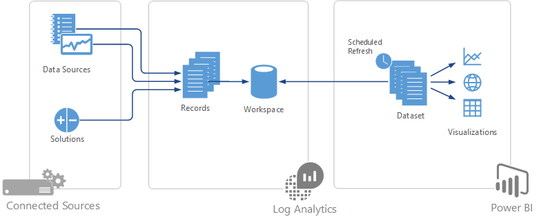
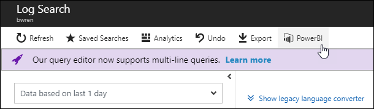
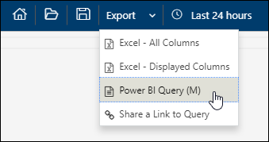

# Import Azure Log Analytics data into Power BI

[Power BI](https://powerbi.microsoft.com/documentation/powerbi-service-get-started/) is a cloud based business analytics service from Microsoft that provides rich visualizations and reports for analysis of different sets of data.  You can import the results of a Log Analytics log search into a Power BI dataset so you can take advantage of its features  such as combining data from different sources and sharing reports on the web and mobile devices.

## Overview
To import data from a Log Analytics workspace into Power BI, you create a dataset in Power BI based on a log search query in Log Analytics.  The query is run each time the dataset is refreshed.  You can then build Power BI reports that use data from the dataset.  To create the dataset in Power BI, you export your query from Log Analytics to [Power Query (M) language](https://msdn.microsoft.com/library/mt807488.aspx).  You then use this to create a query in Power BI Desktop and then publish it to Power BI as a dataset.  The details for this process are described below.

## Export query
Start by creating a [log search](log-analytics-log-search-new.md) that returns the data from Log Analytics that you want to populate the Power BI dataset.  You then export that query to [Power Query (M) language](https://msdn.microsoft.com/library/mt807488.aspx) which can be used by Power BI Desktop.

1. Create the log search in Log Analytics to extract the data for your dataset.
2. If you're using the log search portal, click **Power BI**.  If you're using the Analytics portal, select **Export** > **Power BI Query (M)**.  Both of these options export the query to a text file called **PowerBIQuery.txt**. 

     

3. Open the text file and copy its contents.

## Import query into Power BI Desktop
Power BI Desktop is a desktop application that allows you to create datasets and reports that can be published to Power BI.  You can also use it to create a query using the Power Query language exported from Log Analytics. 

1. Install [Power BI Desktop](https://powerbi.microsoft.com/desktop/) if you don't already have it and then open the application.
2. Select **Get Data** > **Blank Query** to open a new query.  Then select **Advanced Editor** and paste the contents of the exported file into the query. Click **Done**.

    

5. The query runs, and its results are displayed.  You may be prompted for credentials to connect to Azure.  
6. Type in a descriptive name for the query.  The default is **Query1**. Click **Close and Apply** to add the dataset to the report.

    

## Publish to Power BI
When you publish to Power BI, a dataset and a report will be created.  If you create a report in Power BI Desktop, then this will be published with your data.  If not, then a blank report will be created.  You can modify the report in Power BI or create a new one based on the dataset.

8. Create a report based on your data.  Use [Power BI Desktop documentation](https://docs.microsoft.com/power-bi/desktop-report-view) if you're not familiar with it.  When you're ready to send it to Power BI, click **Publish**.  When prompted, select a destination in your Power BI account.  Unless you have a specific destination in mind, use **My workspace**.

    

3. When the publishing completes, click **Open in Power BI** to open Power BI with your new dataset.

### Configure scheduled refresh
The dataset created in Power BI will have the same data that you previously saw in Power BI Desktop.  You need to refresh the dataset periodically to run the query again and populate it with the latest data from Log Analytics.  

1. Click on the workspace where you uploaded your report and select the **Datasets** menu. Select the context menu next to your new dataset and select **Settings**. Under **Data source credentials** you should have a message that the credentials are invalid.  This is because you haven't provided credentials yet for the dataset to use when it refreshes its data.  Click **Edit credentials** and specify credentials with access to Log Analytics.

    

5. Under **Scheduled refresh** turn on the option to **Keep your data up to date**.  You can optionally change the **Refresh frequency** and one or more specific times to run the refresh.

    

## Next steps
* Learn about [log searches](log-analytics-log-searches.md) to build queries that can be exported to Power BI.
* Learn more about [Power BI](http://powerbi.microsoft.com) to build visualizations based on Log Analytics exports.
