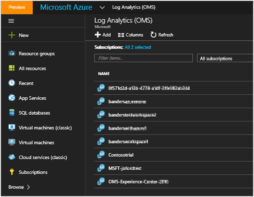
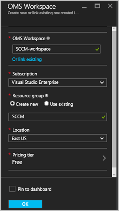
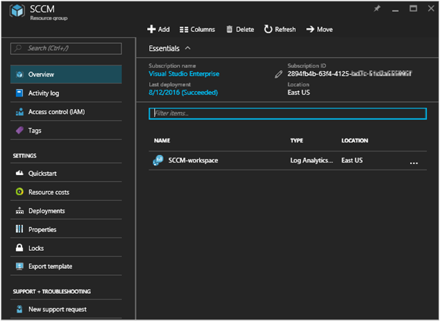
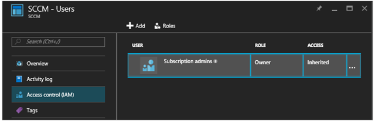
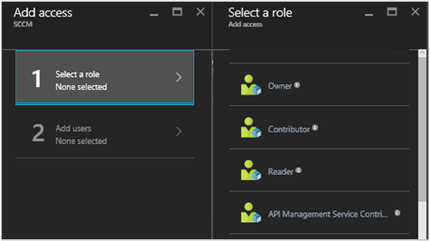

# Connect Configuration Manager to Log Analytics
You can connect System Center Configuration Manager to Log Analytics in OMS to sync device collection data. This makes data from your Configuration Manager hierarchy available in OMS.

## Prerequisites

Log Analytics supports System Center Configuration Manager current branch, version 1606 and higher.  

## Configuration overview
The following steps summarizes the process to connect Configuration Manager to Log Analytics.  

1. In the Azure Management Portal, register Configuration Manager as a Web Application and/or Web API app, and ensure that you have the client ID and client secret key from the registration from Azure Active Directory. See [Use portal to create Active Directory application and service principal that can access resources](../azure-resource-manager/resource-group-create-service-principal-portal.md) for detailed information about how accomplish this step.
2. In the Azure Management Portal, [provide Configuration Manager (the registered web app) with permission to access OMS](#provide-configuration-manager-with-permissions-to-oms).
3. In Configuration Manager, [add a connection using the Add OMS Connection Wizard](#add-an-oms-connection-to-configuration-manager).
4. In Configuration Manager, [update the connection properties](#update-oms-connection-properties) if the password or client secret key ever expires or is lost.
5. With information from the OMS portal, [download and install the Microsoft Monitoring Agent](#download-and-install-the-agent) on the computer running the Configuration Manager service connection point site system role. The agent sends Configuration Manager data to OMS.
6. In Log Analytics, [import collections from Configuration Manager](#import-collections) as computer groups.
7. In Log Analytics, view data from Configuration Manager as [computer groups](log-analytics-computer-groups.md).

You can read more about connecting Configuration Manager to OMS at [Sync data from Configuration Manager to the Microsoft Operations Management Suite](https://technet.microsoft.com/library/mt757374.aspx).

## Provide Configuration Manager with permissions to OMS
The following procedure provides the Azure Management Portal with permissions to access OMS. Specifically, you must grant the *Contributor role* to users in the resource group in order to allow the Azure Management Portal to connect Configuration Manager to OMS.

> [!NOTE]
> You must specify permissions in OMS for Configuration Manager. Otherwise, you'll receive an error message when you use the configuration wizard in Configuration Manager.
>
>

1. Open the [Azure portal](https://portal.azure.com/) and click **Browse** > **Log Analytics (OMS)** to open the Log Analytics (OMS) blade.  
2. On the **Log Analytics (OMS)** blade, click **Add** to open the **OMS Workspace** blade.  
   
3. On the **OMS Workspace** blade, provide the following information and then click **OK**.

   * **OMS Workspace**
   * **Subscription**
   * **Resource group**
   * **Location**
   * **Pricing tier**  
       

     > [!NOTE]
     > The example above creates a new resource group. The resource group is only used to provide Configuration Manager with permissions to the OMS workspace in this example.
     >
     >
4. Click **Browse** > **Resource groups** to open the **Resource groups** blade.
5. In the **Resource groups** blade, click the resource group that you created above to open the &lt;resource group name&gt; settings blade.  
   
6. In the &lt;resource group name&gt; settings blade, click Access control (IAM) to open the &lt;resource group name&gt; Users blade.  
     
7. In the &lt;resource group name&gt; Users blade, click **Add** to open the **Add access** blade.
8. In the **Add access** blade, click **Select a role**, and then select the **Contributor** role.  
     
9. Click **Add users**, select the Configuration Manager user, click **Select**, and then click **OK**.  
     

## Add an OMS connection to Configuration Manager
In order to add an OMS connection, your Configuration Manager environment must have a [service connection point](https://technet.microsoft.com/library/mt627781.aspx) configured for online mode.

1. In the **Administration** workspace of Configuration Manager, select **OMS Connector**. This opens the **Add OMS Connection Wizard**. Select **Next**.
2. On the **General** screen, confirm that you have done the following actions and that you have details for each item, then select **Next**.

   1. In the Azure Management Portal, you've registered Configuration Manager as a Web Application and/or Web API app, and that you have the [client ID from the registration](../active-directory/active-directory-integrating-applications.md).
   2. In the Azure Management Portal, you've created an app secret key for the registered app in Azure Active Directory.  
   3. In the Azure Management Portal, you've provided the registered web app with permission to access OMS.  
      
3. On the **Azure Active Directory** screen, configure your connection settings to OMS by providing your **Tenant** , **Client ID** , and **Client Secret Key** , then select **Next**.  
   
4. If you accomplished all the other procedures successfully, then the information on the **OMS Connection Configuration** screen will automatically appear on this page. Information for the connection settings should appear for your **Azure subscription** , **Azure resource group** , and **Operations Management Suite Workspace**.  
   
5. The wizard connects to the OMS service using the information you've input. Select the device collections that you want to sync with OMS and then click **Add**.  
   
6. Verify your connection settings on the **Summary** screen, then select **Next**. The **Progress** screen shows the connection status, then should **Complete**.

> [!NOTE]
> You must connect OMS to the top-tier site in your hierarchy. If you connect OMS to a standalone primary site and then add a central administration site to your environment, you'll have to delete and recreate the OMS connection within the new hierarchy.
>
>

After you have linked Configuration Manager to OMS, you can add or remove collections, and view the properties of the OMS connection.

## Update OMS connection properties
If a password or client secret key ever expires or is lost, you'll need to manually update the OMS connection properties.

1. In Configuration Manager, navigate to **Cloud Services** , then select **OMS Connector** to open the **OMS Connection Properties** page.
2. On this page, click the **Azure Active Directory** tab to view your **Tenant**, **Client ID**, **Client secret key expiration**. **Verify** your **Client secret key** if it has expired.

## Download and install the agent
1. In the OMS portal, [Download the agent setup file from OMS](log-analytics-windows-agents.md#download-the-agent-setup-file-from-oms).
2. Use one of the following methods to install and configure the agent on the computer running the Configuration Manager service connection point site system role:
   * [Install the agent using setup](log-analytics-windows-agents.md#install-the-agent-using-setup)
   * [Install the agent using the command line](log-analytics-windows-agents.md#install-the-agent-using-the-command-line)
   * [Install the agent using DSC in Azure Automation](log-analytics-windows-agents.md#install-the-agent-using-dsc-in-azure-automation)

## Import collections
After you've added an OMS connection to Configuration Manager and installed the agent on the computer running the Configuration Manager service connection point site system role, the next step is to import collections from Configuration Manager in OMS as computer groups.

After importation is enabled, the collection membership information is retrieved every 3 hours to keep the collection memberships current. You can choose to disable importation at any time.

1. In the OMS portal, click **Settings**.
2. Click the **Computer Groups** tab and then click the **SCCM** tab.
3. Select **Import Configuration Manager collection memberships** and then click **Save**.  
   

## View data from Configuration Manager
After you've added an OMS connection to Configuration Manager and installed the agent on the computer running the Configuration Manager service connection point site system role, data from the agent is sent to OMS. In OMS, your Configuration Manager collections appear as [computer groups](log-analytics-computer-groups.md). You can view the groups from the **Configuration Manager** page under **Computer Groups** in **Settings**.

After the collections are imported, you can see how many computers with collection memberships have been detected. You can also see the number of collections that have been imported.

When you click either one, Search opens, displaying either all of the imported groups or all computers that belong to each group. Using [Log Search](log-analytics-log-searches.md), you can start in-depth analysis of Configuration Manager data.

## Next steps
* Use [Log Search](log-analytics-log-searches.md) to view detailed information about your Configuration Manager data.
