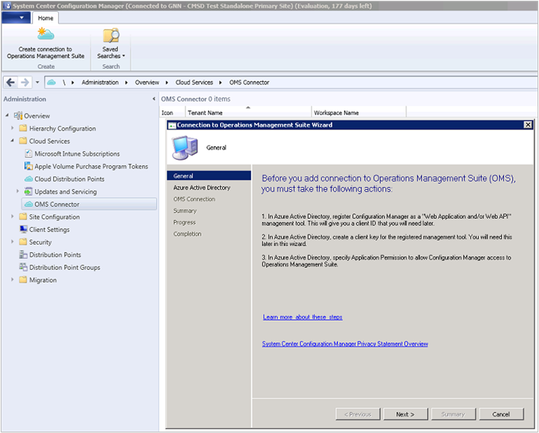
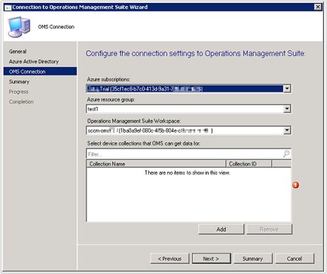
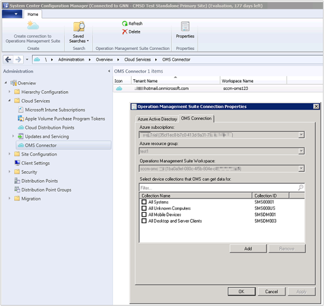

<properties
	pageTitle="Connect Configuration Manager to Log Analytics | Microsoft Azure"
	description="This article shows the steps to connect Configuration Manager to Log Analytics and start analyzing data."
	services="log-analytics"
	documentationCenter=""
	authors="bandersmsft"
	manager="jwhit"
	editor=""/>

<tags
	ms.service="log-analytics"
	ms.workload="na"
	ms.tgt_pltfrm="na"
	ms.devlang="na"
	ms.topic="article"
	ms.date="07/29/2016"
	ms.author="banders"/>

# Connect Configuration Manager to Log Analytics

You can connect System Center Configuration Manager to Log Analytics in OMS to sync device collection data. This makes data from your Configuration Manager deployment available in OMS. First, you'll add a connection using the Add OMS Connection Wizard to configure Configuration Manager, then you'll update the connection properties to choose which device collections are importing into OMS. Afterward, you can add or remove device collections whenever needed. Finally, you'll view data from Configuration Manager in OMS as [computer groups](log-analytics-computer-groups.md).

You can read more about connecting Configuration Manager to OMS at [Sync data from Configuration Manager to the Microsoft Operations Management Suite](https://technet.microsoft.com/library/mt757374.aspx).

After you've configured Configuration Manager, you'll install the Microsoft Monitoring Agent on the computer running the Configuration Manager service connection point site system role.

## Add an OMS connection to Configuration Manager

In order to add an OMS connection, your Configuration Manager environment must have a [service connection point](https://technet.microsoft.com/en-us/library/mt627781.aspx) configured for online mode.

1. In the **Administration** workspace, select **OMS Connector**. This opens the **Add OMS Connection Wizard**. Select **Next**.

2. On the **General** screen, confirm that you have done the following actions and that you have details for each item, then select **Next**.
  1. Registered Configuration Manager as a Web Application and/or Web API app, and that you have the [client ID from the registration](https://azure.microsoft.com/en-us/documentation/articles/active-directory-integrating-applications).
  2. Created an app secret key for the registered app in Azure Active Directory.
  3. [Specified Application Permission in Azure Active Directory](https://msdn.microsoft.com/en-us/office/office365/howto/add-common-consent-manually) to give Configuration Manager access to OMS..  
  

3. On the **Azure Active Directory** screen, configure your connection settings to OMS by providing your **Tenant** , **Client ID** , and **Client Secret Key** , then select **Next**.  
  

4. On the **OMS Connection Configuration** screen, provide your connection settings by filling in your **Azure subscription** , **Azure resource group** , and **Operations Management Suite Workspace**.  
  

5. The wizard connects to the OMS service using the information you've input. Select the device collections that you want to sync with OMS and then click **Add**.  
  

6. Verify your connection settings on the **Summary** screen, then select **Next**. The **Progress** screen shows the connection status, then should **Complete**.

>[AZURE.NOTE] You must connect OMS to the top-tier site in your hierarchy. If you connect OMS to a standalone primary site and then add a central administration site to your environment, you'll have to delete and recreate the OMS connection within the new hierarchy.

After you have linked Configuration Manager to OMS, you can add or remove collections, and view the properties of the OMS connection.

## View OMS connection properties

1. Navigate to **Cloud Services** , then select **OMS Connector** to open the **OMS Connection Properties** page.
2. On this page there are two tabs:
  1. The **Azure Active Directory** tab shows you your **Tenant**, **Client ID**, **Client secret key expiration**, and the ability to **Verify** your **Client secret key** if it has expired.
  2. The **OMS Connection Properties** tab shows you your **Azure subscription**, **Azure resource group**, **Operations Management Suite Workspace**, and a list of **Device collections that Operations Management Suite can get data for**. Use **Add** or **Remove** to modify which collections are allowed.  
    

## Download and install the agent

1. [Download the agent setup file from OMS](log-analytics-windows-agents.md#download-the-agent-setup-file-from-oms).
2. Use one of the following methods to install and configure the agent on the computer running the Configuration Manager service connection point site system role:
  - [Install the agent using setup](log-analytics-windows-agents.md#install-the-agent-using-setup)
  - [Install the agent using the command line](log-analytics-windows-agents.md#install-the-agent-using-the-command-line)
  - [Install the agent using DSC in Azure Automation](log-analytics-windows-agents.md#install-the-agent-using-dsc-in-azure-automation)

## Import collections

After you've added an OMS connection to Configuration Manager and installed the agent on the computer running the Configuration Manager service connection point site system role, the next step is to import collections from Configuration Manager in OMS as computer groups.

After importation is enabled, the collection membership information is retrieved every 3 hours to keep the collection memberships current. You can choose to disable importation at any time.

1. In the OMS portal, click **Settings**.
2. Click the **Computer Groups** tab and then click the **SCCM** tab.
3. Select **Import Configuration Manager collection memberships** and then click **Save**.  
  

## View data from Configuration Manager

After you've added an OMS connection to Configuration Manager and installed the agent on the computer running the Configuration Manager service connection point site system role, data from the agent is sent to OMS. In OMS, your Configuration Manager collections appear as [computer groups](log-analytics-computer-groups.md). You can view the groups from the **Configuration Manager** page under **Computer Groups** in **Settings**.

After the collections are imported, you can see how many computers with collection memberships have been detected. You can also see the number of collections that have been imported.

When you click either one, Search opens, displaying either all of the imported groups or all computers that belong to each group. Using [Log Search](log-analytics-log-searches.md), you can start in-depth analysis for Configuration Manager data.

## Next steps

- Use [Log Search](log-analytics-log-searches.md) to view detailed information about your Configuration Manager data.
