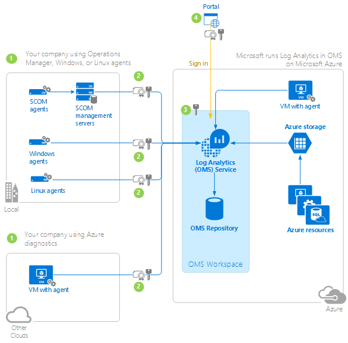

<properties
	pageTitle="Log Analytics data security | Microsoft Azure"
	description="Learn about how Log Analytics protects your privacy and secures your data."
	services="log-analytics"
	documentationCenter=""
	authors="bandersmsft"
	manager="jwhit"
	editor=""/>

<tags
	ms.service="log-analytics"
	ms.workload="na"
	ms.tgt_pltfrm="na"
	ms.devlang="na"
	ms.topic="article"
	ms.date="07/22/2016"
	ms.author="banders"/>

# Log Analytics data security

Microsoft is committed to protecting your privacy and securing your data, while delivering software and services that help you manage the IT infrastructure of your organization. We recognize that when you entrust your data to others, that trust requires rigorous security. Microsoft adheres to strict compliance and security guidelines—from coding to operating a service.

Securing and protecting data is a top priority at Microsoft. Please contact us with any questions, suggestions, or issues about any of the following information, including our security policies at [Azure support options](http://azure.microsoft.com/support/options/).

This article explains how data is collected, processed, and secured by Log Analytics in the Operations Management Suite (OMS). You can use agents to connect to the web service, use System Center Operations Manager to collect operational data, or retrieve data from Azure diagnostics for use by Log Analytics. The collected data is sent over the Internet using certificate-based authentication & SSL 3 to the Log Analytics service, which is hosted in Microsoft Azure. Data is compressed by the agent before it is sent.

The Log Analytics service manages your cloud-based data securely by using the following methods:

- data segregation
- data retention
- physical security
- incident management
- compliance
- security standards certifications

## Data segregation

Customer data is kept logically separate on each component throughout the OMS service. All data is tagged per organization. This tagging persists throughout the data lifecycle, and it is enforced at each layer of the service. Each customer has a dedicated Azure blob that houses the long-term data

## Data retention

Indexed log search data is stored and retained according to your pricing plan. For more information, see [Log Analytics Pricing](https://azure.microsoft.com/pricing/details/log-analytics/).

Microsoft deletes customer data 30 days after the OMS workspace is closed. Microsoft also deletes the Azure Storage Account where the data resides. When customer data is removed, no physical drives are destroyed.

The following table lists some of the available solutions in OMS and examples the types of data they collect.

| **Solution** | **Data types** |
| --- | --- |
| Configuration Assessment | Configuration data, metadata, and state data |
| Capacity Planning | Performance data and metadata |
| Antimalware | Configuration data and metadata |
| System Update Assessment | Metadata and state data |
| Log Management | User-defined event logs, Windows Event Logs and/or IIS Logs |
| Change Tracking | Software inventory and Windows Service metadata |
| SQL and Active Directory Assessment | WMI data, registry data, performance data, and SQL Server dynamic management view results |

The following table shows examples of data types:

| **Data type** | **Fields** |
| --- | --- |
| Alert | Alert Name, Alert Description, BaseManagedEntityId, Problem ID, IsMonitorAlert, RuleId, ResolutionState, Priority, Severity, Category, Owner, ResolvedBy, TimeRaised, TimeAdded, LastModified, LastModifiedBy, LastModifiedExceptRepeatCount, TimeResolved, TimeResolutionStateLastModified, TimeResolutionStateLastModifiedInDB, RepeatCount |
| Configuration | CustomerID, AgentID, EntityID, ManagedTypeID, ManagedTypePropertyID, CurrentValue, ChangeDate |
| Event | EventId, EventOriginalID, BaseManagedEntityInternalId, RuleId, PublisherId, PublisherName, FullNumber, Number, Category, ChannelLevel, LoggingComputer, EventData, EventParameters, TimeGenerated, TimeAdded  **Note:** When you log events with custom fields into the Windows event log, OMS collects them. |
| Metadata | BaseManagedEntityId, ObjectStatus, OrganizationalUnit, ActiveDirectoryObjectSid, PhysicalProcessors, NetworkName, IPAddress, ForestDNSName, NetbiosComputerName, VirtualMachineName, LastInventoryDate, HostServerNameIsVirtualMachine, IP Address, NetbiosDomainName, LogicalProcessors, DNSName, DisplayName, DomainDnsName, ActiveDirectorySite, PrincipalName, OffsetInMinuteFromGreenwichTime |
| Performance | ObjectName, CounterName, PerfmonInstanceName, PerformanceDataId, PerformanceSourceInternalID, SampleValue, TimeSampled, TimeAdded |
| State | StateChangeEventId, StateId, NewHealthState, OldHealthState, Context, TimeGenerated, TimeAdded, StateId2, BaseManagedEntityId, MonitorId, HealthState, LastModified, LastGreenAlertGenerated, DatabaseTimeModified |

## Physical security

The Log Analytics in OMS service is manned by Microsoft personnel and all activities are logged and can be audited. The service runs completely in Azure and complies with the Azure common engineering criteria. You can view details about the physical security of Azure assets on page 18 of the [Microsoft Azure Security Overview](http://download.microsoft.com/download/6/0/2/6028B1AE-4AEE-46CE-9187-641DA97FC1EE/Windows%20Azure%20Security%20Overview%20v1.01.pdf). Physical access rights to secure areas are changed within one business day for anyone who no longer has responsibility for the OMS service, including transfer and termination. You can read about the global physical infrastructure we use at [Microsoft Datacenters](https://www.microsoft.com/en-us/server-cloud/cloud-os/global-datacenters.aspx).

## Incident management

OMS has an incident management process that all Microsoft services adhere to. To summarize, we:

- Use a shared responsibility model where a portion of security responsibility belongs Microsoft while some portion belongs to the customer
- Manage Azure security incidents
  - Detect an incident at the first indication, to start an investigation
  - Assess the impact and severity of an incident by an on-call incident response team member. Based on evidence, the assessment may or may not result in further escalation to the security response team.
  - Diagnose an incident by security response experts to conduct the technical or forensic investigation, identify containment, mitigation, and workaround strategies. If the security team believes that customer data may have become exposed to an unlawful or unauthorized individual, parallel execution of the Customer Incident Notification process begins in parallel.  
  - Stabilize and recover from the incident. The incident response team creates a recovery plan to mitigate the issue. Crisis containment steps such as quarantining impacted systems may occur immediately and in parallel with diagnosis. Longer term mitigations may be planned which occur after the immediate risk has passed.  
  - Close the incident and conduct a post-mortem. The incident response team creates a post-mortem that outlines the details of the incident, with the intention to revise policies, procedures, and processes to prevent a reoccurrence of the event.
- Notify customers of security incidents
  - Determine the scope of impacted customers and to provide anybody who is impacted as detailed a notice as possible
  - Create a notice to provide customers with detailed enough information so that they can perform an investigation on their end and meet any commitments they have made to their end users while not unduly delaying the notification process.
  - Confirm and declare the incident, as necessary.
  - Notify customers with an incident notification without unreasonable delay and in accordance with any legal or contractual commitment. Notification of security incidents will be delivered to one or more of a customer's administrators by any means Microsoft selects, including via email.
- Conduct team readiness and training
  - Microsoft personnel are required to complete security and awareness training, which helps them to identify and report suspected security issues.  
  - Operators working on the Microsoft Azure service have addition training obligations surrounding their access to sensitive systems hosting customer data.
  - Microsoft security response personnel receive specialized training for their roles

In the event of loss of any customer's data, we notify each customer within one day. However, customer data loss has never occurred with OMS. Additionally, we maintain copies of data that was created and it is geographically distributed.

For more information about how Microsoft responds to security incidents, see [Microsoft Azure Security Response in the Cloud](https://gallery.technet.microsoft.com/Azure-Security-Response-in-dd18c678/file/150826/1/Microsoft Azure Security Response in the cloud.pdf).

## Compliance

The OMS software development and service team's information security and governance program supports its business requirements and adheres to laws and regulations as described at [Microsoft Azure Trust Center](https://azure.microsoft.com/support/trust-center/) and [Microsoft Trust Center Compliance](https://www.microsoft.com/en-us/TrustCenter/Compliance/default.aspx). How OMS establishes security requirements, identifies security controls, manages and monitors risks are also described there. Annually, we conduct a review of polices, standards, procedures, and guidelines.

Each OMS development team member receives formal application security training. Internally, we use a version control system for software development. Each software project is protected by the version control system.

Microsoft has a security and compliance team that oversees and assesses all services in Microsoft. Information security officers make up the team and they are not associated with the engineering departments that develop OMS. The security officers have their own management chain and conduct independent assessments of products and services to ensure security and compliance.

Microsoft's board of directors is notified by and annual report about all of the information security programs at Microsoft.

The OMS software development and service team is actively working with the Microsoft Legal and Compliance teams and other industry partners to acquire a variety of certifications.

## Security standards certifications

Log Analytics in OMS currently meet the following security standards:

- [ISO/IEC 27001](http://www.iso.org/iso/home/standards/management-standards/iso27001.htm) and [ISO/IEC 27018:2014](http://www.iso.org/iso/home/store/catalogue_tc/catalogue_detail.htm?csnumber=61498) compliant
- Payment Card Industry (PCI Compliant) Data Security Standard (PCI DSS) by the PCI Security Standards Council.
- [Service Organization Controls (SOC) 1 Type 1 and SOC 2 Type 1](https://www.microsoft.com/en-us/TrustCenter/Compliance/SOC1-and-2) compliant
- Windows Common Engineering Criteria
- Microsoft Trustworthy Computing Certification
- As an Azure service, the components that OMS uses adhere to Azure compliance requirements. You can read more at [Microsoft Trust Center Compliance](https://www.microsoft.com/en-us/TrustCenter/Compliance/default.aspx).

## Cloud computing security data flow
The following diagram shows a cloud security architecture as the flow of information from your company and how it is secured as is moves to the Log Analytics service, ultimately seen by you in the OMS portal. More information about each step follows the diagram.

## 1. Sign up for Log Analytics and collect data

For your organization to send data to Log Analytics, you configure Windows agents, agents running on Azure virtual machines, or OMS Agents for Linux. If you use Operations Manager agents, then you'll use a configuration wizard in the Operations console to configure them. Users (which might be you, other individual users, or a group of people) create one or more OMS accounts (OMS workspaces), and register agents by using one of the following accounts:

- [Organizational ID](./active-directory/sign-up-organization.md)

- [Microsoft Account - Outlook, Office Live, MSN](http://www.microsoft.com/account/default.aspx)

An OMS workspace is where data is collected, aggregated, analyzed, and presented. A workspace is primarily used as a means to partition data, and each workspace is unique. For example, you might want to have your production data managed with one OMS workspace and your test data managed with another workspace. Workspaces also help an administrator control user access to the data. Each workspace can have multiple user accounts associated with it, and each user account can access multiple OMS workspace. You create workspaces based on datacenter region. Each workspace is replicated to other datacenters in the region, primarily for OMS service availability.

For Operations Manager, when the configuration wizard completes, each Operations Manager management group establishes a connection with the Log Analytics service. You then use the Add Computers Wizard to choose which computers in the management group are allowed to send data to the service. For other agent types, each connects securely to the OMS service.

Each type of agent collects data for Log Analytics. The type of data that is collected is dependent on the types of solutions used. You can see a summary of data collection at [Add Log Analytics solutions from the Solutions Gallery](log-analytics-add-solutions.md). Additionally, more detailed collection information is available for most solutions. A solution is a bundle of predefined views, log search queries, data collection rules, and processing logic. Only administrators can use Log Analytics to import a solution. After the solution is imported, it is moved to the Operations Manager management servers (if used), and then to any agents that you have chosen. Afterward, the agents collect the data.

## 2. Send data from agents

You register all agent types with an enrollment key and a secure connection is established between the agent and the Log Analytics service using certificate-based authentication and SSL with port 443. OMS uses a secret store to generate and maintain keys. Private keys are rotated every 90 days and are stored in Azure and are managed by the Azure operations who follow strict regulatory and compliance practices.

With Operations Manager, you register a workspace with the Log Analytics service and a secure HTTPS connection is established between the Operations Manager management server.

For Windows agents running on Azure virtual machines, a read-only storage key is used to read diagnostic events in Azure tables.

If any agent is unable to communicate to the service for any reason, the collected data is stored locally in a temporary cache and the management server tries to resend the data every 8 minutes for 2 hours. The agent's cached data is protected by the operating system's credential store. If the service cannot process the data after 2 hours, the agents will queue the data. If the queue becomes full, OMS starts dropping data types, starting with performance data. The agent queue limit is a registry key so you can modify it, if necessary. Collected data is compressed and sent to the service, bypassing on-premises databases, so it does not add any load to them. After the collected data is sent, it is removed from the cache.

As described above, data from your agents is sent over SSL to Microsoft Azure datacenters. Optionally, you can use ExpressRoute to provide additional security for the data. ExpressRoute is a way to directly connect to Azure from your existing WAN network, such as a multi-protocol label switching (MPLS) VPN, provided by a network service provider. For more information, see [ExpressRoute](https://azure.microsoft.com/services/expressroute/).

## 3. The Log Analytics service receives and processes data

The Log Analytics service ensures that incoming data is from a trusted source by validating certificates and the data integrity with Azure authentication. The unprocessed raw data is then stored as a blob in [Microsoft Azure Storage](./storage/storage-introduction.md) and is not encrypted. However, each Azure storage blob has a set of unique set of keys which is accessible only to that user. The type of data that is stored is dependent on the types of solutions that were imported and used to collect data. Then, the Log Analytics service processes the raw data for the Azure storage blog.

## 4. Use Log Analytics to access the data

You can sign in to Log Analytics in the OMS portal by using the organizational account or Microsoft account that you set up previously. All traffic between the OMS portal and Log Analytics in OMS is sent over a secure HTTPS channel. When using the OMS portal, a session ID is generated on the user client (web browser) and data is stored in a local cache until the session is terminated. When terminated, the cache is deleted. Client-side cookies, which do not contain personally-identifiable information, are not automatically removed. Session cookies are marked HTTPOnly and are secured. After a pre-determined idle period, the OMS portal session is terminated.

Using the OMS portal, you can export data to a CSV file and you can access data using Search APIs. CSV export is limited to 50,000 rows per export and API data is restricted to 5,000 rows per search.

## Next steps

- [Get started with Log Analytics](log-analytics-get-started.md) to learn more about Log Analytics and get up and running in minutes.
