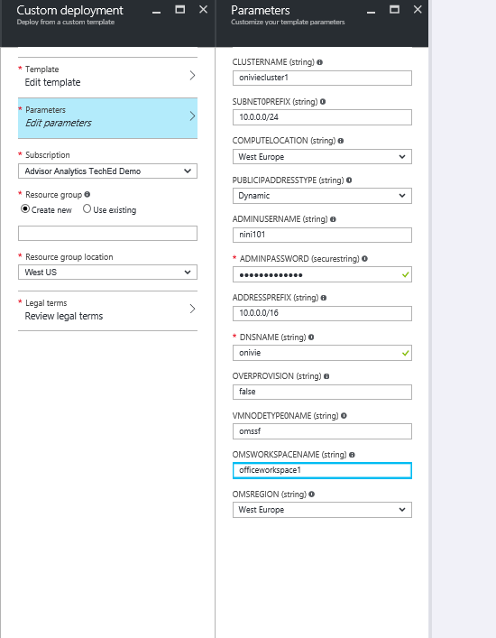
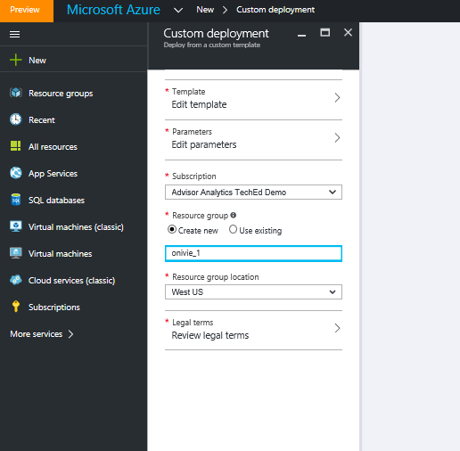
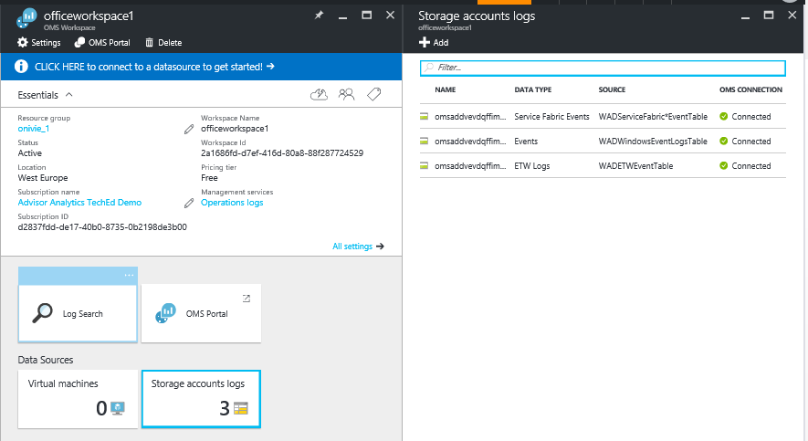
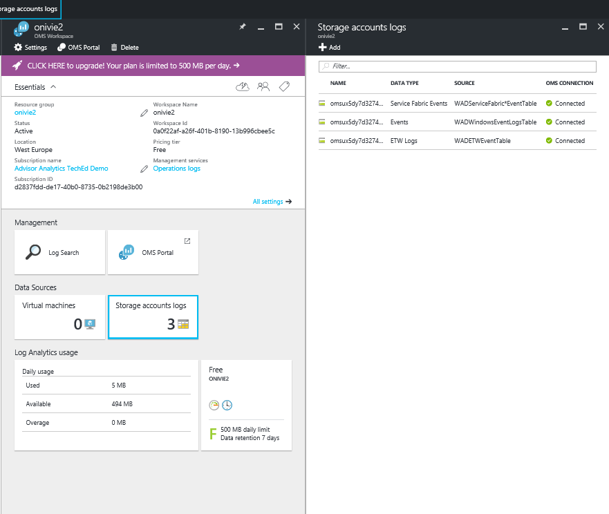
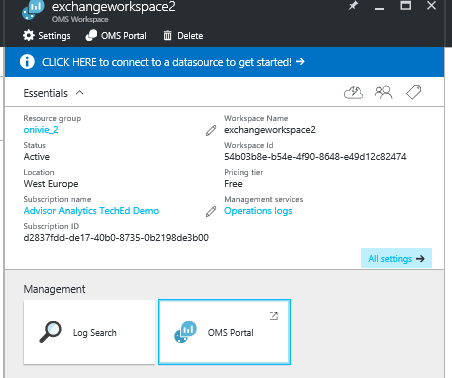
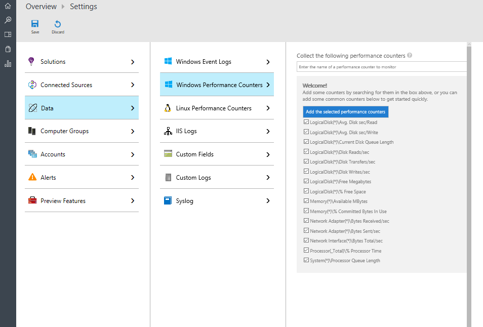
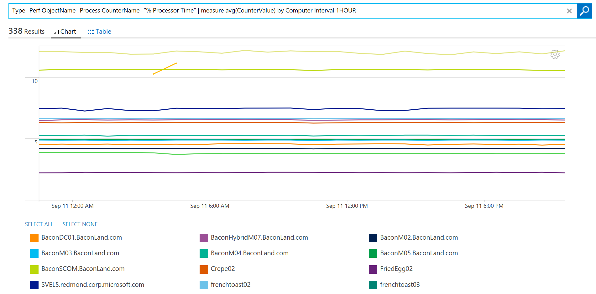
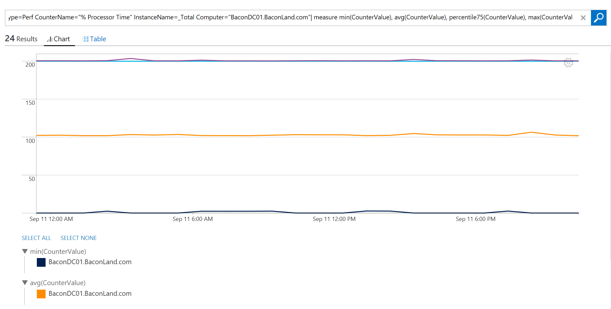
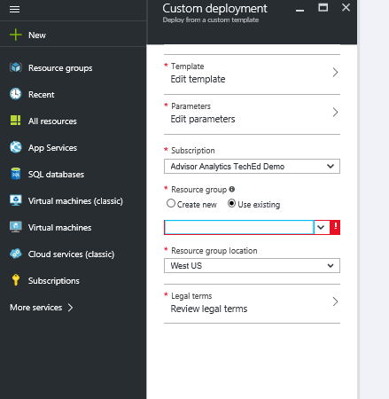
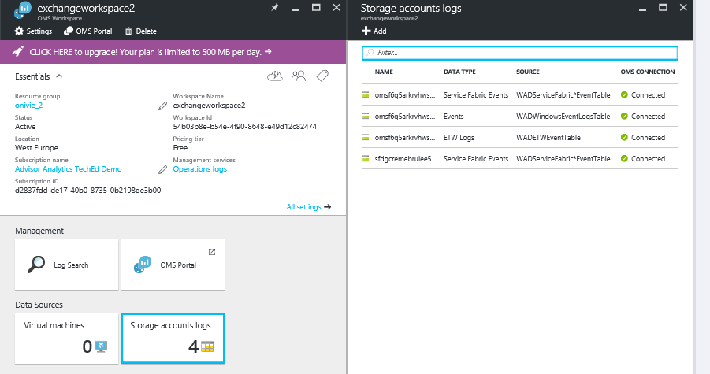

# Assess Service Fabric applications and micro-services with the Azure portal

> [!div class="op_single_selector"]
> * [Resource Manager](log-analytics-service-fabric-azure-resource-manager.md)
> * [PowerShell](log-analytics-service-fabric.md)
>
>


This article describes how to use the Service Fabric solution in Log Analytics to help identify and troubleshoot issues across your Service Fabric cluster.

The Service Fabric solution uses Azure Diagnostics data from your Service Fabric VMs, by collecting this data from your Azure WAD tables. Log Analytics then reads Service Fabric framework events, including **Reliable Service Events**, **Actor Events**, **Operational Events**, and **Custom ETW events**. With the solution dashboard, you are able to view notable issues and relevant events in your Service Fabric environment.

To get started with the solution, you need to connect your Service Fabric cluster to a Log Analytics workspace. Here are three scenarios to consider:

1. If you have not deployed your Service Fabric cluster, use the steps in ***Deploy a Service Fabric Cluster connected to a Log Analytics workspace*** to deploy a new cluster and have it configured to report to Log Analytics.
2. If you need to collect performance counters from your hosts to use other OMS solutions such as Security on your Service Fabric Cluster, follow the steps in ***Deploy a Service Fabric Cluster connected to a Log Analytics workspace with VM Extension installed.***
3. If you have already deployed your Service Fabric cluster and want to connect it to Log Analytics, follow the steps in ***Adding an existing storage account to Log Analytics.***

## Deploy a Service Fabric Cluster connected to a Log Analytics workspace.
This template does the following:

1. Deploys an Azure Service Fabric cluster already connected to a Log Analytics workspace. You have the option to create a new workspace while deploying the template, or input the name of an already existing Log Analytics workspace.
2. Adds the diagnostic storage account to the Log Analytics workspace.
3. Enables the Service Fabric solution in your Log Analytics workspace.

[](https://portal.azure.com/#create/Microsoft.Template/uri/https%3A%2F%2Fraw.githubusercontent.com%2Fazure%2Fazure-quickstart-templates%2Fmaster%2Fservice-fabric-oms%2F%2Fazuredeploy.json)

Once you select the deploy button above, the the Azure portal opens with parameters for you to edit. Be sure to create a new resource group if you input a new Log Analytics workspace name:





Accept the legal terms and hit "Create" to start the deployment. Once the deployment is completed, you should see the new workspace and cluster created, and the WADServiceFabric*Event, WADWindowsEventLogs and WADETWEvent tables added:



## Deploy a Service Fabric Cluster connected to a Log Analytics workspace with VM Extension installed.
This template does the following:

1. Deploys an Azure Service Fabric cluster already connected to a Log Analytics workspace. You can create a new workspace or use an existing one.
2. Adds the diagnostic storage accounts to the Log Analytics workspace.
3. Enables the Service Fabric solution in the Log Analytics workspace.
4. Installs the MMA agent extension in each virtual machine scale set in your Service Fabric cluster. With the MMA agent installed, you are able to view performance metrics about your nodes.

[](https://portal.azure.com/#create/Microsoft.Template/uri/https%3A%2F%2Fraw.githubusercontent.com%2Fazure%2Fazure-quickstart-templates%2Fmaster%2Fservice-fabric-vmss-oms%2F%2Fazuredeploy.json)

Following the same steps above, input the necessary parameters, and kick off a deployment. Once again you should see the new workspace, cluster and WAD tables all created:



### Viewing Performance Data
To view Perf Data from your nodes:
</br>

* Launch the Log Analytics workspace from the Azure portal.



* Go to Settings on the left pane, and select Data >> Windows Performance Counters >> "Add the selected performance counters":
  
* In Log Search, use the following queries to delve into key metrics about your nodes:
  </br>

    a. Compare the average CPU Utilization across all your nodes in the last one hour to see which nodes are having issues and at what time interval a node had a spike:

    ``` Type=Perf ObjectName=Processor CounterName="% Processor Time"|measure avg(CounterValue) by Computer Interval 1HOUR. ```

    

    b. View similar line charts for available memory on each node with this query:

    ```Type=Perf ObjectName=Memory CounterName="Available MBytes Memory" | measure avg(CounterValue) by Computer Interval 1HOUR.```

    To view a listing of all your nodes, showing the exact average value for Available MBytes for each node, use this query:

    ```Type=Perf (ObjectName=Memory) (CounterName="Available MBytes") | measure avg(CounterValue) by Computer ```

    


    c. In the case that you want to drill down into a specific node by examining the hourly average, minimum, maximum and 75-percentile CPU usage, you're able to do this by using this query (replace Computer field):

    ```Type=Perf CounterName="% Processor Time" InstanceName=_Total Computer="BaconDC01.BaconLand.com"| measure min(CounterValue), avg(CounterValue), percentile75(CounterValue), max(CounterValue) by Computer Interval 1HOUR```

    

    Read more information about performance metrics in Log Analytics [here.] (https://blogs.technet.microsoft.com/msoms/tag/metrics/)


## Adding an existing storage account to Log Analytics
This template simply adds your existing storage accounts to a new or existing Log Analytics workspace.
</br>

[](https://portal.azure.com/#create/Microsoft.Template/uri/https%3A%2F%2Fraw.githubusercontent.com%2FAzure%2Fazure-quickstart-templates%2Fmaster%2Foms-existing-storage-account%2Fazuredeploy.json)

> [!NOTE]
> In selecting a Resource Group, if you're working with an already existing Log Analytics workspace, select "Use Existing" and search for the resource group containing the Log Analytics workspace. Create a new one if otherwise.
> 
>
>

After this template has been deployed, you will be able to see the storage account connected to your Log Analytics workspace. In this instance, I added one more storage account to the Exchange workspace I created above.


## View Service Fabric events
Once the deployments are completed and the Service Fabric solution has been enabled in your workspace, select the **Service Fabric** tile in the Log Analytics portal to launch the Service Fabric dashboard. The dashboard includes the columns in the following table. Each column lists the top 10 events by count matching that column's criteria for the specified time range. You can run a log search that provides the entire list by clicking **See all** at the right bottom of each column, or by clicking the column header.

| **Service Fabric event** | **description** |
| --- | --- |
| Notable Issues |A Display of issues such as RunAsyncFailures RunAsynCancellations and Node Downs. |
| Operational Events |Notable operational events such as application upgrade and deployments. |
| Reliable Service Events |Notable reliable service events such a Runasyncinvocations. |
| Actor Events |Notable actor events generated by your micro-services, such as exceptions thrown by an actor method, actor activations and deactivations, and so on. |
| Application Events |All custom ETW events generated by your applications. |


The following table shows data collection methods and other details about how data is collected for Service Fabric.

| platform | Direct Agent | Operations Manager agent | Azure Storage | Operations Manager required? | Operations Manager agent data sent via management group | collection frequency |
| --- | --- | --- | --- | --- | --- | --- |
| Windows | | | | | |10 minutes |

> [!NOTE]
> You can change the scope of these events in the Service Fabric solution by clicking **Data based on last 7 days** at the top of the dashboard. You can also show events generated within the last seven days, one day, or six hours. Or, you can select **Custom** to specify a custom date range.
>
>

## Next steps
* Use [Log Searches in Log Analytics](log-analytics-log-searches.md) to view detailed Service Fabric event data.
