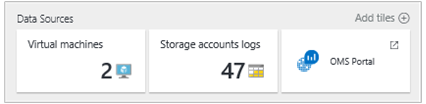
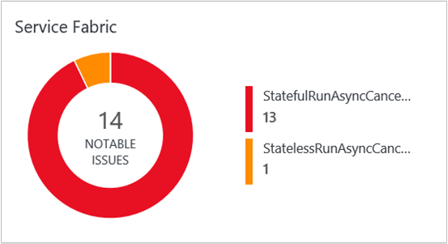
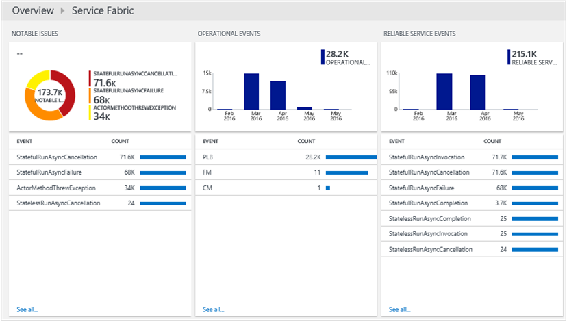
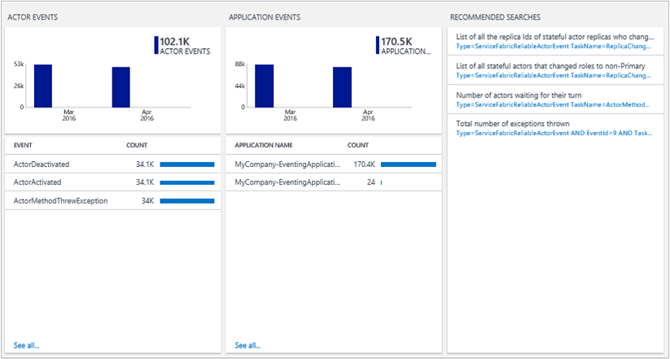

<properties
	pageTitle="Optimize your environment with the Service Fabric solution in Log Analytics | Microsoft Azure"
	description="You can use the Service Fabric solution to assess the risk and health of your Service Fabric applications, micro-services, nodes and clusters."
	services="log-analytics"
	documentationCenter=""
	authors="niniikhena"
	manager="jochan"
	editor=""/>

<tags
	ms.service="log-analytics"
	ms.workload="na"
	ms.tgt_pltfrm="na"
	ms.devlang="na"
	ms.topic="article"
	ms.date="06/30/2016"
	ms.author="nini"/>


# Service Fabric Solution in Log Analytics

This article describes how to use the Service Fabric solution in Log Analytics to help identify and troubleshoot issues across your Service Fabric cluster, by getting visibility into how your Service Fabric nodes are performing, and how your applications and micro-services are running.

The Service Fabric solution uses Azure Diagnostics data from your Service Fabric VMs, by collecting this data from your Azure WAD tables. Log Analytics then reads Service Fabric framework events, including **Reliable Service Events**, **Actor Events**, **Operational Events**, and **Custom ETW events**. The Service Fabric solution dashboard shows you notable issues and relevant events in your Service Fabric environment.

## Installing and configuring the solution

Follow these three easy steps to install and configure the solution:

1. Ensure that the OMS workspace that you use is associated with the same Azure subscription that you used to create all cluster resources, including storage accounts. See [Get started with Log Analytics](log-analytics-get-started.md) for information about creating an OMS workspace.
2. Configure OMS to collect and view Service Fabric logs.
3. Enable the Service Fabric solution in your workspace.

## Configure OMS to collect and view Service Fabric logs
In this section, you'll learn how to configure OMS to retrieve Service Fabric logs. The logs allow you view, analyze, and troubleshoot issues in your cluster or in the applications and services running in that cluster, using the OMS portal.

>[AZURE.NOTE] The Azure Diagnostics extension must be configured to upload the logs to storage tables that match what OMS will look for. See [How to collect logs with Azure Diagnostics](../service-fabric/service-fabric-diagnostics-how-to-setup-wad.md) for more information about how to collect logs. The configuration settings examples in this article show you what the names of the storage tables should be. Once Diagnostics is set up on the cluster and is uploading logs to a storage account, the next step is to configure OMS to collect these logs.

Ensure that you update the **EtwEventSourceProviderConfiguration** section in the **template.json** file to add entries for the new EventSources before you apply the configuration update by running **deploy.ps1**. The table for upload is the same as (ETWEventTable). At the moment, OMS can only read application ETW events from that table. However, support for custom ETW tables is in development.

The following tools are used to perform some of the operations in this section:

-	Azure PowerShell
-	[Operations Management Suite](http://www.microsoft.com/oms)

### Configure an OMS workspace to show the cluster logs

After you've created an OMS workspace as described above, the next step is to configure the workspace to pull the logs from the Azure storage tables where they are being uploaded from the cluster by the Diagnostics extension. In order to do this, run the following PowerShell script:

```
<#
    This script will configure an Operations Management Suite workspace (previously called an Operational Insights workspace) to read Diagnostics from an Azure Storage account.
    It will enable all supported data types (currently Service Fabric Events, ETW Events and IIS Logs).
    It supports Resource Manager storage accounts.
    If you have more than one Azure Subscription, you will be prompted for the subscription to configure.
    If you have more than one OMS workspace you will be prompted for the workspace to configure.
    It will then look through your Service Fabric clusters, and configure your OMS workspace to read Diagnostics from storage accounts that are connected to that cluster and have diagnostics enabled.
#>

try
{
    Get-AzureRMContext
}
catch [System.Management.Automation.PSInvalidOperationException]
{
    Add-AzureRmAccount
}

$validTables = "WADServiceFabric*EventTable", "WADETWEventTable"
function Select-Subscription {
      $subscription = ""
      $allSubscriptions = Get-AzureRmSubscription
      switch ($allSubscriptions.Count) {
             0 {Write-Error "No Operations Management Suite workspaces found"}
             1 {return $allSubscriptions}
        default {
            $uiPrompt = "Enter the number corresponding to the Azure subscription you would like to work with.`n"

            $count = 1
            foreach ($subscription in $allSubscriptions) {
                $uiPrompt += "$count. " + $subscription.SubscriptionName + " (" + $subscription.SubscriptionId + ")`n"
                $count++
            }
            $answer = (Read-Host -Prompt $uiPrompt) - 1
            $subscription = $allSubscriptions[$answer]
             Write-Host $subscription.SubscriptionId
        }  
    }
    return $subscription
}

function Select-Workspace {
    $workspace = ""
    $allWorkspaces = Get-AzureRmOperationalInsightsWorkspace  

    switch ($allWorkspaces.Count) {
        0 {Write-Error "No Operations Management Suite workspaces found. `n"}
        1 {return $allWorkspaces}
        default {
            $uiPrompt = "Enter the number corresponding to the workspace you want to configure.`n"
            $count = 1
            foreach ($workspace in $allWorkspaces) {
                $uiPrompt += "$count. " + $workspace.Name + " (" + $workspace.CustomerId + ")`n"
                $count++
            }
            $answer = (Read-Host -Prompt $uiPrompt) - 1
            $workspace = $allWorkspaces[$answer]
             Write-Host $workspace.WorkspaceName
        }  
    }
    return $workspace
}

function Check-ETWProviderLogging {
     param(
     [string]$id,
     [string]$provider,
     [string]$expectedTable,
     [string]$table
    )       
         Write-Debug ("ID: $id Provider: $provider ExpectedTable $expectedTable ActualTable $table")
         if ( ($table -eq $null) -or ($table -eq ""))  
         {
             Write-Warning ("$id No configuration found for $provider. Configure Azure diagnostics to write to $expectedTable.")
         }  
         elseif ( $table -ne $expectedTable )
         {
             Write-Warning ("$id $provider events are being written to $table instead of WAD$expectedTable. Events will not be collected by OMS")
         }  
         else
         {
             Write-Verbose "$id $provider events are being written to WAD$expectedTable (Correct configuration.)"
         }
 }

function Check-ServiceFabricScaleSetDiagnostics {
     param(
          [psobject]$scaleSetDiagnostics
   )
     $storageAccountsFound = @()
     Write-Verbose ("Checking " + $scaleSetDiagnostics)
     $sfReliableActorTable = $null
     $sfReliableServiceTable = $null
     $sfOperationalTable = $null

     Write-Debug $scaleSetDiagnostics
     $serviceFabricProviderList = ""
     $etwManifestProviderList = ""

     if ( $scaleSetDiagnostics.xmlCfg )  
      {
             Write-Debug ("Found XMLcfg")
             $xmlCfg = [System.Text.Encoding]::UTF8.GetString([System.Convert]::FromBase64String($scaleSetDiagnostics.xmlCfg))
             Write-Debug $xmlCfg
             $etwProviders = Select-Xml -Content $xmlCfg -XPath "//EtwProviders"                 
             $serviceFabricProviderList = $etwProviders.Node.EtwEventSourceProviderConfiguration
             $etwManifestProviderList = $etwProviders.Node.EtwManifestProviderConfiguration
      } elseif ($scaleSetDiagnostics.WadCfg )  
     {
         Write-Debug ("Found WADcfg")
         Write-Debug $scaleSetDiagnostics.WadCfg
         $serviceFabricProviderList = $scaleSetDiagnostics.WadCfg.DiagnosticMonitorConfiguration.EtwProviders.EtwEventSourceProviderConfiguration
         $etwManifestProviderList = $scaleSetDiagnostics.WadCfg.DiagnosticMonitorConfiguration.EtwProviders.EtwManifestProviderConfiguration
     } else
     {
         Write-Error "Unable to parse Azure Diagnostics setting for $id"
             Write-Warning ("$id does not have diagnostics enabled")
     }
     foreach ($provider in $serviceFabricProviderList)  
     {
         Write-Debug ("Event Source Provider: " + $provider.Provider + " Destination: " + $provider.DefaultEvents.eventDestination)
         if ($provider.Provider -eq "Microsoft-ServiceFabric-Actors")
         {
             $sfReliableActorTable = $provider.DefaultEvents.eventDestination  
         } elseif ($provider.Provider -eq "Microsoft-ServiceFabric-Services")  
         {  
             $sfReliableServiceTable = $provider.DefaultEvents.eventDestination  
         } else  
         {
             Check-ETWProviderLogging $id $provider.Provider "ETWEventTable" $provider.DefaultEvents.eventDestination
         }
     }
     foreach ($provider in $etwManifestProviderList)
     {
         Write-Debug ("Manifest Provider: " + $provider.Provider + " Destination: " + $provider.DefaultEvents.eventDestination)
         if ($provider.Provider -eq "cbd93bc2-71e5-4566-b3a7-595d8eeca6e8")
         {
             $sfOperationalTable = $provider.DefaultEvents.eventDestination  
         } else  
         {
             Check-ETWProviderLogging $id $provider.Provider "ETWEventTable" $provider.DefaultEvents.eventDestination
         }
     }

     Check-ETWProviderLogging $id "Microsoft-ServiceFabric-Actors" "ServiceFabricReliableActorEventTable" $sfReliableActorTable
     Check-ETWProviderLogging $id "Microsoft-ServiceFabric-Services" "ServiceFabricReliableServiceEventTable" $sfReliableServiceTable
     Check-ETWProviderLogging $id "cbd93bc2-71e5-4566-b3a7-595d8eeca6e8 (System events)" "ServiceFabricSystemEventTable" $sfOperationalTable

     Write-Verbose ("StorageAccount: " + $scaleSetDiagnostics.StorageAccount)
     $storageAccountsFound += ($scaleSetDiagnostics.StorageAccount)
     return ($storageAccountsFound)
 }

function Select-StorageAccount {
    $allResources = Get-AzureRmResource #pulls in all resources
    $serviceFabricClusters = $allResources.Where({$_.ResourceType -eq "Microsoft.ServiceFabric/clusters"}) #pulls in all service fabric clusters in the resource
    $storageAccountList = @()
    foreach($cluster in $serviceFabricClusters) {
        Write-Host("Checking cluster: " + $cluster.Name)
         $scaleSet = $allResources.Where({($_.ResourceType -eq "Microsoft.Compute/virtualMachineScaleSets") -and ($_.ResourceGroupName -eq $cluster.ResourceGroupName)})

         foreach($set in $scaleSet) {
             $resource = Get-AzureRmResource -ResourceId $set.ResourceId
             $extensions = $resource.Properties.VirtualMachineProfile.ExtensionProfile.Extensions

             foreach($ext in $extensions) {
                 if ($ext.Properties.Publisher -eq "Microsoft.Azure.Diagnostics" -and $ext.Properties.Type -eq "IaaSDiagnostics") {
                     $storageAccountList += (Check-ServiceFabricScaleSetDiagnostics $ext.Properties.Settings)
                 }
             }
          }

         $storageAccountsToCheck = $allResources.Where({($_.ResourceType -eq "Microsoft.Storage/storageAccounts") -and ($_.ResourceName -in $storageAccountList)})

         if ($storageAccountsToCheck.Count -eq "0") {
                Write-Error "No storage accounts found"
           }
           else {
                    foreach ($storageAccount in $storageAccountsToCheck) {
                        Write-Host("Checking Storage Account: " + $storageAccount.Name)
                        $insightsName = $storageAccount.Name + $workspace.Name
                        $existingConfig = ""
                        try
                            {
                                $existingConfig = Get-AzureRmOperationalInsightsStorageInsight -Workspace $workspace -Name $insightsName -ErrorAction Stop
                            }
                        catch [Hyak.Common.CloudException]
                            {
                                # HTTP Not Found is returned if the storage insight doesn't exist
                            }
                        if ($existingConfig) {                         
                                  [array]$Tables = $existingConfig.Tables
                                   foreach($table in $validTables) {
                                         if($Tables -notcontains $table) {
                                               $Tables += $table
                                               $dirty = $true;
                                               Write-Host "Adding Table: $table";
                                         }
                                         else {
                                               Write-Host "$table is already configured.`n";
                                             }
                                      }
                                      # If any of the tables from the table list are not already monitored, then we add them
                                   if($dirty -eq $true) {
                                           Set-AzureRmOperationalInsightsStorageInsight -Workspace $workspace -Name $insightsName -Tables $Tables
                                           Write-Host "Updating Storage Insight. `n"
                                    }
                                    else {
                                           Write-Host "Storage Insight already updated."
                                  }
                          }
                     else {
                            $key = (Get-AzureRmStorageAccountKey -ResourceGroupName $storageAccount.ResourceGroupName -Name $storageAccount.Name)[0].Value
                           New-AzureRmOperationalInsightsStorageInsight -Workspace $workspace -Name $insightsName -StorageAccountResourceId $storageAccount.ResourceId -StorageAccountKey $key -Tables $validTables
                            Write-Host "New Azure Storage Insight Configured. `n"
                           }
                    }
             }
      }
      return
     }

$subscription = Select-Subscription
$subscriptionId = $subscription.SubscriptionId
$subscription = Select-AzureRmSubscription -SubscriptionId $subscriptionId
$workspace = Select-Workspace
$storageAccount = Select-StorageAccount
```

After you've configured the OMS workspace to read from the Azure tables in your storage account, log into the Azure portal, and select the OMS Workspace from **All Resources**. Once selected, you should see the number of storage account logs connected to that OMS Workspace. Select the **Storage account logs** tile and verify from the list of storage account logs that your storage account is connected to that OMS workspace:



## Enable the Service Fabric solution
Use the following script to add the solution to your OMS workspace. Run the script in PowerShell, using the Azure subscription that is associated with the OMS workspace that you want to enable the Service Fabric solution in.

```
function Select-Subscription {
      $subscription = ""
      $allSubscriptions = Get-AzureRmSubscription
      switch ($allSubscriptions.Count) {
             0 {Write-Error "No Operations Management Suite workspaces found"}
             1 {return $allSubscriptions}
        default {
            $uiPrompt = "Enter the number corresponding to the Azure subscription you would like to work with.`n"
            $count = 1
            foreach ($subscription in $allSubscriptions) {
                $uiPrompt += "$count. " + $subscription.SubscriptionName + " (" + $subscription.SubscriptionId + ")`n"
                $count++
            }
            $answer = (Read-Host -Prompt $uiPrompt) - 1
            $subscription = $allSubscriptions[$answer]
             Write-Host $subscription.SubscriptionId
        }  
    }
    return $subscription
}

function Select-Workspace {
    $workspace = ""
    $allWorkspaces = Get-AzureRmOperationalInsightsWorkspace  
    switch ($allWorkspaces.Count) {
        0 {Write-Error "No Operations Management Suite workspaces found"}
        1 {return $allWorkspaces}
        default {
            $uiPrompt = "Enter the number corresponding to the workspace you want to configure.`n"
            $count = 1
            foreach ($workspace in $allWorkspaces) {
                $uiPrompt += "$count. " + $workspace.Name + " (" + $workspace.CustomerId + ")`n"
                $count++
            }
            $answer = (Read-Host -Prompt $uiPrompt) - 1
            $workspace = $allWorkspaces[$answer]
                           Write-Host $workspace.WorkspaceName
        }  
    }
    return $workspace
}
$subscription = Select-Subscription
$subscriptionId = $subscription.SubscriptionId
$subscription = Select-AzureRmSubscription -SubscriptionId $subscriptionId
$workspace = Select-Workspace
Set-AzureRmOperationalInsightsIntelligencePack -ResourceGroupName $workspace.ResourceGroupName -WorkspaceName $workspace.Name -IntelligencePackName "ServiceFabric" -Enabled $true
```

After the solution is enabled, the Service Fabric tile is added to your OMS Overview page, with a view of notable issues such as runAsync failures and cancellations that have occurred in the last 24 hours.



### View Service Fabric events

Click the **Service Fabric** tile to open the Service Fabric dashboard. The dashboard includes the columns in the following table. Each column lists the top ten events by count matching that column's criteria for the specified time range. You can run a log search that provides the entire list by clicking **See all** at the right bottom of each column, or by clicking the column header.

| **Service Fabric event** | **description** |
| --- | --- |
| Notable Issues | The maximum number of results to return. |
| Operational Events | Contains pre and post parameters, used usually for highlighting matching fields. |
| Reliable Service Events | Prefixes the given string to your matched fields. |
| Actor Events | Notable actor events generated by your micro-services, such as exceptions thrown by an actor method, actor activations and deactivations, and so on. |
| Application Events | All custom ETW events generated by your applications. |






The following table shows data collection methods and other details about how data is collected for Service Fabric.

| platform | Direct Agent | SCOM agent | Azure Storage | SCOM required? | SCOM agent data sent via management group | collection frequency |
|---|---|---|---|---|---|---|
|Windows||| |            ||10 minutes |


>[AZURE.NOTE] You can change the scope of these events in the Service Fabric solution by clicking **Data based on last 7 days** at the top of the dashboard. You can also show events generated within the last 7 days, 1 day, or 6 hours. Or, you can select **Custom** to specify a custom date range.


## Troubleshoot your Service Fabric and OMS configuration

If you need to verify your OMS configuration because you are unable to view event data in OMS, use the script below. It reads your Service Fabric diagnostics configuration, checks for data being written into the tables, and it verifies that OMS is configured to read from the tables.

```
<#
    Verify Service Fabric and OMS configuration
    1. Read Service Fabric diagnostics configuration
    2. Check for data being written into the tables
    3. Verify OMS is configured to read from the tables

    Supported tables:
    WADServiceFabricReliableActorEventTable
    WADServiceFabricReliableServiceEventTable
    WADServiceFabricSystemEventTable
    WADETWEventTable

    Script will write a warning for every misconfiguration detected
    To see items that are correctly configured set $VerbosePreference="Continue"
#>
Param
(
    [Parameter(Mandatory=$true,
    ValueFromPipeline=$true,
    Position=1)]
    [string]$workspaceName
)

$WADtables = @("WADServiceFabricReliableActorEventTable",
               "WADServiceFabricReliableServiceEventTable",
               "WADServiceFabricSystemEventTable",
               "WADETWEventTable"
               )

<#
    Check if OMS Log Analytics is configured to index service fabric events from the specified table
#>

function Check-OMSLogAnalyticsConfiguration {
    param(
    [psobject]$workspace,
    [psobject]$storageAccount,
    [string]$id
    )

    $existingInsights = Get-AzureRmOperationalInsightsStorageInsight -ResourceGroupName $workspace.ResourceGroupName -WorkspaceName $workspace.Name

    if ($existingInsights)
    {
        $currentStorageAccountInsight = $existingInsights.Where({$_.StorageAccountResourceId -eq $storageAccount.ResourceId})

        if ("WADServiceFabric*EventTable" -in $currentStorageAccountInsight.Tables)
        {
            Write-Verbose ("OMS Log Analytics workspace " + $workspace.Name + " is configured to index service fabric actor, service and operational events from " + $storageAccount.Name)
        } else
        {
            Write-Warning ("OMS Log Analytics workspace " + $workspace.Name + " is not configured to index service fabric actor, service and operational events from " + $storageAccount.Name)
        }
        if ("WADETWEventTable" -in $currentStorageAccountInsight.Tables)
        {
            Write-Verbose ("OMS Log Analytics workspace " + $workspace.Name + " is configured to index service fabric application events from " + $storageAccount.Name)
        } else
        {
            Write-Warning ("OMS Log Analytics workspace " + $workspace.Name + " is not configured to index service fabric application events from " + $storageAccount.Name)
        }
    } else
    {
        Write-Warning ("OMS Log Analytics workspace " + $workspace.Name + "is not configured to read service fabric events from " + $storageAccount.Name)
    }    
}

<#
    Check Azure table storage to confirm there is recent data written by Service Fabric
#>

function Check-TablesForData {
    param(
    [psobject]$storageAccount
    )

    $ctx = (Get-AzureRmStorageAccount -ResourceGroupName $storageAccount.ResourceGroupName -Name $storageAccount.ResourceName).Context

    $createdTables = Get-AzureStorageTable -Context $ctx

    $recently = Get-Date -Format s ((Get-Date).AddMinutes(-20).ToUniversalTime())
    $recently = $recently + "Z"

    foreach ($table in $WADtables)
    {
        if ($table -in $createdTables.Name)
        {
            $tbl = Get-AzureStorageTable -Name $table -Context $ctx
            $query = New-Object Microsoft.WindowsAzure.Storage.Table.TableQuery
            $list = New-Object System.Collections.Generic.List[string]
            $list.Add("RowKey")
            $list.Add("ProviderName")
            $list.Add("Timestamp")
            $query.FilterString = "Timestamp gt datetime'$recently'"
            $query.SelectColumns = $list
            $query.TakeCount = 20
            $entities = $tbl.CloudTable.ExecuteQuery($query)
            Write-Debug $entities
            if ($entities.Count -gt 0)
            {
                Write-Verbose ("Data was written to $table in " + $storageAccount.ResourceName + "after $recently")
            } else
            {
                Write-Warning ("No data after $recently is in  $table in " + $storageAccount.ResourceName)
            }
        } else
        {
            Write-Warning ("$table does not exist in storage account " + $storageAccount.ResourceName)
        }
    }
}

<#
    Check if ETW provider is configured to log events to the expected table storage
#>
function Check-ETWProviderLogging {
    param(
    [string]$id,
    [string]$provider,
    [string]$expectedTable,
    [string]$table
    )      
        Write-Debug ("ID: $id Provider: $provider ExpectedTable $expectedTable ActualTable $table")
        if ( ($table -eq $null) -or ($table -eq ""))
        {
            Write-Warning ("$id No configuration found for $provider. Configure Azure diagnostics to write to $expectedTable.")
        }
        elseif ( $table -ne $expectedTable )
        {
            Write-Warning ("$id $provider events are being written to $table instead of WAD$expectedTable. Events will not be collected by OMS")
        }
        else
        {
            Write-Verbose "$id $provider events are being written to WAD$expectedTable (Correct configuration.)"
        }
}

<#
    Check Azure Diagnostics Configuration for a Service Fabric cluster
#>
function Check-ServiceFabricScaleSetDiagnostics {
    param(
    [psobject]$scaleSetDiagnostics
    )

    $storageAccountsFound = @()
    Write-Verbose ("Checking " + $scaleSetDiagnostics)
    $sfReliableActorTable = $null
    $sfReliableServiceTable = $null
    $sfOperationalTable = $null
    Write-Debug $scaleSetDiagnostics
    $serviceFabricProviderList = ""
    $etwManifestProviderList = ""

    if ( $scaleSetDiagnostics.xmlCfg )
	{
		Write-Debug ("Found XMLcfg")
		$xmlCfg = [System.Text.Encoding]::UTF8.GetString([System.Convert]::FromBase64String($scaleSetDiagnostics.xmlCfg))
		Write-Debug $xmlCfg
		$etwProviders = Select-Xml -Content $xmlCfg -XPath "//EtwProviders"                
		$serviceFabricProviderList = $etwProviders.Node.EtwEventSourceProviderConfiguration
		$etwManifestProviderList = $etwProviders.Node.EtwManifestProviderConfiguration
	} elseif ($scaleSetDiagnostics.WadCfg )
    {
        Write-Debug ("Found WADcfg")
        Write-Debug $scaleSetDiagnostics.WadCfg
        $serviceFabricProviderList = $scaleSetDiagnostics.WadCfg.DiagnosticMonitorConfiguration.EtwProviders.EtwEventSourceProviderConfiguration
        $etwManifestProviderList = $scaleSetDiagnostics.WadCfg.DiagnosticMonitorConfiguration.EtwProviders.EtwManifestProviderConfiguration 
    } else
    {
        Write-Error "Unable to parse Azure Diagnostics setting for $id"
		Write-Warning ("$id does not have diagnostics enabled")
    }

    foreach ($provider in $serviceFabricProviderList)
    {
        Write-Debug ("Event Source Provider: " + $provider.Provider + " Destination: " + $provider.DefaultEvents.eventDestination)
        if ($provider.Provider -eq "Microsoft-ServiceFabric-Actors")
        {
            $sfReliableActorTable = $provider.DefaultEvents.eventDestination
        } elseif ($provider.Provider -eq "Microsoft-ServiceFabric-Services")
        {
            $sfReliableServiceTable = $provider.DefaultEvents.eventDestination
        } else
        {
            Check-ETWProviderLogging $id $provider.Provider "ETWEventTable" $provider.DefaultEvents.eventDestination
        }
    }
    foreach ($provider in $etwManifestProviderList)
    {
        Write-Debug ("Manifest Provider: " + $provider.Provider + " Destination: " + $provider.DefaultEvents.eventDestination)
        if ($provider.Provider -eq "cbd93bc2-71e5-4566-b3a7-595d8eeca6e8")
        {
            $sfOperationalTable = $provider.DefaultEvents.eventDestination
        } else
        {
            Check-ETWProviderLogging $id $provider.Provider "ETWEventTable" $provider.DefaultEvents.eventDestination
        }
    }

    Check-ETWProviderLogging $id "Microsoft-ServiceFabric-Actors" "ServiceFabricReliableActorEventTable" $sfReliableActorTable
    Check-ETWProviderLogging $id "Microsoft-ServiceFabric-Services" "ServiceFabricReliableServiceEventTable" $sfReliableServiceTable
    Check-ETWProviderLogging $id "cbd93bc2-71e5-4566-b3a7-595d8eeca6e8 (System events)" "ServiceFabricSystemEventTable" $sfOperationalTable

    Write-Verbose ("StorageAccount: " + $scaleSetDiagnostics.StorageAccount)

    $storageAccountsFound += ($scaleSetDiagnostics.StorageAccount)
    return ($storageAccountsFound)
}

# This script uses Get-AzureRmVMDiagnosticsExtension and needs a version where -Name is not a required parameter
Import-Module AzureRM.Compute -MinimumVersion 1.2.2

try
{
    Get-AzureRmContext
}
catch [System.Management.Automation.PSInvalidOperationException]
{
    Login-AzureRmAccount
}

$allResources = Get-AzureRmResource

$OMSworkspace = $allResources.Where({($_.ResourceType -eq "Microsoft.OperationalInsights/workspaces") -and ($_.ResourceName -eq $workspaceName)})

if ($OMSworkspace.Name -ne $workspaceName)
{
    Write-Error ("Unable to find OMS Workspace " + $workspaceName)
}

$serviceFabricClusters = $allResources.Where({$_.ResourceType -eq "Microsoft.ServiceFabric/clusters"})
$storageAccountList = @()
foreach($cluster in $serviceFabricClusters) {
    Write-Verbose ("Checking cluster: " + $cluster.Name)
    $scaleSet = ($allResources.Where({($_.ResourceType -eq "Microsoft.Compute/virtualMachineScaleSets") -and ($_.ResourceGroupName -eq $cluster.ResourceGroupName)}))

    foreach($set in $scaleSet) {
        $resource = Get-AzureRmResource -ResourceId $set.ResourceId
        $extensions = $resource.Properties.VirtualMachineProfile.ExtensionProfile.Extensions
        foreach($ext in $extensions) {
            if ($ext.Properties.Publisher -eq "Microsoft.Azure.Diagnostics" -and $ext.Properties.Type -eq "IaaSDiagnostics") {
                $storageAccountList += (Check-ServiceFabricScaleSetDiagnostics $ext.Properties.Settings)
            }
        }
    }
}

$storageAccountList = $storageAccountList | Sort-Object | Get-Unique
$storageAccountsToCheck = ($allResources.Where({($_.ResourceType -eq "Microsoft.Storage/storageAccounts") -and ($_.ResourceName -in $storageAccountList)}))

foreach($storageAccount in $storageAccountsToCheck)
{
    Check-TablesForData $storageAccount
    Check-OMSLogAnalyticsConfiguration $OMSworkspace $storageAccount
}
 ```


## Next steps

- Use [Log Searches in Log Analytics](log-analytics-log-searches.md) to view detailed Service Fabric event data.
