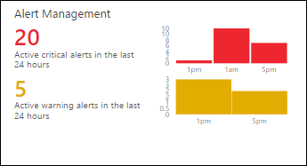

# Alert Management solution in Operations Management Suite (OMS)

The Alert Management solution helps you analyze all of the alerts in your Log Analytics repository.  These alerts may have come from a variety of sources including those [created by Log Analytics](log-analytics-alerts.md) or [imported from Nagios or Zabbix](log-analytics-linux-agents.md#linux-alerts).  The solution also imports alerts from any [connected System Center Operations Manager (SCOM) management groups](log-analytics-om-agents.md).

## Prerequisites
The solution will work with any records in the Log Analytics repository with a type of **Alert**, so you must perform whatever configuration is required to collect these records.

- For Log Analytics alerts, [create alert rules](log-analytics-alerts.md) to create alert records directly in the repository.
- For Nagios and Zabbix alerts, [configure those servers](log-analytics-linux-agents.md#linux-alerts) to send alerts to Log Analytics.
- For SCOM alerts,[connect your Operations Manager management group to your Log Analytics workspace](log-analytics-om-agents.md).  Any alerts created in SCOM will be imported into Log Analytics.  

## Configuration
Add the Alert Management solution to your OMS workspace using the process described in [Add solutions](log-analytics-add-solutions.md).  There is no further configuration required.

## Management packs
If your SCOM management group is connected to your OMS workspace,  then the following management packs will be installed in SCOM when you add this solution.  There is no configuration or maintenance of these management packs required.  

* Microsoft System Center Advisor Alert Management (Microsoft.IntelligencePacks.AlertManagement)

For more information on how solution management packs are updated, see [Connect Operations Manager to Log Analytics](log-analytics-om-agents.md).

## Data collection
### Agents
The following table describes the connected sources that are supported by this solution.

| Connected Source | Support | Description |
|:--- |:--- |:--- |
| [Windows agents](log-analytics-windows-agents.md) | No |Direct Windows agents do not generate alerts.  Log Analytics alerts can be created from events and performance data collected from Windows agents. |
| [Linux agents](log-analytics-linux-agents.md) | No |Direct Linux agents do not generate alerts.  Log Analytics alerts can be created from events and performance data collected from Linux agents.  Nagios and Zabbix alerts are collected from those servers which require the Linux agent. |
| [SCOM management group](log-analytics-om-agents.md) |Yes |Alerts that are generated on SCOM agents are delivered to the management group and then forwarded to Log Analytics.  A direct connection from  SCOM agents to Log Analytics is not required. Alert data is forwarded from the management group to the Log Analytics repository. |

### Collection frequency
- Alert records are available to the solution as soon as they are stored in the repository.
- Alert data is sent from the SCOM management group to Log Analytics every 3 minutes.  

## Using the solution
When you add the Alert Management solution to your OMS workspace, the **Alert Management** tile will be added to your OMS dashboard.  This tile displays a count and graphical representation of the number of currently active alerts that were generated within the last 24 hours.  You cannot change this time range.

Click on the **Alert Management** tile to open the **Alert Management** dashboard.  The dashboard includes the columns in the following table.  Each column lists the top ten alerts by count matching that column's criteria for the specified scope and time range.  You can run a log search that provides the entire list by clicking **See all** at the bottom of the column or by clicking the column header.

| Column | Description |
|:--- |:--- |
| Critical Alerts |All alerts with a severity of Critical grouped by alert name.  Click on an alert name to run a log search returning all records for that alert. |
| Warning Alerts |All alerts with a severity of Warning grouped by alert name.  Click on an alert name to run a log search returning all records for that alert. |
| Active SCOM Alerts |All alerts collected from SCOM with any state other than *Closed* grouped by source that generated the alert. |
| All Active Alerts |All alerts with any severity grouped by alert name. Only includes SCOM alerts with any state other than *Closed*. |

If you scroll to the right, the dashboard will list several common queries that you can click on to perform a [log search](log-analytics-log-searches.md) for alert data.

## Log Analytics records
The Alert Management solution analyzes any record with a type of **Alert**.  Alerts created by Log Analytics or collected from Nagios or Zabbix are not directly collected by the solution.

The solution does import alerts from SCOM and creates a corresponding record for each with a type of **Alert** and a SourceSystem of **OpsManager**.  These records have the properties in the following table.  

| Property | Description |
|:--- |:--- |
| Type |*Alert* |
| SourceSystem |*OpsManager* |
| AlertContext |Details of the data item that caused the alert to be generated in XML format. |
| AlertDescription |Detailed description of the alert. |
| AlertId |GUID of the alert. |
| AlertName |Name of the alert. |
| AlertPriority |Priority level of the alert. |
| AlertSeverity |Severity level of the alert. |
| AlertState |Latest resolution state of the alert. |
| LastModifiedBy |Name of the user who last modified the alert. |
| ManagementGroupName |Name of the management group where the alert was generated. |
| RepeatCount |Number of time the same alert was generated for the same monitored object since being resolved. |
| ResolvedBy |Name of the user who resolved the alert. Empty if the alert has not yet been resolved. |
| SourceDisplayName |Display name of the monitoring object that generated the alert. |
| SourceFullName |Full name of the monitoring object that generated the alert. |
| TicketId |Ticket ID for the alert if the SCOM environment is integrated with a process for assigning tickets for alerts.  Empty of no ticket ID is assigned. |
| TimeGenerated |Date and time that the alert was created. |
| TimeLastModified |Date and time that the alert was last changed. |
| TimeRaised |Date and time that the alert was generated. |
| TimeResolved |Date and time that the alert was resolved. Empty if the alert has not yet been resolved. |

## Sample log searches
The following table provides sample log searches for alert records collected by this solution.  

| Query | Description |
|:--- |:--- |
| Type=Alert SourceSystem=OpsManager AlertSeverity=error TimeRaised>NOW-24HOUR |Critical alerts raised during the past 24 hours |
| Type=Alert AlertSeverity=warning TimeRaised>NOW-24HOUR |Warning alerts raised during the past 24 hours |
| Type=Alert SourceSystem=OpsManager AlertState!=Closed TimeRaised>NOW-24HOUR &#124; measure count() as Count by SourceDisplayName |Sources with active alerts raised during the past 24 hours |
| Type=Alert SourceSystem=OpsManager AlertSeverity=error TimeRaised>NOW-24HOUR AlertState!=Closed |Critical alerts raised during the past 24 hours which are still active |
| Type=Alert SourceSystem=OpsManager TimeRaised>NOW-24HOUR AlertState=Closed |Alerts raised during the past 24 hours which are now closed |
| Type=Alert SourceSystem=OpsManager TimeRaised>NOW-1DAY &#124; measure count() as Count by AlertSeverity |Alerts raised during the past 1 day grouped by their severity |
| Type=Alert SourceSystem=OpsManager TimeRaised>NOW-1DAY &#124; sort RepeatCount desc |Alerts raised during the past 1 day sorted by their repeat count value |

## Next steps
* Learn about [Alerts in Log Analytics](log-analytics-alerts.md) for details on generating alerts from Log Analytics.

