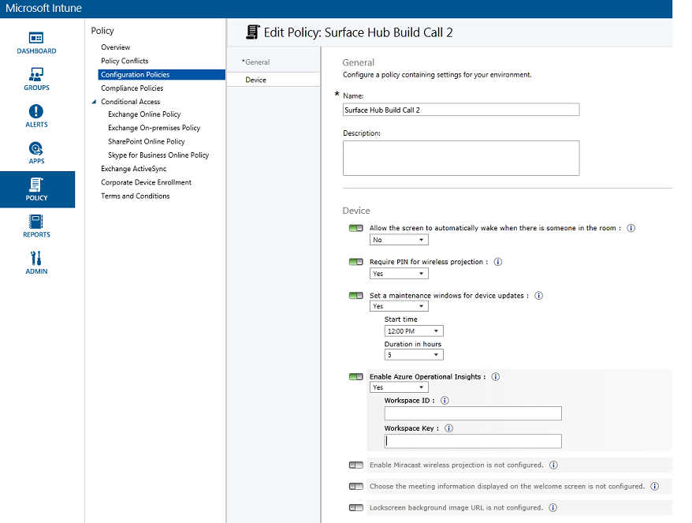
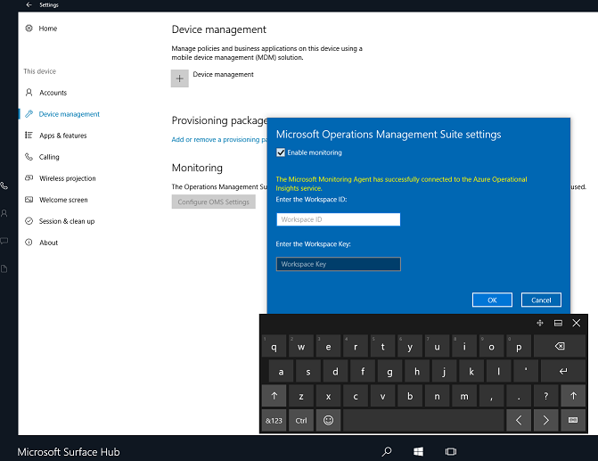
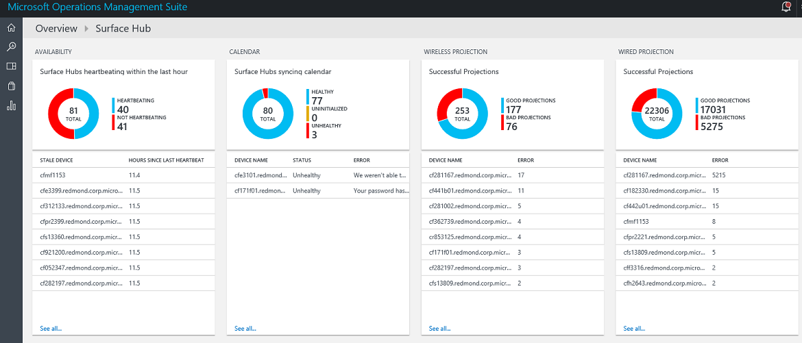

<properties
	pageTitle="Monitor Surface Hubs with Log Analytics | Microsoft Azure"
	description="Use the Surface Hub solution to track the health of your Surface Hubs and understand how they are being used."
	services="log-analytics"
	documentationCenter=""
	authors="bandersmsft"
	manager="jwhit"
	editor=""/>

<tags
	ms.service="log-analytics"
	ms.workload="na"
	ms.tgt_pltfrm="na"
	ms.devlang="na"
	ms.topic="article"
	ms.date="06/21/2016"
	ms.author="banders"/>

# Monitor Surface Hubs with Log Analytics

This article describes how you can use the Surface Hub solution in Log Analytics to monitor Microsoft Surface Hub devices with the Microsoft Operations Management Suite (OMS). Log Analytics helps you track the health of your Surface Hubs as well as understand how they are being used.

Each Surface Hub has the Microsoft Monitoring Agent installed. Its through the agent that you can send data from your Surface Hub to OMS. Log files are read from your Surface Hubs and are then are sent to the OMS service. Issues like servers being offline, the calendar not syncing, or if the device account is unable to log into Skype are shown in OMS in the Surface Hub dashboard. By using the data in the dashboard, you can identify devices that are not running, or that are having other problems, and potentially apply fixes for the detected issues.

## Installing and configuring the solution

Use the following information to install and configure the solution. In order to manage your Surface Hubs from the Microsoft Operations Management Suite (OMS), you'll need the following:

- A valid subscription to [OMS](http://www.microsoft.com/oms).
- An [OMS subscription](https://azure.microsoft.com/pricing/details/log-analytics/) level that will support the number of devices you want to monitor. OMS pricing varies depending on how many devices are enrolled, and how much data it processes. You'll want to take this into consideration when planning your Surface Hub rollout.

Next, you will either add an OMS subscription to your existing Microsoft Azure subscription or create a new workspace directly through the OMS portal. Detailed instructions for using either method is at [Get started with Log Analytics](log-analytics-get-started.md). Once the OMS subscription is set up, there are two ways to enroll your Surface Hub devices:

- Automatically through InTune
- Manually through **Settings** on your Surface Hub device.

## Set up monitoring

You can monitor the health and activity of your Surface Hub using Log Analytics in OMS. You can enroll the Surface Hub in OMS by using InTune, or locally by using **Settings** on the Surface Hub.

## Connect Surface Hubs to OMS through InTune

You'll need the workspace ID and workspace key for the OMS workspace that will manage your Surface Hubs. You can get those from the OMS portal.

InTune is a Microsoft product that allows you to centrally manage the OMS configuration settings that are applied to one or more of your devices. Follow these steps to configure your devices through InTune:

1. Sign in to InTune.
2. Navigate to **Settings** > **Connected Sources**.
3. Create or edit a policy based on the Surface Hub template.
4. Navigate to the OMS (Azure Operational Insights) section of the policy, and add the *Workspace ID* and *Workspace Key* to the policy.
5. Save the policy.
6. Associate the policy with the appropriate group of devices.

  

InTune then syncs the OMS settings with the devices in the target group, enrolling them in your OMS workspace.

## Connect Surface Hubs to OMS using the Settings app

You'll need the workspace ID and workspace key for the OMS workspace that will manage your Surface Hubs. You can get those from the OMS portal.

If you don't use InTune to manage your environment, you can enroll devices manually through **Settings** on each Surface Hub:

1. From your Surface Hub, open **Settings**.
2. Enter the device admin credentials when prompted.
3. Click **This device**, and the under **Monitoring**, click **Configure OMS Settings**.
4. Select **Enable monitoring**.
6. In the OMS settings dialog, type the **Workspace ID** and type the **Workspace Key**.  
  
7. Click **OK** to complete the configuration.

A confirmation appears telling you whether or not the OMS configuration was successfully applied to the device. If it was, a message appears stating that the agent successfully connected to the OMS service. The device then starts sending data to OMS where you can view and act on it.

## Monitor Surface Hubs

Monitoring your Surface Hubs using OMS is much like monitoring any other enrolled devices.

1. Sign in to the OMS portal.
2. Navigate to the Surface Hub solution pack dashboard.
3. Your device's health is displayed.

  

You can create [alerts](log-analytics-alerts.md) based on existing or custom log searches. Using the data the OMS collects from your Surface Hubs, you can search for issues and alert on the conditions that you define for your devices.

## Next steps

- Use [Log searches in Log Analytics](log-analytics-log-searches.md) to view detailed Surface Hub data.
- Create [alerts](log-analytics-alerts.md) to notify you when issues occur with your Surface Hubs.
