<properties
	pageTitle="System Update Assessment solution in Log Analytics | Microsoft Azure"
	description="You can use the System Updates solution in Log Analytics to help you apply missing updates to servers in your infrastructure."
	services="log-analytics"
	documentationCenter=""
	authors="bandersmsft"
	manager="jwhit"
	editor=""/>

<tags
	ms.service="log-analytics"
	ms.workload="na"
	ms.tgt_pltfrm="na"
	ms.devlang="na"
	ms.topic="article"
	ms.date="08/11/2016"
	ms.author="banders"/>

# System Update Assessment solution in Log Analytics

You can use the System Updates solution in Log Analytics to help you apply missing updates to servers in your infrastructure. After you install the solution, you can view the updates that are missing from your monitored servers by using the **System Update Assessment** tile on the **Overview** page in OMS.

If missing updates are found, details are shown on the **Updates** dashboard. You can use the **Updates** dashboard to work with missing updates and develop a plan to apply them to the servers that need them.

## Installing and configuring the solution
Use the following information to install and configure the solution.

- Add the System Update Assessment solution to your OMS workspace using the process described in [Add Log Analytics solutions from the Solutions Gallery](log-analytics-add-solutions.md).  There is no further configuration required.

## System Update data collection details

System Update Assessment collects metadata and state data using the agents that you have enabled.

The following table shows data collection methods and other details about how data is collected for System Update Assessment.

| platform | Direct Agent | SCOM agent | Azure Storage | SCOM required? | SCOM agent data sent via management group | collection frequency |
|---|---|---|---|---|---|---|
|Windows||||            || At least 2 times per day and 15 minutes after installing an update|

The following table shows examples of data types collected by System Update Assessment:

|**Data type**|**Fields**|
|---|---|
|Metadata|BaseManagedEntityId, ObjectStatus, OrganizationalUnit, ActiveDirectoryObjectSid, PhysicalProcessors, NetworkName, IPAddress, ForestDNSName, NetbiosComputerName, VirtualMachineName, LastInventoryDate, HostServerNameIsVirtualMachine, IP Address, NetbiosDomainName, LogicalProcessors, DNSName, DisplayName, DomainDnsName, ActiveDirectorySite, PrincipalName, OffsetInMinuteFromGreenwichTime|
|State|StateChangeEventId, StateId, NewHealthState, OldHealthState, Context, TimeGenerated, TimeAdded, StateId2, BaseManagedEntityId, MonitorId, HealthState, LastModified, LastGreenAlertGenerated, DatabaseTimeModified|

### To work with updates

1. On the **Overview** page, click the **System Update Assessment** tile.  
    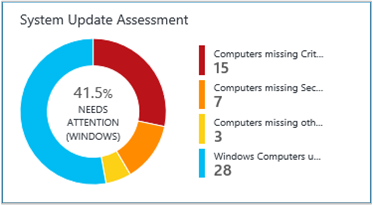
2. On the **Updates** dashboard, view the update categories.  
    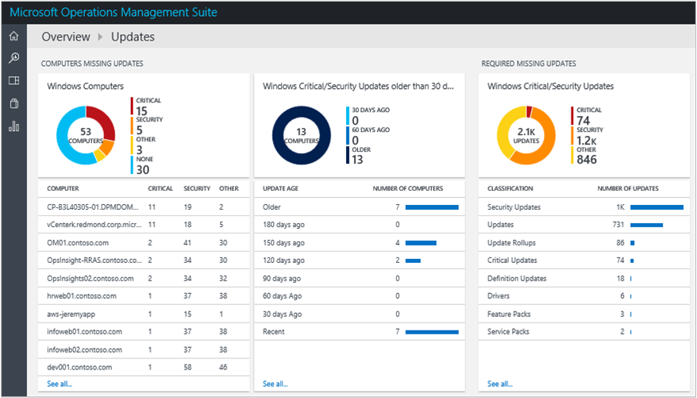
3. Scroll to the right of the page to view the **Windows Critical/Security Updates** blade and then under **Classification**, click **Security Updates**.  
    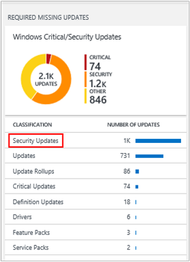
4. On the Log Search page, a variety of information is shown about the security updates that were found missing from servers in your infrastructure. Click **List** to view detailed information about the updates.  
    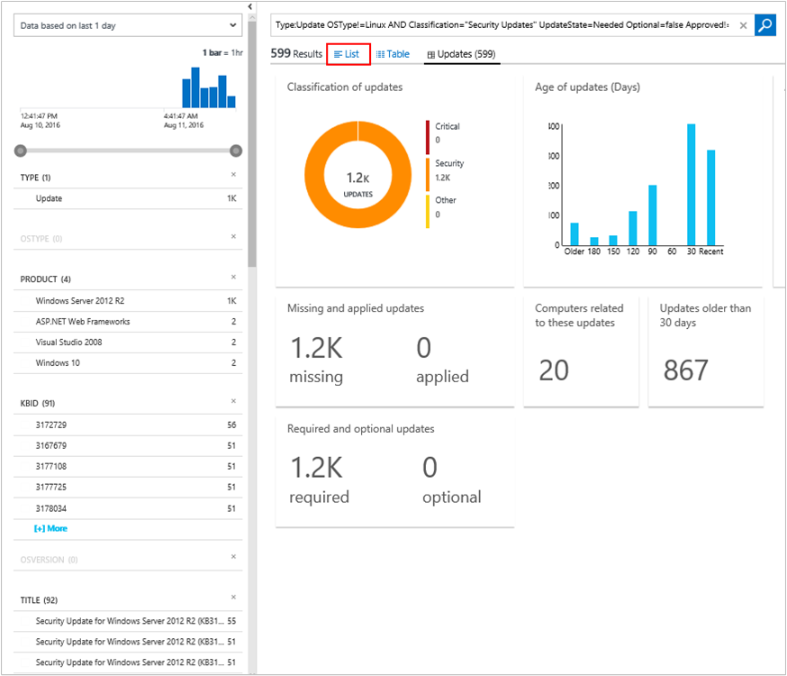
5. On the Log Search page, detailed information about each update is shown. Next to the KBID number, click **View** to view the corresponding article on the Microsoft Support Web site.  
    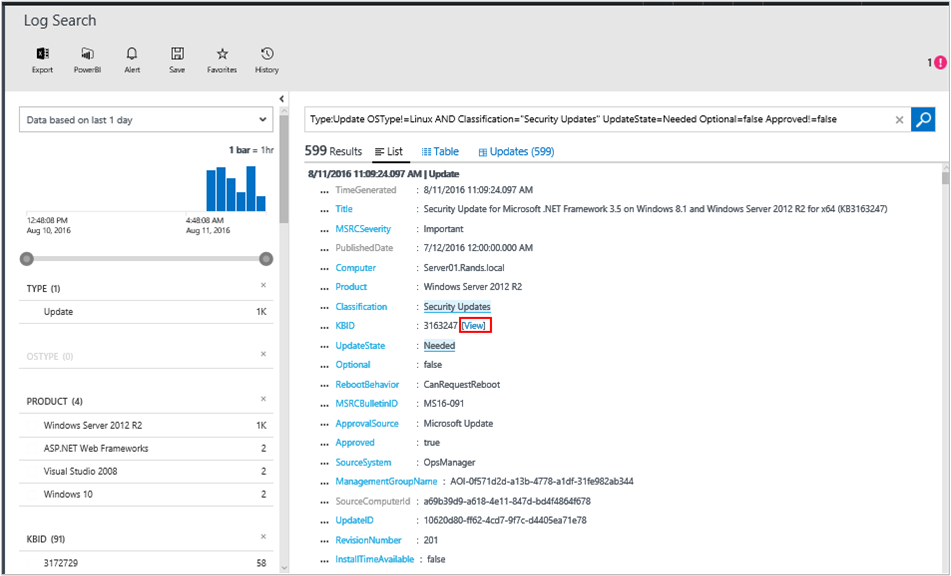
6. Your web browser opens the Microsoft Support Web page for the update in a new tab. View the information about the update that is missing.  
    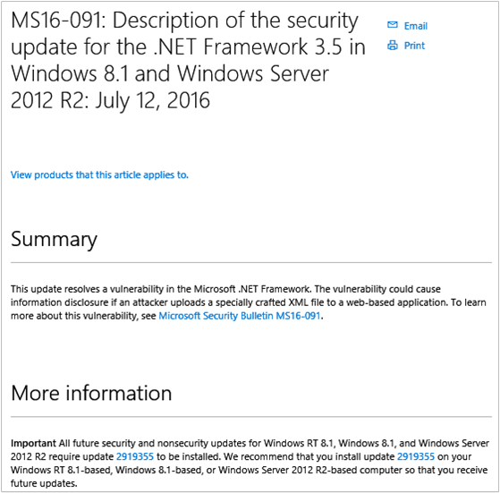
7. Using the using the information you've found, you can create a plan to manually apply the missing update, or you can continue following the remaining steps to automatically apply the update.
8. If you want to automatically apply the missing update, go back to the **Updates** dashboard and then under **Update Runs**, click **Click to schedule an update run**.  
    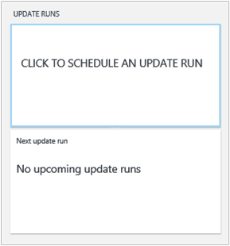
9. On the **Update Runs** page on the **Scheduled** tab, click **Add** to create a new update run.  
    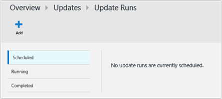
10. On the **New Update Run** page, type a name for the update run, add individual computers or computer groups, define a schedule, and then click **Save**.  
    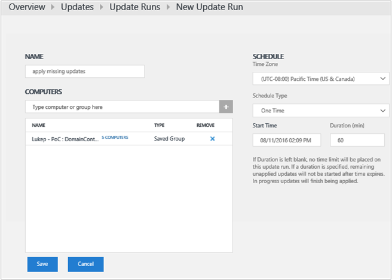
11. The **Scheduled** tab on the **Update Runs** page shows the new update run that you've scheduled.  
    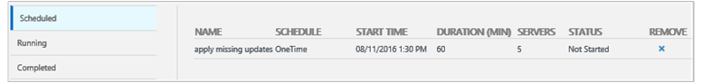
12. When the update run starts, you'll see information for it on the **Running** tab.  
    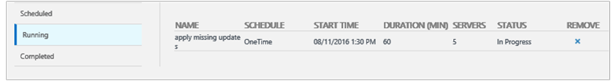
13. After the update run completes, the **Completed** tab displays status.
14. If updates were applied from the update run, in the **Windows Critical/Security Updates** blade, you'll see that the number of updates is reduced.  
    

## Next steps

- [Search logs](log-analytics-log-searches.md) to view detailed system update data.
