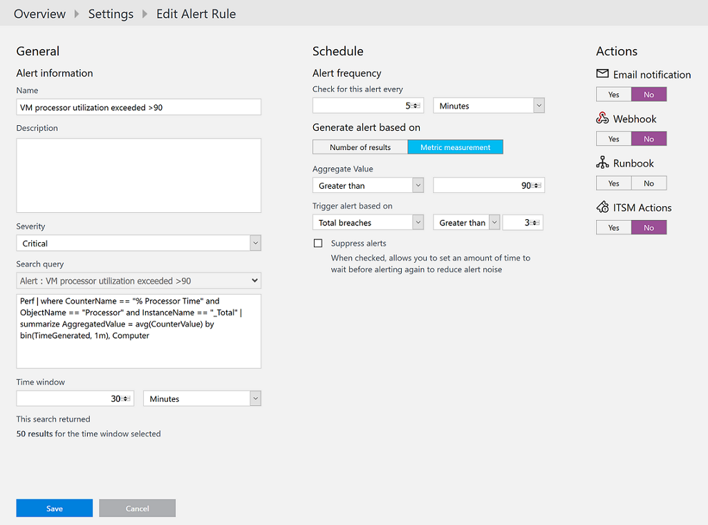
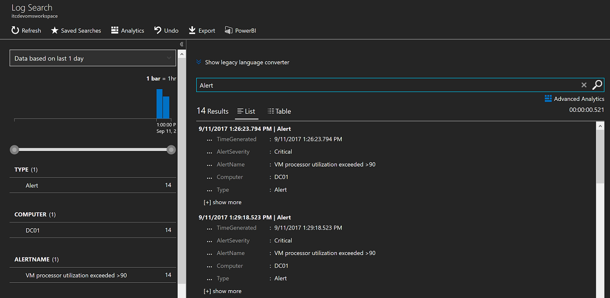

# Monitor and respond to events with Log Analytics Alerts
Alerts in Log Analytics identify important information in your Log Analytics repository.  They are created by alert rules that automatically run log searches at regular intervals, and if results of the log search match particular criteria then an alert record is created and it can be configured to perform an automated response.   

In this tutorial, you learn how to:

> [!div class="checklist"]
> * Create an alert rule
> * Configure an alert rule to send an e-mail notification

To complete the example in this tutorial, you must have an existing virtual machine [connected to the Log Analytics workspace](log-analytics-quick-collect-azurevm.md).  

## Create alerts

Alerts are created by alert rules that automatically run log searches at regular intervals.  You can create alerts based on specific performance metrics or when certain events are created, absence of an event, or a number of events are created within a particular time window.  For example, alerts can be used to notify you when average CPU usage exceeds a certain threshold or an event is generated when a specific Windows service or Linux daemon is not running.   If the results of the log search match particular criteria then an alert record is created. The rule can then automatically run one or more actions to proactively notify you of the alert or invoke another process. 

In the following example, we create a metric measurement alert rule which will create an alert for each computer object in the query with a value that exceeds a 90% threshold.

1. Sign into the Azure portal.
2. Select **Browse** on the left side of the portal, and then select **Log Analytics**.
3. Launch the OMS portal by selecting OMS Portal and on the **Overview** page, select **Log Search**.  
4. Select **Favorites** from the top of the portal and in the **Saved Searches** pane on the right, select the query *Azure VMs - Processor Utilization*.  
5. Click **Alert** at the top of the page to open the **Add Alert Rule** screen.  
6. Configure the alert rule with the following information:  
   a. Provide a **Name** for your alert, such as *VM processor utilization exceeded >90*  
   b. For **Time Window**, specify a time range for the query, such as *30*.  The query returns only records that were created within this range of the current time.  
   c. **Alert Frequency** specifies how often the query should be run.  For this example, specify *5* minutes, which will occur within our time window specified.  
   d. Select **Metric Measurement** and enter *90* for **Aggregated Value** and enter *3* for **Trigger alert based on**   
   e. Under **Actions**, disable email notification.
7. Click **Save** to complete the alert rule. It will start running immediately.   

Alert records created by alert rules in Log Analytics have a Type of **Alert** and a SourceSystem of **OMS**.     

## Alert actions
You can perform advanced actions with alerts such as create an e-mail notification, launch an [Automation runbook](../automation/automation-runbook-types.md), use a webhook to create an incident record in your ITSM incident management system or with the [IT Service Management Connector solution](log-analytics-itsmc-overview.md) as a response when the alert criteria is met.   

Email actions send an e-mail with details of the alert to one or more recipients. You can specify the subject of the mail, but it's content is a standard format constructed by Log Analytics.  Let's update the alert rule created earlier and configure it to e-mail notify you instead of actively monitoring for the alert record with a log search.     

1. In the OMS portal, on the top menu select **Settings** and then select **Alerts**.
2. From the list of alert rules, click the pencil icon next to the alert created earlier.
3. Under **Actions** section, enable email notifications.
4. Provide a **Subject** for the email, such as *Processor utilization exceeded threshold*.
5. Add addresses of one or more e-mail recipients in the **Recipients** field.  If you specify more than one address, then separate the addresses with a semicolon (;).
6. Click **Save** to complete the alert rule. It will start running immediately.   

## Next steps
In this tutorial, you learned how alert rules can proactively identify and respond to an issue when they run log searches at scheduled intervals and match a particular criteria.  

Follow this link to see pre-built Log Analytics script samples.  

> [!div class="nextstepaction"]
> [Log Analytics script samples](powershell-samples.md)