# View or analyze data collected with Log Analytics log search

In Log Analytics you can leverage log searches by constructing queries to analyze the collected data, use pre-existing dashboards which you can customize with graphical views of your most valuable searches.  Now that you have defined collection of operational data from your Azure VMs and Activity Logs, in this tutorial you learn how to:

> [!div class="checklist"]
> * Perform a simple search of event data and use features to modify and filter the results 
> * Learn how to work with performance data

To complete the example in this tutorial, you must have an existing virtual machine [connected to the Log Analytics workspace](log-analytics-quick-collect-azurevm.md).  

Creating and editing queries, in addition to working interactively with returned data, can be accomplished one of two ways.  For basic queries, use the Log Search page in the Azure portal, or for advanced querying, you can use the Advanced Analytics portal. To learn more about the difference in functionality between the two portals, see [Portals for creating and editing log queries in Azure Log Analytics](log-analytics-log-search-portals.md)

In this tutorial, we will be working with Log Search in the Azure portal. 

## Log in to Azure portal
Log in to the Azure portal at [https://portal.azure.com](https://portal.azure.com). 

## Open the Log Search portal 
Start by opening the Log Search portal.   

1. In the Azure portal, click **All services**. In the list of resources, type **Monitor**. As you begin typing, the list filters based on your input. Select **Monitor**.
2. On the Monitor navigation menu, select **Log Analytics** and then select a workspace.

## Create a simple search
The quickest way to retrieve some data to work with is a simple query that returns all records in table.  If you have any Windows or Linux clients connected to your workspace, then you'll have data in either the Event (Windows) or Syslog (Linux) table.

Type one the following queries in the search box and click the search button.  

```
Event
```
```
Syslog
```

Data is returned in the default list view, and you can see how many total records were returned.

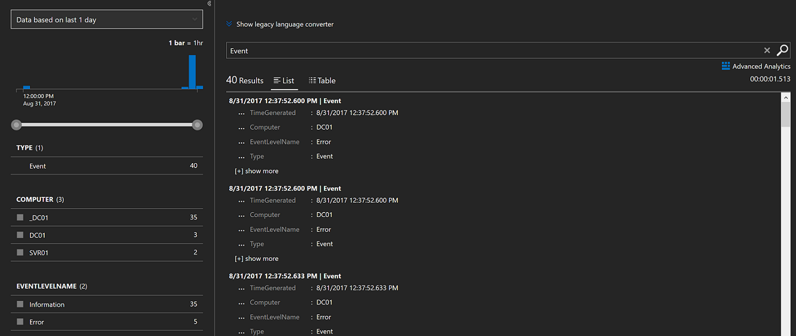

Only the first few properties of each record are displayed.  Click **show more** to display all properties for a particular record.

## Filter results of the query
On the left side of the screen is the filter pane which allows you to add filtering to the query without modifying it directly.  Several record properties are displayed for that record type, and you can select one or more property values to narrow your search results.

If you're working with **Event**, select the checkbox next to **Error** under **EVENTLEVELNAME**.   If you're working with **Syslog**, select the checkbox next to **err** under **SEVERITYLEVEL**.  This changes the query to one of the following to limit the results to error events.

```
Event | where (EventLevelName == "Error")
```
```
Syslog | where (SeverityLevel == "err")
```

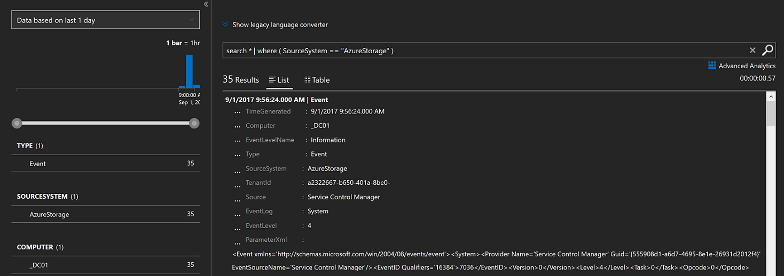

Add properties to the filter pane by selecting **Add to filters** from the property menu on one of the records.

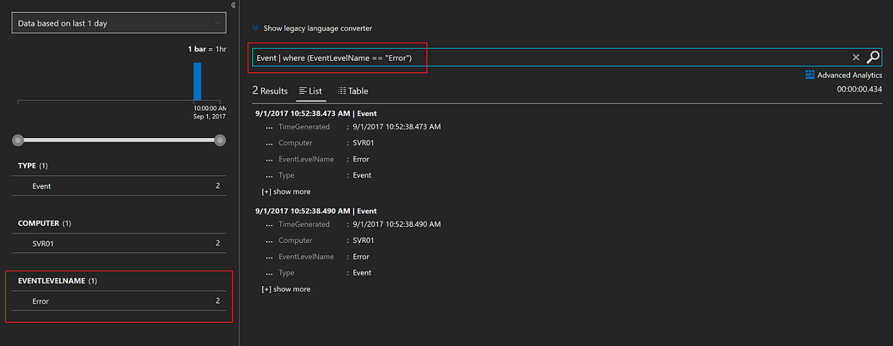

You can set the same filter by selecting **Filter** from the property menu for a record with the value you want to filter.  

You only have the **Filter** option for properties with their name in blue when you hover over them.  These are *searchable* fields which are indexed for search conditions.  Fields in grey are *free text searchable* fields which only have the **Show references** option.  This option returns records that have that value in any property.

You can group the results on a single property by selecting the **Group by** option in the record menu.  This will add a [summarize](/azure/kusto/query/summarizeoperator) operator to your query that displays the results in a chart.  You can group on more than one property, but you would need to edit the query directly.  Select the record menu next the **Computer** property and select **Group by 'Computer'**.  

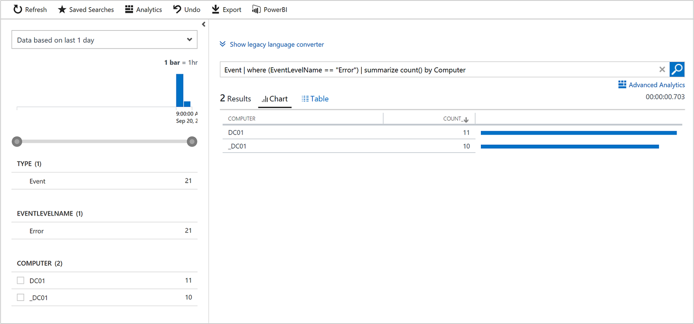

## Work with results
The Log Search portal has a variety of features for working with the results of a query.  You can sort, filter, and group results to analyze the data without modifying the actual query.  Results of a query are not sorted by default.

To view the data in table form which provides additional options for filtering and sorting, click **Table**.  

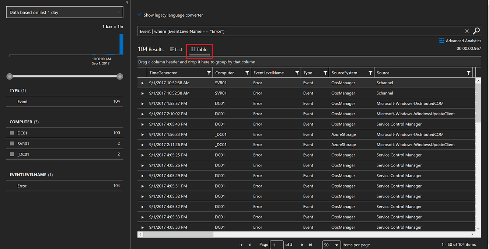

Click the arrow by a record to view the details for that record.

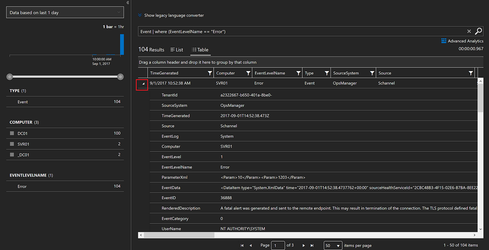

Sort on any field by clicking on its column header.

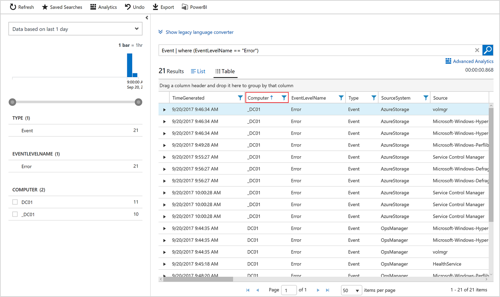

Filter the results on a specific value in the column by clicking the filter button and providing a filter condition.

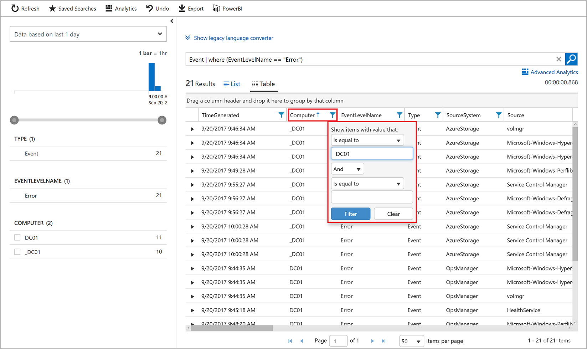

Group on a column by dragging its column header to the top of the results.  You can group on multiple fields by dragging multiple columns to the top.

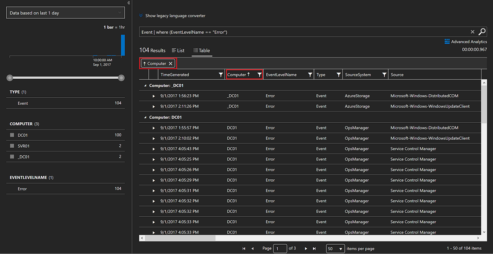


## Work with performance data
Performance data for both Windows and Linux agents is stored in the Log Analytics workspace in the **Perf** table.  Performance records look just like any other record, and we are going to write a simple query that returns all performance records just like with events.

```
Perf
```

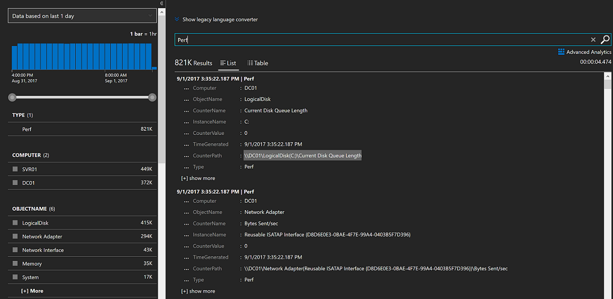

Returning millions of records for all performance objects and counters though isn't very useful.  You can use the same methods you used above to filter the data or just type the following query directly into the log search box.  This returns only processor utilization records for both Windows and Linux computers.

```
Perf | where ObjectName == "Processor"  | where CounterName == "% Processor Time"
```

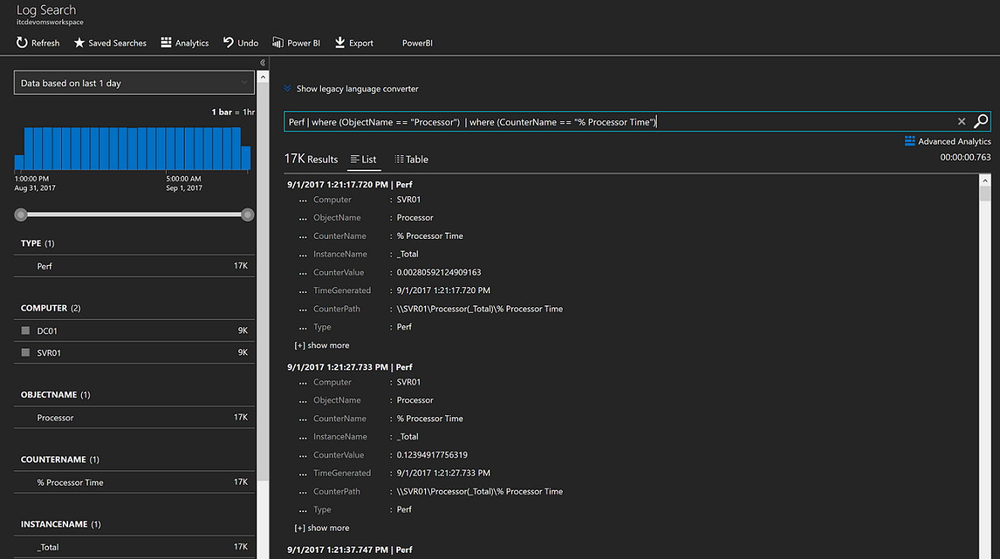

This limits the data to a particular counter, but it still doesn't put it in a form that's particularly useful.  You can display the data in a line chart, but first need to group it by Computer and TimeGenerated.  To group on multiple fields, you need to modify the query directly, so modify the query to the following.  This uses the [avg](/azure/kusto/query/avg-aggfunction) function on the **CounterValue** property to calculate the average value over each hour.

```
Perf  
| where ObjectName == "Processor"  | where CounterName == "% Processor Time"
| summarize avg(CounterValue) by Computer, TimeGenerated
```

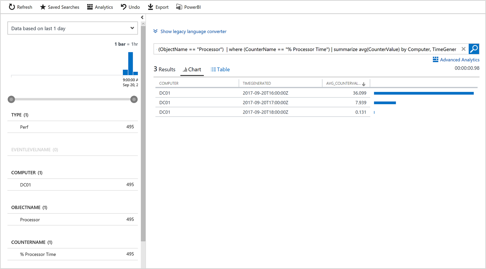

Now that the data is suitably grouped, you can display it in a visual chart by adding the [render](/azure/kusto/query/renderoperator) operator.  

```
Perf  
| where ObjectName == "Processor" | where CounterName == "% Processor Time" 
| summarize avg(CounterValue) by Computer, TimeGenerated 
| render timechart
```

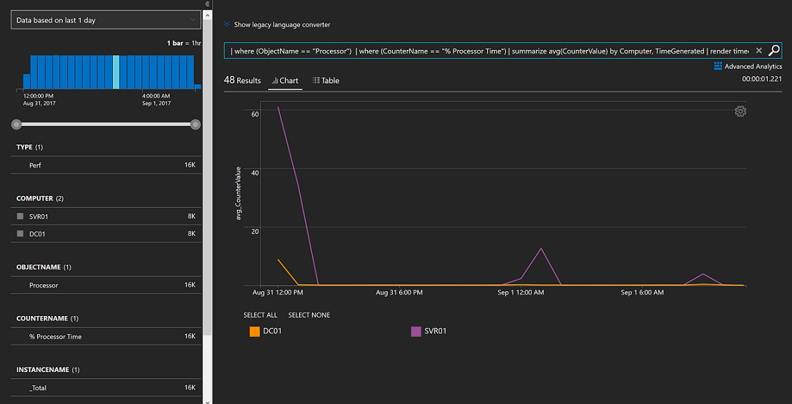

## Next steps
In this tutorial, you learned how to create basic log searches to analyze event and performance data.  Advance to the next tutorial to learn how to visualize the data by creating a dashboard.

> [!div class="nextstepaction"]
> [Create and share Log Analytics dashboards](log-analytics-tutorial-dashboards.md)
