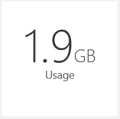
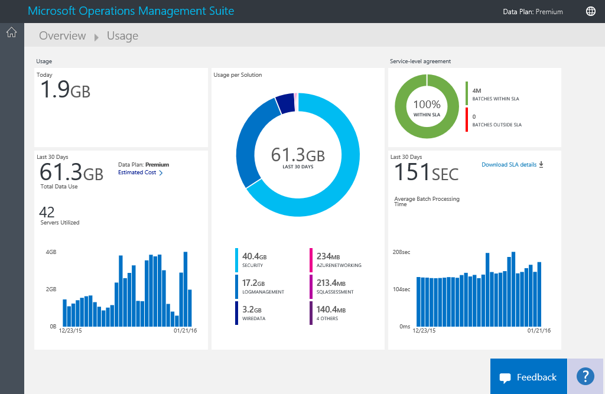
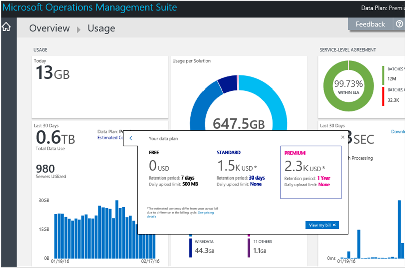
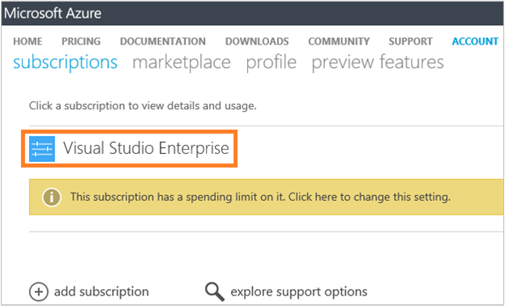
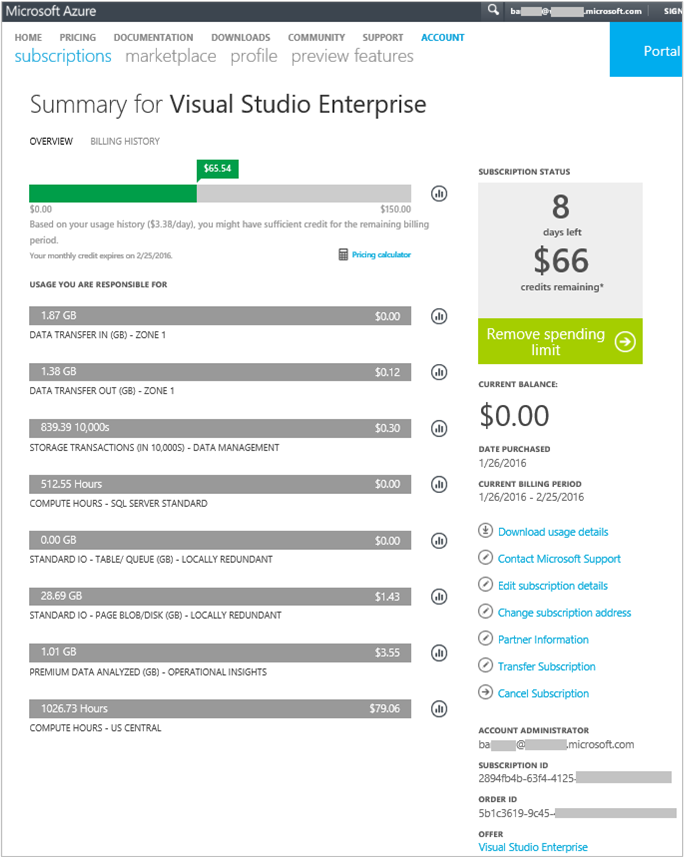
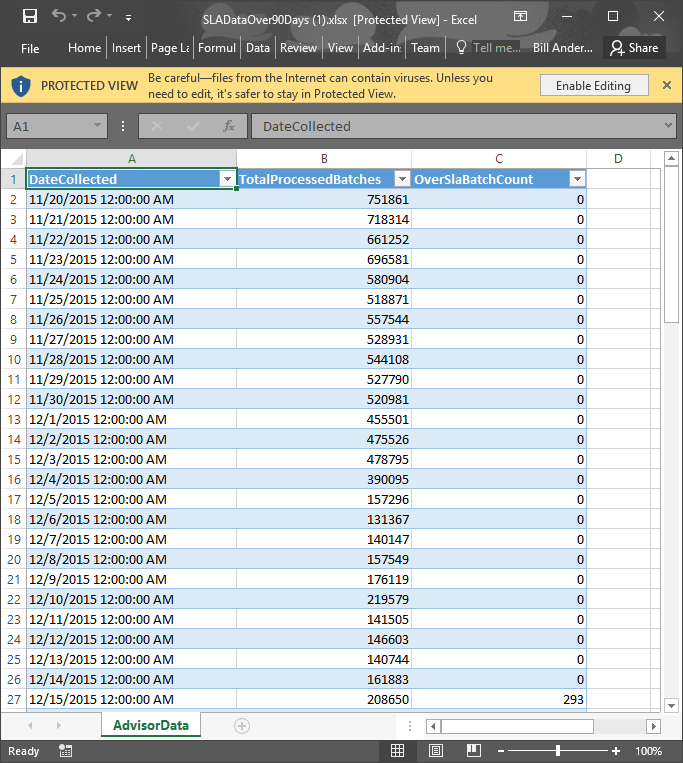

<properties
	pageTitle="Analyze data usage in Log Analytics | Microsoft Azure"
	description="You can use the Usage page in Log Analytics to view how much data is being sent to the OMS service."
	services="log-analytics"
	documentationCenter=""
	authors="bandersmsft"
	manager="jwhit"
	editor=""/>

<tags
	ms.service="log-analytics"
	ms.workload="na"
	ms.tgt_pltfrm="na"
	ms.devlang="na"
	ms.topic="get-started-article"
	ms.date="08/11/2016"
	ms.author="banders"/>

# Analyze data usage in Log Analytics

Log Analytics in the Operations Management Suite (OMS) collects data and sends it to the OMS service periodically.  You can use the **Usage** page to view how much data is being sent to the OMS service. The **Usage** page also shows you how much data is being sent daily by solutions and how often your servers are sending data.

>[AZURE.NOTE] If you have a free account created using the [OMS website](http://www.microsoft.com/oms), you're limited to sending 500 MB of data to the OMS service daily. If you reach the daily limit, data analysis will stop and resume at the start of the next day. You'll also need to resend any data that wasn't accepted or processed by OMS.

You can view your usage by using the **Usage** tile on the **Overview** dashboard in OMS.

If you have exceeded your daily usage limit, or if you are near your limit, you can optionally remove a solution to reduce the amount of data that you send to the OMS service. For more information about removing solutions, see [Add Log Analytics solutions from the Solutions Gallery](log-analytics-add-solutions.md).

The **Usage** page displays the following information:

- Average usage per day
- Data usage for each solution over the last 30 days
- How much data the servers in your environment are sending to the OMS service over the last 30 days
- Your data plan pricing tier and estimated cost
- Information about your service level agreement (SLA), including how long it takes OMS to process your data

## To work with usage data

1. On the **Overview** page, click the **Usage** tile.
2. On the **Usage** page, view the usage categories that show areas you’re concerned about.
3. If you have a solution that is consuming too much of your daily upload quota, you might consider removing that solution.

## To view your estimated cost and billing information
1. On the **Overview** page, click the **Usage** tile.
2. On the **Usage** page under **Usage**, click the chevron (**>**) next to **Estimated cost**.
3. In the expanded **Your data plan** details, you can see your estimated monthly cost.  
    
4. If you want to view your billing information, click **View my bill** to view your subscription information.
    - On the subscriptions page, click your subscription to view details and a line-item list of usage.  
        
    - On the Summary page for your subscription, you can perform a variety of tasks to manage and view more details about your subscription.  
	    

## To view data batches for your SLA
1. On the **Overview** page, click the **Usage** tile.
2. Under **Service Level Agreement**, click **Download SLA details**.
3. An Excel XLSX file is downloaded for you to review.  
    

## Next steps

- See [Log searches in Log Analytics](log-analytics-log-searches.md) to view detailed information gathered by solutions.
