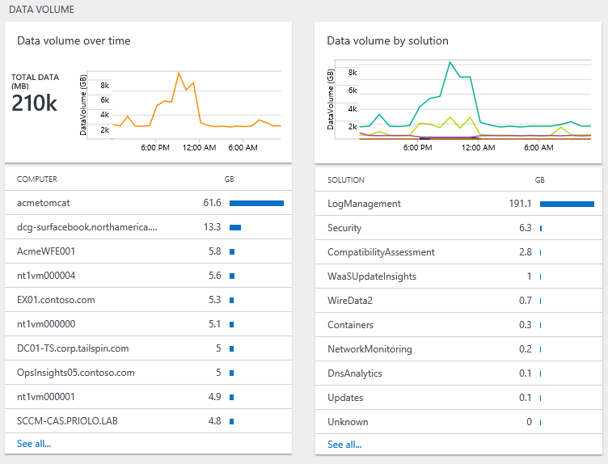
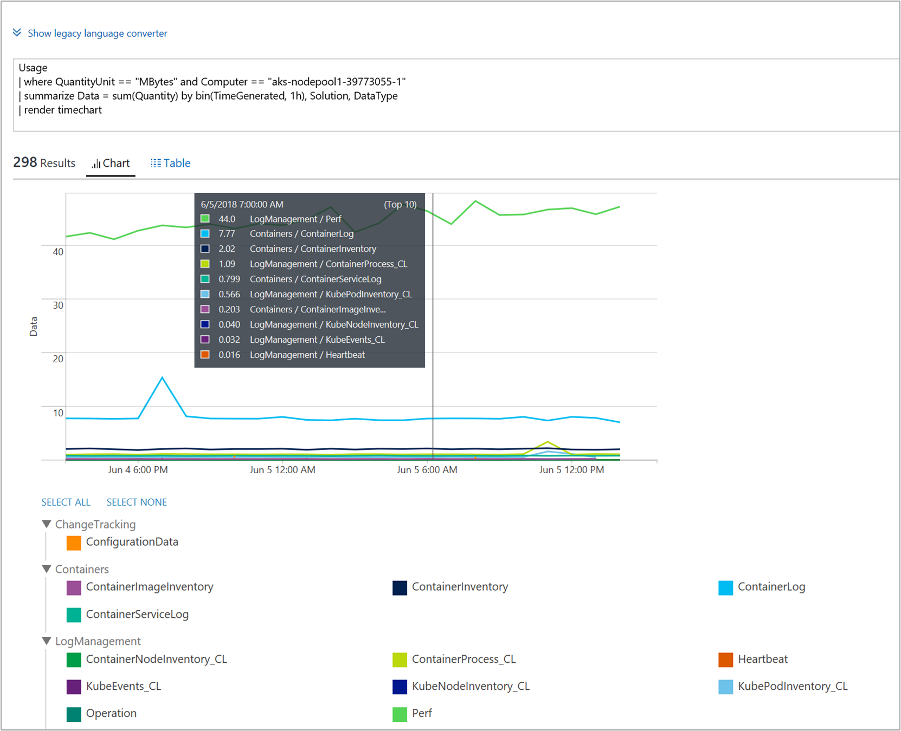
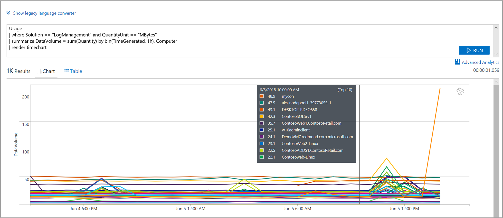
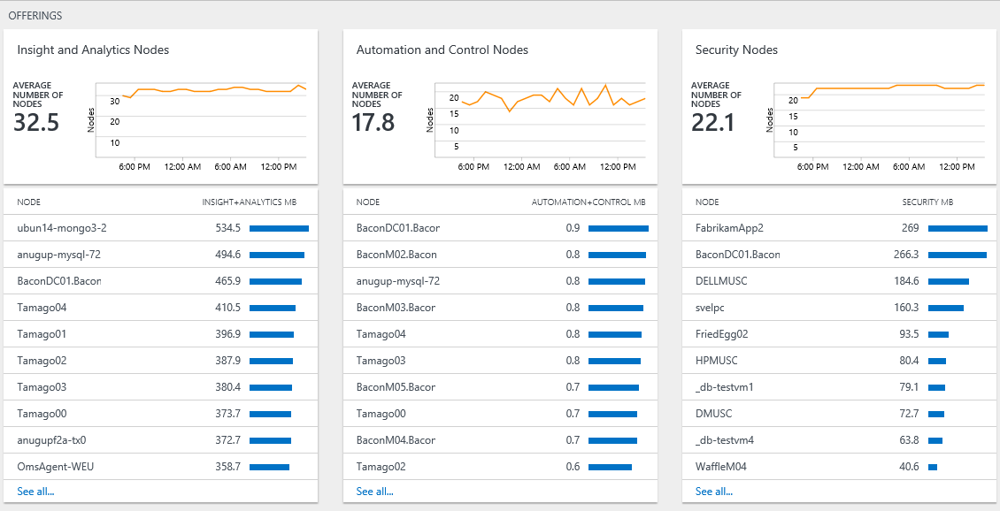

# Analyze data usage in Log Analytics

> [!NOTE]
> This article describes how to analyze data usage in Log Analytics.  Refer to the following articles for related information.
> - [Manage cost by controlling data volume and retention in Log Analytics](log-analytics-manage-cost-storage.md) describes how to control your costs by changing your data retention period.
> - [Monitoring usage and estimated costs](../monitoring-and-diagnostics/monitoring-usage-and-estimated-costs.md) describes how to view usage and estimated costs across multiple Azure monitoring features for different pricing models. It also describes how to change your pricing model.

Log Analytics includes information on the amount of data collected, which sources sent the data, and the different types of data sent.  Use the **Log Analytics Usage** dashboard to review and analyze data usage. The dashboard shows how much data is collected by each solution and how much data your computers are sending.

## Understand the Usage dashboard
The **Log Analytics usage** dashboard displays the following information:

- Data volume
    - Data volume over time (based on your current time scope)
    - Data volume by solution
    - Data not associated with a computer
- Computers
    - Computers sending data
    - Computers with no data in last 24 hours
- Offerings
    - Insight and Analytics nodes
    - Automation and Control nodes
    - Security nodes  
- Performance
    - Time taken to collect and index data  
- List of queries

 
)

### To work with usage data
1. Sign in to the [Azure portal](https://portal.azure.com).
2. In the Azure portal, click **All services**. In the list of resources, type **Log Analytics**. As you begin typing, the list filters based on your input. Select **Log Analytics**.       
3. In your list of Log Analytics workspaces, select a workspace.
4. Select **Usage and estimated costs** from the list in the left pane.
5. On the **Usage and estimated costs** dashboard, you can modify the time range by selecting the **Time: Last 24 hours** and change the time interval.     
6. View the usage category blades that show areas you’re interested in. Choose a blade and then click an item in it to view more details in [Log Search](log-analytics-log-searches.md).     
7. On the Log Search dashboard, review the results that are returned from the search.   

## Create an alert when data collection is higher than expected
This section describes how to create an alert if:
- Data volume exceeds a specified amount.
- Data volume is predicted to exceed a specified amount.

Azure Alerts support [log alerts](../monitoring-and-diagnostics/monitor-alerts-unified-log.md) that use search queries. 

The following query has a result when there is more than 100 GB of data collected in the last 24 hours:

`union withsource = $table Usage | where QuantityUnit == "MBytes" and iff(isnotnull(toint(IsBillable)), IsBillable == true, IsBillable == "true") == true | extend Type = $table | summarize DataGB = sum((Quantity / 1024)) by Type | where DataGB > 100`

The following query uses a simple formula to predict when more than 100 GB of data will be sent in a day: 

`union withsource = $table Usage | where QuantityUnit == "MBytes" and iff(isnotnull(toint(IsBillable)), IsBillable == true, IsBillable == "true") == true | extend Type = $table | summarize EstimatedGB = sum(((Quantity * 8) / 1024)) by Type | where EstimatedGB > 100`

To alert on a different data volume, change the 100 in the queries to the number of GB you want to alert on.

Use the steps described in [create a new log alert](../monitoring-and-diagnostics/monitor-alerts-unified-usage.md) to be notified when data collection is higher than expected.

When creating the alert for the first query -- when there is more than 100 GB of data in 24 hours, set the:  

- **Define alert condition** specify your Log Analytics workspace as the resource target.
- **Alert criteria** specify the following:
   - **Signal Name** select **Custom log search**
   - **Search query** to `union withsource = $table Usage | where QuantityUnit == "MBytes" and iff(isnotnull(toint(IsBillable)), IsBillable == true, IsBillable == "true") == true | extend Type = $table | summarize DataGB = sum((Quantity / 1024)) by Type | where DataGB > 100`
   - **Alert logic** is **Based on** *number of results* and **Condition** is *Greater than* a **Threshold** of *0*
   - **Time period** of *1440* minutes and **Alert frequency** to every *60* minutes since the usage data only updates once per hour.
- **Define alert details** specify the following:
   - **Name** to *Data volume greater than 100 GB in 24 hours*
   - **Severity** to *Warning*

Specify an existing or create a new [Action Group](../monitoring-and-diagnostics/monitoring-action-groups.md) so that when the log alert matches criteria, you are notified.

When creating the alert for the second query -- when it is predicted that there will be more than 100 GB of data in 24 hours, set the:

- **Define alert condition** specify your Log Analytics workspace as the resource target.
- **Alert criteria** specify the following:
   - **Signal Name** select **Custom log search**
   - **Search query** to `union withsource = $table Usage | where QuantityUnit == "MBytes" and iff(isnotnull(toint(IsBillable)), IsBillable == true, IsBillable == "true") == true | extend Type = $table | summarize EstimatedGB = sum(((Quantity * 8) / 1024)) by Type | where EstimatedGB > 100`
   - **Alert logic** is **Based on** *number of results* and **Condition** is *Greater than* a **Threshold** of *0*
   - **Time period** of *180* minutes and **Alert frequency** to every *60* minutes since the usage data only updates once per hour.
- **Define alert details** specify the following:
   - **Name** to *Data volume expected to greater than 100 GB in 24 hours*
   - **Severity** to *Warning*

Specify an existing or create a new [Action Group](../monitoring-and-diagnostics/monitoring-action-groups.md) so that when the log alert matches criteria, you are notified.

When you receive an alert, use the steps in the following section to troubleshoot why usage is higher than expected.

## Troubleshooting why usage is higher than expected
The usage dashboard helps you to identify why usage (and therefore cost) is higher than you are expecting.

Higher usage is caused by one, or both of:
- More data than expected being sent to Log Analytics
- More nodes than expected sending data to Log Analytics

### Check if there is more data than expected 
There are two key sections of the usage page that help identify what is causing the most data to be collected.

The *Data volume over time* chart shows the total volume of data sent and the computers sending the most data. The chart at the top allows you to see if your overall data usage is growing, remaining steady or decreasing. The list of computers shows the 10 computers sending the most data.

The *Data volume by solution* chart shows the volume of data that is sent by each solution and the solutions sending the most data. The chart at the top shows the total volume of data that is sent by each solution over time. This information allows you to identify whether a solution is sending more data, about the same amount of data, or less data over time. The list of solutions shows the 10 solutions sending the most data. 

These two charts show all data. Some data is billable, and other data is free. To focus only on data that billable, modify the query on the search page to include `IsBillable=true`.  

Look at the *Data volume over time* chart. To see the solutions and data types that are sending the most data for a specific computer, click on the name of the computer. Click on the name of the first computer in the list.

In the following screenshot, the *Log Management / Perf* data type is sending the most data for the computer.     

Next, go back to the *Usage* dashboard and look at the *Data volume by solution* chart. To see the computers sending the most data for a solution, click on the name of the solution in the list. Click on the name of the first solution in the list. 

In the following screenshot, it confirms that the *mycon* computer is sending the most data for the Log Management solution.     

If needed, perform additional analysis to identify large volumes within a solution or data type. Example queries include:

+ **Security** solution
  - `SecurityEvent | summarize AggregatedValue = count() by EventID`
+ **Log Management** solution
  - `Usage | where Solution == "LogManagement" and iff(isnotnull(toint(IsBillable)), IsBillable == true, IsBillable == "true") == true | summarize AggregatedValue = count() by DataType`
+ **Perf** data type
  - `Perf | summarize AggregatedValue = count() by CounterPath`
  - `Perf | summarize AggregatedValue = count() by CounterName`
+ **Event** data type
  - `Event | summarize AggregatedValue = count() by EventID`
  - `Event | summarize AggregatedValue = count() by EventLog, EventLevelName`
+ **Syslog** data type
  - `Syslog | summarize AggregatedValue = count() by Facility, SeverityLevel`
  - `Syslog | summarize AggregatedValue = count() by ProcessName`
+ **AzureDiagnostics** data type
  - `AzureDiagnostics | summarize AggregatedValue = count() by ResourceProvider, ResourceId`

Use the following steps to reduce the volume of logs collected:

| Source of high data volume | How to reduce data volume |
| -------------------------- | ------------------------- |
| Security events            | Select [common or minimal security events](https://blogs.technet.microsoft.com/msoms/2016/11/08/filter-the-security-events-the-oms-security-collects/)   Change the security audit policy to collect only needed events. In particular, review the need to collect events for   - [audit filtering platform](https://technet.microsoft.com/library/dd772749(WS.10).aspx)   - [audit registry](https://docs.microsoft.com/previous-versions/windows/it-pro/windows-server-2008-R2-and-2008/dd941614(v%3dws.10))  - [audit file system](https://docs.microsoft.com/previous-versions/windows/it-pro/windows-server-2008-R2-and-2008/dd772661(v%3dws.10))  - [audit kernel object](https://docs.microsoft.com/previous-versions/windows/it-pro/windows-server-2008-R2-and-2008/dd941615(v%3dws.10))  - [audit handle manipulation](https://docs.microsoft.com/previous-versions/windows/it-pro/windows-server-2008-R2-and-2008/dd772626(v%3dws.10))  - audit removable storage |
| Performance counters       | Change [performance counter configuration](log-analytics-data-sources-performance-counters.md) to:   - Reduce the frequency of collection   - Reduce number of performance counters |
| Event logs                 | Change [event log configuration](log-analytics-data-sources-windows-events.md) to:   - Reduce the number of event logs collected   - Collect only required event levels. For example, do not collect *Information* level events |
| Syslog                     | Change [syslog configuration](log-analytics-data-sources-syslog.md) to:   - Reduce the number of facilities collected   - Collect only required event levels. For example, do not collect *Info* and *Debug* level events |
| AzureDiagnostics           | Change resource log collection to:   - Reduce the number of resources send logs to Log Analytics   - Collect only required logs |
| Solution data from computers that don't need the solution | Use [solution targeting](../operations-management-suite/operations-management-suite-solution-targeting.md) to collect data from only required groups of computers. |

### Check if there are more nodes than expected
If you are on the *per node (OMS)* pricing tier, then you are charged based on the number of nodes and solutions you use. You can see how many nodes of each offer are being used in the *offerings* section of the usage dashboard.     

Click on **See all...** to view the full list of computers sending data for the selected offer.

Use [solution targeting](../operations-management-suite/operations-management-suite-solution-targeting.md) to collect data from only required groups of computers.

## Next steps
* See [Log searches in Log Analytics](log-analytics-log-searches.md) to learn how to use the search language. You can use search queries to perform additional analysis on the usage data.
* Use the steps described in [create a new log alert](../monitoring-and-diagnostics/monitor-alerts-unified-usage.md) to be notified when a search criteria is met.
* Use [solution targeting](../operations-management-suite/operations-management-suite-solution-targeting.md) to collect data from only required groups of computers.
* To configure an effective security event collection policy, review [Azure Security Center filtering policy](../security-center/security-center-enable-data-collection.md).
* Change [performance counter configuration](log-analytics-data-sources-performance-counters.md).
* To modify your event collection settings, review [event log configuration](log-analytics-data-sources-windows-events.md).
* To modify your syslog collection settings, review [syslog configuration](log-analytics-data-sources-syslog.md).
