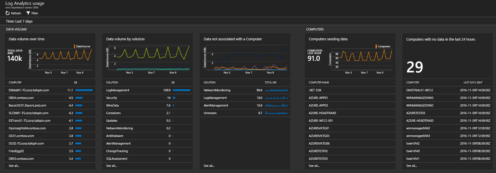
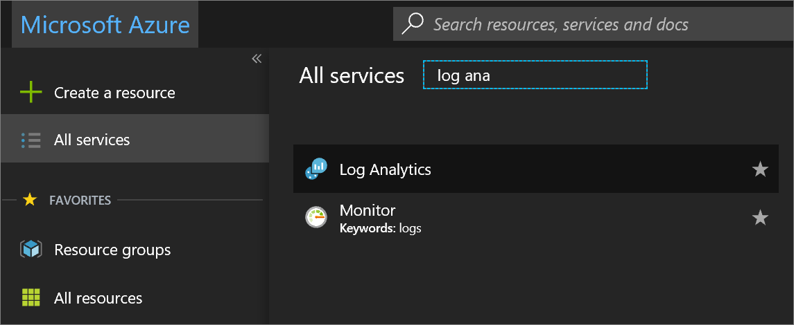
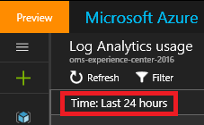
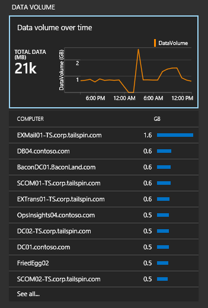
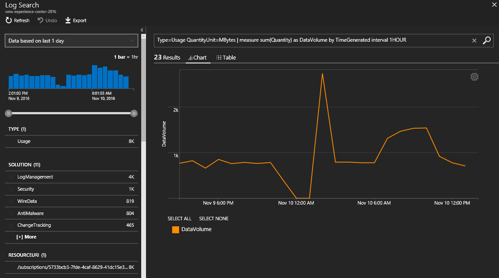

# Analyze data usage in Log Analytics
Log Analytics collects data and sends it to the OMS service periodically.  You can use the **Log Analytics Usage** dashboard to view how much data is being sent to the OMS service. The dashboard also shows you how much data is being sent by solutions and how often your servers are sending data.

> [!NOTE]
> If you have a free account, you're limited to sending 500 MB of data to the OMS service daily. If you reach the daily limit, data analysis stops and resumes at the start of the next day. In that case, you need to resend any data that wasn't accepted or processed by OMS.

If you have exceeded or are near your daily usage limit, you can optionally remove a solution to reduce the amount of data to send to the OMS service. For more information about removing solutions, see [Add Log Analytics solutions from the Solutions Gallery](log-analytics-add-solutions.md).

The **Log Analytics usage** dashboard displays the following information:

- Data volume
    - Data volume over time (based on your current time scope)
    - Data volume by solution
    - Data not associated with a computer
- Computers
    - Computers sending data
    - Computers with no data in last 24 hours
- Offerings
    - Insight and Analytics nodes
    - Automation and Control nodes
    - Security nodes
- Performance
    - Time taken to collect and index data
- List of queries

## Understanding nodes for OMS offers

If you are on the *per node (OMS)* pricing tier, then you are charged based on the number of nodes and solutions you have enabled. You can see how many nodes of each offer are being used in the *offerings* section of the usage dashboard.

## To work with usage data
1. If you haven't already done so, sign in to the [Azure portal](https://portal.azure.com) using your Azure subscription.
2. On the **Hub** menu, click **More services** and in the list of resources, type **Log Analytics**. As you begin typing, the list filters based on your input. Click **Log Analytics**.  
    
3. The **Log Analytics** dashboard shows a list of your workspaces. Select a workspace.
4. In the *workspace* dashboard, click **Log Analytics usage**.
5. On the **Log Analytics Usage** dashboard, click **Time: Last 24 hours** to change the time interval.  
    
6. View the usage category blades that show areas you’re interested in. Choose a blade and then click an item in it to view more details in [Log Search](log-analytics-log-searches.md).  
    
7. On the Log Search dashboard, review the results that are returned from the search.  
    

## Next steps
* See [Log searches in Log Analytics](log-analytics-log-searches.md) to view detailed information that is gathered and sent to OMS by features and solutions.
