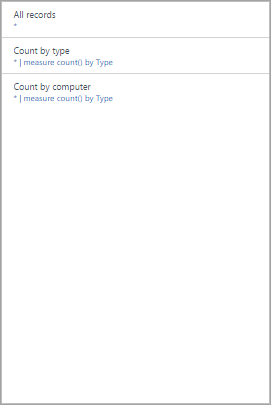

# Log Analytics View Designer visualization part reference
The View Designer in Log Analytics allows you to create custom views in the OMS console that contain different visualizations of data from the OMS repository. This article provides a reference of the settings for each of the visualization parts available to use in your custom views.

Other articles available for View Designer are:

* [View Designer](log-analytics-view-designer.md) - Overview of the View Designer and procedures for creating and editing custom views.
* [Tile reference](log-analytics-view-designer-tiles.md) - Reference of the settings for each of the tiles available to use in your custom views. 

The following table describes the different types of tiles available in the View Designer.  The sections below describe each tile type in detail and their properties.

| View Type | Description |
|:--- |:--- |
| [List of queries](#list-of-queries-part) |Displays a list of log search queries.  The user can click on each query to display its results. |
| [Number & list](#number-amp-list-part) |Header has a single number showing count of records from a log search query.  List displays the top ten results from a query with a graph indicating the relative value of a numeric column or its change over time. |
| [Two numbers & list](#two-numbers-amp-list-part) |Header has two numbers showing count of records from separate log search queries.  List displays the top ten results from a query with a graph indicating the relative value of a numeric column or its change over time. |
| [Donut & list](#donut-amp-list-part) |Header displays a single number summarized from a value column in a log query.  The donut graphically displays results of the top three records. |
| [Two timelines & list](#two-timelines-amp-list-part) |Header displays the results of two log queries over time as column charts with a callout displaying a single number summarized from a value column in a log query.  List displays the top ten results from a query with a graph indicating the relative value of a numeric column or its change over time. |
| [Information](#information-part) |Header displays static text and an optional link.  List displays one or more items with static text and title. |
| [Line chart, callout, & list](#line-chart-callout-amp-list-part) |Header displays a line chart with multiple series from a log query over time and a callout with a summarized value.  List displays the top ten results from a query with a graph indicating the relative value of a numeric column or its change over time. |
| [Line chart & list](#line-chart-amp-list-part) |Header displays a line chart with multiple series from a log query over time.  List displays the top ten results from a query with a graph indicating the relative value of a numeric column or its change over time. |
| [Stack of line charts part](#stack-of-line-charts-part) |Displays three separate line charts with multiple series from a log query over time. |

## List of queries part
Displays a list of log search queries.  The user can click on each query to display its results.  The view will include a single query by default, and you can click **+ Query** to add additional queries.

| Setting | Description |
|:--- |:--- |
| **General** | |
| Title |Text to display at the top of the view. |
| New Group |Select to create a new group in the view starting at the current view. |
| Pre-selected filters |Comma delimited list of properties to include in the left filter pane when the user selects a query. |
| Render mode |Initial view displayed when the query is selected.  The user can select any available views after opening the query. |
| **Queries** | |
| Search query |Query to run. |
| Friendly name |Descriptive name of the query to display to the user. |

## Number & list part
Header has a single number showing count of records from a log search query.  List displays the top ten results from a query with a graph indicating the relative value of a numeric column or its change over time.

| Setting | Description |
|:--- |:--- |
| **General** | |
| Group Title |Text to display at the top of the view. |
| New Group |Select to create a new group in the view starting at the current view. |
| Icon |Image file to display next to the result in the header. |
| Use Icon |Select to have the icon display. |
| **Title** | |
| Legend |Text to display at the top of the header. |
| Query |Query to run for the header.  The count of the number of records returned by the query will be displayed. |
| **List** | |
| Query |Query to run for the list.  The first two properties for the first ten records in the results will be displayed.  The first property should be a text value and the second property a numeric value.  Bars are automatically created based on the relative value of the numeric column.  Use the Sort command in the query to sort the records in the list.  The user can click See all to run the query and return all records. |
| Hide graph |Select to disable the graph to the right of the numeric column. |
| Enable sparklines |Select to display sparkline instead of horizontal bar.  See [Common Settings](#sparklines) for details. |
| Color |Color of the bars or sparklines. |
| Name & Value Separator |Single character delimiter if you want to parse the text property into multiple values.  See [Common Settings](#name-value-separator) for details. |
| Navigation query |Query to run when the user selects an item in the list.  See [Common Settings](#navigation-query) for details. |
| **List** |**> Column Titles** |
| Name |Text to display at the top of the first column of the list. |
| Value |Text to display at the top of the second column of the list. |
| **List** |**> Thresholds** |
| Enable Thresholds |Select to enable thresholds.  See [Common Settings](#thresholds) for details. |

## Two Numbers & list part
Header has two numbers showing count of records from separate log search queries.  List displays the top ten results from a query with a graph indicating the relative value of a numeric column or its change over time.

| Setting | Description |
|:--- |:--- |
| **General** | |
| Group Title |Text to display at the top of the view. |
| New Group |Select to create a new group in the view starting at the current view. |
| Icon |Image file to display next to the result in the header. |
| Use Icon |Select to have the icon display. |
| **Title** | |
| Legend |Text to display at the top of the header. |
| Query |Query to run for the header.  The count of the number of records returned by the query will be displayed. |
| **List** | |
| Query |Query to run for the list.  The first two properties for the first ten records in the results will be displayed.  The first property should be a text value and the second property a numeric value.  Bars are automatically created based on the relative value of the numeric column.  Use the Sort command in the query to sort the records in the list.  The user can click See all to run the query and return all records. |
| Hide graph |Select to disable the graph to the right of the numeric column. |
| Enable sparklines |Select to display sparkline instead of horizontal bar.  See [Common Settings](#sparklines) for details. |
| Color |Color of the bars or sparklines. |
| Operation |Operation to perform for the sparkline.  See [Common Settings](#sparklines) for details. |
| Name & Value Separator |Single character delimiter if you want to parse the text property into multiple values.  See [Common Settings](#name-value-separator) for details. |
| Navigation query |Query to run when the user selects an item in the list.  See [Common Settings](#navigation-query) for details. |
| **List** |**> Column Titles** |
| Name |Text to display at the top of the first column of the list. |
| Value |Text to display at the top of the second column of the list. |
| **List** |**> Thresholds** |
| Enable Thresholds |Select to enable thresholds.  See [Common Settings](#thresholds) for details. |

## Donut & list part
Header displays a single number summarized from a value column in a log query.  The donut graphically displays results of the top three records.

| Setting | Description |
|:--- |:--- |
| **General** | |
| Group Title |Text to display at the top of the tile. |
| New Group |Select to create a new group in the view starting at the current view. |
| Icon |Image file to display next to the result in the header. |
| Use Icon |Select to have the icon display. |
| **Header** | |
| Title |Text to display at the top of the header. |
| Subtitle |Text to display under the Title at the top of the header. |
| **Donut** | |
| Query |Query to run for the donut.  The first property should be a text value and the second property a numeric value. |
| **Donut** |**> Center** |
| Text |Text to display under the value inside the donut. |
| Operation |The operation to perform on the value property to summarize to a single value.  - Sum: Add the values of all records. - Percentage: Percentage of the records returned by the values in **Result values used in center operation** to the total records in the query. |
| Result values used in center operation |Optionally click the plus sign to add one or more values.  The results of the query will be limited to records with the property values you specify.  If no values are added, then all records are included in the query. |
| **Additional options** |**> Colors** |
| Color 1 Color 2 Color 3 |Select the color for the each of the values displayed in the donut. |
| **Additional options** |**> Advanced Color Mapping** |
| Field value |Type the name of a field to display it as a different color if it is included in the donut. |
| Color |Select the color for the unique field. |
| **List** | |
| Query |Query to run for the list.  The count of the number of records returned by the query will be displayed. |
| Hide graph |Select to disable the graph to the right of the numeric column. |
| Enable sparklines |Select to display sparkline instead of horizontal bar.  See [Common Settings](#sparklines) for details. |
| Color |Color of the bars or sparklines. |
| Operation |Operation to perform for the sparkline.  See [Common Settings](#sparklines) for details. |
| Name & Value Separator |Single character delimiter if you want to parse the text property into multiple values.  See [Common Settings](#name-value-separator) for details. |
| Navigation query |Query to run when the user selects an item in the list.  See [Common Settings](#navigation-query) for details. |
| **List** |**> Column Titles** |
| Name |Text to display at the top of the first column of the list. |
| Value |Text to display at the top of the second column of the list. |
| **List** |**> Thresholds** |
| Enable Thresholds |Select to enable thresholds.  See [Common Settings](#thresholds) for details. |

## Two timelines & list part
Header displays the results of two log queries over time as column charts with a callout displaying a single number summarized from a value column in a log query.  List displays the top ten results from a query with a graph indicating the relative value of a numeric column or its change over time.

| Setting | Description |
|:--- |:--- |
| **General** | |
| Group Title |Text to display at the top of the tile. |
| New Group |Select to create a new group in the view starting at the current view. |
| Icon |Image file to display next to the result in the header. |
| Use Icon |Select to have the icon display. |
| **First Chart Second Chart** | |
| Legend |Text to display under the callout for the first series. |
| Color |Color to use for the columns in the series. |
| Query |Query to run for the first series.  The count of the number of records over each time interval will be represented by the chart columns. |
| Operation |The operation to perform on the value property to summarize to a single value for the callout.  -Sum: Sum of the value from all records. - Average: Average of the value from all records. - Last Sample: Value from the last interval included in the chart. - First Sample: Value from the first interval included in the chart. - Count: Count of all records returned by the query. |
| **List** | |
| Query |Query to run for the list.  The count of the number of records returned by the query will be displayed. |
| Hide graph |Select to disable the graph to the right of the numeric column. |
| Enable sparklines |Select to display sparkline instead of horizontal bar.  See [Common Settings](#sparklines) for details. |
| Color |Color of the bars or sparklines. |
| Operation |Operation to perform for the sparkline.  See [Common Settings](#sparklines) for details. |
| Navigation query |Query to run when the user selects an item in the list.  See [Common Settings](#navigation-query) for details. |
| **List** |**> Column Titles** |
| Name |Text to display at the top of the first column of the list. |
| Value |Text to display at the top of the second column of the list. |
| **List** |**> Thresholds** |
| Enable Thresholds |Select to enable thresholds.  See [Common Settings](#thresholds) for details. |

## Information part
Header displays static text and an optional link.  List displays one or more items with static text and title.

| Setting | Description |
|:--- |:--- |
| **General** | |
| Group Title |Text to display at the top of the tile. |
| New Group |Select to create a new group in the view starting at the current view. |
| Color |Background color for the header. |
| **Header** | |
| Image |Image file to display in the header. |
| Label |Text to display in the header. |
| **Header** |**> Link** |
| Label |Link text. |
| Url |Url for link. |
| **Information Items** | |
| Title |Text to display for title of each item. |
| Content |Text to display for each item. |

## Line chart, callout, & list part
Header displays a line chart with multiple series from a log query over time and a callout with a summarized value.  List displays the top ten results from a query with a graph indicating the relative value of a numeric column or its change over time.

| Setting | Description |
|:--- |:--- |
| **General** | |
| Group Title |Text to display at the top of the tile. |
| New Group |Select to create a new group in the view starting at the current view. |
| Icon |Image file to display next to the result in the header. |
| Use Icon |Select to have the icon display. |
| **Header** | |
| Title |Text to display at the top of the header. |
| Subtitle |Text to display under the Title at the top of the header. |
| **Line Chart** | |
| Query |Query to run for the line chart.  The first property should be a text value and the second property a numeric value.  This is typically a query that uses the **measure** keyword to summarize results.  If the query uses the **interval** keyword then the X-Axis of the chart will use this time interval.  If the query does not include the **interval** keyword then hourly intervals are used for the X-Axis. |
| **Line Chart** |**> Callout** |
| Callout Title |Text to display above the callout value. |
| Series Name |Property value for the series to use for the callout value.  If no series is provided, all records from the query are used. |
| Operation |The operation to perform on the value property to summarize to a single value for the callout.  - Average: Average of the value from all records. - Count    Count of all records returned by the query. - Last Sample: Value from the last interval included in the chart. - Max: Maximum value from the intervals included in the chart. - Min: Minimum value from the intervals included in the chart. - Sum: Sum of the value from all records. |
| **Line Chart** |**> Y Axis** |
| Use Logarithmic Scale |Select to use a logarithmic scale for the Y-Axis. |
| Units |Specify the units for the values returned by the query.  This information is used to display labels on the chart indicating the value types and optionally for converting the values.  The Unit Type specifies the category of the unit and defines the Current Unit Type values that are available.  If you select a value in Convert to then the numeric values are converted from the Current Unit type to the Convert to type. |
| Custom Label |Text to display for the Y Axis next to the label for the unit type.  If no label is specified, then only the unit type is displayed. |
| **List** | |
| Query |Query to run for the list.  The count of the number of records returned by the query will be displayed. |
| Hide graph |Select to disable the graph to the right of the numeric column. |
| Enable sparklines |Select to display sparkline instead of horizontal bar.  See [Common Settings](#sparklines) for details. |
| Color |Color of the bars or sparklines. |
| Operation |Operation to perform for the sparkline.  See [Common Settings](#sparklines) for details. |
| Name & Value Separator |Single character delimiter if you want to parse the text property into multiple values.  See [Common Settings](#name-value-separator) for details. |
| Navigation query |Query to run when the user selects an item in the list.  See [Common Settings](#navigation-query) for details. |
| **List** |**> Column Titles** |
| Name |Text to display at the top of the first column of the list. |
| Value |Text to display at the top of the second column of the list. |
| **List** |**> Thresholds** |
| Enable Thresholds |Select to enable thresholds.  See [Common Settings](#thresholds) for details. |

## Line chart & list part
Header displays a line chart with multiple series from a log query over time.  List displays the top ten results from a query with a graph indicating the relative value of a numeric column or its change over time.

| Setting | Description |
|:--- |:--- |
| **General** | |
| Group Title |Text to display at the top of the tile. |
| New Group |Select to create a new group in the view starting at the current view. |
| Icon |Image file to display next to the result in the header. |
| Use Icon |Select to have the icon display. |
| **Header** | |
| Title |Text to display at the top of the header. |
| Subtitle |Text to display under the Title at the top of the header. |
| **Line Chart** | |
| Query |Query to run for the line chart.  The first property should be a text value and the second property a numeric value.  This is typically a query that uses the **measure** keyword to summarize results.  If the query uses the **interval** keyword then the X-Axis of the chart will use this time interval.  If the query does not include the **interval** keyword then hourly intervals are used for the X-Axis. |
| **Line Chart** |**> Y Axis** |
| Use Logarithmic Scale |Select to use a logarithmic scale for the Y-Axis. |
| Units |Specify the units for the values returned by the query.  This information is used to display labels on the chart indicating the value types and optionally for converting the values.  The Unit Type specifies the category of the unit and defines the Current Unit Type values that are available.  If you select a value in Convert to then the numeric values are converted from the Current Unit type to the Convert to type. |
| Custom Label |Text to display for the Y Axis next to the label for the unit type.  If no label is specified, then only the unit type is displayed. |
| **List** | |
| Query |Query to run for the list.  The count of the number of records returned by the query will be displayed. |
| Hide graph |Select to disable the graph to the right of the numeric column. |
| Enable sparklines |Select to display sparkline instead of horizontal bar.  See [Common Settings](#sparklines) for details. |
| Color |Color of the bars or sparklines. |
| Operation |Operation to perform for the sparkline.  See [Common Settings](#sparklines) for details. |
| Name & Value Separator |Single character delimiter if you want to parse the text property into multiple values.  See [Common Settings](#name-value-separator) for details. |
| Navigation query |Query to run when the user selects an item in the list.  See [Common Settings](#navigation-query) for details. |
| **List** |**> Column Titles** |
| Name |Text to display at the top of the first column of the list. |
| Value |Text to display at the top of the second column of the list. |
| **List** |**> Thresholds** |
| Enable Thresholds |Select to enable thresholds.  See [Common Settings](#thresholds) for details. |

## Stack of line charts part
Displays three separate line charts with multiple series from a log query over time.

| Setting | Description |
|:--- |:--- |
| **General** | |
| Group Title |Text to display at the top of the tile. |
| New Group |Select to create a new group in the view starting at the current view. |
| Icon |Image file to display next to the result in the header. |
| **Chart 1 Chart 2 Chart 3** |**> Header** |
| Title |Text to display at the top of the chart. |
| Subtitle |Text to display under the Title at the top of the chart. |
| **Chart 1 Chart 2 Chart 3** |**Line Chart** |
| Query |Query to run for the line chart.  The first property should be a text value and the second property a numeric value.  This is typically a query that uses the **measure** keyword to summarize results.  If the query uses the **interval** keyword then the X-Axis of the chart will use this time interval.  If the query does not include the **interval** keyword then hourly intervals are used for the X-Axis. |
| **Chart** |**> Y Axis** |
| Use Logarithmic Scale |Select to use a logarithmic scale for the Y-Axis. |
| Units |Specify the units for the values returned by the query.  This information is used to display labels on the chart indicating the value types and optionally for converting the values.  The Unit Type specifies the category of the unit and defines the Current Unit Type values that are available.  If you select a value in Convert to then the numeric values are converted from the Current Unit type to the Convert to type. |
| Custom Label |Text to display for the Y Axis next to the label for the unit type.  If no label is specified, then only the unit type is displayed. |

## Common settings
The following sections describe settings common to several visualization parts.

### <a name="name-value-separator">Name & Value Separator</a>
Single character delimiter if you want to parse the text property from a list query into multiple values.  If you specify a delimiter, you can provide names for each field separated by the same delimiter in the Name box.

For example, consider a property called *Location* that included values such as *Redmond-Building 41* and *Bellevue-Building12*.  You could specify – for the Name & Value Separator and *City-Building* for the Name.  This would parse each value into two properties called *City* and *Building*. 

### <a name="navigation-query">Navigation query</a>
Query to run when the user selects an item in the list.  Use *{selected item}* to include the syntax for item that the user selected.

For example, if the query has a column called *Computer* and the navigation query is *{selected item}*, a query such as *Computer="MyComputer"* would be run when the user selected a computer.  If the navigation query is *Type=Event {selected item}* then the query *Type=Event Computer="MyComputer"* would be run.

### <a name="sparklines">Sparklines</a>
A sparkline is a small line chart that illustrates the value of a list entry over time.  For visualization parts with a list, you can select whether to display a horizontal bar indicating the relative value of a numeric column or a sparkline indicating its value over time.

The following table describes the settings for sparklines.

| Setting | Description |
|:--- |:--- |
| Enable Sparklines |Select to display sparkline instead of horizontal bar. |
| Operation |If sparklines are enabled, this is the operation to perform on each property in the list to calculate the values for the sparkline.  - Last Sample: Last value for the series over the time interval. - Max: Maximum value for the series over the time interval. - Min: Minimum value for the series over the time interval. - Sum: Sum of values for the series over the time interval. - Summary: Uses the same measure command as the query in the header. |

### <a name="thresholds">Thresholds</a>
Thresholds allow you to display a colored icon next to each item in a list giving you a quick visual indicator of items that exceed a particular value or fall within a particular range.  For example, you could display a green icon for items with an acceptable value, yellow if the value is within a range that indicates a warning, and red if it exceeds an error value.

When you enable thresholds for a part, you must specify one or more thresholds.  If the value of an item is greater than a threshold value and lower than the next threshold value, then that color is used.  If the item is greater than then highest threshold value, then that color is set.   

Each threshold set has one threshold with a value of **Default**.  This is the color set if no other values are exceeded.  You can add or remove thresholds by clicking the **+** or **x** button.

The following table describes the settings for tresholds.

| Setting | Description |
|:--- |:--- |
| Enable Thresholds |Select to display a color icon to the left of each value indicating its health relative to specified thresholds. |
| Name |Name to identify the threshold value. |
| Threshold |Value for the threshold.  The health color for each list item is set to the color of the highest threshold value exceeded by the item's value.  There is one Default threshold that is the color if no threshold values are exceeded. |
| Color |Color for the threshold value. |

## Next steps
* Learn about [log searches](log-analytics-log-searches.md) to support the queries in visualization parts.

