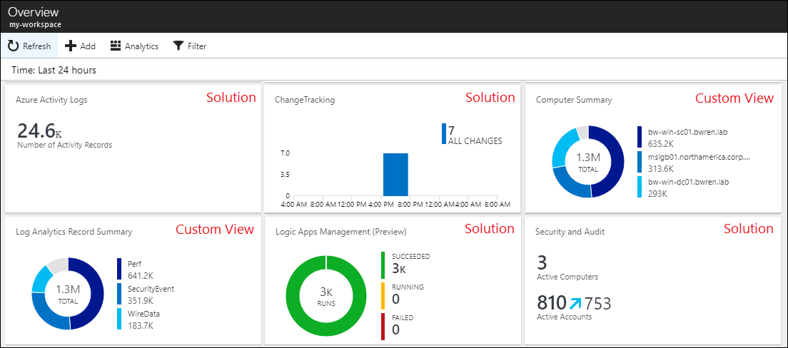
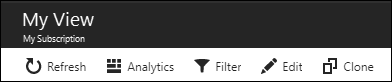
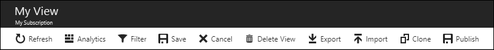

# Create custom views by using View Designer in Log Analytics
By using View Designer in [Azure Log Analytics](log-analytics-overview.md), you can create a variety of custom views in the Azure portal that can help you visualize data in your Log Analytics workspace. This article presents an overview of View Designer and procedures for creating and editing custom views.

For more information about View Designer, see:

* [Tile reference](log-analytics-view-designer-tiles.md): Provides a reference guide to the settings for each of the available tiles in your custom views.
* [Visualization part reference](log-analytics-view-designer-parts.md): Provides a reference guide to the settings for the visualization parts that are available in your custom views.

## Concepts
Views are displayed on the **Overview** page of your Log Analytics workspace in the Azure portal. The tiles in each custom view are displayed alphabetically, and the tiles for the solutions are installed the same workspace.

The views that you create with View Designer contain the elements that are described in the following table:

| Part | Description |
|:--- |:--- |
| Tiles | Are displayed on your Log Analytics workspace **Overview** page. Each tile displays a visual summary of the custom view it represents. Each tile type provides a different visualization of your records. You select a tile to display a custom view. |
| Custom view | Displayed when you select a tile. Each view contains one or more visualization parts. |
| Visualization parts | Present a visualization of data in the Log Analytics workspace based on one or more [log searches](log-analytics-log-searches.md). Most parts include a header, which provides a high-level visualization, and a list, which displays the top results. Each part type provides a different visualization of the records in the Log Analytics workspace. You select elements in the part to perform a log search that provides detailed records. |

## Work with an existing view
Views that were created with View Designer display the following options:

The options are described in the following table:

| Option | Description |
|:--|:--|
| Refresh   | Refreshes the view with the latest data. | 
| Analytics | Opens the [Advanced Analytics portal](log-analytics-log-search-portals.md) to analyze data with log queries. |
| Edit       | Opens the view in View Designer to edit its contents and configuration.  |
| Clone      | Creates a new view and opens it in View Designer. The name of the new view is the same as the original name, but with *Copy* appended to it. |
| Date range | Set the date and time range filter for the data that's included in the view. This date range is applied before any date ranges set in queries in the view.  |
| +          | Define a custom filter that's defined for the view. |

## Create a new view
You can create a new view in View Designer by selecting **View Designer** in the menu of your Log Analytics workspace.

## Work with View Designer
You use View Designer to create new views or edit existing ones. 

View Designer has three panes: 
* **Design**: Contains the custom view that you're creating or editing. 
* **Controls**: Contains the tiles and parts that you add to the **Design** pane. 
* **Properties**: Displays the properties of the tiles or selected parts.

### Configure the view tile
A custom view can have only a single tile. To view the current tile or select an alternate one, select the **Tile** tab in the **Control** pane. The **Properties** pane displays the properties of the current tile. 

You can configure the tile properties according to the information in the [Tile reference](log-analytics-view-designer-tiles.md) and then click **Apply** to save the changes.

### Configure the visualization parts
A view can include any number of visualization parts. To add parts to a view, select the **View** tab, and then select a visualization part. The **Properties** pane displays the properties of the selected part. 

You can configure the view properties according to the information in the [Visualization part reference](log-analytics-view-designer-parts.md) and then click **Apply** to save the changes.

Views have only one row of visualization parts. You can rearrange the existing parts by dragging them to a new location.

You can remove a visualization part from the view by selecting the **X** at the top right of the part.

### Menu options
The options for working with views in edit mode are described in the following table.

| Option | Description |
|:--|:--|
| Save        | Saves your changes and closes the view. |
| Cancel      | Discards your changes and closes the view. |
| Delete View | Deletes the view. |
| Export      | Exports the view to an [Azure Resource Manager template](../azure-resource-manager/resource-group-authoring-templates.md) that you can import into another workspace. The name of the file is the name of the view, and it has an *omsview* extension. |
| Import      | Imports the *omsview* file that you exported from another workspace. This action overwrites the configuration of the existing view. |
| Clone       | Creates a new view and opens it in View Designer. The name of the new view is the same as the original name, but with *Copy* appended to it. |

## Next steps
* Add [Tiles](log-analytics-view-designer-tiles.md) to your custom view.
* Add [Visualization parts](log-analytics-view-designer-parts.md) to your custom view.
