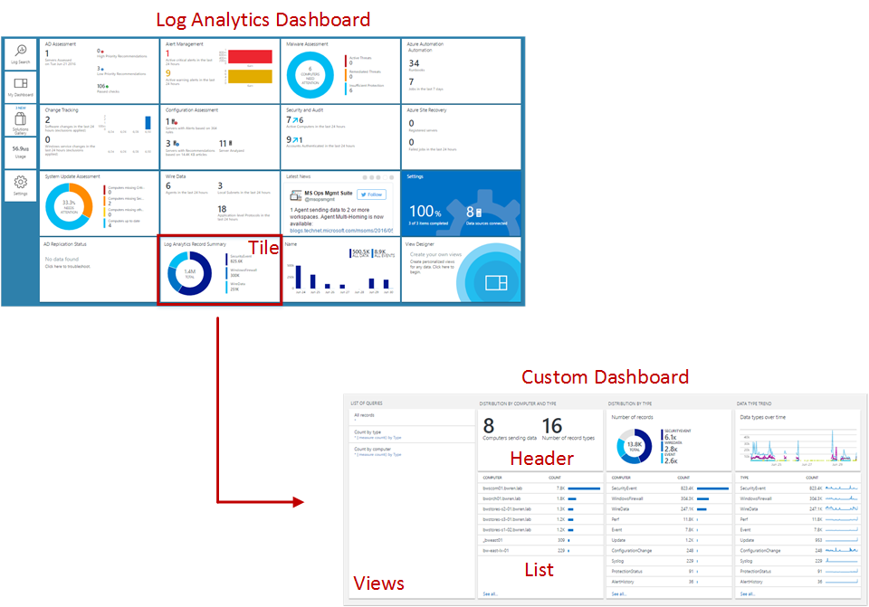
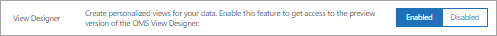
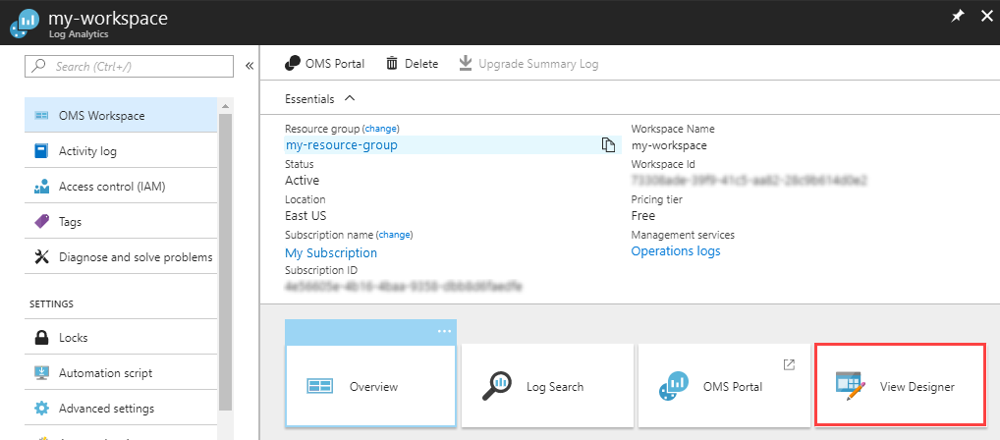
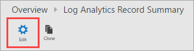
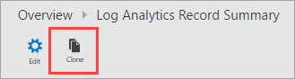
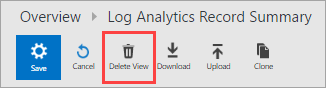
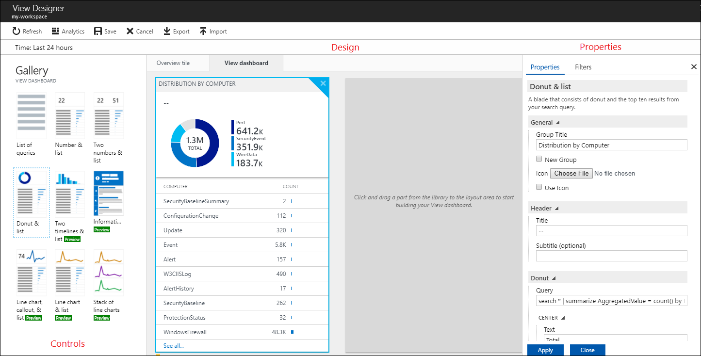

<properties
	pageTitle="Log Analytics View Designer | Microsoft Azure"
	description="View Designer in Log Analytics allows you to create custom Views in the OMS console that contain different visualizations of data in the OMS repository. This article contains an overview of View Designer and procedures for creating and editing custom views."
	services="log-analytics"
	documentationCenter=""
	authors="bwren"
	manager="jwhit"
	editor=""/>

<tags
	ms.service="log-analytics"
	ms.workload="na"
	ms.tgt_pltfrm="na"
	ms.devlang="na"
	ms.topic="article"
	ms.date="08/01/2016"
	ms.author="bwren"/>

# Log Analytics View Designer
The View Designer in Log Analytics allows you to create custom views in the OMS console that contain different visualizations of data in the OMS repository. This article contains an overview of View Designer and procedures for creating and editing custom views.

Other articles available for View Designer are:

- [Tile reference](log-analytics-view-designer-tiles.md) - Reference of the settings for each of the tiles available to use in your custom views. 
- [Visualization part reference](log-analytics-view-designer-parts.md) - Reference of the settings for each of the tiles available to use in your custom views. 

## Concepts
Views created with the View Designer contain the elements in the following table.

| Part | Description |
|:--|:--|
| Tile | Displayed on the main Log Analytics Overview dashboard.  Includes a visual summarizing of the information contained in the custom View.  Different Tile types provide different visualizations of records in the OMS repository.  Click on the Tile to open the Custom View. |
| Custom View | Displayed when the user clicks on the Tile.  Contains one or more visualization parts. |
| Visualization Parts | Visualization of data in the OMS repository based on one or more [log searches](log-analytics-log-searches.md).  Most parts will include a Header that provides a high level visualization and a List of the top results.  Different part types provide different visualizations of records in the OMS repository.  Click on elements in the part to perform a log search providing detailed records. |

## Adding View Designer to your workspace
While View Designer is in preview, you must add it to your workspace by selecting **Preview Features** in the **Settings** section of the OMS portal.

## Create a new view
Open a new view in the **View Designer** by clicking on the View Designer tile in the main OMS dashboard.

## Edit an existing view
To edit an existing view in the View Designer, open the view by clicking on its tile in the main OMS dashboard.  Then click the **Edit** button to open the view in the View Designer.

## Clone an existing view
When you clone a view, it creates a new view and opens it in the View Designer.  The new view will have the same name as the original with "Copy" appended to the end of it.  To clone a view, open the existing view by clicking on its tile in the main OMS dashboard.  Then click the **Clone** button to open the view in the View Designer.

## Delete an existing view
To delete an existing view, open the view by clicking on its tile in the main OMS dashboard.  Then click the **Edit** button to open the view in the View Designer, and click **Delete View**.

## Working with View Designer
The View Designer has three panes.  The **Design** pane represents the custom view.  When you add tiles and parts from the **Control** pane to the **Design** pane they are added to the view.  The **Properties** pane will display the properties for the tile or selected part.

## Configure view tile
A custom view can have only a single tile.  Select the **Tile** tab in the **Control** pane to view the current tile or select an alternate one.  The **Properties** pane will display the properties for the current tile.  Configure the tile properties according to the detailed information in the [Tile Reference](log-analytics-view-designer-tiles.md) and click **Apply** to save changes.

## Configure visualization parts
A view can include any number of visualization parts.  Select the **View** tab and then a visualization part to add to the view.  The **Properties** pane will display the properties for the selected part.  Configure the view properties according to the detailed information in the [Visualization part reference](log-analytics-view-designer-parts.md) and click **Apply** to save changes.

## Delete a visualization part
You can remove a visualization part from the view by clicking the **X** button in the top right corner of the part.

## Rearrange visualization parts
Views only have one row of visualization parts.  Rearrange existing parts in a view by clicking and dragging them to a new location.

## Next steps

- Add [Tiles](log-analytics-view-designer-tiles.md) to your custom dashboard.
- Add [Visualization Parts](log-analytics-view-designer-parts.md) to your custom dashboard.
