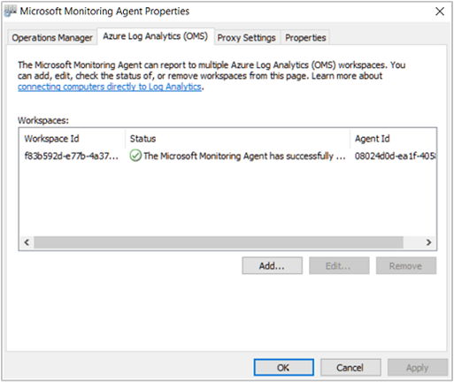

# Connect Windows computers to the Log Analytics service in Azure

This article shows the steps to connect Windows computers in your on-premises infrastructure to OMS workspaces by using a customized version of the Microsoft Monitoring Agent (MMA). You need to install and connect agents for all of the computers that you want to onboard in order for them to send data to the Log Analytics service and to view and act on that data. Each agent can report to multiple workspaces.

You can install agents using Setup, command line, or with Desired State Configuration (DSC) in Azure Automation.  

>[!NOTE]
For virtual machines running in Azure, you can simplify installation by using the [virtual machine extension](log-analytics-azure-vm-extension.md).

On computers with Internet connectivity, the agent uses the connection to the Internet to send data to OMS. For computers that do not have Internet connectivity, you can use a proxy or the [OMS Gateway](log-analytics-oms-gateway.md).

Connecting your Windows computers to OMS is straightforward using three simple steps:

1. Download the agent setup file from the OMS portal
2. Install the agent using the method you choose
3. Configure the agent or add additional workspaces, if necessary

The following diagram shows the relationship between your Windows computers and OMS after you’ve installed and configured agents.


If your IT security policies do not allow computers on your network to connect to the Internet, you can configure your computers to connect to the OMS Gateway. For more information and steps on how to configure your servers to communicate through an OMS Gateway to the OMS service, see [Connect computers to OMS using the OMS Gateway](log-analytics-oms-gateway.md).

## System requirements and required configuration
Before you install or deploy agents, review the following details to ensure you meet the requirements.

- You can only install the OMS MMA on computers running Windows Server 2008 SP 1 or later or Windows 7 SP1 or later.
- You need an Azure subscription.  For more information, see [Get started with Log Analytics](log-analytics-get-started.md).
- Each Windows computer must be able to connect to the Internet using HTTPS or to the OMS Gateway. This connection can be direct, via a proxy, or through the OMS Gateway.
- You can install the OMS MMA on stand-alone computers, servers, and virtual machines. If you want to connect Azure-hosted virtual machines to OMS, see [Connect Azure virtual machines to Log Analytics](log-analytics-azure-vm-extension.md).
- The agent needs to use TCP port 443 for various resources.

### Network

For Windows agents to connect to and register with the OMS service, they must have access to network resources, including the port numbers and domain URLs.

- For proxy servers, you need to ensure that the appropriate proxy server resources are configured in agent settings.
- For firewalls that restrict access to the Internet, you or your networking engineers need to configure your firewall to permit access to OMS. No action is needed in agent settings.

The following table shows resources needed for communication.

>[!NOTE]
>Some of the following resources mention Operational Insights, which was a previous version of OMS. However, the listed resources will change in the future.

| Agent Resource | Ports | Bypass HTTPS inspection |
|---|---|---|
| *.ods.opinsights.azure.com | 443 | Yes |
| *.oms.opinsights.azure.com | 443 | Yes |
| *.blob.core.windows.net | 443 | Yes |
| *.azure-automation.net | 443 | Yes |


## Download the agent setup file from OMS
1. In the OMS portal, on the **Overview** page, click the **Settings** tile.  Click the **Connected Sources** tab at the top.  
    
2. Click **Windows Servers** and then click **Download Windows Agent** applicable to your computer processor type to download the setup file.
3. On the right of **Workspace ID**, click the copy icon and paste the ID into Notepad.
4. On the right of **Primary Key**, click the copy icon and paste the key into Notepad.     

## Install the agent using setup
1. Run Setup to install the agent on a computer that you want to manage.
2. On the Welcome page, click **Next**.
3. On the License Terms page, read the license and then click **I Agree**.
4. On the Destination Folder page, change or keep the default installation folder and then click **Next**.
5. On the Agent Setup Options page, you can choose to connect the agent to Azure Log Analytics (OMS), Operations Manager, or you can leave the choices blank if you want to configure the agent later. Click **Next**.   
    - If you chose to connect to Azure Log Analytics (OMS), paste the **Workspace ID** and **Workspace Key (Primary Key)** that you copied into Notepad in the previous procedure and then click **Next**.  
        
    - If you chose to connect to Operations Manager, type the **Management Group Name**, **Management Server** name, and **Management Server Port**, and then click **Next**. On the Agent Action Account page, choose either the Local System account or a local domain account and then click **Next**.  
        

6. On the Ready to Install page, review your choices and then click **Install**.
7. On the Configuration completed successfully page, click **Finish**.
8. When complete, the **Microsoft Monitoring Agent** appears in **Control Panel**. You can review your configuration there and verify that the agent is connected to Operational Insights (OMS). When connected to OMS, the agent displays a message stating: **The Microsoft Monitoring Agent has successfully connected to the Microsoft Operations Management Suite service.**

## Configure proxy settings

You can use the following procedure to configure proxy settings for the Microsoft Monitoring Agent using Control Panel. You need to use this procedure for each server. If you have many servers that you need to configure, you might find it easier to use a script to automate this process. If so, see the next procedure [To configure proxy settings for the Microsoft Monitoring Agent using a script](#to-configure-proxy-settings-for-the-microsoft-monitoring-agent-using-a-script).

### To configure proxy settings for the Microsoft Monitoring Agent using Control Panel
1. Open **Control Panel**.
2. Open **Microsoft Monitoring Agent**.
3. Click the **Proxy Settings** tab.  
    
4. Select **Use a proxy server** and type the URL and port number, if one is needed, similar to the example shown. If your proxy server requires authentication, type the username and password to access the proxy server.


### Verify agent connectivity to OMS

You can easily verify whether your agents are communicating with OMS using the following procedure:

1.	On the computer with the Windows agent, open Control Panel.
2.	Open Microsoft Monitoring Agent.
3.	Click the Azure Log Analytics (OMS) tab.
4.	In the Status column, you should see that the agent connected successfully to the Operations Management Suite service.




### To configure proxy settings for the Microsoft Monitoring Agent using a script
Copy the following sample, update it with information specific to your environment, save it with a PS1 file name extension, and then run the script on each computer that connects directly to the OMS service.

    param($ProxyDomainName="http://proxy.contoso.com:80", $cred=(Get-Credential))

    # First we get the Health Service configuration object.  We need to determine if we
    #have the right update rollup with the API we need.  If not, no need to run the rest of the script.
    $healthServiceSettings = New-Object -ComObject 'AgentConfigManager.MgmtSvcCfg'

    $proxyMethod = $healthServiceSettings | Get-Member -Name 'SetProxyInfo'

    if (!$proxyMethod)
    {
         Write-Output 'Health Service proxy API not present, will not update settings.'
         return
    }

    Write-Output "Clearing proxy settings."
    $healthServiceSettings.SetProxyInfo('', '', '')

    $ProxyUserName = $cred.username

    Write-Output "Setting proxy to $ProxyDomainName with proxy username $ProxyUserName."
    $healthServiceSettings.SetProxyInfo($ProxyDomainName, $ProxyUserName, $cred.GetNetworkCredential().password)


## Install the agent using the command line
- Modify and then use the following example to install the agent using the command line. The example performs a fully silent installation.

    >[!NOTE]
    If you want to upgrade an agent, you need to use the Log Analytics scripting API. See the next section to upgrade an agent.

    ```dos
    MMASetup-AMD64.exe /Q:A /R:N /C:"setup.exe /qn ADD_OPINSIGHTS_WORKSPACE=1 OPINSIGHTS_WORKSPACE_ID=<your workspace id> OPINSIGHTS_WORKSPACE_KEY=<your workspace key> AcceptEndUserLicenseAgreement=1"
    ```

The agent uses IExpress as its self-extractor using the `/c` command. You can see the command-line switches at [Command-line switches for IExpress](https://support.microsoft.com/help/197147/command-line-switches-for-iexpress-software-update-packages) and then update the example to suit your needs.

|MMA-specific options                   |Notes         |
|---------------------------------------|--------------|
|ADD_OPINSIGHTS_WORKSPACE               | 1 = Configure the agent to report to a workspace                |
|OPINSIGHTS_WORKSPACE_ID                | Workspace Id (guid) for the workspace to add                    |
|OPINSIGHTS_WORKSPACE_KEY               | Workspace key used to initially authenticate with the workspace |
|OPINSIGHTS_WORKSPACE_AZURE_CLOUD_TYPE  | Specify the cloud environment where the workspace is located <br> 0 = Azure commercial cloud (default) <br> 1 = Azure Government |

>[!NOTE]
If you get a `Command line option syntax error.` when using the `OPINSIGHTS_WORKSPACE_AZURE_CLOUD_TYPE` parameter, you can use the following workaround:
```dos
MMASetup-AMD64.exe /C /T:.\MMAExtract
cd .\MMAExtract
setup.exe /qn ADD_OPINSIGHTS_WORKSPACE=1 OPINSIGHTS_WORKSPACE_AZURE_CLOUD_TYPE=1 OPINSIGHTS_WORKSPACE_ID=<your workspace id> OPINSIGHTS_WORKSPACE_KEY=<your workspace key> AcceptEndUserLicenseAgreement=1

## Add a workspace using a script
Add a workspace using the Log Analytics agent scripting API with the following example:

```PowerShell
$mma = New-Object -ComObject 'AgentConfigManager.MgmtSvcCfg'
$mma.AddCloudWorkspace($workspaceId, $workspaceKey)
$mma.ReloadConfiguration()
```

To add a workspace in Azure for US Government, use the following script sample:
```PowerShell
$mma = New-Object -ComObject 'AgentConfigManager.MgmtSvcCfg'
$mma.AddCloudWorkspace($workspaceId, $workspaceKey, 1)
$mma.ReloadConfiguration()
```

>[!NOTE]
If you've used the command line or script previously to install or configure the agent, `EnableAzureOperationalInsights` was replaced by `AddCloudWorkspace`.

## Install the agent using DSC in Azure Automation

You can use the following script example to install the agent using DSC in Azure Automation. The example installs the 64-bit agent, identified by the `URI` value. You can also use the 32-bit version by replacing the URI value. The URIs for both versions are:

- Windows 64-bit agent - https://go.microsoft.com/fwlink/?LinkId=828603
- Windows 32-bit agent - https://go.microsoft.com/fwlink/?LinkId=828604


>[!NOTE]
This procedure and script example will not upgrade an existing agent.

1. Import the xPSDesiredStateConfiguration DSC Module from [http://www.powershellgallery.com/packages/xPSDesiredStateConfiguration](http://www.powershellgallery.com/packages/xPSDesiredStateConfiguration) into Azure Automation.  
2.	Create Azure Automation variable assets for *OPSINSIGHTS_WS_ID* and *OPSINSIGHTS_WS_KEY*. Set *OPSINSIGHTS_WS_ID* to your OMS Log Analytics workspace ID and set *OPSINSIGHTS_WS_KEY* to the primary key of your workspace.
3.	Use the following script and save it as MMAgent.ps1
4.	Modify and then use the following example to install the agent using DSC in Azure Automation. Import MMAgent.ps1 into Azure Automation by using the Azure Automation interface or cmdlet.
5.	Assign a node to the configuration. Within 15 minutes, the node checks its configuration and the MMA is pushed to the node.

```PowerShell
Configuration MMAgent
{
    $OIPackageLocalPath = "C:\MMASetup-AMD64.exe"
    $OPSINSIGHTS_WS_ID = Get-AutomationVariable -Name "OPSINSIGHTS_WS_ID"
    $OPSINSIGHTS_WS_KEY = Get-AutomationVariable -Name "OPSINSIGHTS_WS_KEY"


    Import-DscResource -ModuleName xPSDesiredStateConfiguration

    Node OMSnode {
        Service OIService
        {
            Name = "HealthService"
            State = "Running"
            DependsOn = "[Package]OI"
        }

        xRemoteFile OIPackage {
            Uri = "https://go.microsoft.com/fwlink/?LinkId=828603"
            DestinationPath = $OIPackageLocalPath
        }

        Package OI {
            Ensure = "Present"
            Path  = $OIPackageLocalPath
            Name = "Microsoft Monitoring Agent"
            ProductId = "8A7F2C51-4C7D-4BFD-9014-91D11F24AAE2"
            Arguments = '/C:"setup.exe /qn ADD_OPINSIGHTS_WORKSPACE=1 OPINSIGHTS_WORKSPACE_ID=' + $OPSINSIGHTS_WS_ID + ' OPINSIGHTS_WORKSPACE_KEY=' + $OPSINSIGHTS_WS_KEY + ' AcceptEndUserLicenseAgreement=1"'
            DependsOn = "[xRemoteFile]OIPackage"
        }
    }
}


```

### Get the latest ProductId value

The `ProductId value` in the MMAgent.ps1 script is unique to each agent version. When an updated version of each agent is published, the ProductId value changes. So, when the ProductId changes in the future, you can find the agent version using a simple script. After you have the latest agent version installed on a test server, you can use the following script to get the installed ProductId value. Using the latest ProductId value, you can update the value in the MMAgent.ps1 script.

```PowerShell
$InstalledApplications  = Get-ChildItem hklm:\SOFTWARE\Microsoft\Windows\CurrentVersion\Uninstall


foreach ($Application in $InstalledApplications)

{

     $Key = Get-ItemProperty $Application.PSPath

     if ($Key.DisplayName -eq "Microsoft Monitoring Agent")

     {

        $Key.DisplayName

        Write-Output ("Product ID is: " + $Key.PSChildName.Substring(1,$Key.PSChildName.Length -2))

     }

}  
```

## Configure an agent manually or add additional workspaces
If you've installed agents but did not configure them or if you want the agent to report to multiple workspaces, you can use the following information to enable an agent or reconfigure it. After you've configured the agent, it will register with the agent service and will get necessary configuration information and management packs that contain solution information.

1. After you've installed the Microsoft Monitoring Agent, open **Control Panel**.
2. Open **Microsoft Monitoring Agent** and then click the **Azure Log Analytics (OMS)** tab.   
3. Click **Add** to open the **Add a Log Analytics Workspace** box.
4. Paste the **Workspace ID** and **Workspace Key (Primary Key)** that you copied into Notepad in a previous procedure for the workspace that you want to add and then click **OK**.  
    

After data is collected from computers monitored by the agent, the number of computers monitored by OMS will appear in the OMS portal on the **Connected Sources** tab in **Settings** as **Servers Connected**.


## To disable an agent
1. After installing the agent, open **Control Panel**.
2. Open Microsoft Monitoring Agent and then click the **Azure Log Analytics (OMS)** tab.
3. Select a workspace and then click **Remove**. Repeat this step for all other workspaces.


## Optionally, configure agents to report to an Operations Manager management group

If you use Operations Manager in your IT infrastructure, you can also use the MMA agent as an Operations Manager agent.

### To configure MMA agents to report to an Operations Manager management group
1.	On the computer where the agent is installed, open **Control Panel**.  
2.	Open **Microsoft Monitoring Agent** and then click the **Operations Manager** tab.  
    
3.	If your Operations Manager servers have integration with Active Directory, click **Automatically update management group assignments from AD DS**.
4.	Click **Add** to open the **Add a Management Group** dialog box.  
    
5.	In **Management group name** box, type the name of your management group.
6.	In the **Primary management server** box, type the computer name of the primary management server.
7.	In the **Management server port** box, type the TCP port number.
8.	Under **Agent Action Account**, choose either the Local System account or a local domain account.
9.	Click **OK** to close the **Add a Management Group** dialog box and then click **OK** to close the **Microsoft Monitoring Agent Properties** dialog box.


## Next steps

- [Add Log Analytics solutions from the Solutions Gallery](log-analytics-add-solutions.md) to add functionality and gather data.
