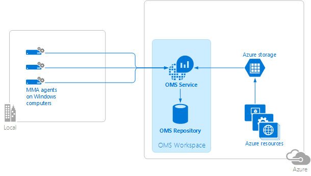
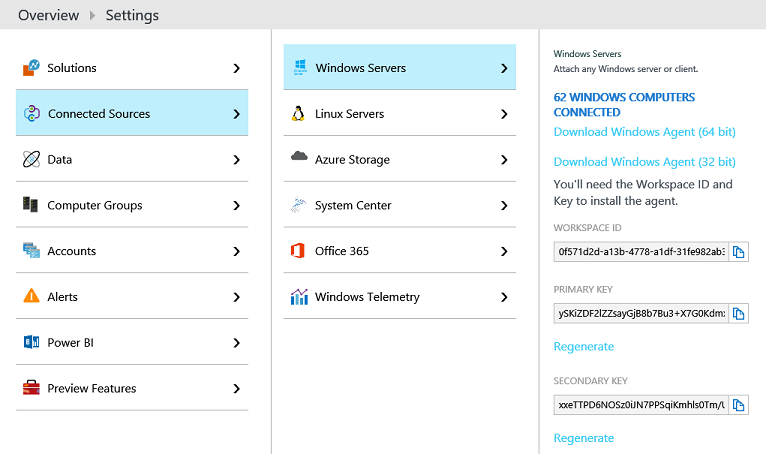
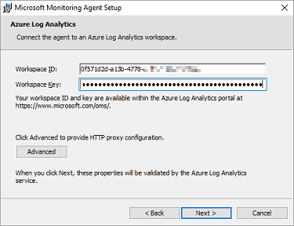
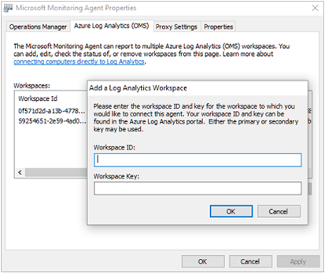
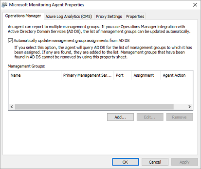
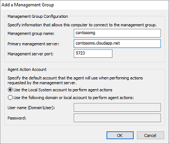

<properties
	pageTitle="Connect Windows computers to Log Analytics | Microsoft Azure"
	description="This article shows the steps to connect the Windows computers in your on-premises infrastructure directly to OMS by using a customized version of the Microsoft Monitoring Agent (MMA)."
	services="log-analytics"
	documentationCenter=""
	authors="bandersmsft"
	manager="jwhit"
	editor=""/>

<tags
	ms.service="log-analytics"
	ms.workload="na"
	ms.tgt_pltfrm="na"
	ms.devlang="na"
	ms.topic="article"
	ms.date="08/11/2016"
	ms.author="banders"/>


# Connect Windows computers to Log Analytics

This article shows the steps to connect the Windows computers in your on-premises infrastructure directly to OMS workspaces by using a customized version of the Microsoft Monitoring Agent (MMA). You need to install and connect agents for all of the computers that you want to onboard to OMS in order for them to send data to OMS and to view and act on that data in the OMS portal. Each agent can report to multiple workspaces.

You can install agents using Setup, command line, or with Desired State Configuration (DSC) in Azure Automation.  

>[AZURE.NOTE] For virtual machines running in Azure you can simplify installation by using the [virtual machine extension](log-analytics-azure-vm-extension.md).

On computers with Internet connectivity, the agent will use the connection to the Internet to send data to OMS. For computers that do not have Internet connectivity, you can use a proxy or the OMS Log Analytics Forwarder.

Connecting your Windows computers to OMS is straightforward using 3 simple steps:

1. Download the agent setup file
2. Install the agent using the method you choose
3. Configure the agent or add additional workspaces, if necessary

The following diagram shows the relationship between your Windows computers and OMS after you’ve installed and configured agents.




## System requirements and required configuration
Before you install or deploy agents, review the following details to ensure you meet necessary requirements.

- You can only install the OMS MMA on computers running Windows Server 2008 SP 1 or later or Windows 7 SP1 or later.
- You'll need an OMS subscription.  For additional information, see [Get started with Log Analytics](log-analytics-get-started.md).
- Each Windows computer must be able to connect to the Internet using HTTPS. This connection can be direct, via a proxy, or through the  OMS Log Analytics Forwarder.
- You can install the OMS MMA on stand-alone computers, servers, and virtual machines. If you want to connect Azure-hosted virtual machines to OMS, see [Connect Azure virtual machines to Log Analytics](log-analytics-azure-vm-extension.md).
- The agent needs to use TCP port 443 for various resources. For more information, see [Configure proxy and firewall settings in Log Analytics](log-analytics-proxy-firewall.md).

## Download the agent setup file from OMS
1. In the OMS portal, on the **Overview** page, click the **Settings** tile.  Click the **Connected Sources** tab at the top.  
    
2. Under **Attach Computers Directly**, click **Download Windows Agent** applicable to your computer processor type to download the setup file.
3. On the right of  **Workspace ID**, click the copy icon and paste the ID into Notepad.
4. On the right of  **Primary Key**, click the copy icon and paste the key into Notepad.     
    

## Install the agent using setup
1. Run Setup to install the agent on a computer that you want to manage.
2. On the Welcome page, click **Next**.
3. On the License Terms page, read the license and then click **I Agree**.
4. On the Destination Folder page, change or keep the default installation folder and then click **Next**.
5. On the Agent Setup Options page, you can choose to connect the agent to Azure Log Analytics (OMS), Operations Manager, or you can leave the choices blank if you want to configure the agent later. Click **Next**.   
    - If you chose to connect to Azure Log Analytics (OMS), paste the **Workspace ID** and **Workspace Key (Primary Key)** that you copied into Notepad in the previous procedure and then click **Next**.  
        
    - If you chose to connect to Operations Manager, type the **Management Group Name**, **Management Server** name, and **Management Server Port**, and then click **Next**. On the Agent Action Account page, choose either the Local System account or a local domain account and then click **Next**.  
        

6. On the Ready to Install page, review your choices and then click **Install**.
7. On the Configuration completed successfully page, click **Finish**.
8. When complete, the **Microsoft Monitoring Agent** appears in **Control Panel**. You can review your configuration there and verify that the agent is connected to Operational Insights (OMS). When connected to OMS, the agent displays a message stating: **The Microsoft Monitoring Agent has successfully connected to the Microsoft Operations Management Suite service.**

## Install the agent using the command line
- Modify and then use the following example to install the agent using the command line.

    >[AZURE.NOTE] If you want to upgrade an agent, you need to use the Log Analytics scripting API. See the next section to upgrade an agent.

    ```
    MMASetup-AMD64.exe /Q:A /R:N /C:"setup.exe /qn ADD_OPINSIGHTS_WORKSPACE=1 OPINSIGHTS_WORKSPACE_ID=<your workspace id> OPINSIGHTS_WORKSPACE_KEY=<your workspace key> AcceptEndUserLicenseAgreement=1"
    ```

## Upgrade the agent and add a workspace using a script
You can upgrade an agent and add a workspace using the Log Analytics scripting API with the following PowerShell example.

```
$mma = New-Object -ComObject 'AgentConfigManager.MgmtSvcCfg'
$mma.AddCloudWorkspace($workspaceId, $workspaceKey)
$mma.ReloadConfiguration()
```

>[AZURE.NOTE] If you've used the command line or script previously to install or configure the agent, `EnableAzureOperationalInsights` was replaced by `AddCloudWorkspace`.

## Install the agent using DSC in Azure Automation

>[AZURE.NOTE] This procedure and script example will not upgrade an existing agent.

1. Import the xPSDesiredStateConfiguration DSC Module from [http://www.powershellgallery.com/packages/xPSDesiredStateConfiguration](http://www.powershellgallery.com/packages/xPSDesiredStateConfiguration) into Azure Automation.  
2.	Create Azure Automation variable assets for *OPSINSIGHTS_WS_ID* and *OPSINSIGHTS_WS_KEY*. Set *OPSINSIGHTS_WS_ID* to your OMS Log Analytics workspace ID and set *OPSINSIGHTS_WS_KEY* to the primary key of your workspace.
3.	Use the script below and save it as MMAgent.ps1
4.	Modify and then use the following example to install the agent using DSC in Azure Automation. Import MMAgent.ps1 into Azure Automation by using the Azure Automation interface or cmdlet.
5.	Assign a node to the configuration. Within 15 minutes the node will check its configuration and the MMA will be pushed to the node.

```
Configuration MMAgent
{
    $OIPackageLocalPath = "C:\MMASetup-AMD64.exe"
    $OPSINSIGHTS_WS_ID = Get-AutomationVariable -Name "OPSINSIGHTS_WS_ID"
    $OPSINSIGHTS_WS_KEY = Get-AutomationVariable -Name "OPSINSIGHTS_WS_KEY"


    Import-DscResource -ModuleName xPSDesiredStateConfiguration

    Node OMSnode {
        Service OIService
        {
            Name = "HealthService"
            State = "Running"
            DependsOn = "[Package]OI"
        }

        xRemoteFile OIPackage {
            Uri = "http://download.microsoft.com/download/0/C/0/0C072D6E-F418-4AD4-BCB2-A362624F400A/MMASetup-AMD64.exe"
            DestinationPath = $OIPackageLocalPath
        }

        Package OI {
            Ensure = "Present"
            Path  = $OIPackageLocalPath
            Name = "Microsoft Monitoring Agent"
            ProductId = "8A7F2C51-4C7D-4BFD-9014-91D11F24AAE2"
            Arguments = '/C:"setup.exe /qn ADD_OPINSIGHTS_WORKSPACE=1 OPINSIGHTS_WORKSPACE_ID=' + $OPSINSIGHTS_WS_ID + ' OPINSIGHTS_WORKSPACE_KEY=' + $OPSINSIGHTS_WS_KEY + ' AcceptEndUserLicenseAgreement=1"'
            DependsOn = "[xRemoteFile]OIPackage"
        }
    }
}  


```


## Configure an agent manually or add additional workspaces
If you've installed agents but did not configure them or if you want the agent to report to multiple workspaces, you can use the following information to enable an agent or reconfigure it. After you've configured the agent, it will register with the agent service and will get necessary configuration information and management packs that contain solution information.

1. After you've installed the Microsoft Monitoring Agent, open **Control Panel**.
2. Open **Microsoft Monitoring Agent** and then click the **Azure Log Analytics (OMS)** tab.   
3. Click **Add** to open the **Add a Log Analytics Workspace** box.
4. Paste the **Workspace ID** and **Workspace Key (Primary Key)** that you copied into Notepad in a previous procedure for the workspace that you want to add and then click **OK**.  
    

After data is collected from computers monitored by the agent, the number of computers monitored by OMS will appear in the OMS portal on the **Connected Sources** tab in **Settings** as **Servers Connected**.


## To disable an agent
1. After installing the agent, open **Control Panel**.
2. Open Microsoft Monitoring Agent and then click the **Azure Log Analytics (OMS)** tab.
3. Select a workspace and then click **Remove**. Repeat this step for all other workspaces.


## Optionally, configure agents to report to an Operations Manager management group

If you use Operations Manager in your IT infrastructure, you can also use the MMA agent as an Operations Manager agent.

### To configure MMA agents to report to an Operations Manager management group
1.	On the computer where the agent is installed, open **Control Panel**.
2.	Open **Microsoft Monitoring Agent** and then click the **Operations Manager** tab.
    
3.	If your Operations Manager servers have integration with Active Directory, click **Automatically update management group assignments from AD DS**.
4.	Click **Add** to open the **Add a Management Group** dialog box.  
    
5.	In **Management group name** box, type the name of your management group.
6.	In the **Primary management server** box, type the computer name of the primary management server.
7.	In the **Management server port** box, type the TCP port number.
8.	Under **Agent Action Account**, choose either the Local System account or a local domain account.
9.	Click **OK** to close the **Add a Management Group** dialog box and then click **OK** to close the **Microsoft Monitoring Agent Properties** dialog box.

## Optionally, configure agents to use the OMS Log Analytics Forwarder

If you have servers or clients that do not have a connection to the Internet, you can still have them send data to OMS by using the OMS Log Analytics Forwarder.  When you use the forwarder, all data from agents is sent through a single server that has access to the Internet. The Forwarder transfers data from the agents to OMS directly without analyzing any of the data that is transferred.

See [OMS Log Analytics Forwarder](https://blogs.technet.microsoft.com/msoms/2016/03/17/oms-log-analytics-forwarder) to learn more about the forwarder, including setup, and configuration.

For information about how to configure your agents to use a proxy server, which in this case is the OMS Forwarder, see [Configure proxy and firewall settings in Log Analytics](log-analytics-proxy-firewall.md).

## Optionally, configure proxy and firewall settings
If you have proxy servers or firewalls in your environment that restrict access to the Internet, see [Configure proxy and firewall settings in Log Analytics](log-analytics-proxy-firewall.md) to enable your agents to communicate to the OMS service.

## Next steps

- [Add Log Analytics solutions from the Solutions Gallery](log-analytics-add-solutions.md) to add functionality and gather data.
- [Configure proxy and firewall settings in Log Analytics](log-analytics-proxy-firewall.md) if your organization uses a proxy server or firewall so that agents can communicate with the Log Analytics service.
