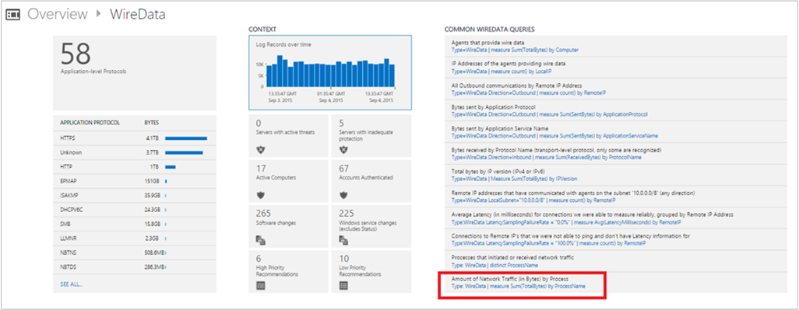
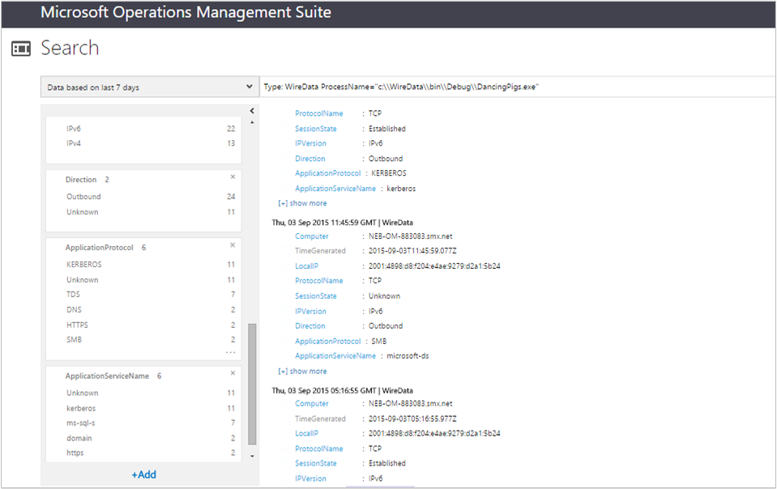
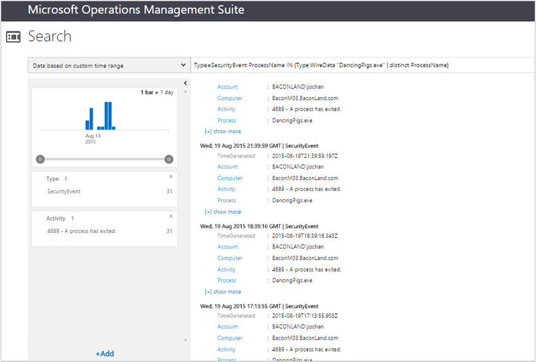
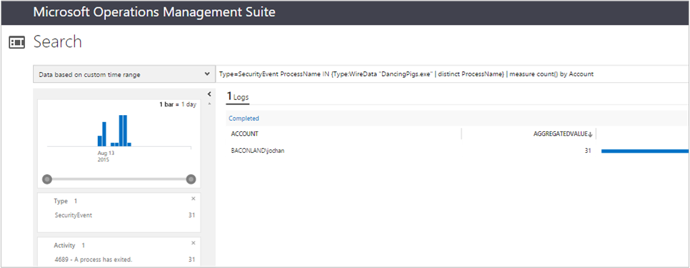

<properties
	pageTitle="Wire Data solution in Log Analytics | Microsoft Azure"
	description="Wire data is consolidated network and performance data from computers with OMS agents, including Operations Manager and Windows-connected agents. Network data is combined with your log data to help you correlate data."
	services="log-analytics"
	documentationCenter=""
	authors="bandersmsft"
	manager="jwhit"
	editor=""/>

<tags
	ms.service="log-analytics"
	ms.workload="na"
	ms.tgt_pltfrm="na"
	ms.devlang="na"
	ms.topic="article"
	ms.date="08/11/2016"
	ms.author="banders"/>

# Wire Data solution in Log Analytics

Wire data is consolidated network and performance data from computers with OMS agents, including Operations Manager and Windows-connected agents. Network data is combined with your log data to help you correlate data. OMS agents installed on computers in your IT infrastructure monitor network data sent to and from those computers for network levels 2-3 in the [OSI model](https://en.wikipedia.org/wiki/OSI_model) including the various protocols and ports used.

>[AZURE.NOTE] The Wire Data solution is not currently available to be added to workspaces. Customers who already have the Wire Data solution enabled can continue to use the Wire Data solution.

By default, OMS collects logged data for CPU, memory, disk, and network performance data from counters built into Windows. Network and other data collection is done in real-time for each agent, including subnets and application-level protocols being used by the computer. You can add other performance counters on the Settings page on the Logs tab.

If you’ve used [sFlow](http://www.sflow.org/) or other software with [Cisco’s NetFlow protocol](http://www.cisco.com/c/en/us/products/collateral/ios-nx-os-software/ios-netflow/prod_white_paper0900aecd80406232.html), then the statistics and data you’ll see from wire data will be familiar to you.

Some of the types of built-in Log search queries include:

- Agents that provide wire data
- IP address of agents providing wire data
- Outbound communications by IP addresses
- Number of bytes sent by application protocols
- Number of bytes sent by an application service
- Bytes received by different protocols
- Total bytes sent and received by IP
- IP addresses that have communicated with agents on the 10.0.0.0/8 subnet
- Average latency for connections that were measured reliably
- Computer processes that initiated or received network traffic
- Amount of network traffic for a process

When you search using wire data, you can filter and group data to view information about the top agents and top protocols. Or you can look into when certain computers (IP addresses/MAC addresses) communicated with each other, for how long, and how much data was sent--basically, you view metadata about network traffic, which is search-based.

However, since you’re viewing metadata, it’s not necessarily useful for in-depth troubleshooting. Wire data in OMS is not a full capture of network data. So it’s not intended for deep packet-level troubleshooting.
The advantage of using the agent, compared to other collection methods, is that you don’t have to install appliances, reconfigure your network switches, or preform complicated configurations. Wire data is simply agent-based--you install the agent on a computer and it will monitor its own network traffic. Another advantage is when you want to monitor workloads running in cloud providers or hosting service provider or Microsoft Azure, where the user doesn’t own the fabric layer.

In contrast, you don’t have complete visibility of what occurs on the network if you don’t install agents on all the computers in your network infrastructure.

## Installing and configuring the solution
Use the following information to install and configure the solution.

- The Wire Data solution acquires data from computers running Windows Server 2012 R2, Windows 8.1, and later operating systems.
- Microsoft .NET Framework 4.0 or later is required on computers where you want to acquire wire data from.
- Add the Wire Data solution to your OMS workspace using the process described in [Add Log Analytics solutions from the Solutions Gallery](log-analytics-add-solutions.md).  There is no further configuration required.
- If you want to view wire data for a specific solution, you'll need to have the solution already added to your OMS workspace.

## Wire Data data collection details

Wire data collects metadata about network traffic using the agents that you have enabled.

The following table shows data collection methods and other details about how data is collected for Wire Data.


| platform | Direct Agent | SCOM agent | Azure Storage | SCOM required? | SCOM agent data sent via management group | collection frequency |
|---|---|---|---|---|---|---|
|Windows (2012 R2 / 8.1 or later)||||            || every 1 minute|


## Combining wire data with other solution data

Data returned from the built-in queries shown above might be interesting by itself. However, the usefulness of wire data is realized when you combine it with information from other OMS solutions. For example, you can use security event data collected by the Security and Audit solution and combine it with wire data to look for unusual network logon attempts for named processes.  In this example, you’d use the IN and DISTINCT operators to join data points in your search query.

Requirements: In order to use the following example, you’ll need to have the Security and Audit solution installed. However, you can use data from other solutions to combine with wire data to achieve similar results.

### To combine wire data with security events

1. On the Overview page, click the **WireData** tile.
2. In the list of **Common WireData Queries**, click **Amount of Network Traffic (in Bytes) by Process** to see the list of returned processes.
    
3. If the list of processes is too long to easily view, you can modify the search query to resemble:

    ```
    Type WireData | measure count() by ProcessName | where AggregatedValue <40
    ```
    Shown in the example below is a process named DancingPigs.exe, which might appear suspicious.
    

4. Using data returned in your list, click a named process. In this example, DancingPigs.exe was clicked. The results shown below describe the type of network traffic such as outbound communication over various protocols.
    

5. Because the Security and Audit solution is installed, you can probe into the security events that have the same ProcessName field value by modifying your search query using the IN and DISTINCT search query operators. You can do that then when both your wire data and other solution logs have values in the same format. Modify your search query to resemble:

    ```
    Type=SecurityEvent ProcessName IN {Type:WireData "DancingPigs.exe" | distinct ProcessName}
    ```    

    
6. In the results above, you’ll see that account information is shown. Now you can refine your search query to find out how often the account, showing Security and Audit data, was used by the process with a query resembling:        

    ```
    Type=SecurityEvent ProcessName IN {Type:WireData "DancingPigs.exe" | distinct ProcessName} | measure count() by Account
    ```

    


## Next steps

- [Search logs](log-analytics-log-searches.md) to view detailed wire data search records.
- See Dan’s [Using Wire Data in Operations Management Suite Log Search blog post](http://blogs.msdn.com/b/dmuscett/archive/2015/09/09/using-wire-data-in-operations-management-suite.aspx) has additional information about how often data is collected and how you can modify collection properties for Operations Manager agents.
