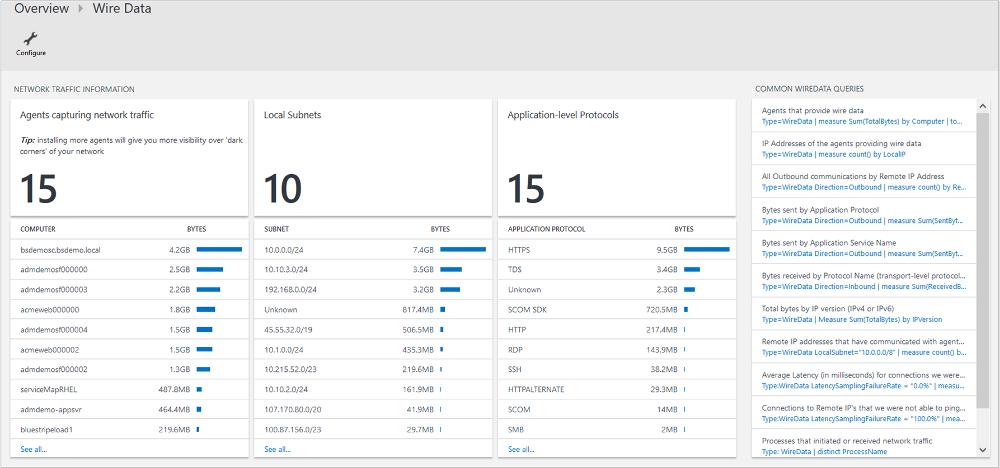
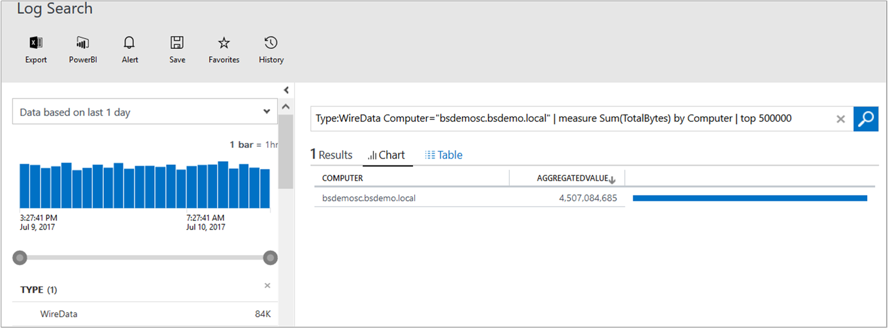
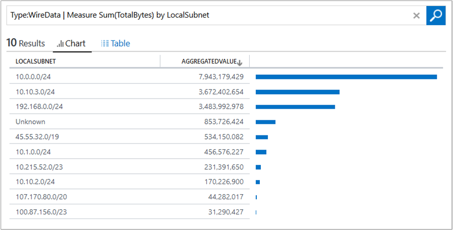
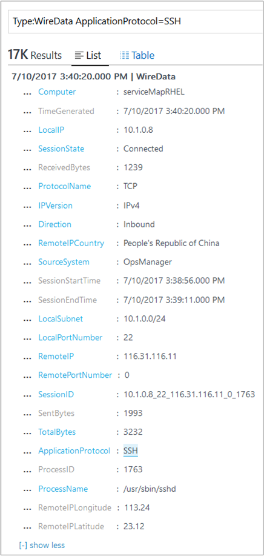

# Wire Data 2.0 (Preview) solution in Log Analytics


Wire data is consolidated network and performance data collected from Windows-connected and Linux-connected computers with the OMS agent, including those monitored by Operations Manager in your environment. Network data is combined with your other log data to help you correlate data.

In addition to the OMS agent, the Wire Data solution uses Microsoft Dependency Agents that you install on computers in your IT infrastructure. Dependency Agents monitor network data sent to and from your computers for network levels 2-3 in the [OSI model](https://en.wikipedia.org/wiki/OSI_model), including the various protocols and ports used. Data is then sent to Log Analytics using agents.  

>[!NOTE]
>If you have already deployed Service Map, or are considering Service Map or [Azure Monitor for VMs](../monitoring/monitoring-vminsights-overview.md), there is a new connection metrics data set they collect and store in Log Analytics that provides comparable information to Wire Data.

By default, Log Analytics logs data for CPU, memory, disk, and network performance data from counters built into Windows and Linux, as well as other performance counters that you can specify. Network and other data collection is done in real-time for each agent, including subnets and application-level protocols being used by the computer.  Wire Data looks at network data at the application level, not down at the TCP transport layer.  The solution doesn't look at individual ACKs and SYNs.  Once the handshake is completed, it is considered a live connection and marked as Connected. That connection stays live as long as both sides agree the socket is open and data can pass back and forth.  Once either sides closes the connection, it is marked as Disconnected.  Therefore, it only counts the bandwidth of successfully completed packets, it doesn't report on resends or failed packets.

If you've used [sFlow](http://www.sflow.org/) or other software with [Cisco's NetFlow protocol](http://www.cisco.com/c/en/us/products/collateral/ios-nx-os-software/ios-netflow/prod_white_paper0900aecd80406232.html), then the statistics and data you see from wire data will be familiar to you.

Some of the types of built-in Log search queries include:

- Agents that provide wire data
- IP address of agents providing wire data
- Outbound communications by IP addresses
- Number of bytes sent by application protocols
- Number of bytes sent by an application service
- Bytes received by different protocols
- Total bytes sent and received by IP version
- Average latency for connections that were measured reliably
- Computer processes that initiated or received network traffic
- Amount of network traffic for a process

When you search using wire data, you can filter and group data to view information about the top agents and top protocols. Or you can view when certain computers (IP addresses/MAC addresses) communicated with each other, for how long, and how much data was sent—basically, you view metadata about network traffic, which is search-based.

However, since you're viewing metadata, it's not necessarily useful for in-depth troubleshooting. Wire data in Log Analytics is not a full capture of network data.  It is not intended for deep packet-level troubleshooting. The advantage of using the agent, compared to other collection methods, is that you don't have to install appliances, reconfigure your network switches, or preform complicated configurations. Wire data is simply agent-based—you install the agent on a computer and it will monitor its own network traffic. Another advantage is when you want to monitor workloads running in cloud providers or hosting service provider or Microsoft Azure, where the user doesn't own the fabric layer.

## Connected sources

Wire Data gets its data from the Microsoft Dependency Agent. The Dependency Agent depends on the Log Analytics agent for its connections to Log Analytics. This means that a server must have the Log Analytics agent installed and configured with the Dependency agent. The following table describes the connected sources that the Wire Data solution supports.

| **Connected source** | **Supported** | **Description** |
| --- | --- | --- |
| Windows agents | Yes | Wire Data analyzes and collects data from Windows agent computers. <br><br> In addition to the [Log Analytics agent for Windows](log-analytics-windows-agent.md), Windows agents require the Microsoft Dependency Agent. See the [supported operating systems](../monitoring/monitoring-service-map-configure.md#supported-windows-operating-systems) for a complete list of operating system versions. |
| Linux agents | Yes | Wire Data analyzes and collects data from Linux agent computers.<br><br> In addition to the [Log Analytics agent for Linux](log-analytics-quick-collect-linux-computer.md), Linux agents require the Microsoft Dependency Agent. See the [supported operating systems](../monitoring/monitoring-service-map-configure.md#supported-linux-operating-systems) for a complete list of operating system versions. |
| System Center Operations Manager management group | Yes | Wire Data analyzes and collects data from Windows and Linux agents in a connected [System Center Operations Manager management group](log-analytics-om-agents.md). <br><br> A direct connection from the System Center Operations Manager agent computer to Log Analytics is required. |
| Azure storage account | No | Wire Data collects data from agent computers, so there is no data from it to collect from Azure Storage. |

On Windows, the Microsoft Monitoring Agent (MMA) is used by both System Center Operations Manager and Log Analytics to gather and send data. Depending on the context, the agent is called the System Center Operations Manager Agent, OMS Agent, Log Analytics agent, MMA, or Direct Agent. System Center Operations Manager and Log Analytics provide slightly different versions of the MMA. These versions can each report to System Center Operations Manager, to Log Analytics, or to both.

On Linux, the Log Analytics agent for Linux gathers and sends data to Log Analytics. You can use Wire Data on servers with agents directly connected to Log Analytics, or on servers that are connecting to Log Analytics via System Center Operations Manager management groups.

The Dependency Agent does not transmit any data itself, and it does not require any changes to firewalls or ports. The data in Wire Data is always transmitted by the Log Analytics agent to Log Analytics, either directly or through the OMS Gateway.


If you are a System Center Operations Manager user with a management group connected to Log Analytics:

- No additional configuration is required when your System Center Operations Manager agents can access the Internet to connect to Log Analytics.
- You need to configure the OMS Gateway to work with System Center Operations Manager when your System Center Operations Manager agents cannot access Log Analytics over the Internet.

If your Windows or Linux computers cannot directly connect to the service, you need to configure the Log Analytics agent to connect to Log Analytics using the OMS Gateway. You can download the OMS Gateway from the [Microsoft Download Center](https://www.microsoft.com/download/details.aspx?id=52666).

## Prerequisites

- Requires the [Insight and Analytics](https://www.microsoft.com/cloud-platform/operations-management-suite-pricing) solution offer.
- If you're using the previous version of the Wire Data solution, you must first remove it. However, all data captured through the original Wire Data solution is still available in Wire Data 2.0 and log search.
- Administrator privileges are required to install or uninstall the Dependency Agent.
- The Dependency Agent must be installed on a computer with a 64-bit operating system.

### Operating systems

The following sections list the supported operating systems for the Dependency Agent. Wire Data doesn't support 32-bit architectures for any operating system.

#### Windows Server

- Windows Server 2016
- Windows Server 2012 R2
- Windows Server 2012
- Windows Server 2008 R2 SP1

#### Windows desktop

- Windows 10
- Windows 8.1
- Windows 8
- Windows 7

#### Red Hat Enterprise Linux, CentOS Linux, and Oracle Linux (with RHEL Kernel)

- Only default and SMP Linux kernel releases are supported.
- Nonstandard kernel releases, such as PAE and Xen, are not supported for any Linux distribution. For example, a system with the release string of _2.6.16.21-0.8-xen_ is not supported.
- Custom kernels, including recompiles of standard kernels, are not supported.
- CentOSPlus kernel is not supported.
- Oracle Unbreakable Enterprise Kernel (UEK) is covered in a later section of this article.

#### Red Hat Linux 7

| **OS version** | **Kernel version** |
| --- | --- |
| 7.0 | 3.10.0-123 |
| 7.1 | 3.10.0-229 |
| 7.2 | 3.10.0-327 |
| 7.3 | 3.10.0-514 |

#### Red Hat Linux 6

| **OS version** | **Kernel version** |
| --- | --- |
| 6.0 | 2.6.32-71 |
| 6.1 | 2.6.32-131 |
| 6.2 | 2.6.32-220 |
| 6.3 | 2.6.32-279 |
| 6.4 | 2.6.32-358 |
| 6.5 | 2.6.32-431 |
| 6.6 | 2.6.32-504 |
| 6.7 | 2.6.32-573 |
| 6.8 | 2.6.32-642 |

#### Red Hat Linux 5

| **OS version** | **Kernel version** |
| --- | --- |
| 5.8 | 2.6.18-308 |
| 5.9 | 2.6.18-348 |
| 5.10 | 2.6.18-371 |
| 5.11 | 2.6.18-398 <br> 2.6.18-400 <br>2.6.18-402 <br>2.6.18-404 <br>2.6.18-406 <br> 2.6.18-407 <br> 2.6.18-408 <br> 2.6.18-409 <br> 2.6.18-410 <br> 2.6.18-411 <br> 2.6.18-412 <br> 2.6.18-416 <br> 2.6.18-417 <br> 2.6.18-419 |

#### Oracle Enterprise Linux with Unbreakable Enterprise Kernel

#### Oracle Linux 6

| **OS version** | **Kernel version** |
| --- | --- |
| 6.2 | Oracle 2.6.32-300 (UEK R1) |
| 6.3 | Oracle 2.6.39-200 (UEK R2) |
| 6.4 | Oracle 2.6.39-400 (UEK R2) |
| 6.5 | Oracle 2.6.39-400 (UEK R2 i386) |
| 6.6 | Oracle 2.6.39-400 (UEK R2 i386) |

#### Oracle Linux 5

| **OS version** | **Kernel version** |
| --- | --- |
| 5.8 | Oracle 2.6.32-300 (UEK R1) |
| 5.9 | Oracle 2.6.39-300 (UEK R2) |
| 5.10 | Oracle 2.6.39-400 (UEK R2) |
| 5.11 | Oracle 2.6.39-400 (UEK R2) |

#### SUSE Linux Enterprise Server

#### SUSE Linux 11

| **OS version** | **Kernel version** |
| --- | --- |
| 11 | 2.6.27 |
| 11 SP1 | 2.6.32 |
| 11 SP2 | 3.0.13 |
| 11 SP3 | 3.0.76 |
| 11 SP4 | 3.0.101 |

#### SUSE Linux 10

| **OS version** | **Kernel version** |
| --- | --- |
| 10 SP4 | 2.6.16.60 |

#### Dependency Agent downloads

| **File** | **OS** | **Version** | **SHA-256** |
| --- | --- | --- | --- |
| [InstallDependencyAgent-Windows.exe](https://aka.ms/dependencyagentwindows) | Windows | 9.0.5 | 73B3F6A2A76A08D58F72A550947FF839B588591C48E6EDDD6DDF73AA3FD82B43 |
| [InstallDependencyAgent-Linux64.bin](https://aka.ms/dependencyagentlinux) | Linux | 9.0.5 | A1BAD0B36EBF79F2B69113A07FCF48C68D90BD169C722689F9C83C69FC032371 |


## Configuration

Perform the following steps to configure the Wire Data solution for your workspaces.

1. Enable the Activity Log Analytics solution from the [Azure marketplace](https://azuremarketplace.microsoft.com/marketplace/apps/Microsoft.WireData2OMS?tab=Overview) or by using the process described in [Add Log Analytics solutions from the Solutions Gallery](log-analytics-add-solutions.md).
2. Install the Dependency Agent on each computer where you want to get data. The Dependency Agent can monitor connections to immediate neighbors, so you might not need an agent on every computer.

> [!NOTE]
> You cannot add the previous version of the Wire Data solution to new workspaces. If you have the original Wire Data solution enabled, you can continue to use it. However, to use Wire Data 2.0, you must first remove the original version.
> 
### Install the Dependency Agent on Windows

Administrator privileges are required to install or uninstall the agent.

The Dependency Agent is installed on computers running Windows through InstallDependencyAgent-Windows.exe. If you run this executable file without any options, it starts a wizard that you can follow to install interactively.

Use the following steps to install the Dependency Agent on each computer running Windows:

1. Install the OMS Agent following the steps in [Collect data from Windows computers hosted in your environment](log-analytics-windows-agent.md).
2. Download the Windows Dependency Agent using the link in the previous section and then run it by using the following command: `InstallDependencyAgent-Windows.exe`
3. Follow the wizard to install the agent.
4. If the Dependency Agent fails to start, check the logs for detailed error information. For Windows agents, the log directory is %Programfiles%\Microsoft Dependency Agent\logs.

#### Windows command line

Use options from the following table to install from a command line. To see a list of the installation flags, run the installer by using the /? flag as follows.

InstallDependencyAgent-Windows.exe /?

| **Flag** | **Description** |
| --- | --- |
| <code>/?</code> | Get a list of the command-line options. |
| <code>/S</code> | Perform a silent installation with no user prompts. |

Files for the Windows Dependency Agent are placed in C:\Program Files\Microsoft Dependency Agent by default.

### Install the Dependency Agent on Linux

Root access is required to install or configure the agent.

The Dependency Agent is installed on Linux computers through InstallDependencyAgent-Linux64.bin, a shell script with a self-extracting binary. You can run the file by using _sh_ or add execute permissions to the file itself.

Use the following steps to install the Dependency Agent on each Linux computer:

1. Install the OMS Agent following the steps in [Collect data from Linux computers hosted in your environment](log-analytics-quick-collect-linux-computer.md#obtain-workspace-id-and-key).
2. Download the Linux Dependency Agent using the link in the previous section and then install it as root by using the following command:
sh InstallDependencyAgent-Linux64.bin
3. If the Dependency Agent fails to start, check the logs for detailed error information. On Linux agents, the log directory is: /var/opt/microsoft/dependency-agent/log.

To see a list of the installation flags, run the installation program with the `-help` flag as follows.

```
InstallDependencyAgent-Linux64.bin -help
```

| **Flag** | **Description** |
| --- | --- |
| <code>-help</code> | Get a list of the command-line options. |
| <code>-s</code> | Perform a silent installation with no user prompts. |
| <code>--check</code> | Check permissions and the operating system but do not install the agent. |

Files for the Dependency Agent are placed in the following directories:

| **Files** | **Location** |
| --- | --- |
| Core files | /opt/microsoft/dependency-agent |
| Log files | /var/opt/microsoft/dependency-agent/log |
| Config files | /etc/opt/microsoft/dependency-agent/config |
| Service executable files | /opt/microsoft/dependency-agent/bin/microsoft-dependency-agent<br><br>/opt/microsoft/dependency-agent/bin/microsoft-dependency-agent-manager |
| Binary storage files | /var/opt/microsoft/dependency-agent/storage |

### Installation script examples

To easily deploy the Dependency Agent on many servers at once, it helps to use a script. You can use the following script examples to download and install the Dependency Agent on either Windows or Linux.

#### PowerShell script for Windows

```PowerShell

Invoke-WebRequest &quot;https://aka.ms/dependencyagentwindows&quot; -OutFile InstallDependencyAgent-Windows.exe

.\InstallDependencyAgent-Windows.exe /S

```

#### Shell script for Linux

```
wget --content-disposition https://aka.ms/dependencyagentlinux -O InstallDependencyAgent-Linux64.bin
```

```
sh InstallDependencyAgent-Linux64.bin -s
```

### Desired State Configuration

To deploy the Dependency Agent via Desired State Configuration, you can use the xPSDesiredStateConfiguration module and a bit of code like the following:

```
Import-DscResource -ModuleName xPSDesiredStateConfiguration

$DAPackageLocalPath = &quot;C:\InstallDependencyAgent-Windows.exe&quot;


Node $NodeName

{

    # Download and install the Dependency Agent

    xRemoteFile DAPackage

    {

        Uri = &quot;https://aka.ms/dependencyagentwindows&quot;

        DestinationPath = $DAPackageLocalPath

        DependsOn = &quot;[Package]OI&quot;

    }

    xPackage DA

    {

        Ensure=&quot;Present&quot;

        Name = &quot;Dependency Agent&quot;

        Path = $DAPackageLocalPath

        Arguments = '/S'

        ProductId = &quot;&quot;

        InstalledCheckRegKey = &quot;HKEY\_LOCAL\_MACHINE\SOFTWARE\Wow6432Node\Microsoft\Windows\CurrentVersion\Uninstall\DependencyAgent&quot;

        InstalledCheckRegValueName = &quot;DisplayName&quot;

        InstalledCheckRegValueData = &quot;Dependency Agent&quot;

    }

}

```
### Uninstall the Dependency Agent

Use the following sections to help you remove the Dependency Agent.

#### Uninstall the Dependency Agent on Windows

An administrator can uninstall the Dependency Agent for Windows through Control Panel.

An administrator can also run %Programfiles%\Microsoft Dependency Agent\Uninstall.exe to uninstall the Dependency Agent.

#### Uninstall the Dependency Agent on Linux

To completely uninstall the Dependency Agent from Linux, you must remove the agent itself and the connector, which is installed automatically with the agent. You can uninstall both by using the following single command:

```
rpm -e dependency-agent dependency-agent-connector
```

## Management packs

When Wire Data is activated in a Log Analytics workspace, a 300-KB management pack is sent to all the Windows servers in that workspace. If you are using System Center Operations Manager agents in a [connected management group](log-analytics-om-agents.md), the Dependency Monitor management pack is deployed from System Center Operations Manager. If the agents are directly connected, Log Analytics delivers the management pack.

The management pack is named Microsoft.IntelligencePacks.ApplicationDependencyMonitor. It's written to: %Programfiles%\Microsoft Monitoring Agent\Agent\Health Service State\Management Packs. The data source that the management pack uses is: %Program files%\Microsoft Monitoring Agent\Agent\Health Service State\Resources&lt;AutoGeneratedID&gt;\Microsoft.EnterpriseManagement.Advisor.ApplicationDependencyMonitorDataSource.dll.

## Using the solution

**Installing and configuring the solution**

Use the following information to install and configure the solution.

- The Wire Data solution acquires data from computers running Windows Server 2012 R2, Windows 8.1, and later operating systems.
- Microsoft .NET Framework 4.0 or later is required on computers where you want to acquire wire data from.
- Add the Wire Data solution to your Log Analytics workspace using the process described in [Add Log Analytics solutions from the Solutions Gallery](log-analytics-add-solutions.md). There is no further configuration required.
- If you want to view wire data for a specific solution, you need to have the solution already added to your workspace.

After you have agents installed and you install the solution, the Wire Data 2.0 tile appears in your workspace.


## Using the Wire Data 2.0 solution

In the **Overview** page for your Log Analytics workspace in the Azure portal, click the **Wire Data 2.0** tile to open the Wire Data dashboard. The dashboard includes the blades in the following table. Each blade lists up to 10 items matching that blade's criteria for the specified scope and time range. You can run a log search that returns all records by clicking **See all** at the bottom of the blade or by clicking the blade header.

| **Blade** | **Description** |
| --- | --- |
| Agents capturing network traffic | Shows the number of agents that are capturing network traffic and lists the top 10 computers that are capturing traffic. Click the number to run a log search for <code>Type:WireData &#124; measure Sum(TotalBytes) by Computer &#124; top 500000</code>. Click a computer in the list to run a log search returning the total number of bytes captured. |
| Local Subnets | Shows the number of local subnets that agents have discovered.  Click the number to run a log search for <code>Type:WireData &#124; Measure Sum(TotalBytes) by LocalSubnet</code> that lists all subnets with the number of bytes sent over each one. Click a subnet in the list to run a log search returning the total number of bytes sent over the subnet. |
| Application-level Protocols | Shows the number of application-level protocols in use, as discovered by agents. Click the number to run a log search for <code>Type:WireData &#124; Measure Sum(TotalBytes) by ApplicationProtocol</code>. Click a protocol to run a log search returning the total number of bytes sent using the protocol. |



You can use the **Agents capturing network traffic** blade to determine how much network bandwidth is being consumed by computers. This blade can help you easily find the _chattiest_ computer in your environment. Such computers could be overloaded, acting abnormally, or using more network resources than normal.



Similarly, you can use the **Local Subnets** blade to determine how much network traffic is moving through your subnets. Users often define subnets around critical areas for their applications. This blade offers a view into those areas.



The **Application-level Protocols** blade is useful because it's helpful know what protocols are in use. For example, you might expect SSH to not be in use in your network environment. Viewing information available in the blade can quickly confirm or disprove your expectation.


In this example, you could drill-into SSH details to see which computers are using SSH and many other communication details.



It's also useful to know if protocol traffic is increasing or decreasing over time. For example, if the amount of data being transmitted by an application is increasing, that might be something you should be aware of, or that you might find noteworthy.

## Input data

Wire data collects metadata about network traffic using the agents that you have enabled. Each agent sends data about every 15 seconds.

## Output data

A record with a type of _WireData_ is created for each type of input data. WireData records have properties shown in the following table:

| Property | Description |
|---|---|
| Computer | Computer name where data was collected |
| TimeGenerated | Time of the record |
| LocalIP | IP address of the local computer |
| SessionState | Connected or disconnected |
| ReceivedBytes | Amount of bytes received |
| ProtocolName | Name of the network protocol used |
| IPVersion | IP version |
| Direction | Inbound or outbound |
| MaliciousIP | IP address of a known malicious source |
| Severity | Suspected malware severity |
| RemoteIPCountry | Country of the remote IP address |
| ManagementGroupName | Name of the Operations Manager management group |
| SourceSystem | Source where data was collected |
| SessionStartTime | Start time of session |
| SessionEndTime | End time of session |
| LocalSubnet | Subnet where data was collected |
| LocalPortNumber | Local port number |
| RemoteIP | Remote IP address used by the remote computer |
| RemotePortNumber | Port number used by the remote IP address |
| SessionID | A unique value that identifies communication session between two IP addresses |
| SentBytes | Number of bytes sent |
| TotalBytes | Total number of bytes sent during session |
| ApplicationProtocol | Type of network protocol used   |
| ProcessID | Windows process ID |
| ProcessName | Path and file name of the process |
| RemoteIPLongitude | IP longitude value |
| RemoteIPLatitude | IP latitude value |


## Next steps

- [Search logs](log-analytics-log-searches.md) to view detailed wire data search records.
