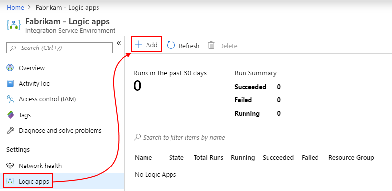
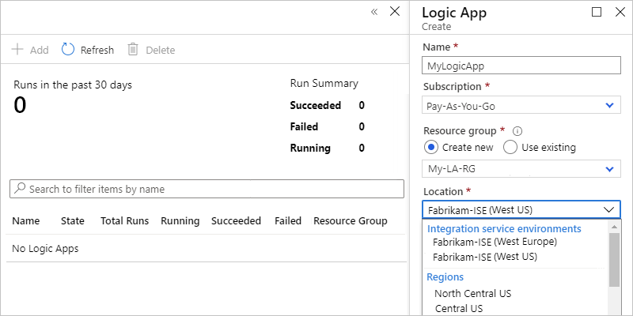
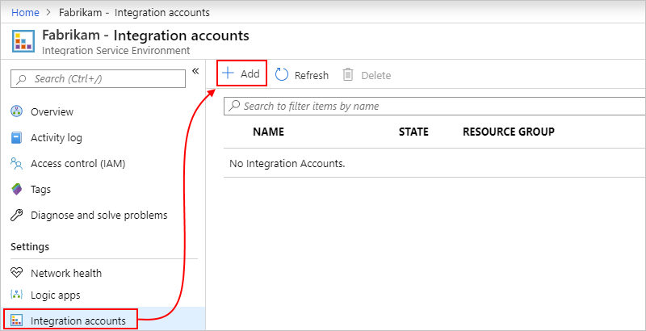
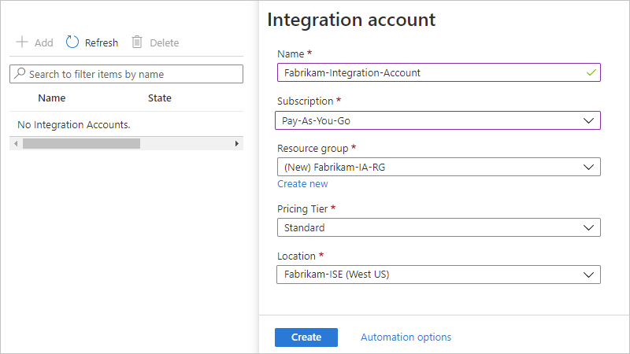
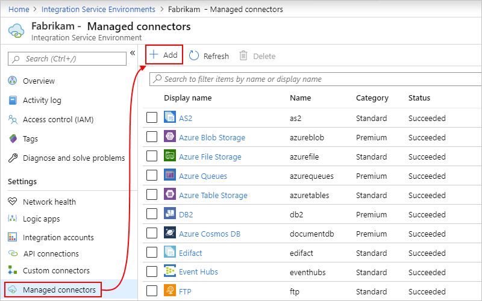
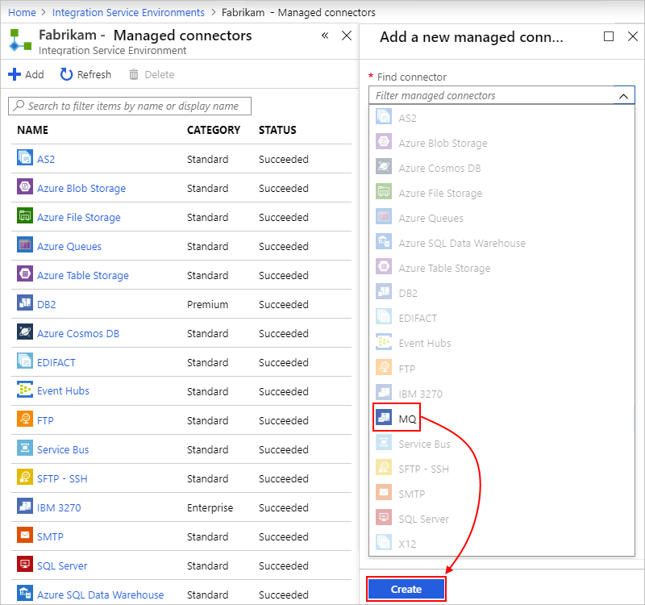
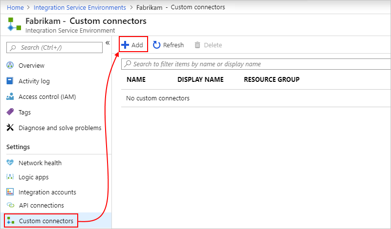
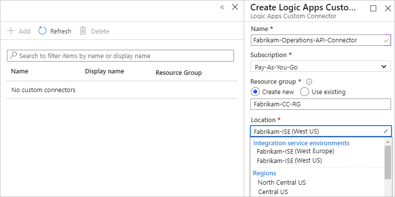
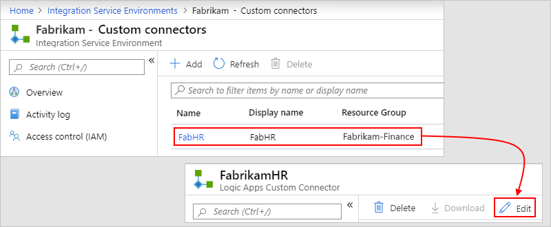

# Add resources to your integration service environment (ISE) in Azure Logic Apps

> [!IMPORTANT]
>
> On August 31, 2024, the ISE resource will retire, due to its dependency on Azure Cloud Services (classic), 
> which retires at the same time. Before the retirement date, export any logic apps from your ISE to Standard 
> logic apps so that you can avoid service disruption. Standard logic app workflows run in single-tenant Azure 
> Logic Apps and provide the same capabilities plus more.
>
> Starting November 1, 2022, you can no longer create new ISE resources. However, ISE resources existing 
> before this date are supported through August 31, 2024. For more information, see the following resources:
>
> - [ISE Retirement - what you need to know](https://techcommunity.microsoft.com/t5/integrations-on-azure-blog/ise-retirement-what-you-need-to-know/ba-p/3645220)
> - [Single-tenant versus multi-tenant and integration service environment for Azure Logic Apps](single-tenant-overview-compare.md)
> - [Azure Logic Apps pricing](https://azure.microsoft.com/pricing/details/logic-apps/)
> - [Export ISE workflows to a Standard logic app](export-from-ise-to-standard-logic-app.md)
> - [Integration Services Environment will be retired on 31 August 2024 - transition to Logic Apps Standard](https://azure.microsoft.com/updates/integration-services-environment-will-be-retired-on-31-august-2024-transition-to-logic-apps-standard/)
> - [Cloud Services (classic) deployment model is retiring on 31 August 2024](https://azure.microsoft.com/updates/cloud-services-retirement-announcement/)

After you create an [integration service environment (ISE)](../logic-apps/connect-virtual-network-vnet-isolated-environment-overview.md), you can add resources such as **Consumption** logic apps, integration accounts, and connectors so that they can access the resources in your Azure virtual network. For example, managed ISE connectors that become available after you create your ISE don't automatically appear in the Logic App Designer. Before you can use these ISE connectors, you have to manually [add and deploy those connectors to your ISE](#add-ise-connectors-environment) so that they appear in the Logic App Designer.

> [!IMPORTANT]
> For logic apps and integration accounts to work together in an ISE, both must use the *same ISE* as their location.

## Prerequisites

* An Azure account and subscription. If you don't have an Azure subscription, [sign up for a free Azure account](https://azure.microsoft.com/free/?WT.mc_id=A261C142F).

* The ISE that you created to run your Consumption logic app workflows

* To create, add, or update resources that are deployed to an ISE, you need to be assigned the Owner or Contributor role on that ISE, or you have permissions inherited through the Azure subscription or Azure resource group associated with the ISE. For people who don't have owner, contributor, or inherited permissions, they can be assigned the Integration Service Environment Contributor role or Integration Service Environment Developer role. For more information, see [What is Azure role-based access control (Azure RBAC)](../role-based-access-control/overview.md)?

<a name="create-logic-apps-environment"></a>

## Create logic apps

To develop logic apps that run in your integration service environment (ISE), follow these steps:

1. Find and open your ISE, if not already open. From the ISE menu, under **Settings**, select **Logic apps** > **Add**.

   

1. Provide information about the logic app that you want to create, for example:

   

   | Property | Required | Description |
   |----------|----------|-------------|
   | **Logic app name** | Yes | The name for the logic app to create |
   | **Subscription** | Yes | The name for the Azure subscription to use |
   | **Resource group** | Yes | The name for the new or existing Azure resource group to use |
   | **Region** | Yes | The Azure region for your logic app, which matches the location for the ISE that you later select |
   | **Associate with integration service environment*** | Yes | Select this option so you can choose an ISE to use. |
   | **Integration service environment** | Yes | From the list, select the ISE that you want to use, if not already selected. <p><p>**Important**: To use an integration account with your logic app, both must use the same ISE. |
   ||||

1. When you're done, select **Create**.

1. Continue [creating your logic app in the usual way](../logic-apps/quickstart-create-example-consumption-workflow.md).

   For differences in how triggers and actions work and how they're labeled when you use an ISE compared to the multi-tenant Logic Apps service, see [Isolated versus multi-tenant in the ISE overview](../logic-apps/connect-virtual-network-vnet-isolated-environment-overview.md#difference).

1. To manage logic apps and API connections in your ISE, see [Manage your integration service environment](../logic-apps/ise-manage-integration-service-environment.md).

<a name="create-integration-account-environment"></a>

## Create integration accounts

Based on the [ISE SKU](../logic-apps/connect-virtual-network-vnet-isolated-environment-overview.md#ise-level) selected at creation, your ISE includes specific integration account usage at no additional cost. Logic apps that exist in an integration service environment (ISE) can reference only integration accounts that exist in the same ISE. So, for an integration account to work with logic apps in an ISE, both the integration account and logic apps must use the *same environment* as their location. For more information about integration accounts and ISEs, see [Integration accounts with ISE](connect-virtual-network-vnet-isolated-environment-overview.md#create-integration-account-environment).

To create an integration account that uses an ISE, follow these steps:

1. Find and open your ISE, if not already open. From the ISE menu, under **Settings**, select **Integration accounts** > **Add**.

   

1. Provide information about the logic app that you want to create, for example:

   

   | Property | Required | Description |
   |----------|----------|-------------|
   | **Name** | Yes | The name for the integration account that you want to create |
   | **Subscription** | Yes | The name for the Azure subscription that you want to use |
   | **Resource group** | Yes | The name for the Azure resource group (new or existing) to use |
   | **Pricing Tier** | Yes | The pricing tier to use for the integration account |
   | **Location** | Yes | From the list, under **Integration service environments**, select the same ISE that your logic apps use, if not already selected. <p><p>**Important**: To use an integration account with your logic app, both must use the same ISE. |
   ||||

1. When you're done, select **Create**.

1. [Link your logic app to your integration account in the usual way](../logic-apps/logic-apps-enterprise-integration-create-integration-account.md#link-account).

1. Continue by adding resources to your integration account, such as [trading partners](../logic-apps/logic-apps-enterprise-integration-partners.md) and [agreements](../logic-apps/logic-apps-enterprise-integration-agreements.md).

1. To manage integration accounts in your ISE, see [Manage your integration service environment](../logic-apps/ise-manage-integration-service-environment.md).

<a name="add-ise-connectors-environment"></a>

## Add ISE connectors

After you create your ISE, managed ISE connectors don't automatically appear in the connector picker on the Logic App Designer. Before you can use these ISE connectors, you have to manually add and deploy these connectors to your ISE so that they appear in the Logic App Designer.

> [!IMPORTANT]
> Managed ISE connectors currently don't support [tags](../azure-resource-manager/management/tag-support.md). 
> If you set up a policy that enforces tagging, trying to add ISE connectors might fail with an error similar to this example:
> 
> ```json
> {
>    "error": { 
>       "code": "IntergrationServiceEnvironmentManagedApiDefinitionTagsNotSupported", 
>       "message": "The tags are not supported in the managed API 'azureblob'."
>    }
> }
> ```
> 
> So, to add ISE connectors, you have to either disable or remove your policy. 

1. On your ISE menu, under **Settings**, select **Managed connectors**. On the toolbar, select **Add**.

   

1. On the **Add a new managed connector** pane, open the **Find connector** list. Find and select the ISE connector that you want to use but isn't yet deployed in your ISE. When you're done, select **Create**.

   

   Only ISE connectors that are eligible but not yet deployed to your ISE appear available for you to select. Connectors that are already deployed in your ISE appear unavailable for selection.

<a name="create-custom-connectors-environment"></a>

## Create custom connectors

To use custom connectors in your ISE, create those custom connectors from directly inside your ISE.

1. Find and open your ISE, if not already open. From the ISE menu, under **Settings**, select **Custom connectors** > **Add**.

   

1. Provide the name, Azure subscription, and Azure resource group (new or existing) to use for your custom connector.

1. From the **Location** list, under the **Integration service environments** section, select the same ISE that your logic apps use, and select **Create**, for example:

   

1. Select your new custom connector, and then select **Edit**, for example:

   

1. Continue by creating the connector in the usual way from an [OpenAPI definition](/connectors/custom-connectors/define-openapi-definition#import-the-openapi-definition) or [SOAP](/connectors/custom-connectors/create-register-logic-apps-soap-connector#2-define-your-connector).

1. To manage custom connectors in your ISE, see [Manage your integration service environment](../logic-apps/ise-manage-integration-service-environment.md).

## Next steps

* [Manage integration service environments](../logic-apps/ise-manage-integration-service-environment.md)
