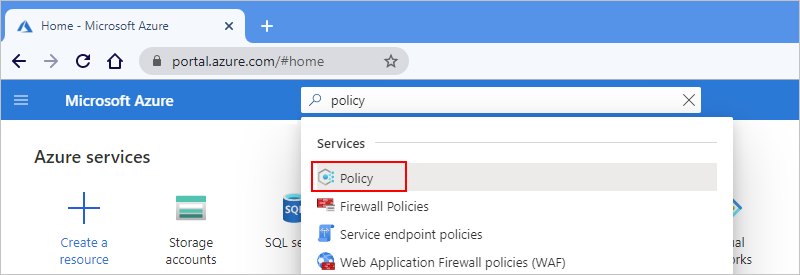
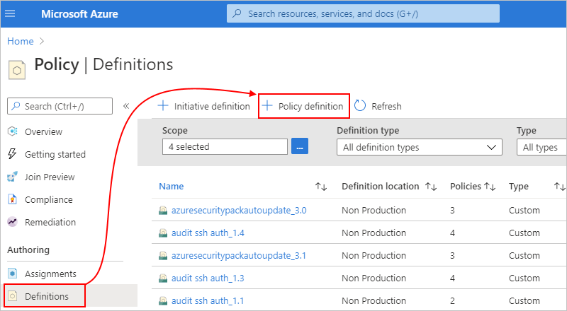
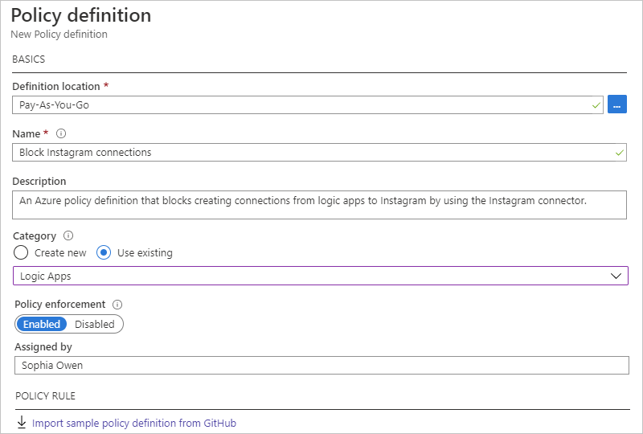
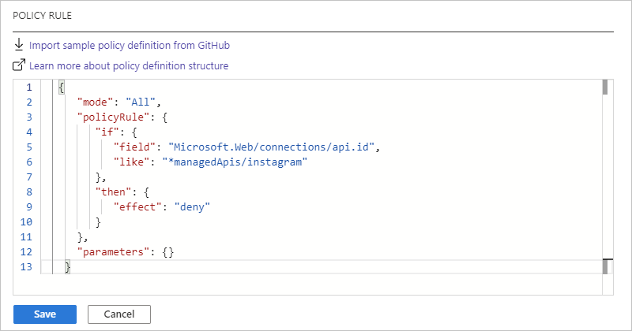
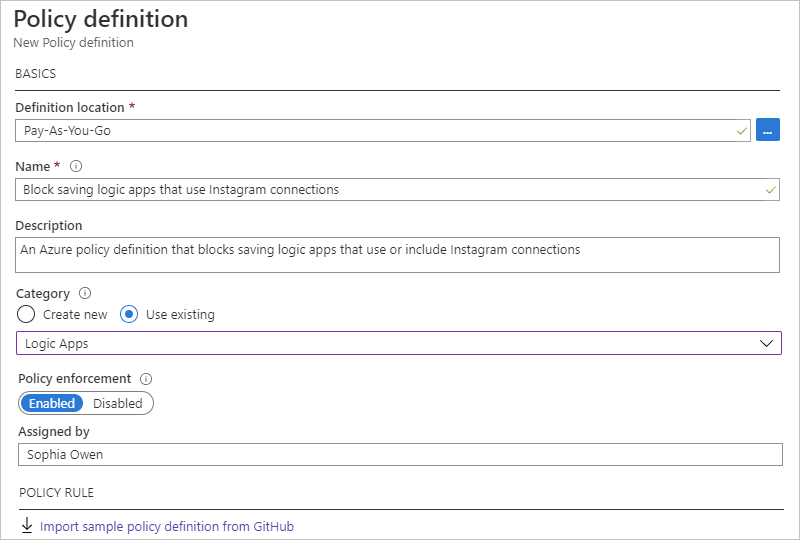
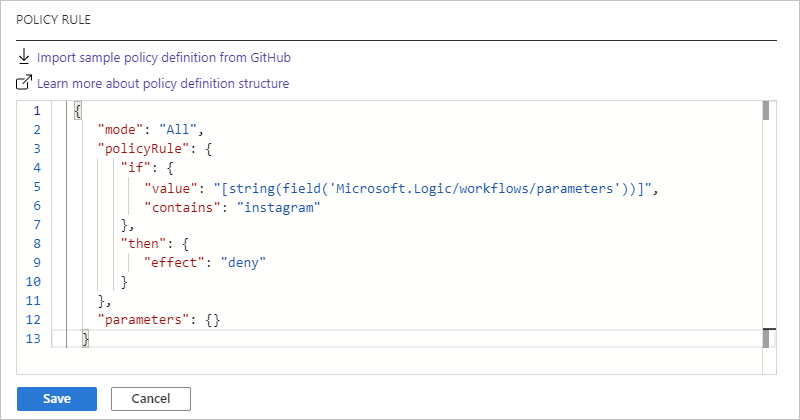
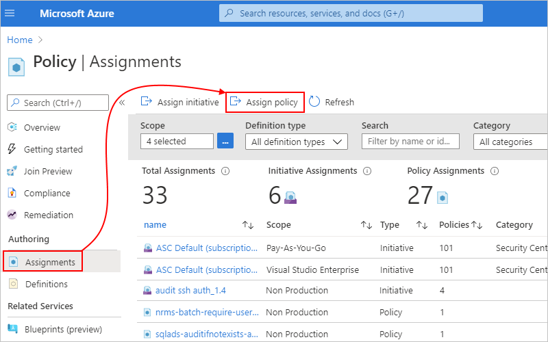
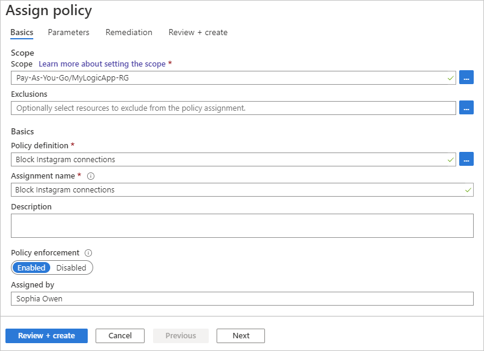
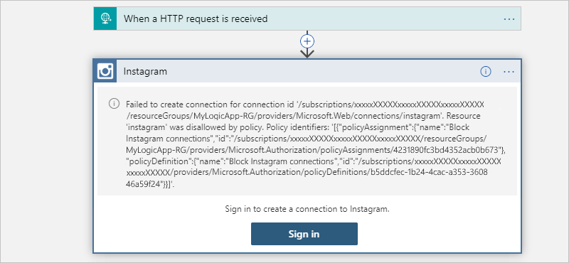

# Block connector usage in Azure Logic Apps

[!INCLUDE [logic-apps-sku-consumption-standard](../../includes/logic-apps-sku-consumption-standard.md)]

If your organization doesn't permit connecting to restricted or unapproved resources using their [managed connectors](../connectors/managed.md) in Azure Logic Apps, you can block the capability to create and use those connections in logic app workflows. With [Azure Policy](../governance/policy/overview.md), you can define and enforce [policies](../governance/policy/overview.md#policy-definition) that prevent creating or using connections for connectors that you want to block. For example, for security reasons, you might want to block connections to specific social media platforms or other services and systems.

This article shows how to set up a policy that blocks specific connections by using the Azure portal, but you can create policy definitions in other ways. For example, you can use the Azure REST API, Azure PowerShell, Azure CLI, and Azure Resource Manager templates. For more information, see [Tutorial: Create and manage policies to enforce compliance](../governance/policy/tutorials/create-and-manage.md).

## Prerequisites

* An Azure account and subscription. If you don't have a subscription, [create a free Azure account](https://azure.microsoft.com/free/?WT.mc_id=A261C142F).

* The reference ID for the connector that you want to block. For more information, see [Find the connector reference ID](#connector-reference-ID).

<a name="connector-reference-ID"></a>

## Find connector reference ID

If you already have a logic app with the connection that you want to block, follow the [steps for the Azure portal](#connector-ID-portal). Otherwise, follow these steps:

<a name="connector-ID-doc-reference"></a>

### Connector reference doc

1. Review [Connectors for Azure Logic Apps](/connectors/connector-reference/connector-reference-logicapps-connectors).

1. Find the reference page for the connector that you want to block.

   For example, if you want to block the Instagram connector, which is deprecated, go to this page:

   `https://learn.microsoft.com/connectors/instagram/`

1. From the page's URL, copy and save the connector reference ID at the end without the forward slash (`/`), for example, `instagram`.

   Later, when you create your policy definition, you use this ID in the definition's condition statement, for example:

   `"like": "*managedApis/instagram"`

<a name="connector-ID-portal"></a>

### Azure portal

1. In the [Azure portal](https://portal.azure.com), find and open your logic app workflow.

1. On the logic app menu, select one of the following options:
   
   * Consumption logic app: Under **Development Tools**, select **API connections**.

   * Standard logic app: Under **Workflows**, select **Connections**. On the **Connections** pane, select **API Connections** if not already selected.

   1. On the API connections pane, select the connection. When the connection pane opens, in the upper right corner, select **JSON View**.

   1. Find the `api` object, which contains an `id` property and value that has the following format: 

      `"id": "/subscriptions/{Azure-subscription-ID}/providers/Microsoft.Web/locations/{Azure-region}/managedApis/{connection-name}"`

      The following example shows the `id` property and value for an Instagram connection:

      `"id": "/subscriptions/xxxxxXXXXXxxxxxXXXXXxxxxxXXXXX/providers/Microsoft.Web/locations/westus/managedApis/instagram"`

   1. From the `id` property value, copy and save the connector reference ID at the end, for example, `instagram`.

      Later, when you create your policy definition, you use this ID in the definition's condition statement, for example:

      `"like": "*managedApis/instagram"`

<a name="create-policy-connections"></a>

## Block creating connections

To block creating a connection altogether in a logic app workflow, follow these steps:

1. In the [Azure portal](https://portal.azure.com) search box, enter **policy**, and select **Policy**.

   

1. On the **Policy** menu, under **Authoring**, select **Definitions**. On the **Definitions** pane toolbar, select **Policy definition**.

   

1. On the **Policy definition** pane, provide the information for your policy definition, based on the properties described under the example:

   

   | Property | Required | Value | Description |
   |----------|----------|-------|-------------|
   | **Definition location** | Yes | <*Azure-subscription-name*> | The Azure subscription to use for the policy definition <p><p>1. To find your subscription, select the ellipses (**...**) button. <br>2. From the **Subscription** list, find and select your subscription. <br>3. When you're done, select **Select**. |
   | **Name** | Yes | <*policy-definition-name*> | The name to use for the policy definition |
   | **Description** | No | <*policy-definition-name*> | A description for the policy definition |
   | **Category** | Yes | **Logic apps** | The name for an existing category or new category for the policy definition |
   | **Policy enforcement** | Yes | **Enabled** | This setting specifies whether to enable or disable the policy definition when you save your work. |
   |||||

1. Under **POLICY RULE**, the JSON edit box is pre-populated with a policy definition template. Replace this template with your [policy definition](../governance/policy/concepts/definition-structure.md) based on the properties described in the table below and by following this syntax:

   ```json
   {
      "mode": "All",
      "policyRule": {
         "if": {
            "field": "Microsoft.Web/connections/api.id",
            "like": "*managedApis/{connector-name}"
         },
         "then": {
            "effect": "deny"
         }
      },
      "parameters": {}
    }
    ```

   | Property | Value | Description |
   |----------|-------|-------------|
   | `mode` | `All` | The mode that determines the resource types that the policy evaluates. <p><p>This scenario sets `mode` to `All`, which applies the policy to Azure resource groups, subscriptions, and all resource types. <p><p>For more information, see [Policy definition structure - mode](../governance/policy/concepts/definition-structure.md#mode). |
   | `if` | `{condition-to-evaluate}` | The condition that determines when to enforce the policy rule <p><p>In this scenario, the `{condition-to-evaluate}` determines whether the `api.id` value in `Microsoft.Web/connections/api.id` matches on `*managedApis/{connector-name}`, which specifies a wildcard (*) value. <p><p>For more information, see [Policy definition structure - Policy rule](../governance/policy/concepts/definition-structure.md#policy-rule). |
   | `field` | `Microsoft.Web/connections/api.id` | The `field` value to compare against the condition <p><p>In this scenario, the `field` uses the [*alias*](../governance/policy/concepts/definition-structure.md#aliases), `Microsoft.Web/connections/api.id`, to access the value in the connector property, `api.id`. |
   | `like` | `*managedApis/{connector-name}` | The logical operator and value to use for comparing the `field` value <p><p>In this scenario, the `like` operator and the wildcard (*) character both make sure that the rule works regardless of region, and the string, `*managedApis/{connector-name}`, is the value to match where `{connector-name}` is the ID for the connector that you want to block. <p><p>For example, suppose that you want to block creating connections to social media platforms or databases: <p><p>- Twitter: `twitter` <br>- Instagram: `instagram` <br>- Facebook: `facebook` <br>- Pinterest: `pinterest` <br>- SQL Server or Azure SQL: `sql` <p><p>To find these connector IDs, see [Find connector reference ID](#connector-reference-ID) earlier in this topic. |
   | `then` | `{effect-to-apply}` | The effect to apply when the `if` condition is met <p><p>In this scenario, the `{effect-to-apply}` is to block and fail a request or operation that doesn't comply with the policy. <p><p>For more information, see [Policy definition structure - Policy rule](../governance/policy/concepts/definition-structure.md#policy-rule). |
   | `effect` | `deny` | The `effect` is to block the request, which is to create the specified connection <p><p>For more information, see [Understand Azure Policy effects - Deny](../governance/policy/concepts/effects.md#deny). |
   ||||

   For example, suppose that you want to block creating connections with the Instagram connector. Here's the policy definition that you can use:

   ```json
   {
      "mode": "All",
      "policyRule": {
         "if": {
            "field": "Microsoft.Web/connections/api.id",
            "like": "*managedApis/instagram"
         },
         "then": {
            "effect": "deny"
         }
      },
      "parameters": {}
   }
   ```

   Here's the way that the **POLICY RULE** box appears:

   

   For multiple connectors, you can add more conditions, for example:

   ```json
   {
      "mode": "All",
      "policyRule": {
         "if": {
            "anyOf": [
               {
                  "field": "Microsoft.Web/connections/api.id",
                  "like": "*managedApis/instagram"
               },
               {
                  "field": "Microsoft.Web/connections/api.id",
                  "like": "*managedApis/twitter"
               },
               {
                  "field": "Microsoft.Web/connections/api.id",
                  "like": "*managedApis/facebook"
               },
               {
                  "field": "Microsoft.Web/connections/api.id",
                  "like": "*managedApis/pinterest"
               }
            ]
         },
         "then": {
            "effect": "deny"
         }
      },
      "parameters": {}
    }
    ```

1. When you're done, select **Save**. After you save the policy definition, Azure Policy generates and adds more property values to the policy definition.

1. Next, to assign the policy definition where you want to enforce the policy, [create a policy assignment](#create-policy-assignment).

For more information about Azure Policy definitions, see these topics:

* [Azure Policy definition structure](../governance/policy/concepts/definition-structure.md)
* [Tutorial: Create and manage policies to enforce compliance](../governance/policy/tutorials/create-and-manage.md)
* [Azure Policy built-in policy definitions for Azure Logic Apps](./policy-reference.md)

<a name="create-policy-connector-usage"></a>

## Block associating connections with logic apps
   
When you create a connection in a logic app workflow, this connection exists as separate Azure resource. If you delete only the logic app workflow, the connection resource isn't automatically deleted and continues to exist until deleted. You might have a scenario where the connection resource already exists or where you have to create the connection resource for use outside the logic app. You can still block the capability to associate the connection with a different logic app workflow by creating a policy that prevents saving logic app workflows that try to use the restricted or unapproved connection. This policy affects only logic app workflows that don't already use the connection.
   
1. In the [Azure portal](https://portal.azure.com) search box, enter **policy**, and select **Policy**.

   

1. On the **Policy** menu, under **Authoring**, select **Definitions**. On the **Definitions** pane toolbar, select **Policy definition**.

   

1. Under **Policy definition**, provide the information for your policy definition, based on the properties described under the example and continues by using Instagram as the example:

   

   | Property | Required | Value | Description |
   |----------|----------|-------|-------------|
   | **Definition location** | Yes | <*Azure-subscription-name*> | The Azure subscription to use for the policy definition <p><p>1. To find your subscription, select the ellipses (**...**) button. <br>2. From the **Subscription** list, find and select your subscription. <br>3. When you're done, select **Select**. |
   | **Name** | Yes | <*policy-definition-name*> | The name to use for the policy definition |
   | **Description** | No | <*policy-definition-name*> | A description for the policy definition |
   | **Category** | Yes | **Logic apps** | The name for an existing category or new category for the policy definition |
   | **Policy enforcement** | Yes | **Enabled** | This setting specifies whether to enable or disable the policy definition when you save your work. |
   |||||

1. Under **POLICY RULE**, the JSON edit box is pre-populated with a policy definition template. Replace this template with your [policy definition](../governance/policy/concepts/definition-structure.md) based on the properties described in the table below and by following this syntax:

   ```json
   {
      "mode": "All",
      "policyRule": {
         "if": {
            "value": "[string(field('Microsoft.Logic/workflows/parameters'))]",
            "contains": "{connector-name}"
         },
         "then": {
            "effect": "deny"
         }
      },
      "parameters": {}
    }
    ```

   | Property | Value | Description |
   |----------|-------|-------------|
   | `mode` | `All` | The mode that determines the resource types that the policy evaluates. <p><p>This scenario sets `mode` to `All`, which applies the policy to Azure resource groups, subscriptions, and all resource types. <p><p>For more information, see [Policy definition structure - mode](../governance/policy/concepts/definition-structure.md#mode). |
   | `if` | `{condition-to-evaluate}` | The condition that determines when to enforce the policy rule <p><p>In this scenario, the `{condition-to-evaluate}` determines whether the string output from `[string(field('Microsoft.Logic/workflows/parameters'))]`, contains the string, `{connector-name}`. <p><p>For more information, see [Policy definition structure - Policy rule](../governance/policy/concepts/definition-structure.md#policy-rule). |
   | `value` | `[string(field('Microsoft.Logic/workflows/parameters'))]` | The value to compare against the condition <p><p>In this scenario, the `value` is the string output from `[string(field('Microsoft.Logic/workflows/parameters'))]`, which converts the `$connectors` object inside the `Microsoft.Logic/workflows/parameters` object to a string. |
   | `contains` | `{connector-name}` | The logical operator and value to use for comparing with the `value` property <p><p>In this scenario, the `contains` operator makes sure that the rule works regardless where `{connector-name}` appears, where the string, `{connector-name}`, is the ID for the connector that you want to restrict or block. <p><p>For example, suppose that you want to block using connections to social media platforms or databases: <p><p>- Twitter: `twitter` <br>- Instagram: `instagram` <br>- Facebook: `facebook` <br>- Pinterest: `pinterest` <br>- SQL Server or Azure SQL: `sql` <p><p>To find these connector IDs, see [Find connector reference ID](#connector-reference-ID) earlier in this topic. |
   | `then` | `{effect-to-apply}` | The effect to apply when the `if` condition is met <p><p>In this scenario, the `{effect-to-apply}` is to block and fail a request or operation that doesn't comply with the policy. <p><p>For more information, see [Policy definition structure - Policy rule](../governance/policy/concepts/definition-structure.md#policy-rule). |
   | `effect` | `deny` | The `effect` is to `deny` or block the request to save a logic app that uses the specified connection <p><p>For more information, see [Understand Azure Policy effects - Deny](../governance/policy/concepts/effects.md#deny). |
   ||||

   For example, suppose that you want to block saving logic apps that use Instagram connections. Here's the policy definition that you can use:

   ```json
   {
      "mode": "All",
      "policyRule": {
         "if": {
            "value": "[string(field('Microsoft.Logic/workflows/parameters'))]",
            "contains": "instagram"
         },
         "then": {
            "effect": "deny"
         }
      },
      "parameters": {}
    }
    ```

   Here's the way that the **POLICY RULE** box appears:

   

1. When you're done, select **Save**. After you save the policy definition, Azure Policy generates and adds more property values to the policy definition.

1. Next, to assign the policy definition where you want to enforce the policy, [create a policy assignment](#create-policy-assignment).

For more information about Azure Policy definitions, see these topics:

* [Azure Policy definition structure](../governance/policy/concepts/definition-structure.md)
* [Tutorial: Create and manage policies to enforce compliance](../governance/policy/tutorials/create-and-manage.md)
* [Azure Policy built-in policy definitions for Azure Logic Apps](./policy-reference.md)

<a name="create-policy-assignment"></a>

## Create policy assignment

Next, you need to assign the policy definition where you want to enforce the policy, for example, to a single resource group, multiple resource groups, Azure Active Directory (Azure AD) tenant, or Azure subscription. For this task, follow these steps to create a policy assignment:

1. In the [Azure portal](https://portal.azure.com), portal search box, enter **policy**, and select **Policy**.

   

1. On the **Policy** menu, under **Authoring**, select **Assignments**. On the **Assignments** pane toolbar, select **Assign policy**.

   

1. On the **Assign policy** pane, under **Basics**, provide this information for the policy assignment:

   | Property | Required | Description |
   |----------|----------|-------------|
   | **Scope** | Yes | The resources where you want to enforce the policy assignment. <p><p>1. Next to the **Scope** box, select the ellipses (**...**) button. <br>2. From the **Subscription** list, select the Azure subscription. <br>3. Optionally, from the **Resource Group** list, select the resource group. <br>4. When you're done, select **Select**. |
   | **Exclusions** | No | Any Azure resources to exclude from the policy assignment. <p><p>1. Next to the **Exclusions** box, select the ellipses (**...**) button. <br>2. From the **Resource** list, select the resource > **Add to Selected Scope**. <br>3. When you're done, select **Save**. |
   | **Policy definition** | Yes | The name for the policy definition that you want to assign and enforce. This example continues with the example Instagram policy, "Block Instagram connections". <p><p>1. Next to the **Policy definition** box, select the ellipses (**...**) button. <br>2. Find and select the policy definition by using the **Type** filter or **Search** box. <br>3. When you're done, select **Select**. |
   | **Assignment name** | Yes | The name to use for the policy assignment, if different from the policy definition |
   | **Assignment ID** | Yes | The automatically generated ID for the policy assignment |
   | **Description** | No | A description for the policy assignment |
   | **Policy enforcement** | Yes | The setting that enables or disables the policy assignment |
   | **Assigned by** | No | The name for the person who created and applied the policy assignment |
   ||||

   For example, to assign the policy to an Azure resource group by using the Instagram example:

   

1. When you're done, select **Review + create**.

   After you create a policy, you might have to wait up to 15 minutes before the policy takes effect. Changes might also have similar delayed effects.

1. After the policy takes effect, you can [test your policy](#test-policy).

For more information, see [Quickstart: Create a policy assignment to identify non-compliant resources](../governance/policy/assign-policy-portal.md).

<a name="test-policy"></a>

## Test the policy

To try your policy, start creating a connection by using the now restricted connector in the workflow designer. Continuing with the Instagram example, when you sign in to Instagram, you get this error that your logic app failed to create the connection:



The message includes this information:

| Description | Content |
|-------------|---------|
| Reason for the failure | `"Resource 'instagram' was disallowed by policy."` |
| Assignment name | `"Block Instagram connections"` |
| Assignment ID | `"/subscriptions/xxxxxXXXXXxxxxxXXXXXxxxxxXXXXX/resourceGroups/MyLogicApp-RG/providers/Microsoft.Authorization/policyAssignments/4231890fc3bd4352acb0b673"` |
| Policy definition ID | `"/subscriptions/xxxxxXXXXXxxxxxXXXXXxxxxxXXXXX/providers/Microsoft.Authorization/policyDefinitions/b5ddcfec-1b24-4cac-a353-360846a59f24"` |
|||

## Next steps

* Learn more about [Azure Policy](../governance/policy/overview.md)
