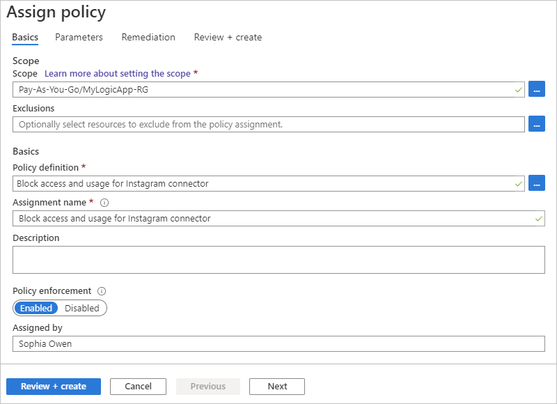

# Block access and usage for specific connectors in Azure Logic Apps

If your organization needs to prohibit access and usage for specific connectors in logic app workflows, you can use [Azure Policy](../governance/policy/overview.md) to create an [Azure Policy definition](../governance/policy/overview.md#policy-definition) that blocks access to those connectors.

This topic shows how to create a policy definition in the Azure portal, but you can also create policy definitions in these ways:

* [Azure PowerShell]
* [Azure CLI]
* [Azure Resource Manager template]

## Prerequisites

* An Azure subscription. If you don't have a subscription, [create a free Azure account](https://azure.microsoft.com/free/) before you start.


## 

Based on the connector that you want to block, 

To find the `id` property for the connector that you want to block,

```json
{
   "properties": {
      "api": {
         "id": "/subscriptions/{your-Azure-subscription-ID}/providers/Microsoft.Web/locations/{location}/managedApis/instagram"
      },
      "location": "{location}"
   }
}
```


* For more information about the JSON syntax and structure to follow for a policy definition, see these topics:

  * [Policy structure definition](../governance/policy/concepts/definition-structure.md)
  * [Tutorial: Create a custom policy definition](../governance/policy/tutorials/create-custom-policy-definition.md)
  * [Azure Policy built-in policy definitions for Azure Logic Apps](../logic-apps/policy-samples.md)

## Create policy definition

1. Sign in to the [Azure portal](https://portal.azure.com). In the portal search box, enter `policy`, and select **Policy**.

   

1. On the **Policy** menu, under **Authoring**, select **Definitions** > **+ Policy definition**.

   

1. Provide this information for your definition:

   | Property | Required | Description |
   |----------|----------|-------------|
   | **Definition location** | Yes | The Azure subscription to use for the policy definition. <p><p>1. To find your subscription, select the ellipses (**...**) button. <br>2. From the **Subscription** list, find and select your subscription. <br>3. When you're done, select **Select**. |
   | **Name** | Yes | The name to use for the policy definition |
   | **Description** | No | A description for the policy definition |
   | **Category** | Yes | The name for an existing category or new category where you want to put the policy definition. The default category is **Logic Apps**. |
   | **POLICY RULE** | Yes | The policy definition, which follows the structure and syntax described in this topic: [Policy structure definition](../governance/policy/concepts/definition-structure.md)
   ||||

   Here's the syntax for the policy definition rule:

   ```json
   {
      "properties": {
         "displayName": "{policyDefinitionDisplayName}",
         "description": "{policyDefinitionDescription}",
         "mode": "{policyDefinitionMode}",
         "parameters": { <parameters> },
         "policyRule": {
            "if": { <rule> },
            "then": { 
               "effect": "{effect}"
            }
         }
      }
   }
   ```

   For example, suppose that you want to block access and usage for the Instagram connector. Here's a sample that shows what a policy definition might look, using `like` as the condition so that the definition works regardless of region, which is part of the `id` value:

   ```json
   {
      "properties": {
         "displayName": "{policyDefinitionDisplayName}",
         "description": "{policyDefinitionDescription}",
         "mode": "{policyDefinitionMode}",
         "policyRule": {
            "if": {
               "field": "Microsoft.Web/connections/api.id",
               "like": "*managedApis/instagram"
         },
         "then": {
            "effect": "deny"
         }
      },
      "parameters": {}
   }
   ```

1. When you're done, select **Save**.

## Create policy assignment

Next, you need to assign the policy definition where you want the policy to apply, for example, to a single resource group, multiple resource groups, Azure Active Directory (Azure AD) tenant, or Azure subscription. To complete this task, create a policy assignment: 

Assign the policy definition
For more information, see [Quickstart: Create a policy assignment to identify non-compliant resources]().

1. On the **Policy** menu, under **Authoring**, select **Assignments** > **Assign policy**.

   

1. Under **Basics**, provide this information for the policy assignment:

   | Property | Required | Description |
   |----------|----------|-------------|
   | **Scope** | Yes | The Azure subscription and optional resource group where you want to apply and enforce the policy. <p><p>1. Next to the **Scope** box, select the ellipses (**...**) button. <br>2. From the **Subscription** list, select the Azure subscription. <br>3. Optionally, from the **Resource Group** list, select the resource group. <br>4. When you're done, select **Select**. |
   | **Exclusions** | No | Any Azure resources to exclude from the policy assignment. <p><p>1. Next to the **Exclusions** box, select the ellipses (**...**) button. <br>2. From the **Resource** list, select the resource > **Add to Selected Scope**. <br>3. When you're done, select **Save**. |
   | **Policy definition** | Yes | The name for the policy definition that you want to apply and enforce. <p><p>1. Next to the **Policy definition** box, select the ellipses (**...**) button. <br>2. Find and select the policy definition by using the **Type** filter or **Search** box. <br>3. When you're done, select **Select**. |
   | **Assignment name** | Yes | The name to use for the policy assignment |
   | **Description** | No | A description for the policy assignment |
   | **Policy enforcement** | Yes | The setting that enables or disables the policy assignment |
   | **Assigned by** | No | The name for the person who created and applied the policy assignment |
   ||||

   For example:

   


   | **Create a Managed Identity** | No |
   | **Managed identity location** | Yes if selected | | 
   | **POLICY RULE** | Yes | The policy definition, which follows the structure and syntax described in this topic: [Policy structure definition](../governance/policy/concepts/definition-structure.md)

1. 
