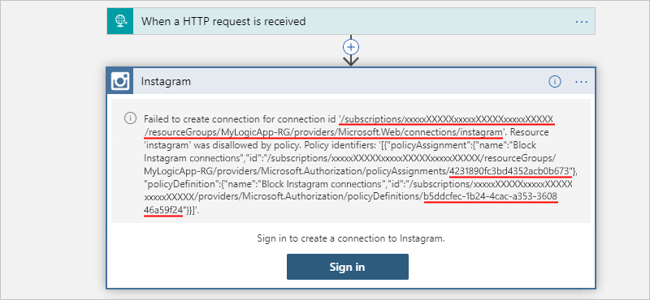

# Block connections created by specific connectors in Azure Logic Apps

If your organization doesn't permit connecting to specific resources through available connectors in Azure Logic Apps, you can prevent creating those connections in logic app workflows. By using [Azure Policy](../governance/policy/overview.md), you can define and enforce a [policy](../governance/policy/overview.md#policy-definition) that blocks connections through those connectors.

This topic shows how to create and assign the policy in the Azure portal, but you can also create policies in these ways:

* [Azure PowerShell]
* [Azure CLI]
* [Azure Resource Manager template]

## Prerequisites

* An Azure subscription. If you don't have a subscription, [create a free Azure account](https://azure.microsoft.com/free/) before you start.

* The reference ID for the connector that you want to block. If you have a logic app that uses this connector, you can [find the connector reference ID](#find-connector-portal) in various ways, based on how you create the connection for your logic app. Regardless, the connector's reference ID follows this format:

  `"/subscriptions/{Azure-subscription-ID}/providers/Microsoft.Web/locations/{Azure-region}/managedApis/{connector-name}"`

  For example, suppose that you want to block connections created by the Instagram connector. The connector's reference ID looks like this example, based on a logic app that's in the West US region:

  `"/subscriptions/xxxxXXXXxxxxXXXXXXXxxxxx/providers/Microsoft.Web/locations/westus/managedApis/instagram"`

<a name="find-connector-portal"></a>

## Find connector reference ID

### Azure portal

In the Logic App Designer, you can find the connector's reference ID in these ways:

* Open code view for the logic app, and find the connector's `id` property for the connector that you want to block, review the underlying JSON definition for logic app:

  review the network trace 
  find the PUT call to the 


```json
{
   "properties": {
      "api": {
         "id": "/subscriptions/{Azure-subscription-ID}/providers/Microsoft.Web/locations/{Azure-region}/managedApis/{connector-name}"
      },
      "location": "{Azure-region}"
   }
}
```

```json
{
   "parameters": {
      "$connections": {
         "connectionId": ,
         "connectionName": ,
         "id": 
      }
   }
}


```

### REST API

1. In a tool such as Postman, make this REST API call:

   `PUT https://management.azure.com/subscriptions/{Azure-subscription-ID}/resourceGroups/{Azure-resource-group-name}/providers/Microsoft.Web/connections/{connector-name}?api-version=2018-07-01-preview`

1. In the response's payload, find the connector reference ID, which is located in the `id` property:

   ```json
   {
      "properties": {
         "api": {
            "id": "/subscriptions/{Azure-subscription-ID}/providers/Microsoft.Web/locations/{Azure-region}/managedApis/{connector-name}"
         },
         "location": "{Azure-region}"
      }
   }
   ```

### Azure Resource Manager template

  In your Resource Manager template, the connections looks like this example:

  ```json
  {

  }
  ```

For more information, see [Microsoft.Web connections template reference](https://docs.microsoft.com/azure/templates/microsoft.web/2016-06-01/connections).

## Create policy definition

1. Sign in to the [Azure portal](https://portal.azure.com). In the portal search box, enter `policy`, and select **Policy**.

   

1. On the **Policy** menu, under **Authoring**, select **Definitions** > **+ Policy definition**.

   

1. Provide this information for your definition:

   | Property | Required | Description |
   |----------|----------|-------------|
   | **Definition location** | Yes | The Azure subscription to use for the policy definition. <p><p>1. To find your subscription, select the ellipses (**...**) button. <br>2. From the **Subscription** list, find and select your subscription. <br>3. When you're done, select **Select**. |
   | **Name** | Yes | The name to use for the policy definition |
   | **Description** | No | A description for the policy definition |
   | **Category** | Yes | The name for an existing category or new category for the policy definition, which is **Logic Apps** in this scenario |
   ||||

1. Under **POLICY RULE**, in the JSON text box, enter your [policy definition](../governance/policy/concepts/definition-structure.md) by following this syntax and the properties described in the table:

   ```json
   {
      "mode": "All",
      "policyRule": {
         "if": {
            "field": "Microsoft.Web/connections/api.id",
            "like": "*managedApis/{connector-name}"
         },
         "then": {
            "effect": "deny"
         }
      },
      "parameters": {}
    }
    ```

   | Property | Value | Description |
   |----------|-------|-------------|
   | `"mode"` | `"All"` | Determines the resource types that the policy evaluates. For this scenario, set `"mode"` to `"All"`, which applies the policy to Azure resource groups, subscriptions, and all resource types. <p><p>For more information, see [Policy definition structure - mode](../governance/policy/concepts/definition-structure.md#mode). |
   | `"if"` | - `"field": "Microsoft.Web/connections/api.id"` <p><p>- `"like": "*managedApis/{connector-name}"` | The condition that determines when to enforce the policy rule. In this scenario, the condition is met if the `"api.id"` in `"Microsoft.Web/connections/api.id"` matches on `"*managedApis/{connector-name}"`, which also uses a wildcard (*) value. <p><p>For more information, see [Policy definition structure - Policy rule](../governance/policy/concepts/definition-structure.md#policy-rule). |
   | `"then"` | `"effect": "deny"` | The effect to apply when the `"if"` condition is met. In this scenario, the effect is to block a resource request that doesn't comply with the policy and to fail that request. For more information, see [Understand Azure Policy effects - Deny](../governance/policy/concepts/effects.md#deny). |
   ||||

   For example, suppose that you want to block logic apps from creating connections using the Instagram connector. Here is the policy definition that you can use:

   ```json
   {
      "mode": "All",
      "policyRule": {
         "if": {
            "field": "Microsoft.Web/connections/api.id",
            "like": "*managedApis/instagram"
         },
         "then": {
            "effect": "deny"
         }
      },
      "parameters": {}
    }
    ```

1. When you're done, select **Review + Save**. After you save the policy definition, Azure Policy adds more property values to the policy definition, which now looks like this example:

   ```json
   {
      "mode": "All",
      "policyRule": {
         "if": {
            "field": "Microsoft.Web/connections/api.id",
            "like": "*managedApis/instagram"
         },
         "then": {
            "effect": "deny"
         }
      },
      "parameters": {}
    }
    ```

         "displayName": "Block Instagram connections",

         "metadata": {
            "category": "Logic Apps",
            "createdBy": "c8d78a66-0f83-4f76-8201-8315ab9b1c5a",
            "createdOn": "2019-10-08T18:48:19.7203003Z",
            "updatedBy": "c8d78a66-0f83-4f76-8201-8315ab9b1c5a",
            "updatedOn": "2020-05-29T19:08:16.2817462Z"
    },
    "parameters": {},
  },
  "id": "/subscriptions/80d4fe69-c95b-4dd2-a938-9250f1c8ab03/providers/Microsoft.Authorization/policyDefinitions/b5ddcfec-1b24-4cac-a353-360846a59f24",
  "type": "Microsoft.Authorization/policyDefinitions",
  "name": "b5ddcfec-1b24-4cac-a353-360846a59f24"
}
   ```

   ```json
   {
      "properties": {
         "mode": "{policyDefinitionMode}",
         "policyRule": {
            "if": { 
               "not": { 
                  "field": "location",
                  "in": "[parameters('allowedLocations')]"
               }
            },
            "then": { 
               "effect": "deny"
            }
         }
         "parameters": {
            "allowedLocations": {
               "type": "Array",
               "metadata": {
                  "description": "The list of allowed locations",
                  "displayName": "Allowed locations",
                  "strongType": "location"
               }
            }
         }
      }
   }
   ```

   For example, suppose that you want to block access and usage for the Instagram connector. Here's a sample that shows what a policy definition might look, using `like` as the condition so that the definition works regardless of region, which is part of the `id` value:

   ```json
   {
      "properties": {
         "mode": "All",
         "policyRule": {
            "if": {
               "field": "Microsoft.Web/connections/api.id",
               "like": "*managedApis/instagram"
         },
         "then": {
            "effect": "deny"
         }
      },
      "parameters": {
         "description": "{policyDefinitionDescription}",
         "displayName": "{policyDefinitionDisplayName}"
      }
   }
   ```

1. When you're done, select **Save**.

For more information about the JSON syntax and structure to follow for a policy definition, see these topics:

* [Policy structure definition](../governance/policy/concepts/definition-structure.md)
* [Tutorial: Create a custom policy definition](../governance/policy/tutorials/create-custom-policy-definition.md)
* [Azure Policy built-in policy definitions for Azure Logic Apps](../logic-apps/policy-samples.md)
* [Azure Resource Manager Templates: Microsoft.Authorization policyDefinitions template reference](https://docs.microsoft.com/azure/templates/microsoft.authorization/2019-06-01/policydefinitions)
* [Azure REST API: Resource Management - Policy Definitions](https://docs.microsoft.com/rest/api/resources/policydefinitions)

## Create policy assignment

Next, you need to assign the policy definition where you want the policy to apply, for example, to a single resource group, multiple resource groups, Azure Active Directory (Azure AD) tenant, or Azure subscription. To complete this task, create a policy assignment: 

Assign the policy definition
For more information, see [Quickstart: Create a policy assignment to identify non-compliant resources]().

1. On the **Policy** menu, under **Authoring**, select **Assignments** > **Assign policy**.

   

1. Under **Basics**, provide this information for the policy assignment:

   | Property | Required | Description |
   |----------|----------|-------------|
   | **Scope** | Yes | The Azure subscription and optional resource group where you want to apply and enforce the policy. <p><p>1. Next to the **Scope** box, select the ellipses (**...**) button. <br>2. From the **Subscription** list, select the Azure subscription. <br>3. Optionally, from the **Resource Group** list, select the resource group. <br>4. When you're done, select **Select**. |
   | **Exclusions** | No | Any Azure resources to exclude from the policy assignment. <p><p>1. Next to the **Exclusions** box, select the ellipses (**...**) button. <br>2. From the **Resource** list, select the resource > **Add to Selected Scope**. <br>3. When you're done, select **Save**. |
   | **Policy definition** | Yes | The name for the policy definition that you want to apply and enforce. <p><p>1. Next to the **Policy definition** box, select the ellipses (**...**) button. <br>2. Find and select the policy definition by using the **Type** filter or **Search** box. <br>3. When you're done, select **Select**. |
   | **Assignment name** | Yes | The name to use for the policy assignment |
   | **Assignment ID** | Yes | The automatically generated ID for the policy assignment |
   | **Description** | No | A description for the policy assignment |
   | **Policy enforcement** | Yes | The setting that enables or disables the policy assignment |
   | **Assigned by** | No | The name for the person who created and applied the policy assignment |
   ||||

   For example:

   

1. To test the policy after taking effect, in the Logic App Designer, you can try to create a connection with the restricted connector. When you try to sign in, you get this error that your logic app failed to create the connection:

   

   `Failed to create connection for connection id '/subscriptions/xxxxxXXXXXxxxxxXXXXXxxxxxXXXXX`
   `/resourceGroups/MyLogicApp-RG/providers/Microsoft.Web/connections/instagram'. Resource`
   `'instagram' was disallowed by policy. Policy identifiers: '[{"policyAssignment":{"name":"Block`
   `Instagram connections","id":"/subscriptions/xxxxxXXXXXxxxxxXXXXXxxxxxXXXXX/resourceGroups/`
   `MyLogicApp-RG/providers/Microsoft.Authorization/policyAssignments/4231890fc3bd4352acb0b673"},`
   `"policyDefinition":{"name":"Block Instagram connections","id":"/subscriptions/xxxxxXXXXXxxxxxXXXXX`
   `xxxxxXXXXX/providers/Microsoft.Authorization/policyDefinitions/b5ddcfec-1b24-4cac-a353-360846a59f24"}}]'.`

For more information, see these topics:

* [Azure Resource Manager Templates: Microsoft.Authorization policyAssignments template reference](https://docs.microsoft.com/azure/templates/microsoft.authorization/2019-06-01/policyassignments)
* [Azure REST API: Resource Management - Policy Assignments](https://docs.microsoft.com/rest/api/resources/policyassignments)