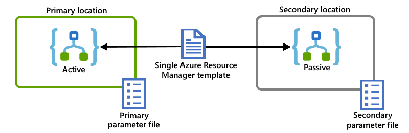
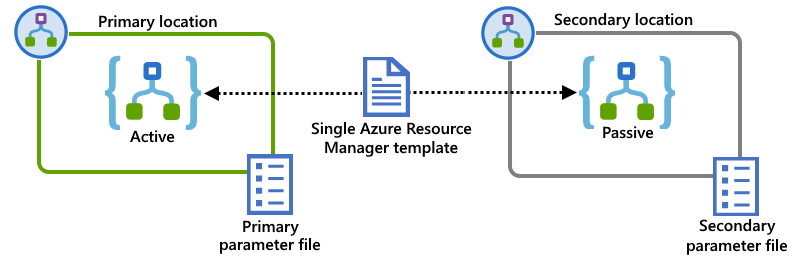
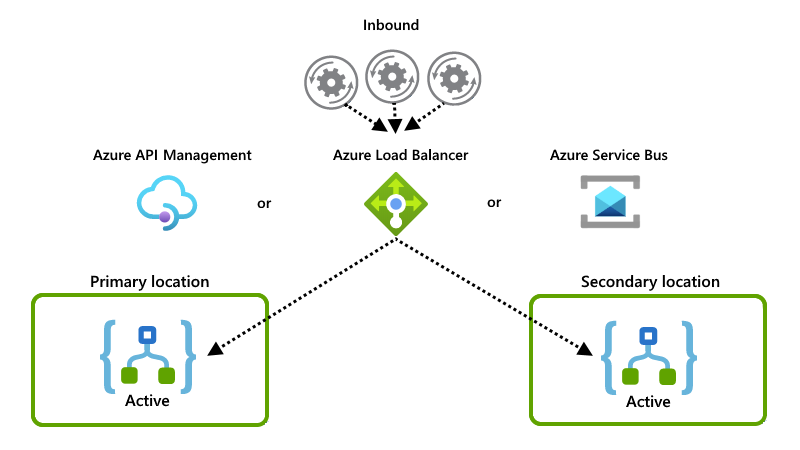
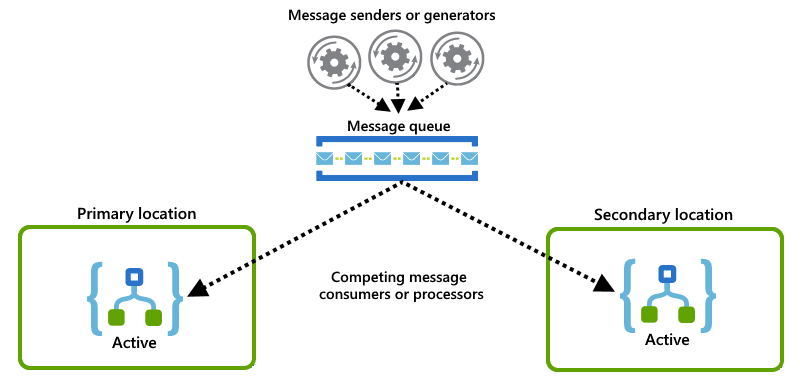
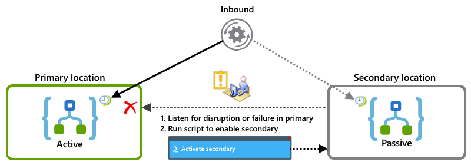
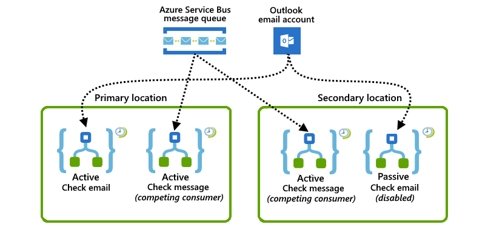
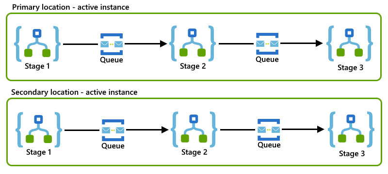
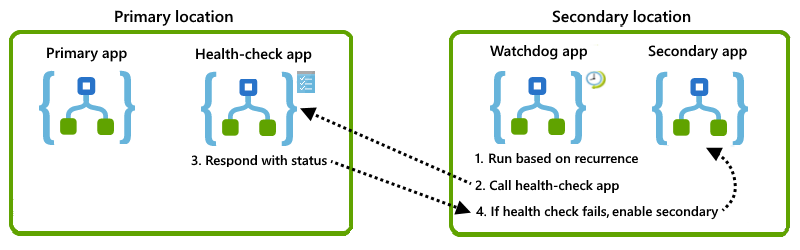

# Business continuity and disaster recovery for Azure Logic Apps

To help reduce the impact and effects that unpredictable events have on your business and customers, make sure that you have a [*disaster recovery* (DR)](https://en.wikipedia.org/wiki/Disaster_recovery) solution in place so that you can protect data, quickly restore the resources that support critical business functions, and keep operations running to maintain [*business continuity* (BC)](https://en.wikipedia.org/wiki/Business_continuity_planning). For example, disruptions can include outages, losses in underlying infrastructure or components such as storage, network, or compute resources, unrecoverable application failures, or even a full datacenter loss. By having a business continuity and disaster recovery (BCDR) solution ready, your enterprise or organization can respond more quickly to interruptions, planned or unplanned, and reduce downtime for your customers.

This article provides BCDR guidance and strategies that you can apply when you build automated workflows by using [Azure Logic Apps](../logic-apps/logic-apps-overview.md). Logic app workflows help you more easily integrate and orchestrate data between apps, cloud services, and on-premises systems by reducing how much code that you have to write. When you plan for BCDR, make sure that you consider not just your logic apps, but also these Azure resources that you use with your logic apps:

* [Connections](../connectors/apis-list.md) that you create from logic apps to other apps, services, and systems. For more information, see [Connections to resources](#resource-connections) later in this topic.

* [On-premises data gateways](../logic-apps/logic-apps-gateway-connection.md) which are Azure resources that you create and use in your logic apps to access data in on-premises systems. Each gateway resource represents a separate [data gateway installation](../logic-apps/logic-apps-gateway-install.md) on a local computer. For more information, see [On-premises data gateways](#on-premises-data-gateways) later in this topic.

* [Integration accounts](../logic-apps/logic-apps-enterprise-integration-create-integration-account.md) where you define and store the artifacts that logic apps use for [business-to-business (B2B) enterprise integration](../logic-apps/logic-apps-enterprise-integration-overview.md) scenarios. For example, you can [set up cross-region disaster recovery for integration accounts](../logic-apps/logic-apps-enterprise-integration-b2b-business-continuity.md).

* [Integration service environments (ISEs)](../logic-apps/connect-virtual-network-vnet-isolated-environment-overview.md) where you create logic apps that run in an isolated Logic Apps runtime instance within an Azure virtual network. These logic apps can then access resources that are protected behind a firewall in that virtual network.

## Primary and secondary locations

Each logic app needs to specify the location that you want to use for deployment. This location is either a public region in global multi-tenant Azure, such as "West US", or an integration service environment (ISE) that you previously created and deployed into an Azure virtual network. Running logic apps in an ISE is similar to running logic apps in a global Azure region, which means your disaster recovery strategy can apply to both scenarios. However, ISEs have other considerations such as configuring access to resources that are available only to ISEs.

> [!NOTE]
> If your logic app also works with B2B artifacts, such as trading partners, agreements, schemas, maps, and certificates, 
> which are stored in an integration account, both your integration account and logic apps must specify the same location.

This disaster recovery strategy focuses on setting up your primary logic app to [*failover*](https://en.wikipedia.org/wiki/Failover) onto a standby or backup logic app in an alternate location where Azure Logic Apps is also available. That way, if the primary suffers losses, disruptions, or failures, the secondary can take on the work. This strategy requires that your secondary logic app and dependent resources are already deployed and ready in the alternate location.

If you follow good DevOps practices, you already use [Azure Resource Manager templates](../azure-resource-manager/management/overview.md) to define and deploy your logic apps and their dependent resources. Resource Manager templates give you the capability to use a single deployment definition and then use parameter files to provide the configuration values to use for each deployment destination. This capability means that you can deploy the same logic app to different environments, for example, development, test, and production. You can also deploy the same logic app to different Azure regions or ISEs, which supports disaster recovery strategies that use [paired-regions](../best-practices-availability-paired-regions.md).

For the failover strategy, your logic apps and locations must meet these requirements:

* The secondary logic app instance has access to the same apps, services, and systems as the primary logic app instance.

* Both logic app instances have the same host type. So, either both instances are deployed to regions in global multi-tenant Azure, or both instances are deployed to ISEs, which let your logic apps directly access resources in an Azure virtual network. For best practices and more information about paired regions for BCDR, see [Business continuity and disaster recovery (BCDR): Azure paired regions](../best-practices-availability-paired-regions.md).

  For example, both the primary and secondary locations must be ISEs when the primary logic app runs in an ISE and uses [ISE-versioned connectors](../connectors/apis-list.md#ise-connectors), HTTP actions to call resources in the Azure virtual network, or both. In this scenario, your secondary logic app must also have a similar setup in the secondary location as the primary logic app.

  > [!NOTE]
  > For more advanced scenarios, you can mix both multi-tenant Azure and an 
  > ISE as locations. However, make sure that you consider and understand the 
  > [differences between how logic apps run in an ISE versus multi-tenant Azure](../logic-apps/connect-virtual-network-vnet-isolated-environment-overview.md#difference).

* If you use ISEs, [make sure that they are scaled out or have enough capacity](../logic-apps/ise-manage-integration-service-environment.md#add-capacity) to handle the load.

#### Example: Multi-tenant Azure

This example shows primary and secondary logic app instances, which are deployed to separate regions in the global multi-tenant Azure for this scenario. A single [Resource Manager template](../logic-apps/logic-apps-azure-resource-manager-templates-overview.md) defines both logic app instances and the dependent resources required by those logic apps. Separate parameter files specify the configuration values to use for each deployment location:

#### Example: Integration service environment

This example shows the previous primary and secondary logic app instances but deployed to separate ISEs. A single Resource Manager template defines both logic app instances, the dependent resources required by those logic apps, and the ISEs as the deployment locations. Separate parameter files define the configuration values to use for deployment in each location:

## Connections to resources

Azure Logic Apps provides [built-in triggers and actions plus hundreds of managed connectors](../connectors/apis-list.md) that your logic app can use to work with other apps, services, systems, and other resources, such as Azure Storage accounts, SQL Server databases, Office 365 Outlook email accounts, and so on. If your logic app needs access to these resources, you create connections that authenticate access to these resources. Each connection is a separate Azure resource that exists in a specific location and can't be used by resources in other locations.

For your disaster recovery strategy, consider the locations where dependent resources exist relative to your logic app instances:

* Your primary instance and dependent resources exist in different locations. In this case, your secondary instance can connect to the same dependent resources or endpoints. However, you should create connections specifically for your secondary instance. That way, if your primary location becomes unavailable, your secondary's connections aren't affected.

  For example, suppose that your primary logic app connects to an external service such as Salesforce. Usually, the external service's availability and location are independent from your logic app's availability. In this case, your secondary instance can connect to the same service but should have its own connection.

* Both your primary instance and dependent resources exist in the same location. In this case, dependent resources should have backups or replicated versions in a different location so that your secondary instance can still access those resources.

  For example, suppose that your primary logic app connects to a service that's in the same location or region, for example, Azure SQL Database. If this entire region becomes unavailable, the Azure SQL Database service in that region is also likely unavailable. In this case, you'd want your secondary instance to use a replicated or backup database along with a separate connection to that database.

## On-premises data gateways

If your logic app runs in multi-tenant Azure and needs access to on-premises resources such as SQL Server databases, you need to install the [on-premises data gateway](../logic-apps/logic-apps-gateway-install.md) on a local computer. You can then create a data gateway resource in the Azure portal so that your logic app can use the gateway when you create a connection to the resource.

The data gateway resource is associated with a location or Azure region, just like your logic app resource. In your disaster recovery strategy, make sure that the data gateway remains available for your logic app to use. You can [enable high availability for your gateway](../logic-apps/logic-apps-gateway-install.md#high-availability) when you have multiple gateway installations.

> [!NOTE]
> If your logic app runs in an integration service environment (ISE) and uses only 
> ISE-versioned connectors for on-premises data sources, you don't need the data 
> gateway because ISE connectors provide direct access to the the on-premises resource.
>
> If no ISE-versioned connector is available for the on-premises resource that you want, 
> your logic app can still create the connection by using a non-ISE connector, 
> which runs in the global multi-tenant Azure, not your ISE. However, this connection 
> requires the on-premises data gateway.

## Active-active versus active-passive roles

You can set up your primary and secondary locations so that your logic app instances in these locations can play these roles:

| Primary-secondary role | Description |
|------------------------|-------------|
| *Active-active* | The primary and secondary logic app instances in both locations actively handle requests by following either of these patterns: 

- *Load balance*: You can have both instances listen to an endpoint and load balance traffic to each instance as necessary. 
- *Competing consumers*: You can have both instances act as competing consumers so that the instances compete for messages from a queue. If one instance fails, the other instance takes over the workload. |
| *Active-passive* | The primary logic app instance actively handles the entire workload, while the secondary instance is passive (disabled or inactive). The secondary waits for a signal that the primary is unavailable or not working due to disruption or failure and takes over the workload as the active instance. |
| Combination | Some logic apps play an active-active role, while other logic apps play an active-passive role. |
|||

### Active-active examples

These examples show the active-active setup where both logic app instances actively handle requests or messages. Some other system or service distributes the requests or messages between instances, for example, one of these options:

* A "physical" load balancer, such as a piece of hardware that routes traffic

* A "soft" load balancer such as [Azure Load Balancer](../load-balancer/load-balancer-overview.md) or [Azure API Management](../api-management/api-management-key-concepts.md). With API Management, you can specify policies that determine how to load balance incoming traffic. Or, you can use a service that supports state tracking, for example, [Azure Service Bus](../service-bus-messaging/service-bus-messaging-overview.md).

  Although this example primarily shows Azure Load Balancer, you can use the option that best suits your scenario's needs:

  

* Each logic app instance acts as a consumer and have both instances compete for messages from a queue:

  

### Active-passive examples

This example shows the active-passive setup where the primary logic app instance is active in one location, while the secondary instance remains inactive in another location. If the primary experiences a disruption or failure, you can have an operator run a script that activates the secondary to take on the workload.

### Combination with active-active and active-passive

This example shows a combined setup where the primary location has both active logic app instances, while the secondary location has active-passive logic app instances. If the primary location experiences a disruption or failure, the active logic app in the secondary location, which is already handling a partial workload, can take over the entire workload.

* In the primary location, an active logic app listens to an Azure Service Bus queue for messages, while another active logic app checks for emails by using a Office 365 Outlook polling trigger.

* In the secondary location, an active logic app works with the logic app in the primary location by listening and competing for messages from the same Service Bus queue. Meanwhile, a passive inactive logic app waits on standby to check for emails when the primary location becomes unavailable but is *disabled* to avoid rereading emails.

## Logic app state and history

When your logic app is triggered and starts running, the app's state is stored in the same location where the app started and is non-transferable to another location. If a failure or disruption happens, any in-progress workflow instances are abandoned. When you have a primary and secondary locations set up, new workflow instances start running at the secondary location.

### Reduce abandoned in-progress instances

To minimize the number of abandoned in-progress workflow instances, you can choose from various message patterns that you can implement, for example:

* [Fixed routing slip pattern](https://docs.microsoft.com/biztalk/esb-toolkit/message-routing-patterns#routing-slip)

  This enterprise message pattern that splits a business process into smaller stages. For each stage, you set up a logic app that handles the workload for that stage. To communicate with each other, your logic apps use an asynchronous messaging protocol such as Azure Service Bus queues or topics. When you divide a process into smaller stages, you reduce the number of business processes that might get stuck on a failed logic app instance. For more general information about this pattern, see [Enterprise integration patterns - Routing slip](https://www.enterpriseintegrationpatterns.com/patterns/messaging/RoutingTable.html).

  This example shows a routing slip pattern where each logic app represents a stage and uses a Service Bus queue to communicate with the next logic app in the process.

  

  If both primary and secondary logic app instances follow the same routing slip pattern in their locations, you can implement the [competing consumers pattern](https://docs.microsoft.com/azure/architecture/patterns/competing-consumers) by setting up [active-active roles](#roles) for those instances.

* [Process manager (broker) pattern](https://www.enterpriseintegrationpatterns.com/patterns/messaging/ProcessManager.html)

* [Peek-lock without timeout pattern](https://social.technet.microsoft.com/wiki/contents/articles/50022.azure-service-bus-how-to-peek-lock-a-message-from-queue-using-azure-logic-apps.aspx)

### Access to trigger and runs history

To get more information about your logic app's past workflow executions, you can review the app's trigger and runs history. A logic app's history execution history is stored in the same location or region where that logic app ran, which means you can't migrate this history to a different location. If your primary instance fails over to a secondary instance, you can only access each instance's trigger and runs history in the respective locations where those instances ran. However, you can get location-agnostic information about your logic app's history by setting up your logic apps to send diagnostic events to an Azure Log Analytics workspace. You can then review the health and history across logic apps that run in multiple locations.

## Trigger type guidance

The trigger type that you use in your logic apps determines your options for how you can set up logic apps across locations in your disaster recovery strategy. Here are the available trigger types that you can use in logic apps:

* [Recurrence trigger](#recurrence-trigger)
* [Polling trigger](#polling-trigger)
* [Request trigger](#request-trigger)
* [Webhook trigger](#webhook-trigger)

### Recurrence trigger

The **Recurrence** trigger is independent from any specific service or endpoint, and fires solely based a specified schedule and no other criteria, for example:

* A fixed frequency and interval, such as every 10 minutes
* A more advanced schedule, such as the last Monday of every month at 5:00 PM

When your logic app starts with a Recurrence trigger, you need to set up your primary and secondary logic app instances with the [active-passive roles](#roles). To reduce the *recovery time objective* (RTO), which refers to the target duration for restoring a business process after a disruption or disaster, you can set up your logic app instances with a combination of [active-passive roles](#roles) and [passive-active roles](#roles). In this setup, you split the schedule across locations.

For example, suppose that you have a logic app that needs to run every 10 minutes. You can set up your logic apps and locations so that if the primary location becomes unavailable, the secondary location can take over the work:

* In the primary location, set up [active-passive roles](#roles) for these logic apps:

  * For the *active* enabled logic app, set the Recurrence trigger to start at the top of the hour and repeat every 20 minutes, for example, 9:00 AM, 9:20 AM, and so on.

  * For the *passive* disabled logic app, set the Recurrence trigger to same schedule but start at 10 minutes past the hour and repeat every 20 minutes, for example, 9:10 AM, 9:30 AM, and so on.

* In the secondary location, set up [passive-active](#roles) for these logic apps:

  * For the *passive* disabled logic app, set the Recurrence trigger to the same schedule as the active logic app in the primary location, which is at the top of hour and repeat every 20 minutes, for example, 9:00 AM, 9:10 AM, and so on.

  * For the *active* enabled logic app, set the Recurrence trigger to the same schedule as the passive logic app in the primary location, which is to start at 10 minutes past the hour and repeat every 20 minutes, for example, 9:10 AM, 9:20 AM, and so on.

Now, if a disruptive event happens in the primary location, activate the passive logic app in the alternate location. That way, if finding the failure takes time, this setup limits the number of missed recurrences during that delay.

### Polling trigger

To regularly check whether new data for processing is available from a specific service or endpoint, your logic app can use a *polling* trigger that repeatedly calls the service or endpoint based on a fixed recurrence schedule. The data that the service or endpoint provides can have either of these types:

* Static data, which describes data that is always available for reading
* Volatile data, which describes data that is no longer available after reading

To avoid repeatedly reading the same data, your logic app needs to remember which data was previously read by maintaining state either on the client side or on the server, service, or system side.

* Logic apps that work with client-side state use triggers that can maintain state.

  For example, a trigger that reads a new message from an email inbox requires that the trigger can remember the most recently read message. That way, the trigger starts the logic app only when the next unread message arrives.

* Logic apps that work with server, service, or system-side state use property values or settings that are on the server, service, or system side.

  For example, a query-based trigger that reads a row from a database requires that the row has an `isRead` column that's set to `FALSE`. Every time that the trigger reads a row, the logic app updates that row by changing the `isRead` column from `FALSE` to `TRUE`.

  This server-side approach works similarly for Service Bus queues or topics that have queuing semantics where a trigger can read and lock a message while the logic app processes the message. When the logic app finishes processing, the trigger deletes the message from the queue or topic.

From a disaster recovery perspective, when you set up your logic app's primary and secondary instances, make sure that you account for these behaviors based on whether your logic app tracks state on the client side or on the server side:

* For a logic app that works with client-side state, make sure that your logic app doesn't read the same message more than one time. Only one location can have an active logic app instance at any specific time. Make sure that the logic app instance in the alternate location is inactive or disabled until the primary instance fails over to the alternate location.

  For example, the Office 365 Outlook trigger maintains client-side state and tracks the timestamp for the most recently read email to avoid reading a duplicate.

* For a logic app that works with server-side state, you can set up your logic app instances to play either [active-active roles](#roles) where they work as competing consumers or [active-passive roles](#roles) where the alternate instance waits until the primary instance fails over to the alternate location.

  For example, reading from a message queue, such as an Azure Service Bus queue, uses server-side state because the queuing service maintains locks on messages to prevent other clients from reading the same messages.

  > [!NOTE]
  > If your logic app needs to read messages in a specific order, for example, from a Service Bus queue, 
  > you can use the competing consumer pattern but only when combined with Service Bus sessions, 
  > which is also known as the [*sequential convoy* pattern](https://docs.microsoft.com/azure/architecture/patterns/sequential-convoy). 
  > Otherwise, you must set up your logic app instances with the active-passive roles.

### Request trigger

The **Request** trigger makes your logic app callable from other apps, services, and systems and is typically used to provide these capabilities:

* A direct REST API for your logic app that others can call

  For example, use the Request trigger to start your logic app so other logic apps can call the trigger by using the **Call workflow - Logic Apps** action.

* A [webhook](#webhook-trigger) or callback mechanism for your logic app

* A way that you can manually run user operations or routines to call your logic app, for example, by using a PowerShell script that performs a specific task

From a disaster recovery perspective, the Request trigger is a passive receiver because the logic app doesn't do any work and waits until some other service or system explicitly calls the trigger. As a passive endpoint, you can set up your primary and secondary instances in these ways:

* [Active-active](#roles): Both instances actively handle requests or calls. The caller or router balances or distributes traffic between those instances.

* [Active-passive](#roles): Only the primary instance is active and handles all the work, while the secondary instance waits until the primary experiences disruption or failure. The caller or router determines when to call the secondary instance.

As a recommended architecture, you can use Azure API Management as a proxy for the logic apps that use Request triggers. API Management provides [built-in cross-regional resiliency and the capability to route traffic across multiple endpoints](https://docs.microsoft.com/azure/api-management/api-management-howto-deploy-multi-region).

### Webhook trigger

A *webhook* trigger provides the capability for your logic app to subscribe to a service by passing a *callback URL* to that service. Your logic app can then listen and wait for a specific event to happen at that service endpoint. When the event happens, the service calls the webhook trigger by using the callback URL, which then runs the logic app. When enabled, the webhook trigger subscribes to the service. When disabled, the trigger unsubscribes from the service.

From a disaster recovery perspective, set up primary and secondary instances that use webhook triggers to play active-passive roles because only one instance should receive events or messages from the subscribed endpoint.

## Assess primary instance health

For your disaster recovery strategy to work, your solution needs ways to perform these tasks:

* [Check the primary instance's availability](#check-primary-availability)
* [Monitor the primary instance's health](#monitor-primary-health)
* [Activate the secondary instance](#activate-secondary)

This section describes one solution that you can use outright or as a foundation for your own design. Here's a high-level visual overview for this solution:

### Check primary instance availability

To determine whether the primary instance is available, running, and able to work, you can create a "health-check" logic app that's in the same location as the primary instance. You can then call this health-check app from an alternate location. If the health-check app successfully responds, the underlying infrastructure for the Azure Logic Apps service in that region is available and working. If the health-check app fails to respond, you can assume that the location is no longer healthy.

For this task, create a basic health-check logic app that performs these tasks:

1. Receives a call from the watchdog app by using the Request trigger.

1. Respond with a status indicating whether the checked logic app still works by using the Response action.

   > [!IMPORTANT]
   > The health-check logic app must use a Response action so that the app responds synchronously, not asynchronously.

1. Optionally, to further determine whether the primary location is healthy, you can factor in the health of any other services that interact with the target logic app in this location. Just expand the health-check logic app to assess the health for these other services too.

### Create a watchdog logic app

To monitor the primary instance's health and call the health-check logic app, create a "watchdog" logic app in an *alternate location*. For example, you can set up the watchdog logic app so that if calling the health-check logic fails, the watchdog can send an alert to your operations team so that they can investigate the failure and why the primary instance doesn't respond.

> [!IMPORTANT]
> Make sure that your watchdog logic app is in a *location that differs from primary location*. If the 
> Logic Apps service in the primary location experiences problems, your watchdog logic app might not run.

For this task, in the secondary location, create a watchdog logic app that performs these tasks:

1. Run based on a fixed or scheduled recurrence by using the Recurrence trigger.

   You can set the recurrence to a value that below the tolerance level for your recovery time objective (RTO).

1. Call the health-check logic app in the primary location by using the HTTP action, for example:

### Activate your secondary instance

To automatically activate the secondary instance, you can create a logic app that calls the management API such as the [Azure Resource Manager connector](https://docs.microsoft.com/connectors/arm/) to activate the appropriate logic apps in the secondary location. You can expand your watchdog app to call this activation logic app after a specific number of failures happen.

## Collect diagnostic data

You can set up logging for your logic app runs and send the resulting diagnostic data to services such as Azure Storage, Azure Event Hubs, and Azure Log Analytics for further handling and processing.

* If you want to use this data with Azure Log Analytics, you can make the data available for both the primary and secondary locations by setting up your logic app's **Diagnostic settings** and sending the data to multiple Log Analytics workspaces. For more information, see [Set up Azure Monitor logs and collect diagnostics data for Azure Logic Apps](../logic-apps/monitor-logic-apps-log-analytics.md).

* If you want to send the data to Azure Storage or Azure Event Hubs, you can make the data available for both the primary and secondary locations by setting up geo-redundancy. For more information, see these articles:

  * [Azure Blob Storage disaster recovery and account failover](../storage/common/storage-disaster-recovery-guidance.md)
  * [Azure Event Hubs geo-disaster recovery](../event-hubs/event-hubs-geo-dr.md)

## Next steps

* [Resiliency overview for Azure](https://docs.microsoft.com/azure/architecture/framework/resiliency/overview)
* [Resiliency checklist for specific Azure services](https://docs.microsoft.com/azure/architecture/checklist/resiliency-per-service)
* [Data management for resiliency in Azure](https://docs.microsoft.com/azure/architecture/framework/resiliency/data-management)
* [Backup and disaster recovery for Azure applications](https://docs.microsoft.com/azure/architecture/framework/resiliency/backup-and-recovery)
* [Recover from a region-wide service disruption](https://docs.microsoft.com/azure/architecture/resiliency/recovery-loss-azure-region)
* [Microsoft Service Level Agreements (SLAs) for Azure services](https://azure.microsoft.com/support/legal/sla/)
