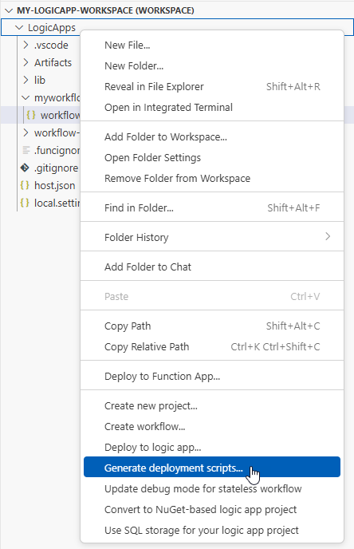
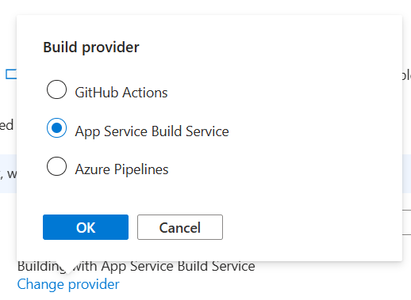
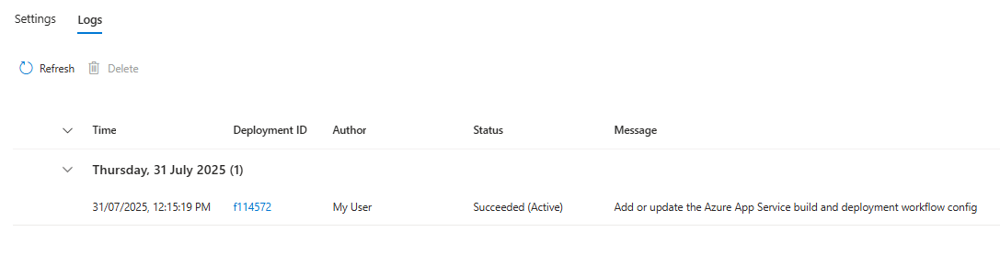

# Configure continuous deployment using Deployment Center

[!INCLUDE [logic-apps-sku-standard](../../includes/logic-apps-sku-standard.md)]

Deployment Center for Logic Apps Standard provides a streamlined and automated way to manage your application’s deployments by integrating your source code repository directly with your Logic App resource. By using Deployment Center, you can set up continuous deployment (CD) to ensure that every change committed to your repository is automatically deployed to your Logic App in Azure, enabling teams to deliver new features, fix bugs, and respond to changes more rapidly, all while maintaining control and visibility over the deployment process. Deployment Center supports multiple source control providers and seamlessly fits into modern DevOps workflows, ensuring your Logic Apps remain up to date and production-ready.

## Prerequisites

-   An Azure account and subscription. If you don't have an Azure subscription, [sign up for a free Azure account](https://azure.microsoft.com/free/?WT.mc_id=A261C142F).
-   [Visual Studio Code with the Azure Logic Apps (Standard) extension installed and their prerequisites](/azure/logic-apps/create-single-tenant-workflows-visual-studio-code#prerequisites).
-   An Azure Standard Logic Apps application with Basic Source Control Management (SCM) Authentication enabled. This application is the target of the continuous deployment process.
-   An Azure Key Vault instance, used to store connection strings and secrets.
-   A User-Assigned Managed Identity associated to the Logic Apps application, with the following role assignments:
    -   "Logic App Standard Contributor" role assigned on the Logic Apps’ resource group.
    -   "Key Vault Secrets User" role assigned on the Azure Key Vault instance.
-   A Visual Studio Code Logic Apps Standard workspace created and connected to a source control repository.

## Walkthrough

Follow these steps  to configure and use Deployment Center with Logic Apps Standard.

### Create Deployment Center scripts in Visual Studio Code

1.  In Visual Studio Code, open your **Logic Apps project** context menu and select **Generate deployment scripts…**

2.  Complete the steps, following the prompts from the wizard:
    - Select the existing Azure subscription where your Logic Apps is deployed.
    - Select the the target resource group.
    - Select the target Logic Apps application.
    - Select the associated user managed identity that has the **Logic Apps Standard Contributor** permissions.

When you're done, Visual Studio Code creates the following resources:

| Folder Name                   | File Name           | Description                                                                                                                                                                                                                                                                                                                                                         |
|-------------------------------|---------------------|---------------------------------------------------------------------------------------------------------------------------------------------------------------------------------------------------------------------------------------------------------------------------------------------------------------------------------------------------------------------|
| \<Logic Apps project folder\> | cloud.settings.json | This file copies the keys required to deploy the Logic Apps application from the local.settings.json. The file will have associated values for any nonsecret value, and a placeholder to include a keyvault reference for any secrets.                                                                                                                             |
| deployment                    | deploy.ps1          | This is the deployment script parameterized with the items you selected during the wizard. This script deploys the logic app code and update the authentication required for any Azure managed connection defined in connections.json. It also configures the settings defined in the cloud.settings.json file created in the Logic Apps project. |
|                               | README.md           | The README.md file contains instructions on how to update cloud.settings.json to safely deploy application secrets, including: Connection strings required for Service Provider connections in the project. API Management keys Azure Function keys Any other customer defined secrets.                                                                             |

Once you review the files and update cloud.settings.json with the keyvault references, push your changes to your source control.

### Configure Azure Logic Apps Standard Deployment Center in the portal

# [GitHub](#tab/github)
To configure Azure Logic Apps Standard Deployment Center with a GitHub repository, follow these steps:

1.  In the [Azure portal](https://portal.azure.com/), go to your Standard logic app resource.
2.  On the logic app menu, under **Deployment**, select **Deployment Center.**
3.  Select GitHub as source repository.
4.  Change the provider to App Service Build Service.

    

5.  Sign in to GitHub, if you aren't signed yet.
6.  Select your organization.
7.  Select your repository.
8.  Select your branch.

Scroll back to the top of the page and click **Save.**

# [Azure Repos](#tab/azure-repos)
To configure Azure Logic Apps Standard Deployment Center with an Azure Repo repository, follow these steps:

1.  In the [Azure portal](https://portal.azure.com/), go to your Standard logic app resource.
2.  On the logic app menu, under **Deployment**, select **Deployment Center.**
3.  Select Azure Repos as source repository.
4.  Change the provider to App Service Build Service.

    

5.  Select your organization
6.  Select your project
7.  Select your repository
8.  Select your branch

Scroll back to the top of the page and click **Save.**

---

Verify that your deployment worked correctly by checking the Logs tab and check if the deployment completed successfully.

