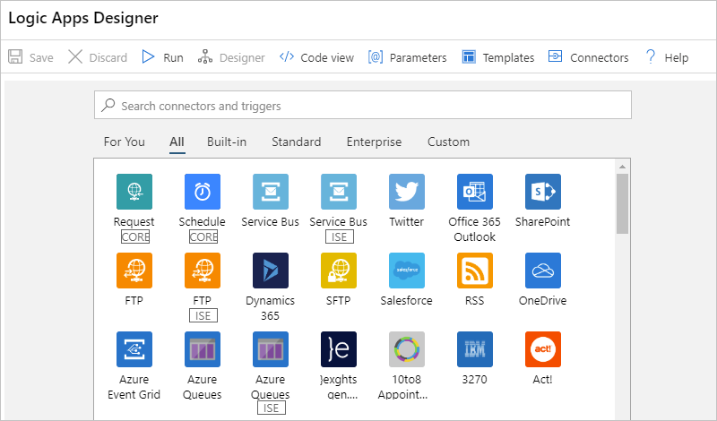
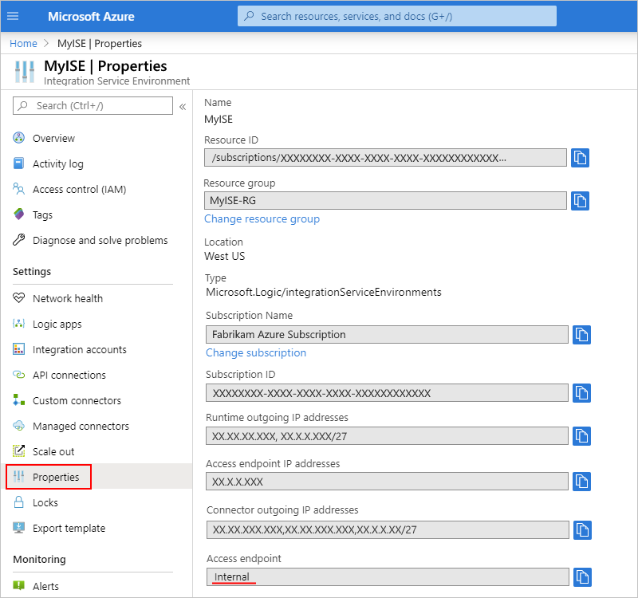

# Access to Azure Virtual Network resources from Azure Logic Apps by using integration service environments (ISEs)

Sometimes, your logic apps need access to secured resources, such as virtual machines (VMs) and other systems or services, that are inside an [Azure virtual network](../virtual-network/virtual-networks-overview.md). To set up this access, you can [create an *integration service environment* (ISE)](../logic-apps/connect-virtual-network-vnet-isolated-environment.md). An ISE is a dedicated instance of the Logic Apps service that uses dedicated resources and runs separately from the "global" multi-tenant Logic Apps service.

Running logic apps in your own separate dedicated instance helps reduce the impact that other Azure tenants might have on your apps' performance, also known as the ["noisy neighbors" effect](https://en.wikipedia.org/wiki/Cloud_computing_issues#Performance_interference_and_noisy_neighbors). An ISE also provides these benefits:

* Your own static IP addresses, which are separate from the static IP addresses that are shared by the logic apps in the multi-tenant service. You can also set up a single public, static, and predictable outbound IP address to communicate with destination systems. That way, you don't have to set up additional firewall openings at those destination systems for each ISE.

* Increased limits on run duration, storage retention, throughput, HTTP request and response timeouts, message sizes, and custom connector requests. For more information, see [Limits and configuration for Azure Logic Apps](logic-apps-limits-and-config.md).

> [!NOTE]
> Some Azure virtual networks use private endpoints ([Azure Private Link](../private-link/private-link-overview.md)) 
> for providing access to Azure PaaS services, such as Azure Storage, Azure Cosmos DB, or Azure SQL Database, 
> partner services, or customer services that are hosted on Azure. If your logic apps need access to virtual 
> networks that use private endpoints, you must create, deploy, and run those logic apps inside an ISE.

When you create an ISE, Azure *injects* or deploys that ISE into your Azure virtual network. You can then use this ISE as the location for the logic apps and integration accounts that need access.

Logic apps can access resources that are inside or connected to your virtual network by using these items, which run in the same ISE as your logic apps:

* A **CORE**-labeled built-in trigger or action, such as the HTTP trigger or action
* An **ISE**-labeled connector for that system or service
* A custom connector

You can still also use connectors that don't have the **CORE** or **ISE** label with the logic apps in your ISE. These connectors run in the multi-tenant Logic Apps service instead. For more information, see these sections:

* [Dedicated versus multi-tenant](#difference)
* [Connect from an integration service environment](../connectors/apis-list.md#integration-service-environment)
* [ISE connectors](../connectors/apis-list.md#ise-connectors)

> [!IMPORTANT]
> Logic apps, built-in triggers, built-in actions, and connectors that run in 
> your ISE use a pricing plan that differs from the consumption-based pricing plan. 
> For more information, see [Logic Apps pricing model](../logic-apps/logic-apps-pricing.md#fixed-pricing). 
> For pricing details, see [Logic Apps pricing](../logic-apps/logic-apps-pricing.md).

This overview describes more information about how an ISE gives your logic apps direct access to your Azure virtual network and compares the differences between an ISE and the multi-tenant Logic Apps service.

## Dedicated versus multi-tenant

When you create and run logic apps in an ISE, you get the same user experiences and similar capabilities as the multi-tenant Logic Apps service. You can use all the same built-in triggers, actions, and managed connectors that are available in the multi-tenant Logic Apps service. Some managed connectors offer additional ISE versions. The difference between ISE connectors and non-ISE connectors exist in where they run and the labels that they have in the Logic App Designer when you work within an ISE.

* Built-in triggers and actions display the **CORE** label. They always run in the same ISE as your logic app. Managed connectors that display the **ISE** label also run in the same ISE as your logic app.

  For example, here are some connectors that offer ISE versions:

  * Azure Blob Storage, File Storage, and Table Storage
  * Azure Queues, Azure Service Bus, Azure Event Hubs, and IBM MQ
  * FTP and SFTP-SSH
  * SQL Server, Azure SQL Data Warehouse, Azure Cosmos DB
  * AS2, X12, and EDIFACT

* Managed connectors that don't display any additional labels always run in the multi-tenant Logic Apps service, but you can still use these connectors in an ISE-hosted logic app.

### Access to on-premises systems

To access on-premises systems or data sources that are connected to an Azure virtual network, logic apps in an ISE can use these items:

* HTTP action

* ISE-labeled connector for that system

  > [!NOTE]
  > To use Windows authentication with the SQL Server connector in an 
  > [integration service environment (ISE)](../logic-apps/connect-virtual-network-vnet-isolated-environment-overview.md), 
  > use the connector's non-ISE version with the [on-premises data gateway](../logic-apps/logic-apps-gateway-install.md). 
  > The ISE-labeled version doesn't support Windows authentication.

* Custom connector

  * If you have custom connectors that require the on-premises data gateway, and you created those connectors outside an ISE, logic apps in an ISE can also use those connectors.

  * Custom connectors created in an ISE don't work with the on-premises data gateway. However, these connectors can directly access on-premises data sources that are connected to the virtual network hosting the ISE. So, logic apps in an ISE most likely don't need the data gateway when communicating with those resources.

For on-premises systems that aren't connected to a virtual network or don't have ISE-labeled connectors, you must first [set up the on-premises data gateway](../logic-apps/logic-apps-gateway-install.md) before your logic apps can connect to those systems.

## ISE SKUs

When you create your ISE, you can select the Developer SKU or Premium SKU. Here are the differences between these SKUs:

* **Developer**

  Provides a lower-cost ISE that you can use for experimentation, development, and testing, but not for production or performance testing. The Developer SKU includes built-in triggers and actions, Standard connectors, Enterprise connectors, and a single [Free tier](../logic-apps/logic-apps-limits-and-config.md#artifact-number-limits) integration account for a fixed monthly price. However, this SKU doesn't include any service-level agreement (SLA), options for scaling up capacity, or redundancy during recycling, which means that you might experience delays or downtime.

* **Premium**

  Provides an ISE that you can use for production and includes SLA support, built-in triggers and actions, Standard connectors, Enterprise connectors, a single [Standard tier](../logic-apps/logic-apps-limits-and-config.md#artifact-number-limits) integration account, options for scaling up capacity, and redundancy during recycling for a fixed monthly price.

> [!IMPORTANT]
> The SKU option is available only at ISE creation and can't be changed later.

For pricing rates, see [Logic Apps pricing](https://azure.microsoft.com/pricing/details/logic-apps/). To learn how pricing and billing work for ISEs, see the [Logic Apps pricing model](../logic-apps/logic-apps-pricing.md#fixed-pricing).

## ISE endpoint access

When you create your ISE, you can choose to use either internal or external access endpoints. Your selection determines whether request or webhook triggers on logic apps in your ISE can receive calls from outside your virtual network. These endpoints also affect the way that you can access the inputs and outputs from your logic apps' runs history.

> [!IMPORTANT]
> You can select the access endpoint only during ISE creation and can't change this option later.

* **Internal**: Private endpoints permit calls to logic apps in your ISE where you can view and access inputs and outputs from logic apps' runs history *only from inside your virtual network*. Make sure that you have network connectivity between the private endpoints and the computer from where you want to access runs history. For example, your client computer can exist inside the ISE's virtual network or inside a virtual network that's connected to the ISE's virtual network, for example, through peering or a virtual private network.

* **External**: Public endpoints permit calls to logic apps in your ISE where you can view and access inputs and outputs from logic apps' runs history *from outside your virtual network*. If you use network security groups (NSGs), make sure they're set up with inbound rules to allow access to the run history's inputs and outputs. For more information, see [Enable access for ISE](../logic-apps/connect-virtual-network-vnet-isolated-environment.md#enable-access).

To determine whether your ISE uses an internal or external access endpoint, on your ISE's menu, under **Settings**, select **Properties**, and find the **Access endpoint** property:

## Integration accounts with ISE

You can use integration accounts with logic apps inside an integration service environment (ISE). However, those integration accounts must use the *same ISE* as the linked logic apps. Logic apps in an ISE can reference only those integration accounts that are in the same ISE. When you create an integration account, you can select your ISE as the location for your integration account. To learn how pricing and billing work for integration accounts with an ISE, see the [Logic Apps pricing model](../logic-apps/logic-apps-pricing.md#fixed-pricing). For pricing rates, see [Logic Apps pricing](https://azure.microsoft.com/pricing/details/logic-apps/).

## Next steps

* [Connect to Azure virtual networks from Azure Logic Apps](../logic-apps/connect-virtual-network-vnet-isolated-environment.md)
* Learn more about [Azure Virtual Network](../virtual-network/virtual-networks-overview.md)
* Learn about [virtual network integration for Azure services](../virtual-network/virtual-network-for-azure-services.md)
