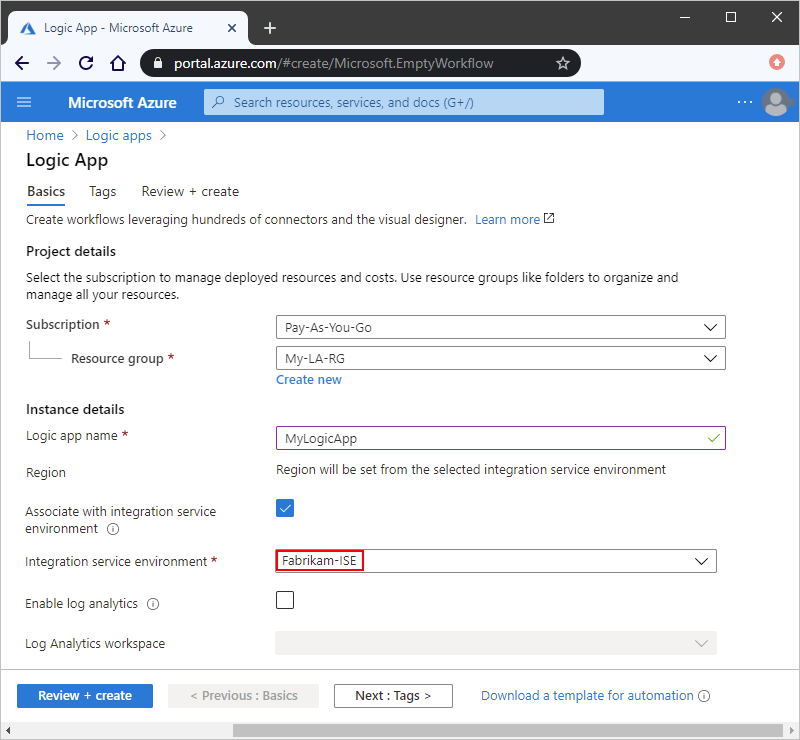
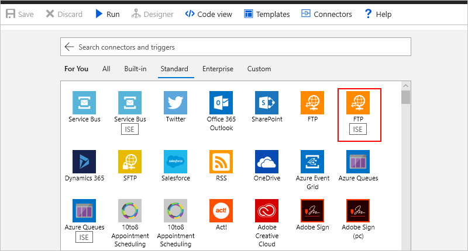

# Access to Azure Virtual Network resources from Azure Logic Apps by using integration service environments (ISEs)

Sometimes, your logic apps and integration accounts need access to secured resources, 
such as virtual machines (VMs) and other systems or services, that are inside an 
[Azure virtual network](../virtual-network/virtual-networks-overview.md). 
To set up this access, you can 
[create an *integration service environment* (ISE)](../logic-apps/connect-virtual-network-vnet-isolated-environment.md) 
where you can run your logic apps and create your integration accounts.

When you create an ISE, Azure deploys a private and isolated 
instance of the Logic Apps service into your Azure virtual network. 
This private instance uses dedicated resources such as storage, 
and runs separately from the public "global" Logic Apps service. 
Separating your isolated private instance and the public global 
instance also helps reduce the impact that other Azure tenants 
might have on your apps' performance, which is also known as the 
["noisy neighbors" effect](https://en.wikipedia.org/wiki/Cloud_computing_issues#Performance_interference_and_noisy_neighbors).

After creating your ISE, when you go to create your logic app 
or integration account, you can select your ISE as your logic 
app or integration account's location:

Your logic app can now directly access systems that are inside 
or connected to your virtual network by using any of these items:

* An **ISE**-labeled connector for that system, such as SQL Server
* A **Core**-labeled built-in trigger or action, such as the HTTP trigger or action
* A custom connector

This overview describes more details about how an ISE gives your logic apps 
and integration accounts direct access to your Azure virtual network and 
compares differences between an ISE and the global Logic Apps service.

> [!NOTE]
> Logic apps, built-in triggers, built-in actions, and connectors that run in 
> your ISE use a pricing plan different from the consumption-based pricing plan. 
> For more information, see [Logic Apps pricing](../logic-apps/logic-apps-pricing.md). 
> Your ISE also has increased limits on run duration, storage retention, throughput, 
> HTTP request and response timeouts, message sizes, and custom connector requests. 
> For more information, see [Limits and configuration for Azure Logic Apps](logic-apps-limits-and-config.md).

## Isolated versus global

When you create an integrated service environment (ISE) in Azure, 
you can select the Azure virtual network where you want to *inject* your ISE. 
Azure then injects, or deploys, a private instance of the Logic Apps service 
into your virtual network. This action creates an isolated environment where 
you can create and run your logic apps on dedicated resources. When you create 
your logic app, you select your ISE as your app's location, which gives your 
logic app direct access to your virtual network and the resources in that network.

Logic apps in an ISE provide the same user experiences and similar capabilities 
as the global Logic Apps service. Not only can you use the same built-in triggers, 
built-in actions, and connectors from the global Logic Apps service, but you can 
also use ISE-specific connectors. For example, here's some Standard connectors 
that offer versions that run in an ISE:

* Azure Blob Storage, File Storage, and Table Storage
* Azure Queues, Azure Service Bus, Azure Event Hubs, and IBM MQ
* FTP and SFTP-SSH
* SQL Server, SQL Data Warehouse, Azure Cosmos DB
* AS2, X12, and EDIFACT

The difference between ISE and non-ISE connectors is 
in the locations where the triggers and actions run:

* In your ISE, built-in triggers and actions, 
such as HTTP, always run in the same ISE as 
your logic app and display the **Core** label.

  

* Connectors that run in an ISE have publicly hosted versions 
available in the global Logic Apps service. For connectors that 
offer two versions, connectors with the **ISE** label always run 
in the same ISE as your logic app. Connectors without the **ISE** 
label run in the global Logic Apps service.

  

An ISE also provides increased limits for run duration, storage retention, throughput, HTTP request and response timeouts, message sizes, and custom connector requests. For more information, see [Limits and configuration for Azure Logic Apps](logic-apps-limits-and-config.md).

### Access to on-premises data sources

For on-premises systems that are connected to an Azure virtual network, 
inject an ISE into that network so your logic apps can directly access 
those systems by using any of these items:

* ISE-version connector for that system, for example, SQL Server
* HTTP action
* Custom connector

  * If you have custom connectors that require the on-premises 
  data gateway, and you created those connectors outside an ISE, 
  logic apps in an ISE can also use those connectors.
  
  * Custom connectors created in an ISE don't work with the 
  on-premises data gateway. However, these connectors can 
  directly access on-premises data sources that are connected 
  to the virtual network hosting the ISE. So, logic apps in an 
  ISE most likely don't need the data gateway when communicating 
  with those resources.

For on-premises systems that aren't connected to a virtual 
network or don't have ISE-version connectors, you must first 
[set up the on-premises data gateway](../logic-apps/logic-apps-gateway-install.md) 
before your logic apps can connect to those systems.

## Integration accounts with ISE

You can use integration accounts with logic apps inside an 
integration service environment (ISE). However, those integration 
accounts must use the *same ISE* as the linked logic apps. 
Logic apps in an ISE can reference only those integration accounts 
that are in the same ISE. When you create an integration account, 
you can select your ISE as the location for your integration account.

## Next steps

* Learn how to [connect to Azure virtual networks from isolated logic apps](../logic-apps/connect-virtual-network-vnet-isolated-environment.md)
* Learn more about [Azure Virtual Network](../virtual-network/virtual-networks-overview.md)
* Learn about [virtual network integration for Azure services](../virtual-network/virtual-network-for-azure-services.md)
