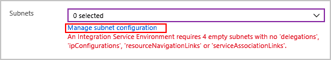
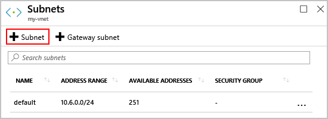
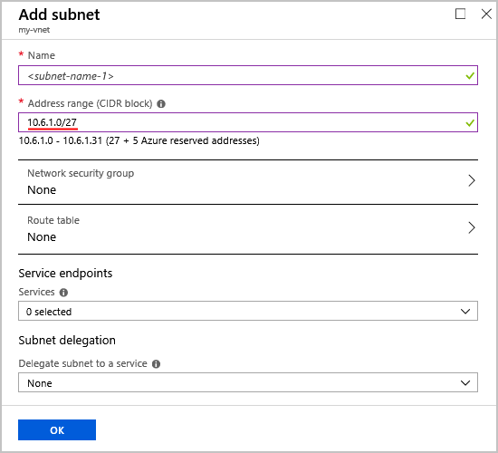

# Connect to Azure virtual networks from Azure Logic Apps by using an integration service environment (ISE)

> [!NOTE]
> This capability is in 
> [*public preview*](https://azure.microsoft.com/support/legal/preview-supplemental-terms/).

For scenarios where your logic apps and integration accounts need access to an 
[Azure virtual network](../virtual-network/virtual-networks-overview.md), create an 
[*integration service environment* (ISE)](../logic-apps/connect-virtual-network-vnet-isolated-environment-overview.md). 
An ISE is a private and isolated environment that uses dedicated storage and other 
resources that are kept separate from the public or "global" Logic Apps service. 
This separation also reduces any impact that other Azure tenants might have on your 
apps' performance. Your ISE is *injected* into to your Azure virtual network, 
which then deploys the Logic Apps service into your virtual network. When you create 
a logic app or integration account, select this ISE as their location. Your logic 
app or integration account can then directly access resources, such as virtual machines (VMs), 
servers, systems, and services, in your virtual network.

This article shows how to complete these tasks:

* Set up ports on your Azure virtual network so traffic 
can travel through your integration service environment 
(ISE) across subnets in your virtual network.

* Create your integration service environment (ISE).

* Create a logic app that can run in your ISE.

* Create an integration account for your logic apps in your ISE.

For more information about integration service environments, see 
[Access to Azure Virtual Network resources from Azure Logic Apps](../logic-apps/connect-virtual-network-vnet-isolated-environment-overview.md).

## Prerequisites

* An Azure subscription. If you don't have an Azure subscription, 
<a href="https://azure.microsoft.com/free/" target="_blank">sign up for a free Azure account</a>.

  > [!IMPORTANT]
  > Logic apps, built-in actions, and connectors that run in your ISE use 
  > a different pricing plan, not the consumption-based pricing plan. 
  > For more information, see [Logic Apps pricing](../logic-apps/logic-apps-pricing.md).

* An [Azure virtual network](../virtual-network/virtual-networks-overview.md). 
If you don't have a virtual network, learn how to 
[create an Azure virtual network](../virtual-network/quick-create-portal.md). 

  * Your virtual network must have four *empty* subnets for deploying and 
  creating resources in your ISE. You can create these subnets in advance, 
  or you can wait until you create your ISE where you can create subnets 
  at the same time. Learn more about [subnet requirements](#create-subnet). 
  
    > [!NOTE]
    > If you use [ExpressRoute](../expressroute/expressroute-introduction.md), 
    > which provides a private connection to Microsoft cloud services, you must 
    > [create a route table](../virtual-network/manage-route-table.md) that has 
    > the following route and link that table with each subnet used by your ISE:
    > 
    > **Name**: <*route-name*> 
    > **Address prefix**: 0.0.0.0/0 
    > **Next hop**: Internet

  * Make sure that your virtual network [makes these ports available](#ports) 
  so your ISE works correctly and stays accessible.

* If you want to use custom DNS servers for your Azure virtual network, 
[set up those servers by following these steps](../virtual-network/virtual-networks-name-resolution-for-vms-and-role-instances.md) 
before you deploy your ISE to your virtual network. Otherwise, 
each time you change your DNS server, you also have to restart your ISE, 
which is a capability that's available with ISE public preview.

* Basic knowledge about 
[how to create logic apps](../logic-apps/quickstart-create-first-logic-app-workflow.md)

## Set up network ports

To work correctly and stay accessible, your integration 
service environment (ISE) needs to have specific ports 
available on your virtual network. Otherwise, if any of 
these ports are unavailable, you might lose access to your 
ISE, which might stop working. When you use an ISE in a 
virtual network, a common setup problem is having one 
or more blocked ports. For connections between your ISE 
and the destination system, the connector you use might 
also have its own port requirements. For example, if you 
communicate with an FTP system by using the FTP connector, 
make sure the port you use on that FTP system, 
such as port 21 for sending commands, is available.

To control the traffic across the virtual network's 
subnets where you deploy your ISE, you can set up 
[network security groups](../virtual-network/security-overview.md) for those subnets by 
[filtering network traffic across subnets](../virtual-network/tutorial-filter-network-traffic.md). 
These tables describe the ports in your virtual network 
that your ISE uses and where those ports get used. 
The [Resource Manager service tags](../virtual-network/security-overview.md#service-tags) 
represents a group of IP address prefixes that help 
minimize complexity when creating security rules.

> [!IMPORTANT]
> For internal communication inside your subnets, 
> ISE requires that you open all ports within those subnets.

| Purpose | Direction | Ports | Source service tag | Destination service tag | Notes |
|---------|-----------|-------|--------------------|-------------------------|-------|
| Communication from Azure Logic Apps | Outbound | 80 & 443 | VirtualNetwork | Internet | The port depends on the external service with which the Logic Apps service communicates |
| Azure Active Directory | Outbound | 80 & 443 | VirtualNetwork | AzureActiveDirectory | |
| Azure Storage dependency | Outbound | 80 & 443 | VirtualNetwork | Storage | |
| Intersubnet communication | Inbound & Outbound | 80 & 443 | VirtualNetwork | VirtualNetwork | For communication between subnets |
| Communication to Azure Logic Apps | Inbound | 443 | Internet  | VirtualNetwork | The IP address for the computer or service that calls any request trigger or webhook that exists in your logic app. Closing or blocking this port prevents HTTP calls to logic apps with request triggers.  |
| Logic app run history | Inbound | 443 | Internet  | VirtualNetwork | The IP address for the computer from which you view the logic app's run history. Although closing or blocking this port doesn't prevent you from viewing the run history, you can't view the inputs and outputs for each step in that run history. |
| Connection management | Outbound | 443 | VirtualNetwork  | Internet | |
| Publish Diagnostic Logs & Metrics | Outbound | 443 | VirtualNetwork  | AzureMonitor | |
| Communication from Azure Traffic Manager | Inbound | 443 | AzureTrafficManager | VirtualNetwork | |
| Logic Apps Designer - dynamic properties | Inbound | 454 | Internet  | VirtualNetwork | Requests come from the Logic Apps [access endpoint inbound IP addresses in that region](../logic-apps/logic-apps-limits-and-config.md#inbound). |
| App Service Management dependency | Inbound | 454 & 455 | AppServiceManagement | VirtualNetwork | |
| Connector deployment | Inbound | 454 & 3443 | Internet  | VirtualNetwork | Necessary for deploying and updating connectors. Closing or blocking this port causes ISE deployments to fail and prevents connector updates or fixes. |
| Azure SQL dependency | Outbound | 1433 | VirtualNetwork | SQL |
| Azure Resource Health | Outbound | 1886 | VirtualNetwork | Internet | For publishing health status to Resource Health |
| API Management - management endpoint | Inbound | 3443 | APIManagement  | VirtualNetwork | |
| Dependency from Log to Event Hub policy and monitoring agent | Outbound | 5672 | VirtualNetwork  | EventHub | |
| Access Azure Cache for Redis Instances between Role Instances | Inbound  Outbound | 6379-6383 | VirtualNetwork  | VirtualNetwork | Also, for ISE to work with Azure Cache for Redis, you must open these [outbound and inbound ports described in the Azure Cache for Redis FAQ](../azure-cache-for-redis/cache-how-to-premium-vnet.md#outbound-port-requirements). |
| Azure Load Balancer | Inbound | * | AzureLoadBalancer | VirtualNetwork |  |
||||||

## Create your ISE

To create your integration service environment (ISE), 
follow these steps:

1. In the [Azure portal](https://portal.azure.com), 
on the main Azure menu, select **Create a resource**.

   

1. In the search box, enter "integration service environment" as your filter.
From the results list, select **Integration Service Environment (preview)**, 
and then choose **Create**.

   

   

1. Provide these details for your environment, 
and then choose **Review + create**, for example:

   

   | Property | Required | Value | Description |
   |----------|----------|-------|-------------|
   | **Subscription** | Yes | <*Azure-subscription-name*> | The Azure subscription to use for your environment |
   | **Resource group** | Yes | <*Azure-resource-group-name*> | The Azure resource group where you want to create your environment |
   | **Integration Service Environment Name** | Yes | <*environment-name*> | The name to give your environment |
   | **Location** | Yes | <*Azure-datacenter-region*> | The Azure datacenter region where to deploy your environment |
   | **Additional capacity** | Yes | 0, 1, 2, 3 | The number of processing units to use for this ISE resource. To add capacity after creation, see [Add capacity](#add-capacity). |
   | **Virtual network** | Yes | <*Azure-virtual-network-name*> | The Azure virtual network where you want to inject your environment so logic apps in that environment can access your virtual network. If you don't have a network, you can create one here. 
**Important**: You can *only* perform this injection when you create your ISE. However, before you can create this relationship, make sure you already set up role-based access control in your virtual network for Azure Logic Apps. |
   | **Subnets** | Yes | <*subnet-resource-list*> | An ISE requires four *empty* subnets for creating resources in your environment. To create each subnet, [follow the steps under this table](#create-subnet).  |
   |||||

   

   **Create subnet**

   To create resources in your environment, your ISE needs 
   four *empty* subnets that aren't delegated to any service. 
   You *can't* change these subnet addresses after you create 
   your environment. Each subnet must meet these criteria:

   * Has a name that starts with an alphabetic character or an underscore, 
   and doesn't have these characters: `<`, `>`, `%`, `&`, `\\`, `?`, `/`

   * Uses the [Classless Inter-Domain Routing (CIDR) format](https://en.wikipedia.org/wiki/Classless_Inter-Domain_Routing) and a Class B address space.

   * Uses at least a `/27` in the address space because each subnet 
   must have 32 addresses as the *minimum*. For example:

     * `10.0.0.0/27` has 32 addresses because 2(32-27) is 25 or 32.

     * `10.0.0.0/24` has 256 addresses because 2(32-24) is 28 or 256.

     * `10.0.0.0/28` has only 16 addresses and is too small because 2(32-28) 
     is 24 or 16.

     To learn more about calculating addresses, see 
     [IPv4 CIDR blocks](https://en.wikipedia.org/wiki/Classless_Inter-Domain_Routing#IPv4_CIDR_blocks).

   * If you use [ExpressRoute](../expressroute/expressroute-introduction.md), 
   remember to [create a route table](../virtual-network/manage-route-table.md) 
   that has the following route and link that table with each subnet used by your ISE:

     **Name**: <*route-name*> 
     **Address prefix**: 0.0.0.0/0 
     **Next hop**: Internet

   1. Under the **Subnets** list, choose **Manage subnet configuration**.

      

   1. On the **Subnets** pane, choose **Subnet**.

      

   1. On the **Add subnet** pane, provide this information.

      * **Name**: The name for your subnet
      * **Address range (CIDR block)**: Your subnet's 
      range in your virtual network and in CIDR format

      

   1. When you're done, choose **OK**.

   1. Repeat these steps for three more subnets.

1. After Azure successfully validates your ISE information, 
choose **Create**, for example:

   

   Azure starts deploying your environment, but this 
   process *might* take up to two hours before finishing. 
   To check deployment status, on your Azure toolbar, 
   choose the notifications icon, which opens the notifications pane.

   

   If deployment finishes successfully, 
   Azure shows this notification:

   

   > [!NOTE]
   > If deployment fails or you delete your ISE, 
   > Azure *might* take up to an hour before 
   > releasing your subnets. So, you might 
   > have to wait before reusing those 
   > subnets in another ISE.

1. To view your environment, choose **Go to resource** if Azure 
doesn't automatically go to your environment after deployment finishes.  

### Add capacity

Your ISE base unit has fixed capacity, so if you 
need more throughput, you can add more scale units. 
You can autoscale based on performance metrics or 
based on a number of processing units. If you choose 
autoscaling based on metrics, you can choose from 
various criteria and specify the threshold 
conditions for meeting that criteria.

1. In the Azure portal, find your ISE.

1. To view performance metrics for your ISE, 
on your ISE's main menu, choose **Overview**.

1. To set up autoscaling, under **Settings**, 
select **Scale out**. On the **Configure** tab, 
choose **Enable autoscale**.

1. In the **Default** section, choose either 
**Scale based on a metric** or 
**Scale to a specific instance count**.

1. If you choose instance-based, enter the number of 
processing units between 0 and 3 inclusively. 
Otherwise, for metric-based, follow these steps:

   1. In the **Default** section, choose **Add a rule**.

   1. On the **Scale rule** pane, set up your criteria 
   and action to take when the rule triggers.

   1. When you're done, choose **Add**.

1. When you're finished, remember to save your changes.

## Create logic app - ISE

To create logic apps that use your integration 
service environment (ISE), follow the steps in 
[how to create a logic app](../logic-apps/quickstart-create-first-logic-app-workflow.md) 
but with these differences: 

* When you create your logic app, under the **Location** property, 
select your ISE from the **Integration service environments** section, 
for example:

  

* You can use the same built-in triggers and actions such as HTTP, 
which run in the same ISE as your logic app. Connectors with 
the **ISE** label also run in the same ISE as your logic app. 
Connectors without the **ISE** label run in the global Logic Apps service.

  

* After you inject your ISE into an Azure virtual network, 
the logic apps in your ISE can directly access resources in that virtual network. 
For on-premises systems that are connected to a virtual network, 
inject an ISE into that network so your logic apps can directly 
access those systems by using any of these items: 

  * ISE connector for that system, for example, SQL Server
  
  * HTTP action 
  
  * Custom connector

  For on-premises systems that aren't in a virtual 
  network or don't have ISE connectors, first 
  [set up the on-premises data gateway](../logic-apps/logic-apps-gateway-install.md).

## Create integration account - ISE

To use an integration account with logic apps in an 
integration service environment (ISE), that integration 
account must use the *same environment* as the logic apps. 
Logic apps in an ISE can reference only integration 
accounts in the same ISE. 

To create an integration account that uses an ISE, follow the steps in 
[how to create integration accounts](../logic-apps/logic-apps-enterprise-integration-create-integration-account.md) 
except for the **Location** property where the 
**Integration service environments** section now appears. 
Instead, select your ISE, rather than a region, for example:

## Get support

* For questions, visit the <a href="https://social.msdn.microsoft.com/Forums/en-US/home?forum=azurelogicapps" target="_blank">Azure Logic Apps forum</a>.
* To submit or vote on feature ideas, visit the <a href="https://aka.ms/logicapps-wish" target="_blank">Logic Apps user feedback site</a>.

## Next steps

* Learn more about [Azure Virtual Network](../virtual-network/virtual-networks-overview.md)
* Learn about [virtual network integration for Azure services](../virtual-network/virtual-network-for-azure-services.md)
