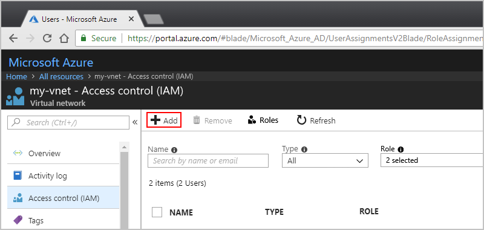
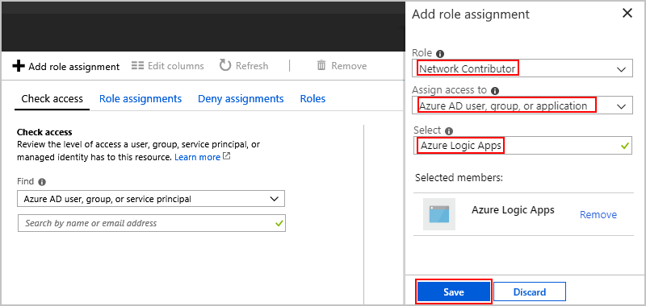
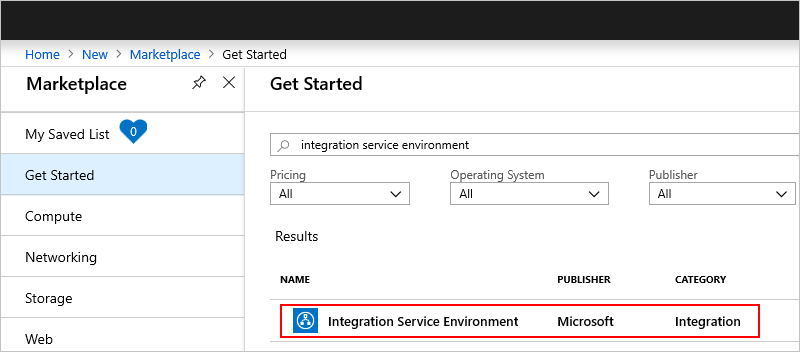
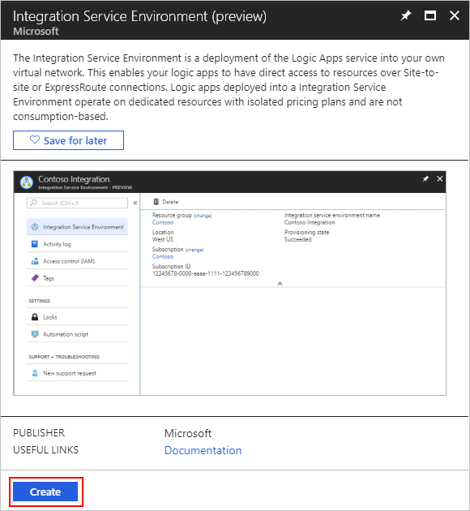
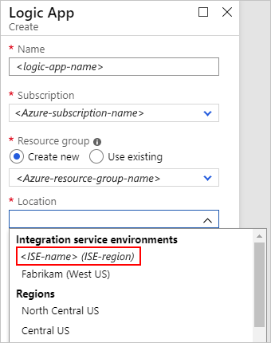
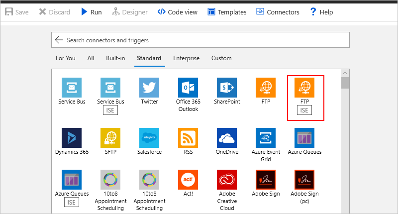
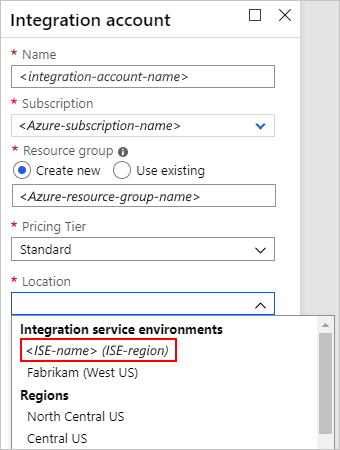

# Create isolated environments to access Azure Virtual Networks (VNETs) from Azure Logic Apps

> [!NOTE]
> To try this capability, which is in *private preview*, 
> [learn how to sign up for access]. 

For integration scenarios where your logic apps and integration accounts need access to an 
[Azure virtual network (VNET)](../virtual-network/virtual-networks-overview.md), 
you can create an *integration service environment* (ISE) that links to your VNET 
and deploys the Logic Apps service into your VNET. When you create logic apps and 
integration accounts, you select this ISE as their location. Your logic apps and 
integration accounts can then directly access resources, such as virtual machines (VMs), 
servers, systems, and services, in your VNET. 

Your ISE is a private and isolated environment that uses dedicated storage and other 
resources that exist separately from the public or *global* Logic Apps service. 
This separation also helps reduce any impact other Azure tenants might have on your 
apps' performance. 

This article shows how to perform these tasks:

* Set up permissions on your Azure VNET so the 
private Logic Apps instance can access your VNET.

* Create your integration service environment (ISE). 

* Create a logic app that can run in your ISE. 

* Create an integration account for your logic apps in your ISE.

For more information about integration service environments, see 
[Overview: Access to Azure Virtual Network (VNET) resources from isolated Azure Logic Apps](connect-virtual-network-vnet-isolated-environment-overview.md).

## Prerequisites

* An Azure subscription. If you don't have an Azure subscription, 
<a href="https://azure.microsoft.com/free/" target="_blank">sign up for a free Azure account</a>. 

* If you don't have an Azure VNET, learn how to 
[create an Azure virtual network](../virtual-network/quick-create-portal.md). 

  > [!IMPORTANT]
  > While you don't need an Azure VNET for creating your environment, 
  > you can *only* select a VNET as your environment's peer when you 
  > create that environment. 

* To give your logic apps direct access to your Azure VNET, 
[set up Role-Based Access Control (RBAC) permissions](#vnet-access) 
so the Logic Apps service has the permissions for accessing your VNET. 

* Basic knowledge about 
[how to create logic apps](../logic-apps/quickstart-create-first-logic-app-workflow.md)

## Set up VNET permissions

When you create your integration service environment, 
you can select an Azure virtual network (VNET) as a *peer* 
for your environment. However, you can only perform this step, 
or *peering*, when you create your environment. 
This relationship lets the Logic Apps service 
connect directly to resources in that VNET and 
gives your environment access to those resources. 

Before you can select your VNET, you must set up 
Role-Based Access Control (RBAC) permissions in your VNET. 
To complete this task, you must assign specific roles 
to the Azure Logic Apps service.

1. In the [Azure portal](https://portal.azure.com), 
find and select your VNET. On your VNET's menu, 
select **Access control (IAM)**. 

1. Under **Access Control**, select **Role assignment** 
if not already selected. On the **Role assignment** toolbar, 
choose **Add**. 

   

1. On the **Add permissions** pane, set up each role in this 
table for the Azure Logic Apps service. Make sure you choose 
**Save** after you finish each role:

   | Role | Assign access to | Select | 
   |------|------------------|--------|
   | **Network Contributor** | **Azure AD user, group, or application** | Enter **Azure Logic Apps**. After the member list appears, select the same value. 
**Tip**: If you can't find this service, enter the Logic Apps service's app ID: `7cd684f4-8a78-49b0-91ec-6a35d38739ba` | 
   | **Classic Contributor** | **Azure AD user, group, or application** | Enter **Azure Logic Apps**. After the member list appears, select the same value. 
**Tip**: If you can't find this service, enter the Logic Apps service's app ID: `7cd684f4-8a78-49b0-91ec-6a35d38739ba` | 
   |||| 

   For example:

   

For more information about the role permissions required for peering, see the 
[Permissions section in Create, change, or delete a virtual network peering](../virtual-network/virtual-network-manage-peering.md#permissions).

## Create your ISE

To create your integration service environment (ISE), 
follow these steps:

1. In the [Azure portal](https://portal.azure.com), 
on the main Azure menu, select **Create a resource**.

   

1. In the search box, enter "integration service environment" as your filter.
From the results list, select **Integration Service Environment (preview)**, 
and then choose **Create**.

   

   

1. Provide these details for your environment:

   

   | Property | Required | Value | Description |
   |----------|----------|-------|-------------|
   | **Name** | Yes | <*environment-name*> | The name to give your environment | 
   | **Subscription** | Yes | <*Azure-subscription-name*> | The Azure subscription to use for your environment | 
   | **Resource group** | Yes | <*Azure-resource-group-name*> | The Azure resource group where you want to create your environment |
   | **Location** | Yes | <*Azure-datacenter-region*> | The Azure datacenter region where to store information about your environment |
   | **Peer VNET** | No | <*Azure-VNET-name*> | The Azure virtual network (VNET) to associate with your environment as a *peer* so logic apps in that environment can access your VNET. Before you can create this relationship, make sure you already [set up role-based access control in your VNET for Azure Logic Apps](#vnet-access). 
**Important**: Although a VNET isn't required, you can select a VNET *only* when you create your environment. | 
   | **Peering Name** | Yes with a selected VNET | <*peering-name*> | The name to give the peer relationship | 
   | **VNET IP Range** | Yes with a selected VNET | <*IP-address-range*> | The IP address range to use for creating resources in your environment. This range must use the [Classless Inter-Domain Routing (CIDR) format](https://en.wikipedia.org/wiki/Classless_Inter-Domain_Routing), for example, 10.0.0.1/16, and requires a Class B address space. The range must not exist within the address space for the VNET selected in the **Peer VNET** property, nor within any other private IP addresses where the peer network is connected, either through peering or gateways. 

**Important**: You *can't change* this address range after you create your environment. |
   |||||
   
1. When you're done, choose **Create**. 

   Azure starts deploying your environment, but this 
   process might take *up to two hours* before finishing. 
   To check deployment status, on your Azure toolbar, 
   choose the notifications icon, which opens the notifications pane.

   

   When deployment finishes successfully, Azure shows this notification:

   

1. To view your environment, choose **Go to resource** if Azure 
doesn't automatically go to your environment after deployment finishes.  

## Create logic app with ISE

To create logic apps that use your integration service environment (ISE), 
follow the usual steps in [how to create a logic app](../logic-apps/quickstart-create-first-logic-app-workflow.md) 
but with these differences and considerations: 

* When you create your logic app, the **Location** property 
lists your ISEs under **Integration service environments** 
along with available regions. Select your ISE, rather than a region, 
for example:

  

* If you previously set up your ISE with an Azure VNET as a peer, 
the logic apps in your ISE can directly access resources in that VNET. 
However, to access on-premises systems, you still have to 
[set up an on-premises data gateway](../logic-apps/logic-apps-gateway-install.md).

* You can use the same built-ins, such as the HTTP trigger or action, 
which run in the same ISE as the parent logic app. Connectors with 
the **ISE** label also run in the same ISE as the parent logic app. 
Connectors without the **ISE** label run in the global Logic Apps service.

  

## Create integration account with ISE

To use an integration account with logic apps in an 
integration service environment (ISE), that integration 
account must use the *same environment* as the logic apps. 
Logic apps in an ISE can reference only integration 
accounts in the same ISE. 

To create an integration account that uses an ISE, follow the usual steps in 
[how to create integration accounts](../logic-apps/logic-apps-enterprise-integration-create-integration-account.md) 
except for the **Location** property, which now lists 
your ISEs under **Integration service environments** 
along with available regions. Select your ISE, 
rather than a region, for example:

## Get support

* For questions, visit the <a href="https://social.msdn.microsoft.com/Forums/en-US/home?forum=azurelogicapps" target="_blank">Azure Logic Apps forum</a>.
* To submit or vote on feature ideas, visit the <a href="http://aka.ms/logicapps-wish" target="_blank">Logic Apps user feedback site</a>.

## Next steps

* Learn more about [Azure Virtual Network](../virtual-network/virtual-networks-overview.md)
* Learn about [virtual network integration for Azure services](../virtual-network/virtual-network-for-azure-services.md)
