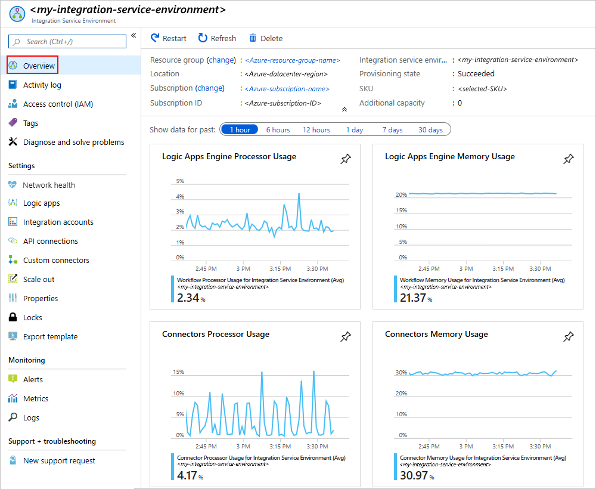
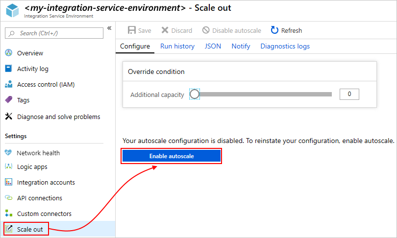

# Connect to Azure virtual networks from Azure Logic Apps by using an integration service environment (ISE)

For scenarios where your logic apps and integration accounts need access to an [Azure virtual network](../virtual-network/virtual-networks-overview.md), create an [*integration service environment* (ISE)](../logic-apps/connect-virtual-network-vnet-isolated-environment-overview.md). An ISE is a private and isolated environment that uses dedicated storage and other resources that are kept separate from the public, "global", multi-tenant Logic Apps service. This separation also reduces any impact that other Azure tenants might have on your apps' performance. An ISE also provides you with your own static IP addresses. These IP addresses are separate from the static IP addresses that are shared by the logic apps in the public, multi-tenant service.

When you create an ISE, Azure *injects* that ISE into your Azure virtual network, which then deploys the Logic Apps service into your virtual network. When you create a logic app or integration account, select your ISE as their location. Your logic app or integration account can then directly access resources, such as virtual machines (VMs), servers, systems, and services, in your virtual network.

> [!IMPORTANT]
> For logic apps and integration accounts to work together in an ISE, 
> both must use the *same ISE* as their location.

An ISE has increased limits on run duration, storage retention, throughput, HTTP request and response timeouts, message sizes, and custom connector requests. For more information, see [Limits and configuration for Azure Logic Apps](logic-apps-limits-and-config.md). To learn more about ISEs, see [Access to Azure Virtual Network resources from Azure Logic Apps](../logic-apps/connect-virtual-network-vnet-isolated-environment-overview.md).

This article shows you how to complete these tasks:

* Enable access for your ISE.
* Create your ISE.
* Add extra capacity to your ISE.

> [!IMPORTANT]
> Logic apps, built-in triggers, built-in actions, and connectors that run in 
> your ISE use a pricing plan different from the consumption-based pricing plan. 
> To learn how pricing and billing work for ISEs, see the 
> [Logic Apps pricing model](../logic-apps/logic-apps-pricing.md#fixed-pricing). 
> For pricing rates, see [Logic Apps pricing](../logic-apps/logic-apps-pricing.md).

## Prerequisites

* An Azure subscription. If you don't have an Azure subscription, [sign up for a free Azure account](https://azure.microsoft.com/free/).

* An [Azure virtual network](../virtual-network/virtual-networks-overview.md). If you don't have a virtual network, learn how to [create an Azure virtual network](../virtual-network/quick-create-portal.md).

  * Your virtual network needs to have four *empty* subnets for creating and deploying resources in your ISE. Each subnet supports a different Logic Apps component for your ISE. You can create these subnets in advance, or you can wait until you create your ISE where you can create subnets at the same time. Learn more about [subnet requirements](#create-subnet).

  * Subnet names need to start with either an alphabetic character or an underscore and can't use these characters: `<`, `>`, `%`, `&`, `\\`, `?`, `/`. 
  
  * If you want to deploy the ISE through an Azure Resource Manager template, first make sure that you delegate one empty subnet to Microsoft.Logic/integrationServiceEnvironment. You don't need to do this delegation when you deploy through the Azure portal.

  * Make sure that your virtual network [enables access for your ISE](#enable-access) so that your ISE can work correctly and stay accessible.

  * If you use [ExpressRoute](../expressroute/expressroute-introduction.md), which provides a private connection to Microsoft cloud services, you must [create a route table](../virtual-network/manage-route-table.md) that has the following route and link that table to each subnet that's used by your ISE:

    **Name**: <*route-name*> 
    **Address prefix**: 0.0.0.0/0 
    **Next hop**: Internet

* If you want to use custom DNS servers for your Azure virtual network, [set up those servers by following these steps](../virtual-network/virtual-networks-name-resolution-for-vms-and-role-instances.md) before you deploy your ISE to your virtual network. Otherwise, each time you change your DNS server, you also have to restart your ISE.

  > [!IMPORTANT]
  > If you change your DNS server settings after you create an ISE, make sure that you restart your ISE. 
  > For more information about managing DNS server settings, see [Create, change, or delete a virtual network](../virtual-network/manage-virtual-network.md#change-dns-servers).

## Enable access for ISE

When you use an ISE with an Azure virtual network, a common setup problem is having one or more blocked ports. The connectors that you use for creating connections between your ISE and destination systems might also have their own port requirements. For example, if you communicate with an FTP system by using the FTP connector, the port that you use on your FTP system needs to be available, for example, port 21 for sending commands.

To make sure that your ISE is accessible and that the logic apps in that ISE can communicate across each subnet in your virtual network, [open the ports described in this table for each subnet](#network-ports-for-ise). If any required ports are unavailable, your ISE won't work correctly.

* If you have multiple ISE instances that need access to other endpoints that have IP restrictions, deploy an [Azure Firewall](../firewall/overview.md) or a [network virtual appliance](../virtual-network/virtual-networks-overview.md#filter-network-traffic) into your virtual network and route outbound traffic through that firewall or network virtual appliance. You can then [set up a single, outbound, public, static, and predictable IP address](connect-virtual-network-vnet-set-up-single-ip-address.md) that all the ISE instances in your virtual network can use to communicate with destination systems. That way, you don't have to set up additional firewall openings at those destination systems for each ISE.

   > [!NOTE]
   > You can use this approach for a single ISE when your scenario requires limiting the 
   > number of IP addresses that need access. Consider whether the additional costs for 
   > the firewall or virtual network appliance make sense for your scenario. Learn more about 
   > [Azure Firewall pricing](https://azure.microsoft.com/pricing/details/azure-firewall/).

* If you created a new Azure virtual network and subnets without any constraints, you don't need to set up [network security groups (NSGs)](../virtual-network/security-overview.md#network-security-groups) in your virtual network to control traffic across subnets.

* On an existing virtual network, you can *optionally* set up NSGs by [filtering network traffic across subnets](../virtual-network/tutorial-filter-network-traffic.md). If you choose this route, on the virtual network where you want to set up the NSGs, make sure that you [open the ports in this table](#network-ports-for-ise). If you use [NSG security rules](../virtual-network/security-overview.md#security-rules), you need both TCP and UDP protocols.

* If you have previously existing NSGs, make sure that you [open the ports in this table](#network-ports-for-ise). If you use [NSG security rules](../virtual-network/security-overview.md#security-rules), you need both TCP and UDP protocols.

### Network ports used by your ISE

This table describes the ports in your Azure virtual network that your ISE uses and where those ports get used. The [Resource Manager service tags](../virtual-network/security-overview.md#service-tags) represents a group of IP address prefixes that help minimize complexity when creating security rules.

> [!IMPORTANT]
> Source ports are ephemeral, so make sure that you set them to `*` for all rules.

| Purpose | Direction | Destination ports | Source service tag | Destination service tag | Notes |
|---------|-----------|-------------------|--------------------|-------------------------|-------|
| Intrasubnet communication | Inbound & Outbound | * | Address space for the virtual network with the ISE subnets | Address space for the virtual network with the ISE subnets | Required so that traffic can flow inside each subnet. **Important**: For communication between components inside subnets, make sure that you open all the ports within those subnets. |
| Intersubnet communication | Inbound & Outbound | 80, 443 | VirtualNetwork | VirtualNetwork | For communication between subnets |
| Communication from Azure Logic Apps | Outbound | 80, 443 | VirtualNetwork | Internet | The port depends on the external service with which the Logic Apps service communicates |
| Azure Active Directory | Outbound | 80, 443 | VirtualNetwork | AzureActiveDirectory | |
| Azure Storage dependency | Outbound | 80, 443 | VirtualNetwork | Storage | |
| Communication to Azure Logic Apps | Inbound | 443 | Internal access endpoints:  VirtualNetwork 

External access endpoints:  Internet 

**Note**: These endpoints refer to the endpoint setting that was [selected at ISE creation](connect-virtual-network-vnet-isolated-environment.md#create-environment). For more information, see [Endpoint access](../logic-apps/connect-virtual-network-vnet-isolated-environment-overview.md#endpoint-access). | VirtualNetwork | The IP address for the computer or service that calls any request triggers or webhooks in your logic app. Closing or blocking this port prevents HTTP calls to logic apps with request triggers. |
| Logic app run history | Inbound | 443 | Internal access endpoints:  VirtualNetwork 

External access endpoints:  Internet 

**Note**: These endpoints refer to the endpoint setting that was [selected at ISE creation](../logic-apps/connect-virtual-network-vnet-isolated-environment.md#create-environment). For more information, see [Endpoint access](../logic-apps/connect-virtual-network-vnet-isolated-environment-overview.md#endpoint-access). | VirtualNetwork | The IP address for the computer from where you want to view your logic app's run history. Although closing or blocking this port doesn't prevent you from viewing the run history, you can't view the inputs and outputs for each step in that run history. |
| Connection management | Outbound | 443 | VirtualNetwork  | AppService | |
| Publish Diagnostic Logs & Metrics | Outbound | 443 | VirtualNetwork  | AzureMonitor | |
| Communication from Azure Traffic Manager | Inbound | Internal access endpoints: 454 

External access endpoints: 443 | AzureTrafficManager | VirtualNetwork | |
| Logic Apps Designer - dynamic properties | Inbound | 454 | See Notes column for IP addresses to allow | VirtualNetwork | Requests come from the Logic Apps access endpoint [inbound](../logic-apps/logic-apps-limits-and-config.md#inbound) IP addresses for that region. |
| Network health check | Inbound | 454 | See Notes column for IP addresses to allow | VirtualNetwork | Requests come from the Logic Apps access endpoint for both [inbound](../logic-apps/logic-apps-limits-and-config.md#inbound) and [outbound](../logic-apps/logic-apps-limits-and-config.md#outbound) IP addresses for that region. |
| App Service Management dependency | Inbound | 454, 455 | AppServiceManagement | VirtualNetwork | |
| Connector deployment | Inbound | 454 | AzureConnectors | VirtualNetwork | Necessary for deploying and updating connectors. Closing or blocking this port causes ISE deployments to fail and prevents connector updates or fixes. |
| Connector policy deployment | Inbound | 3443 | Internet | VirtualNetwork | Necessary for deploying and updating connectors. Closing or blocking this port causes ISE deployments to fail and prevents connector updates or fixes. |
| Azure SQL dependency | Outbound | 1433 | VirtualNetwork | SQL | |
| Azure Resource Health | Outbound | 1886 | VirtualNetwork | AzureMonitor | For publishing health status to Resource Health |
| API Management - management endpoint | Inbound | 3443 | APIManagement | VirtualNetwork | |
| Dependency from Log to Event Hub policy and monitoring agent | Outbound | 5672 | VirtualNetwork | EventHub | |
| Access Azure Cache for Redis Instances between Role Instances | Inbound  Outbound | 6379-6383 | VirtualNetwork | VirtualNetwork | Also, for ISE to work with Azure Cache for Redis, you must open these [outbound and inbound ports described in the Azure Cache for Redis FAQ](../azure-cache-for-redis/cache-how-to-premium-vnet.md#outbound-port-requirements). |
| Azure Load Balancer | Inbound | * | AzureLoadBalancer | VirtualNetwork | |
||||||

## Create your ISE

To create your integration service environment (ISE), follow these steps:

1. In the [Azure portal](https://portal.azure.com), on the main Azure menu, select **Create a resource**.
In the search box, enter "integration service environment" as your filter.

   

1. On the Integration Service Environment creation pane, choose **Create**.

   

1. Provide these details for your environment, and then choose **Review + create**, for example:

   

   | Property | Required | Value | Description |
   |----------|----------|-------|-------------|
   | **Subscription** | Yes | <*Azure-subscription-name*> | The Azure subscription to use for your environment |
   | **Resource group** | Yes | <*Azure-resource-group-name*> | The Azure resource group where you want to create your environment |
   | **Integration service environment name** | Yes | <*environment-name*> | Your ISE name, which can contain only letters, numbers, hyphens (`-`), underscores (`_`), and periods (`.`). |
   | **Location** | Yes | <*Azure-datacenter-region*> | The Azure datacenter region where to deploy your environment |
   | **SKU** | Yes | **Premium** or **Developer (No SLA)** | The ISE SKU to create and use. For differences between these SKUs, see [ISE SKUs](../logic-apps/connect-virtual-network-vnet-isolated-environment-overview.md#ise-level). 

**Important**: This option is available only at ISE creation and can't be changed later. |
   | **Additional capacity** | Premium:  Yes 

Developer:  Not applicable | Premium:  0 to 10 

Developer:  Not applicable | The number of additional processing units to use for this ISE resource. To add capacity after creation, see [Add ISE capacity](#add-capacity). |
   | **Access endpoint** | Yes | **Internal** or **External** | The type of access endpoints to use for your ISE. These endpoints determine whether request or webhook triggers on logic apps in your ISE can receive calls from outside your virtual network. 

Your selection also affects the way that you can view and access inputs and outputs in your logic app runs history. For more information, see [ISE endpoint access](../logic-apps/connect-virtual-network-vnet-isolated-environment-overview.md#endpoint-access). 

**Important**: This option is available only at ISE creation and can't be changed later. |
   | **Virtual network** | Yes | <*Azure-virtual-network-name*> | The Azure virtual network where you want to inject your environment so logic apps in that environment can access your virtual network. If you don't have a network, [create an Azure virtual network first](../virtual-network/quick-create-portal.md). 
**Important**: You can *only* perform this injection when you create your ISE. |
   | **Subnets** | Yes | <*subnet-resource-list*> | An ISE requires four *empty* subnets for creating and deploying resources in your environment. To create each subnet, [follow the steps under this table](#create-subnet). |
   |||||

   

   **Create subnet**

   To create and deploy resources in your environment, your ISE needs four *empty* subnets that aren't delegated to any service. You *can't* change these subnet addresses after you create your environment.

   > [!IMPORTANT]
   > 
   > Subnet names must start with either an alphabetic character or an underscore 
   > (no numbers), and doesn't use these characters: `<`, `>`, `%`, `&`, `\\`, `?`, `/`.

   Also, each subnet must meet these requirements:

   * Uses the [Classless Inter-Domain Routing (CIDR) format](https://en.wikipedia.org/wiki/Classless_Inter-Domain_Routing) and a Class B address space.

   * Uses at least a `/27` in the address space because each subnet requires *at least* 32 addresses *minimum*. For example:

     * `10.0.0.0/27` has 32 addresses because 2(32-27) is 25 or 32.

     * `10.0.0.0/24` has 256 addresses because 2(32-24) is 28 or 256.

     * `10.0.0.0/28` has only 16 addresses and is too small because 2(32-28) is 24 or 16.

     To learn more about calculating addresses, see [IPv4 CIDR blocks](https://en.wikipedia.org/wiki/Classless_Inter-Domain_Routing#IPv4_CIDR_blocks).

   * If you use [ExpressRoute](../expressroute/expressroute-introduction.md), you have to [create a route table](../virtual-network/manage-route-table.md) that has the following route and link that table with each subnet that's used by your ISE:

     **Name**: <*route-name*> 
     **Address prefix**: 0.0.0.0/0 
     **Next hop**: Internet

   1. Under the **Subnets** list, choose **Manage subnet configuration**.

      

   1. On the **Subnets** pane, choose **Subnet**.

      

   1. On the **Add subnet** pane, provide this information.

      * **Name**: The name for your subnet
      * **Address range (CIDR block)**: Your subnet's range in your virtual network and in CIDR format

      

   1. When you're done, choose **OK**.

   1. Repeat these steps for three more subnets.

      > [!NOTE]
      > If the subnets you try to create aren't valid, the Azure portal shows a message, 
      > but doesn't block your progress.

   For more information about creating subnets, see [Add a virtual network subnet](../virtual-network/virtual-network-manage-subnet.md).

1. After Azure successfully validates your ISE information, choose **Create**, for example:

   

   Azure starts deploying your environment, which usually takes within two hours to finish. Occasionally, deployment might take up to four hours. To check deployment status, on your Azure toolbar, choose the notifications icon, which opens the notifications pane.

   

   If deployment finishes successfully, Azure shows this notification:

   

   Otherwise, follow the Azure portal instructions for troubleshooting deployment.

   > [!NOTE]
   > If deployment fails or you delete your ISE, Azure might take up to an hour 
   > before releasing your subnets. This delay means means you might have to wait 
   > before reusing those subnets in another ISE.
   >
   > If you delete your virtual network, Azure generally takes up to two hours 
   > before releasing up your subnets, but this operation might take longer. 
   > When deleting virtual networks, make sure that no resources are still connected. 
   > See [Delete virtual network](../virtual-network/manage-virtual-network.md#delete-a-virtual-network).

1. To view your environment, choose **Go to resource** if Azure doesn't automatically go to your environment after deployment finishes.

1. To check the network health for your ISE, see [Manage your integration service environment](../logic-apps/ise-manage-integration-service-environment.md#check-network-health).

1. To start creating logic apps and other artifacts in your ISE, see [Add artifacts to integration service environments](../logic-apps/add-artifacts-integration-service-environment-ise.md).

   > [!IMPORTANT]
   > Managed ISE connectors that become available after you create your ISE don't automatically appear in the 
   > connector picker on the Logic App Designer. Before you can use these ISE connectors, you have to manually 
   > [add those connectors to your ISE](../logic-apps/add-artifacts-integration-service-environment-ise.md#add-ise-connectors-environment) 
   > so that they appear in the Logic App Designer.

## Add ISE capacity

The Premium ISE base unit has fixed capacity, so if you need more throughput, you can add more scale units, either during creation or afterwards. You can autoscale based on performance metrics or based on a number of additional processing units. If you choose autoscaling based on metrics, you can choose from various criteria and specify the threshold conditions for meeting that criteria. The Developer SKU doesn't include the capability to add scale units.

1. In the Azure portal, find your ISE.

1. To review usage and performance metrics for your ISE, on your ISE's main menu, select **Overview**.

   

1. To set up autoscaling, under **Settings**, select **Scale out**. On the **Configure** tab, choose **Enable autoscale**.

   

1. For **Autoscale setting name**, provide a name for your setting.

1. In the **Default** section, choose either **Scale based on a metric** or **Scale to a specific instance count**.

   * If you choose instance-based, enter the number of processing units between 0 and 10 inclusively.

   * If you choose metric-based, follow these steps:

     1. In the **Rules** section, choose **Add a rule**.

     1. On the **Scale rule** pane, set up your criteria and action to take when the rule triggers.

     1. When you're done, choose **Add**.

1. When you're finished with your autoscale settings, save your changes.

## Delete ISE

Before you delete an ISE that you no longer need or an Azure resource group that contains an ISE, check that you have no policies or locks on the Azure resource group that contains these resources or on your Azure virtual network because these items can block deletion.

After you delete your ISE, you might have to wait up to 9 hours before you try to delete your Azure virtual network or subnets.

## Next steps

* [Add artifacts to integration service environments](../logic-apps/add-artifacts-integration-service-environment-ise.md)
* [Check network health for integration service environments](../logic-apps/ise-manage-integration-service-environment.md#check-network-health)
* Learn more about [Azure Virtual Network](../virtual-network/virtual-networks-overview.md)
* Learn about [virtual network integration for Azure services](../virtual-network/virtual-network-for-azure-services.md)
