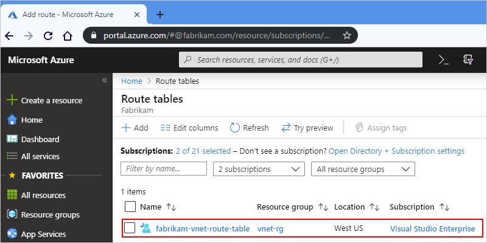
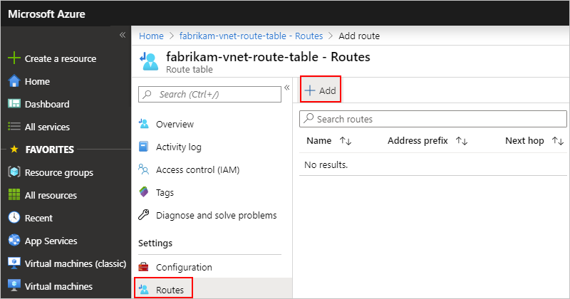
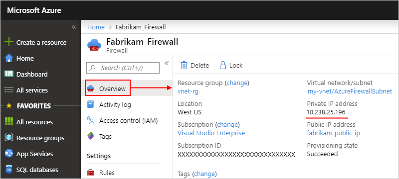
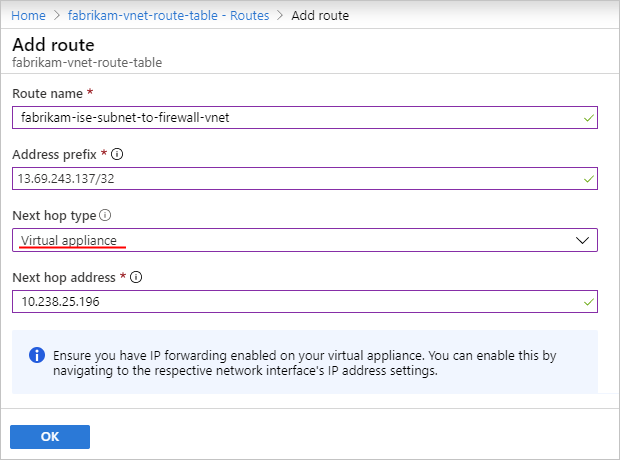
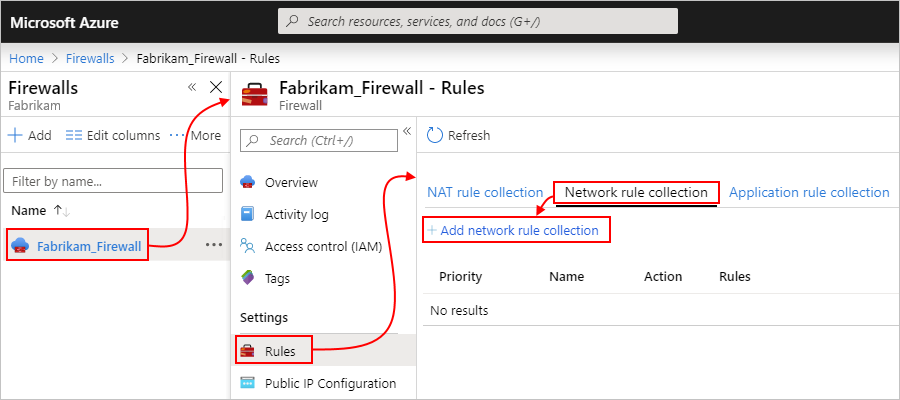
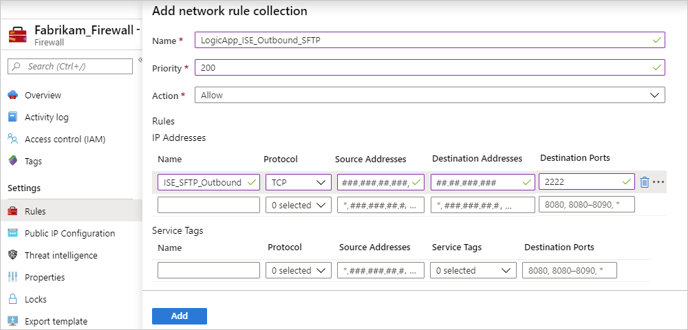

# Set up a single IP address for one or more integration service environments in Azure Logic Apps

> [!IMPORTANT]
>
> On August 31, 2024, the ISE resource will retire, due to its dependency on Azure Cloud Services (classic), 
> which retires at the same time. Before the retirement date, export any logic apps from your ISE to Standard 
> logic apps so that you can avoid service disruption. Standard logic app workflows run in single-tenant Azure 
> Logic Apps and provide the same capabilities plus more.
>
> Starting November 1, 2022, you can no longer create new ISE resources. However, ISE resources existing 
> before this date are supported through August 31, 2024. For more information, see the following resources:
>
> - [ISE Retirement - what you need to know](https://techcommunity.microsoft.com/t5/integrations-on-azure-blog/ise-retirement-what-you-need-to-know/ba-p/3645220)
> - [Single-tenant versus multi-tenant and integration service environment for Azure Logic Apps](single-tenant-overview-compare.md)
> - [Azure Logic Apps pricing](https://azure.microsoft.com/pricing/details/logic-apps/)
> - [Export ISE workflows to a Standard logic app](export-from-ise-to-standard-logic-app.md)
> - [Integration Services Environment will be retired on 31 August 2024 - transition to Logic Apps Standard](https://azure.microsoft.com/updates/integration-services-environment-will-be-retired-on-31-august-2024-transition-to-logic-apps-standard/)
> - [Cloud Services (classic) deployment model is retiring on 31 August 2024](https://azure.microsoft.com/updates/cloud-services-retirement-announcement/)

When you work with Azure Logic Apps, you can set up an [*integration service environment* (ISE)](../logic-apps/connect-virtual-network-vnet-isolated-environment-overview.md) for hosting logic apps that need access to resources in an [Azure virtual network](../virtual-network/virtual-networks-overview.md). When you have multiple ISE instances that need access to other endpoints that have IP restrictions, deploy an [Azure Firewall](../firewall/overview.md) or a [network virtual appliance](../virtual-network/virtual-networks-overview.md#filter-network-traffic) into your virtual network and route outbound traffic through that firewall or network virtual appliance. You can then have all the ISE instances in your virtual network use a single, public, static, and predictable IP address to communicate with the destination systems that you want. That way, you don't have to set up additional firewall openings at your destination systems for each ISE.

This topic shows how to route outbound traffic through an Azure Firewall, but you can apply similar concepts to a network virtual appliance such as a third-party firewall from the Azure Marketplace. While this topic focuses on setup for multiple ISE instances, you can also use this approach for a single ISE when your scenario requires limiting the number of IP addresses that need access. Consider whether the additional costs for the firewall or virtual network appliance make sense for your scenario. Learn more about [Azure Firewall pricing](https://azure.microsoft.com/pricing/details/azure-firewall/).

## Prerequisites

* An Azure firewall that runs in the same virtual network as your ISE. If you don't have a firewall, first [add a subnet](../virtual-network/virtual-network-manage-subnet.md#add-a-subnet) that's named `AzureFirewallSubnet` to your virtual network. You can then [create and deploy a firewall](../firewall/tutorial-firewall-deploy-portal.md#create-a-virtual-network) in your virtual network.

* An Azure [route table](../virtual-network/manage-route-table.md). If you don't have one, first [create a route table](../virtual-network/manage-route-table.md#create-a-route-table). For more information about routing, see [Virtual network traffic routing](../virtual-network/virtual-networks-udr-overview.md).

## Set up route table

1. In the [Azure portal](https://portal.azure.com), select the route table, for example:

   

1. To [add a new route](../virtual-network/manage-route-table.md#create-a-route), on the route table menu, select **Routes** > **Add**.

   

1. On the **Add route** pane, [set up the new route](../virtual-network/manage-route-table.md#create-a-route) with a rule that specifies that all the outbound traffic to the destination system follows this behavior:

   * Uses the [**Virtual appliance**](../virtual-network/virtual-networks-udr-overview.md#user-defined) as the next hop type.

   * Goes to the private IP address for the firewall instance as the next hop address.

     To find this IP address, on your firewall menu, select **Overview**, find the address under **Private IP address**, for example:

     

   Here's an example that shows how such a rule might look:

   

   | Property | Value | Description |
   |----------|-------|-------------|
   | **Route name** | <*unique-route-name*> | A unique name for the route in the route table |
   | **Address prefix** | <*destination-address*> | The address prefix for your destination system where you want outbound traffic to go. Make sure that you use [Classless Inter-Domain Routing (CIDR) notation](https://en.wikipedia.org/wiki/Classless_Inter-Domain_Routing) for this address. In this example, this address prefix is for an SFTP server, which is described in the section, [Set up network rule](#set-up-network-rule). |
   | **Next hop type** | **Virtual appliance** | The [hop type](../virtual-network/virtual-networks-udr-overview.md#next-hop-types-across-azure-tools) that's used by outbound traffic |
   | **Next hop address** | <*firewall-private-IP-address*> | The private IP address for your firewall |
   |||

## Set up network rule

1. In the Azure portal, find and select your firewall. On the firewall menu, under **Settings**, select **Rules**. On the rules pane, select **Network rule collection** > **Add network rule collection**.

   

1. In the collection, add a rule that permits traffic to the destination system.

   For example, suppose that you have a logic app that runs in an ISE and needs to communicate with an SFTP server. You create a network rule collection that's named `LogicApp_ISE_SFTP_Outbound`, which contains a network rule named `ISE_SFTP_Outbound`. This rule permits traffic from the IP address of any subnet where your ISE runs in your virtual network to the destination SFTP server by using your firewall's private IP address.

   

   **Network rule collection properties**

   | Property | Value | Description |
   |----------|-------|-------------|
   | **Name** | <*network-rule-collection-name*> | The name for your network rule collection |
   | **Priority** | <*priority-level*> | The order of priority to use for running the rule collection. For more information, see [What are some Azure Firewall concepts](../firewall/firewall-faq.yml#what-are-some-azure-firewall-concepts)? |
   | **Action** | **Allow** | The action type to perform for this rule |
   |||

   **Network rule properties**

   | Property | Value | Description |
   |----------|-------|-------------|
   | **Name** | <*network-rule-name*> | The name for your network rule |
   | **Protocol** | <*connection-protocols*> | The connection protocols to use. For example, if you're using NSG rules, select both **TCP** and **UDP**, not only **TCP**. |
   | **Source addresses** | <*ISE-subnet-addresses*> | The subnet IP addresses where your ISE runs and where traffic from your logic app originates |
   | **Destination addresses** | <*destination-IP-address*> | The IP address for your destination system where you want outbound traffic to go. In this example, this IP address is for the SFTP server. |
   | **Destination ports** | <*destination-ports*> | Any ports that your destination system uses for inbound communication |
   |||

   For more information about network rules, see these articles:

   * [Configure a network rule](../firewall/tutorial-firewall-deploy-portal.md#configure-a-network-rule)
   * [Azure Firewall rule processing logic](../firewall/rule-processing.md#network-rules-and-applications-rules)
   * [Azure Firewall FAQ](../firewall/firewall-faq.yml)
   * [Azure PowerShell: New-AzFirewallNetworkRule](/powershell/module/az.network/new-azfirewallnetworkrule)
   * [Azure CLI: az network firewall network-rule](/cli/azure/network/firewall/network-rule#az-network-firewall-network-rule-create)

## Next steps

* [Connect to Azure virtual networks from Azure Logic Apps](../logic-apps/connect-virtual-network-vnet-isolated-environment.md)
