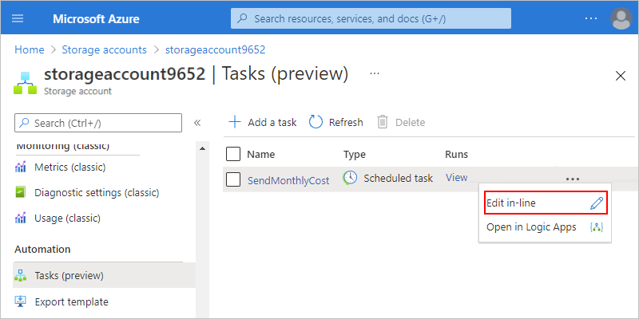

# Manage Azure resources and monitor costs by creating automation tasks (preview)

> [!IMPORTANT]
> This capability is in public preview, is provided without a service level agreement, 
> and is not recommended for production workloads. Certain features might not be supported 
> or might have constrained capabilities. For more information, see 
> [Supplemental Terms of Use for Microsoft Azure Previews](https://azure.microsoft.com/support/legal/preview-supplemental-terms/).

To help you manage [Azure resources](../azure-resource-manager/management/overview.md#terminology) more easily, you can create automated management tasks for a specific resource or resource group by using automation task templates, which vary in availability based on the resource type. For example, for an [Azure storage account](../storage/common/storage-account-overview.md), you can set up an automation task that sends you the monthly cost for that storage account. For an [Azure virtual machine](https://azure.microsoft.com/services/virtual-machines/), you can create an automation task that turns on or turns off that virtual machine on a predefined schedule.

Behind the scenes, an automation task is actually a workflow that runs on the [Azure Logic Apps](../logic-apps/logic-apps-overview.md) service and is billed using the same [pricing rates](https://azure.microsoft.com/pricing/details/logic-apps/) and [pricing model](../logic-apps/logic-apps-pricing.md). After you create the task, you can view and edit the underlying workflow by opening the task in the Logic App Designer. After a task finishes at least one run, you can review the status, history, inputs, and outputs for each run.

Here are the currently available task templates in this preview:

| Resource type | Automation task templates |
|---------------|---------------------------|
| Azure resource groups | **When resource is deleted** |
| All Azure resources | **Send monthly cost for resource** |
| Azure virtual machines | Additionally: 
- **Power off Virtual Machine**  - **Start Virtual Machine** |
| Azure Storage accounts | Additionally: 
- **Delete old blobs** |
| Azure Cosmos DB | Additionally, 
- **Send query result via email** |
|||

This article shows you how to complete the following tasks:

* [Create an automation task](#create-automation-task) for a specific Azure resource.

* [Review a task's history](#review-task-history), which includes the run status, inputs, outputs, and other historical information.

* [Edit the task](#edit-task) so that you can update the task, or customize the task's underlying workflow in the Logic App Designer.

## How do automation tasks differ from Azure Automation?

Currently, you can create an automation task only at the resource level, view the task's runs history, and edit the task's underlying logic app workflow, which is powered by the [Azure Logic Apps](../logic-apps/logic-apps-overview.md) service. Automation tasks are more basic and lightweight than [Azure Automation](../automation/automation-intro.md).

By comparison, Azure Automation is a cloud-based automation and configuration service that supports consistent management across your Azure and non-Azure environments. The service comprises [process automation for orchestrating processes](../automation/automation-intro.md#process-automation) by using [runbooks](../automation/automation-runbook-execution.md), configuration management with [change tracking and inventory](../automation/change-tracking/overview.md), update management, shared capabilities, and heterogeneous features. Automation gives you complete control during deployment, operations, and decommissioning of workloads and resources.

## Prerequisites

* An Azure account and subscription. If you don't have a subscription, [sign up for a free Azure account](https://azure.microsoft.com/free/?WT.mc_id=A261C142F).

* The Azure resource that you want to manage. This article uses an Azure storage account as the example.

* An Office 365 account if you want to follow along with the example, which sends you email by using Office 365 Outlook.

## Create an automation task

1. In the [Azure portal](https://portal.azure.com), find the resource that you want to manage.

1. On the resource menu, scroll to the **Automation** section, and select **Tasks**

   

1. On the **Tasks** pane, select **Add** so that you can select a task template.

   

1. On the **Add a Task** pane, under **Select a template**, select the template for the task that you want to create. If the next page doesn't appear, select **Next: Authentication**.

   This example continues by selecting the **Send monthly cost for resource** task template.

   

1. Under **Authentication**, in the **Connections** section, select **Create** for every connection that appears in the task so that you can provide authentication credentials for all the connections. The types of connections in each task vary based on the task.

   This example shows only one of the connections that's required by this task.

   

1. When you're prompted, sign in with your Azure account credentials.

   

   Each successfully authenticated connection looks similar to this example:

   

1. After you authenticate all the connections, select **Next: Configuration** if the next page doesn't appear.

1. Under **Configuration**, provide a name for the task and any other information required for the task. When you're done, select **Create**.

   > [!NOTE]
   > You can't change the task name after creation, so consider a name that still applies if you [edit the underlying workflow](#edit-task-workflow). 
   > Changes that you make to the underlying workflow apply only to the task that you created, not the task template.
   >
   > For example, if you name your task `Send monthly cost`, but you later edit the underlying workflow to run weekly, 
   > you can't change your task's name to `Send weekly cost`.

   Tasks that send email notifications require an email address.

   

   The task that you created, which is automatically live and running, now appears on the **Automation tasks** list.

   

   > [!TIP]
   > If the task doesn't appear immediately, try refreshing the tasks list or wait a little before you refresh. On the toolbar, select **Refresh**.

   After the selected task runs, you get an email that looks like this example:

   

## Review task history

To view a task's history of runs along with their statuses, inputs, outputs, and other information, follow these steps:

1. In the [Azure portal](https://portal.azure.com), find the resource that has the task history that you want to review.

1. On the resource's menu, under **Settings**, select **Automation tasks**.

1. In the tasks list, find the task that you want to review. In that task's **Runs** column, select **View**.

   

   The **Runs history** pane shows all the runs for the task along with their statuses, start times, identifiers, and run durations.

   

   Here the possible statuses for a run:

   | Status | Description |
   |--------|-------------|
   | **Cancelled** | The task was cancelled while running. |
   | **Failed** | The task has at least one failed action, but no subsequent actions existed to handle the failure. |
   | **Running** | The task is currently running. |
   | **Succeeded** | All actions succeeded. A task can still finish successfully if an action failed, but a subsequent action existed to handle the failure. |
   | **Waiting** | The run hasn't started yet and is paused because an earlier instance of the task is still running. |
   |||

   For more information, see [Review runs history](../logic-apps/monitor-logic-apps.md#review-runs-history)

1. To view the statuses and other information for each step in a run, select that run.

   The **Logic app run** pane opens and shows the underlying workflow that ran.

   * A workflow always starts with a [*trigger*](../connectors/apis-list.md#triggers). For this task, the workflow starts with the [**Recurrence** trigger](../connectors/connectors-native-recurrence.md).

   * Each step shows its status and run duration. Steps that have 0-second durations took less than 1 second to run.

   

1. To review the inputs and outputs for each step, select the step, which expands.

   This example shows the inputs for the Recurrence trigger, which has no outputs because the trigger only specifies when the workflow runs and provides no outputs for the subsequent actions to process.

   

   In contrast, the **Send an email** action has inputs from earlier actions in the workflow and outputs.

   

To learn how you can build your own automated workflows so that you can integrate apps, data, services, and systems apart from the context of automation tasks for Azure resources, see [Quickstart: Create your first integration workflow by using Azure Logic Apps - Azure portal](../logic-apps/quickstart-create-first-logic-app-workflow.md).

## Edit the task

To change a task, you have these options:

* [Edit the task "inline"](#edit-task-inline) so that you can change the task's properties, such as connection information or configuration information, for example, your email address.

* [Edit the task's underlying workflow](#edit-task-workflow) in the Logic App Designer.

### Edit the task inline

1. In the [Azure portal](https://portal.azure.com), find the resource that has the task that you want to update.

1. On the resource's menu, under **Automation**, select **Tasks**.

1. In the tasks list, find the task that you want to update. Open the task's ellipses (**...**) menu, and select **Edit in-line**.

   

   By default, the **Authentication** tab appears and shows the existing connections.

1. To add new authentication credentials or select different existing authentication credentials for a connection, open the connection's ellipses (**...**) menu, and select either **Add new connection** or if available, different authentication credentials.

   

1. To update other task properties, select **Next: Configuration**.

   For the task in this example, the only property available for edit is the email address.

   

1. When you're done, select **Save**.

### Edit the task's underlying workflow

When you change the underlying workflow for an automation task, your changes affect only the task instance that you created, and not the template that creates the task. After you make and save your changes, the name that you provided for your original task might not accurately describe the task anymore, so you might have to recreate the task with a different name.

> [!TIP]
> As a best practice, clone the underlying workflow so that you can edit the copied version instead. 
> That way, you can make and test your changes on the copy while the original automation task continues 
> to work and run without risking disruption or breaking existing functionality. After you finish your 
> changes and are satisfied that the new version runs successfully, you can disable or delete the 
> original automation task and use the cloned version for your automation task. The following steps 
> include information about how to clone your workflow.

1. In the [Azure portal](https://portal.azure.com), find the resource that has the task that you want to update.

1. On the resource's menu, under **Automation**, select **Tasks**.

1. In the tasks list, find the task that you want to update. Open the task's ellipses (**...**) menu, and select **Open in Logic Apps**.

   

   The task's underlying workflow opens in the Azure Logic Apps service and shows the **Overview** pane where you can view the same runs history that's available for the task.

   

1. To open the underlying workflow in the Logic App Designer, on the logic app's menu, select **Logic app designer**.

   

   You can now edit the properties for the workflow's trigger and actions as well as edit the trigger and actions that define the workflow itself. However, as best practice, follow the steps to clone your workflow so that you can make your changes on a copy while the original workflow continues to work and run.

1. To clone your workflow and edit the copied version instead, follow these steps:

   1. On the logic app workflow menu, select **Overview**.

   1. On the overview pane's toolbar, select **Clone**.

   1. On the logic app creation pane, under **Name**, enter a new name for your copied logic app workflow.

      Except for **Logic App Status**, the other properties aren't available for editing. 
      
   1. Under **Logic App Status**, select **Disabled** so that the cloned workflow doesn't run while you make your changes. You can enable the workflow when you're ready to test your changes.

   1. After Azure finishes provisioning your cloned workflow, find and open that workflow in the Logic App Designer.

1. To view the properties for the trigger or an action, expand that trigger or action.

   For example, you can change the Recurrence trigger to run weekly, rather than monthly.

   

   For more information about the Recurrence trigger, see [Create, schedule, and run recurring tasks and workflows with the Recurrence trigger](../connectors/connectors-native-recurrence.md). For more information about other triggers and actions that you can use, see [Connectors for Azure Logic Apps](../connectors/apis-list.md).

1. To save your changes, on the designer toolbar, select **Save**.

   

1. To test and run the updated workflow, on the designer toolbar, select **Run**.

   After the run finishes, the designer shows the workflow's run details.

   

1. To disable the workflow so that the task doesn't continue running, see [Manage logic apps in the Azure portal](../logic-apps/manage-logic-apps-with-azure-portal.md).

## Provide feedback

We'd like to hear from you! To report bugs, provide feedback, or ask questions about this preview capability, [contact the Azure Logic Apps team](mailto:logicappspm@microsoft.com).

## Next steps

* [Manage logic apps in the Azure portal](../logic-apps/manage-logic-apps-with-azure-portal.md)
