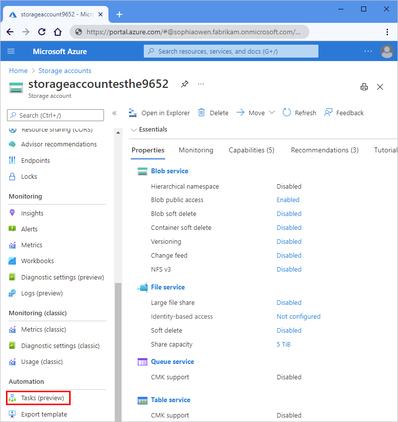

# Manage Azure resources and monitor costs by creating automation tasks (preview)

> [!IMPORTANT]
> This capability is in preview and is subject to the 
> [Supplemental Terms of Use for Microsoft Azure Previews](https://azure.microsoft.com/support/legal/preview-supplemental-terms/).

To help you manage [Azure resources](../azure-resource-manager/management/overview.md#terminology) more easily, you can create automated management tasks for a specific resource or resource group. These tasks vary in number and availability, based on the resource type. For example:

- For an [Azure storage account](../storage/common/storage-account-overview.md), you can set up an automation task that sends the monthly cost for that storage account.

- For an [Azure virtual machine](../virtual-machines/overview.md), you can create an automation task that turns on or turns off that virtual machine on a predefined schedule. Specifically, you can create a task that automatically starts or stops the virtual machine a specific number of times every day, week, or month. On the task's **Configure** tab, set the **Interval** value to the number of times and the **Frequency** value to **Day**, **Week**, or **Month**. The automation task continues to work until you delete or disable the task.
 
  For example, you can create a task that automatically starts a virtual machine once every day. On the task's **Configure** tab, set **Interval** to **1** and **Frequency** to **Day**. 

You can create an automation task from a specific automation task template. The following table lists the currently supported resource types and available task templates in this preview:

| Resource type | Automation task templates |
|---------------|---------------------------|
| All Azure resources | **Send monthly cost for resource** |
| Azure virtual machines | Additionally: <br><br>- **Power off Virtual Machine** <br>- **Start Virtual Machine** <br>- **Deallocate Virtual Machine** |
| Azure storage accounts | Additionally: <br><br>- **Delete old blobs** |
| Azure Cosmos DB | Additionally, <br><br>- **Send query result via email** |

This article shows you how to complete the following tasks:

* [Create an automation task](#create-automation-task) for a specific Azure resource.

* [Review a task's history](#review-task-history), which includes the run status, inputs, outputs, and other historical information.

* [Edit the task](#edit-task) so that you can update the task, or customize the task's underlying workflow in the workflow designer.

<a name="differences"></a>

## How do automation tasks differ from Azure Automation?

Automation tasks are more basic and lightweight than [Azure Automation](../automation/automation-intro.md). Currently, you can create an automation task only at the Azure resource level. Behind the scenes, an automation task is actually a logic app resource that runs a workflow. This logic app workflow is powered by the [*multi-tenant* Azure Logic Apps service](logic-apps-overview.md). After you create the automation task, you can view and edit the underlying workflow by opening the task in the workflow designer. After a task finishes at least one run, you can review the run's status, history, inputs, and outputs.

By comparison, Azure Automation is a cloud-based automation and configuration service that supports consistent management across your Azure and non-Azure environments. The service comprises [process automation for orchestrating processes](../automation/automation-intro.md#process-automation) that uses [runbooks](../automation/automation-runbook-execution.md), configuration management with [change tracking and inventory](../automation/change-tracking/overview.md), update management, shared capabilities, and heterogeneous features. Automation gives you complete control during deployment, operations, and decommissioning of workloads and resources.

<a name="pricing"></a>

## Pricing

When you create an automation task, charges don't start automatically incurring. Underneath, an automation task is powered by a workflow in a logic app resource that's hosted in multi-tenant Azure Logic Apps. So, the [Consumption pricing model](logic-apps-pricing.md) applies to automation tasks. Metering and billing are based on the trigger and action executions in the underlying logic app workflow.

Executions are metered and billed, regardless whether the workflow runs successfully or whether the workflow is even instantiated. For example, suppose your automation task uses a polling trigger that regularly makes an outgoing call to an endpoint. This outbound request is metered and billed as an execution, regardless whether the trigger fires or is skipped, which affects whether a workflow instance is created.

Triggers and actions follow [Consumption plan rates](https://azure.microsoft.com/pricing/details/logic-apps/), which differ based on whether these operations are ["built-in"](../connectors/built-in.md) or ["managed" (Standard or Enterprise)](../connectors/managed.md). Triggers and actions also make storage transactions, which use the [Consumption plan data rate](https://azure.microsoft.com/pricing/details/logic-apps/).

> [!NOTE]
> As a monthly bonus, the Consumption plan includes *several thousand* built-in executions free of charge. 
> For specific information, review the [Consumption plan rates](https://azure.microsoft.com/pricing/details/logic-apps/).

## Prerequisites

* An Azure account and subscription. If you don't have a subscription, [sign up for a free Azure account](https://azure.microsoft.com/free/?WT.mc_id=A261C142F).

* The Azure resource that you want to manage. This article uses an Azure storage account as the example.

* An Office 365 account if you want to follow along with the example, which sends email by using Office 365 Outlook.

<a name="create-automation-task"></a>

## Create an automation task

1. In the [Azure portal](https://portal.azure.com), find the resource that you want to manage.

1. On the resource navigation menu, in the **Automation** section, and select **Tasks (preview)**.

   

1. On the **Tasks** pane, select **Add a task** so that you can select a task template.

   

1. On the **Add a task** pane, under **Select a template**, in the template for the replication task that you want to create, select **Select**. If the next page doesn't appear, select **Next: Authenticate**.

   This example continues by selecting the **Send monthly cost for resource** task template.

   

1. Under **Authenticate**, in the **Connections** section, select **Create** for every connection that appears in the task so that you can provide authentication credentials for all the connections. The types of connections in each task vary based on the task.

   This example shows only one of the connections that's required by this task.

   

1. When you're prompted, sign in with your Azure account credentials.

   

   Each successfully authenticated connection looks similar to this example:

   

1. After you authenticate all the connections, select **Next: Configure** if the next page doesn't appear.

1. Under **Configure**, provide a name for the task and any other information required for the task. When you're done, select **Review + create**.

   > [!NOTE]
   > You can't change the task name after creation, so consider a name that still applies if you 
   > [edit the underlying workflow](#edit-task-workflow). Changes that you make to the underlying 
   > workflow apply only to the task that you created, not the task template.
   >
   > For example, if you name your task `SendMonthlyCost`, but you later edit the underlying workflow 
   > to run weekly, you can't change your task's name to `SendWeeklyCost`.

   Tasks that send email notifications require an email address.

   

   The task that you created, which is automatically live and running, now appears on the **Tasks** list.

   

   > [!TIP]
   > If the task doesn't appear immediately, try refreshing the tasks list or wait a little before you refresh. On the toolbar, select **Refresh**.

   After the selected task runs, you get an email that looks like this example:

   

<a name="review-task-history"></a>

## Review task history

To view a task's history of runs along with their statuses, inputs, outputs, and other information, follow these steps:

1. In the [Azure portal](https://portal.azure.com), find the resource that has the task history that you want to review.

1. On the resource's menu, under **Settings**, in the **Automation** section, select **Tasks (preview)**.

1. In the tasks list, find the task that you want to review. In that task's **Runs** column, select **View**.

   

   The **Runs history** pane shows all the runs for the task along with their statuses, start times, identifiers, and run durations.

   

   Here the possible statuses for a run:

   | Status | Description |
   |--------|-------------|
   | **Cancelled** | The task was canceled while running. |
   | **Failed** | The task has at least one failed action, but no subsequent actions existed to handle the failure. |
   | **Running** | The task is currently running. |
   | **Succeeded** | All actions succeeded. A task can still finish successfully if an action failed, but a subsequent action existed to handle the failure. |
   | **Waiting** | The run hasn't started yet and is paused because an earlier instance of the task is still running. |
   |||

   For more information, see [Review runs history in monitoring view](monitor-logic-apps.md#review-runs-history).

1. To view the statuses and other information for each step in a run, select that run.

   The **Logic app run** pane opens and shows the underlying workflow that ran.

   * A workflow always starts with a [*trigger*](../connectors/introduction.md#triggers). For this task, the workflow starts with the [**Recurrence** trigger](../connectors/connectors-native-recurrence.md).

   * Each step shows its status and run duration. Steps that have 0-second durations took less than 1 second to run.

   

1. To review the inputs and outputs for each step, select the step, which expands.

   This example shows the inputs for the Recurrence trigger, which has no outputs because the trigger only specifies when the workflow runs and provides no outputs for the subsequent actions to process.

   

   In contrast, the **Send an email** action has inputs from earlier actions in the workflow and outputs.

   

To learn how you can build your own automated workflows so that you can integrate apps, data, services, and systems apart from the context of automation tasks for Azure resources, see [Quickstart: Create an example Consumption logic app workflow - Azure portal](quickstart-create-example-consumption-workflow.md).

<a name="edit-task"></a>

## Edit the task

To change a task, you have these options:

* [Edit the task "inline"](#edit-task-inline) so that you can change the task's properties, such as connection information or configuration information, for example, your email address.

* [Edit the task's underlying workflow](#edit-task-workflow) in the workflow designer.

<a name="edit-task-inline"></a>

### Edit the task inline

1. In the [Azure portal](https://portal.azure.com), find the resource that has the task that you want to update.

1. On the resource navigation menu, in the **Automation** section, select **Tasks (preview)**.

1. In the tasks list, find the task that you want to update. Open the task's ellipses (**...**) menu, and select **Edit in-line**.

   

   By default, the **Authenticate** tab appears and shows the existing connections.

1. To add new authentication credentials or select different existing authentication credentials for a connection, open the connection's ellipses (**...**) menu, and select either **Add new connection** or if available, different authentication credentials.

   

1. To update other task properties, select **Next: Configure**.

   For the task in this example, the only property available for edit is the email address.

   

1. When you're done, select **Save**.

<a name="edit-task-workflow"></a>

### Edit the task's underlying workflow

When you change the underlying workflow for an automation task, your changes affect only the task instance that you created, and not the template that creates the task. After you make and save your changes, the name that you provided for your original task might not accurately describe the task anymore, so you might have to recreate the task with a different name.

> [!TIP]
> As a best practice, clone the underlying workflow so that you can edit the copied version instead. 
> That way, you can make and test your changes on the copy while the original automation task continues 
> to work and run without risking disruption or breaking existing functionality. After you finish your 
> changes and are satisfied that the new version runs successfully, you can disable or delete the 
> original automation task and use the cloned version for your automation task. The following steps 
> include information about how to clone your workflow.

1. In the [Azure portal](https://portal.azure.com), find the resource that has the task that you want to update.

1. On the resource navigation menu, in the **Automation** section, select **Tasks**.

1. In the tasks list, find the task that you want to update. Open the task's ellipses (**...**) menu, and select **Open in Logic Apps**.

   

   The task's underlying workflow opens in the Azure Logic Apps service and shows the **Overview** pane where you can view the same runs history that's available for the task.

   

1. To open the underlying workflow in the designer, on the logic app navigation menu, select **Logic app designer**.

   

   You can now edit the properties for the workflow's trigger and actions as well as edit the trigger and actions that define the workflow itself. However, as best practice, follow the steps to clone your workflow so that you can make your changes on a copy while the original workflow continues to work and run.

1. To clone your workflow and edit the copied version instead, follow these steps:

   1. On the logic app workflow menu, select **Overview**.

   1. On the overview pane's toolbar, select **Clone**.

   1. On the logic app creation pane, under **Name**, enter a new name for your copied logic app workflow.

      Except for **Logic App Status**, the other properties aren't available for editing.

   1. Under **Logic App Status**, select **Disabled** so that the cloned workflow doesn't run while you make your changes. You can enable the workflow when you're ready to test your changes.

   1. After Azure finishes provisioning your cloned workflow, find and open that workflow in the designer.

1. To view the properties for the trigger or an action, expand that trigger or action.

   For example, you can change the Recurrence trigger to run weekly, rather than monthly.

   

   For more information about the Recurrence trigger, see [Create, schedule, and run recurring tasks and workflows with the Recurrence trigger.](../connectors/connectors-native-recurrence.md).

1. To save your changes, on the designer toolbar, select **Save**.

   

1. To test and run the updated workflow, on the designer toolbar, select **Run**.

   After the run finishes, the designer shows the workflow's run details.

   

1. To disable the workflow so that the task doesn't continue running, see [Manage logic apps in the Azure portal](../logic-apps/manage-logic-apps-with-azure-portal.md).

<a name="create-automation-template"></a>

## Create automation task template from workflow

You can create your own automation task template by using any Consumption logic app workflow that starts with a recurring or event-based trigger, but not HTTP-based triggers or HTTP-based webhook triggers. For this task, you'll need the following items:

* A [GitHub](https://github.com) account

* Your forked version of the [Azure automation task templates GitHub repository](https://github.com/Azure/automation-task-template/tree/master/templates).

  For more information about forks and creating a fork, review the following GitHub documentation:

  * [About forks](https://docs.github.com/pull-requests/collaborating-with-pull-requests/working-with-forks/about-forks)
  * [Fork a repo](https://docs.github.com/get-started/quickstart/fork-a-repo)

* A working branch in your forked repository where you'll add your automation task template.

  For more information about branches and creating a branch, review the following documentation:

  * [About branches](https://docs.github.com/pull-requests/collaborating-with-pull-requests/proposing-changes-to-your-work-with-pull-requests/about-branches)
  * [Create and delete branches](https://docs.github.com/pull-requests/collaborating-with-pull-requests/proposing-changes-to-your-work-with-pull-requests/creating-and-deleting-branches-within-your-repository)

* Your choice of a web debugging tool. This example uses Fiddler 4, but you can try the free trial available for [Fiddler Everywhere](https://www.telerik.com/fiddler/fiddler-everywhere).

To create the template and make the template available for use in Azure, here are the high-level steps:

1. [Export the workflow](#export-workflow) to an automation task template.
1. [Upload your template](#upload-template) to your working branch in your forked repository.
1. [Test your template](#test-template) by using your web debugging tool or Fiddler.
1. [Create a pull request (PR) for your working branch](#create-pull-request) against the default branch in the Azure automation task templates GitHub repository.

After the Azure Logic Apps team reviews and approves your PR for merging to the default branch, your template is live and available to all Azure customers.

<a name="export-workflow"></a>

### Export workflow to automation task template

1. In the [Azure portal](https://portal.azure.com), open the logic app workflow that you want to export. Make sure that the workflow starts with a recurring or event-based trigger, not an HTTP-based trigger or HTTP-based webhook trigger.

1. On the logic app resource menu, select **Overview**.

1. On the **Overview** pane toolbar, select **Export** > **Export to Automation Task**.

   

1. On the **Export to Automation Task** pane that opens, provide the following information:

   | Property | Required | Value | Description |
   |----------|----------|-------|-------------|
   | **Template Name** | Yes | <*template-name*> | The friendly display name for the automation task template. <p><p>**Important**: Make sure that you use a concise and easy-to-understand name, for example, **List stale virtual machines**. |
   | **Template Description** | Yes | <*template-description*> | A description for the template's task or purpose |
   | **Supported Resource Types** | No | Empty or <*supported-Azure-resource-type-list*> | The first-class Azure resource types where you want to make the template available. Sub-resource types are currently unsupported. To include all first-class Azure resource types, leave this property empty. To specify multiple resource types, separate each name with a comma and use the following syntax: <p><p>**Microsoft.<*service-provider*>/<*entity*>** <p><p>For example, to make the template available for Azure resource groups, specify **Microsoft.Resources/resourceGroups**. For more information, review [Resource providers for Azure services](../azure-resource-manager/management/azure-services-resource-providers.md). |
   | **Unsupported Resource Types** | No | Empty or <*unsupported-Azure-resource-type-list*> | If any, the Azure resource types where you specifically don't want to make the template available. To specify multiple resource types, separate each name with a comma and use the following syntax: <p><p>**Microsoft.<*service-provider*>/<*entity*>** <p><p>For example, to make the template unavailable for Azure resource groups, specify **Microsoft.Resources/resourceGroups**. For more information, review [Resource providers for Azure services](../azure-resource-manager/management/azure-services-resource-providers.md). |
   | **Configure Parameters** | No | Varies | If your workflow includes cross-environment [parameter definitions](create-parameters-workflows.md), those parameters appear in this section for you to configure further. You can select whether each parameter value is provided either from the resource or the task creator. <p><p>- If you select **From Resource**, select a **Source Parameter** property value to use from that resource: <p>-- **Resource Name** <br>-- **Resource Type** <br>-- **Resource Id** <br>-- **Subscription Id** <br>-- **Resource Group** <br>-- **Resource Location**. <p><p>- If you select **User Provided**, select a **Template** format that determines how the task creator provides the parameter value: <p>-- **Default**: The parameter value is anything other than an interval, frequency, or time zone. <p>---- Specify the parameter's display name, default value, and description. <p>---- If the value is a timestamp (*hh:mm:ss*), set the **Format** property to **Time Format**. <p>---- To mark the parameter as required, change the **Optional** to **Required**. <p>-- **Interval**: The parameter value is an interval, such as **1** or **12**. <p>-- **Frequency**: The parameter value is a frequency, such as **Hour**, **Day** or **Month**. <p>-- **Timezone**: The parameter value is a timezone, such as **(UTC-08:00) Pacific Time (US & Canada)**. |
   |||||

   The following example shows the properties for a sample automation task template that works only on an Azure resource group:

   

   In this example, the task's underlying workflow includes the following parameter definitions and specifies that these parameter values are provided by the task creator:

   | Parameter | Description |
   |-----------|-------------|
   | **emailAddress** | Specifies the email address for where to send the report. This parameter uses the **Default** template, which lets you specify the parameter's information, the expected format, and whether the parameter is optional or not. For this example parameter, the expected format is **None**, and the parameter is **Required**. |
   | **numberOf** | Specifies the maximum number of time units that a virtual machine can stay idle. This parameter uses the **Default** template. |
   | **timeUnit** | Specifies the time unit to use for the parameter value. This parameter uses the **Frequency** template, which shows the time units that the task creator can select, for example, **Hour**, **Day**, or **Month**. |
   |||

1. When you're done, select **Download Template**, and save the template using the **.json** file name extension. For a consistent template name, use only lowercase, hyphens between words, and the following syntax:

   **<*action-verb*>-<*Azure-resource*>**

   For example, based on the earlier example template name, you might name the template file as **list-stale-virtual-machines.json**.

<a name="upload-template"></a>

### Upload template to GitHub

1. Go to [GitHub](https://github.com), and sign in with your GitHub account.

1. Go to the [Azure automation task templates GitHub repository](https://github.com/Azure/automation-task-template/tree/master/templates), which takes you to the default branch in the repository.

1. From the branch list, switch to your working branch.

1. Above the files list, select **Add file** > **Upload files**.

1. Either drag your workflow definition file to the specified area on the page, or select **choose your files**.

1. After you add your template, in the same folder, open the **manifest.json** file, and add an entry for your **<*template-name*>.json** file.

<a name="test-template"></a>

### Test your template

You can use your favorite web debugging tool to test the template you uploaded to your working directory. This example continues by using Fiddler with the script that modifies web requests. If you use a different tool, use the equivalent steps and script for your tool.

1. In the Fiddler script, find the `onBeforeRequest()` function, and add the following code to the function, for example:

   ```javascript
   static function OnBeforeRequest(oSession: Session)
   {
      if (oSession.url == "raw.githubusercontent.com/azure/automation-task-template/master/templates/manifest.json") {
         oSession.url = "raw.githubusercontent.com/<GitHub-username>/automation-task-template/<working-branch>/templates/manifest.json";
      }

      if (oSession.url == "raw.githubusercontent.com/azure/automation-task-template/master/templates/<template-name>") {
         oSession.url = "raw.githubusercontent.com/<GitHub-username>/automation-task-template/<working-branch>/templates/<template-name>";
      }

      {...}
   }
   ```

   This code gets the **manifest.json** and **<*template-name*>.json** files from your forked repository, rather than from the main Azure GitHub repository.

   So, based on the example, the file redirection code looks like the following version:

   ```javascript
   static function OnBeforeRequest(oSession: Session)
   {
      if (oSession.url == "raw.githubusercontent.com/azure/automation-task-template/master/templates/manifest.json") {
         oSession.url = "raw.githubusercontent.com/sophowe/automation-task-template/upload-auto-template/templates/manifest.json";
      }

      if (oSession.url == "raw.githubusercontent.com/azure/automation-task-template/master/templates/list-stale-virtual-machines.json") {
         oSession.url = "raw.githubusercontent.com/sophowe/automation-task-template/upload-auto-template/templates/list-stale-virtual-machines.json";
      }

      {...}
   }
   ```

1. Before you run your test, make sure to close all browser windows, and clear your browser cache in Fiddler.

1. Open a new browser window, and sign in to the [Azure portal](https://portal.azure.com).

1. Open the Azure resource where you expect to find your automation task. Create an automation task with your exported template. Run the task.

If your task runs successfully, continue by creating a pull request from your working branch to the default branch.

<a name="create-pull-request"></a>

### Create your pull request

1. Under **Commit changes**, enter a concise but descriptive title for your update. You can provide more information in the description box.

1. Select **Create a new branch for this commit and start a pull request**. At the prompt, provide a name for your working branch, for example:

   `<your-GitHub-alias>-<automation-task-name>-template`

1. When you're ready, select **Propose changes**. On the next page, select **Create pull request**.

1. Provide a name and description for your pull request. In the lower-right corner, select **Create pull request**.

1. Wait for the Azure Logic Apps team to review your pull request.

## Provide feedback

We'd like to hear from you! To report bugs, provide feedback, or ask questions about this preview capability, [contact the Azure Logic Apps team](mailto:logicappspm@microsoft.com).

## Next steps

* [Manage logic apps in the Azure portal](manage-logic-apps-with-azure-portal.md)
