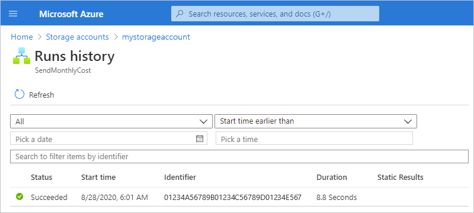

# Manage Azure resources by creating automation tasks (preview)

To help you manage [Azure resources](../azure-resource-manager/management/overview.md#terminology) more easily, you can create and automate management tasks for a specific resource or resource group by using automation task templates, which vary based on the resource type. For example, for an [Azure storage account](../storage/common/storage-account-overview.md), you can set up an automation task that sends you the monthly cost for that storage account. For an [Azure virtual machine](../virtual-machines/), you can turn on and turn off that virtual machine. Currently, here are the task templates available in this preview:

* All Azure resources and resource groups: **Send monthly cost for resource**

* Azure virtual machines:

  * **Send monthly cost for resource**
  * **Delete old blobs**

* Azure Storage accounts:

  * **Send monthly cost for resource**
  * **Delete old blobs**

When you create an automation task for a resource in the Azure portal, you do so from that specific resource, for example, the actual storage account or virtual machine resource. Behind the scenes, an automation task is actually a workflow that's run by the [Azure Logic Apps](../logic-apps/logic-apps-overview.md) service. You can review and customize the task template's underlying workflow by opening the template in the Logic App Designer. After a task finishes at least one run, you can review the status, history, inputs, and outputs for each run.

This article shows you how to complete the following tasks:

* Create an automation task for a specific Azure resource.

* Review the run status, inputs, outputs, and other historical information for each finished task.

* Open the task template to review or edit the template's underlying workflow in the Logic App Designer.

## How do automation tasks differ from Azure Automation?

Currently, you can create automation tasks only at the resource level, view their run history, and edit the task templates.

while [Azure Automation](../automation/automation-intro.md) is a cloud-based automation and configuration service that supports consistent management across your Azure and non-Azure environments. The service comprises [process automation for orchestrating processes](../automation/automation-intro.md#process-automation) by using [runbooks](../automation/automation-runbook-execution.md), configuration management with [change tracking and inventory](../automation/change-tracking.md), update management, shared capabilities, and heterogeneous features. Automation gives you complete control during deployment, operations, and decommissioning of workloads and resources.

## Prerequisites

* An Azure account and subscription. If you don't have a subscription, [sign up for a free Azure account](https://azure.microsoft.com/free/?WT.mc_id=A261C142F).

* The Azure resource that you want to manage. This article uses an Azure storage account as the example.

## Create an automation task

1. In the [Azure portal](https://portal.azure.com), find the resource that you want to manage.

1. On the resource's menu, under **Settings**, select **Automation tasks** > **Add** so that you can select a task template.

   

1. On the **Add a Task** pane, under **Select a template**, select the template for the task that you want to create, and then select **Next: Authentication**.

   This example continues by selecting the **Send monthly cost for resource** task template.

   

1. Under **Authentication**, in the **Connections** section, select **Create** for each connection to the resource required for this task. The types of connections required for each task vary based on the selected task.

   

1. When you're prompted, sign in with your Azure account credentials.

   

   Each successfully created connection looks similar to this example:

   

1. After you create all the necessary connections, select **Next: Configuration**.

1. Under **Configuration**, provide a name for the task and any other information required for the task. When you're done, select **Create**.

   > [!NOTE]
   > You can't change the task name after creation.

   For example, tasks that send you email notifications require an email address.

   

   The task that you created, which is automatically live and running, now appears on the **Automation tasks** list.

   

   > [!TIP]
   > If the task doesn't appear, try refreshing the tasks list. On the toolbar, select **Refresh**.

## Review task history

To view a task's history of runs along with their statuses, inputs, outputs, and other information, follow these steps:

1. In the [Azure portal](https://portal.azure.com), find the resource that has the task history that you want to review.

1. On the resource's menu, under **Settings**, select **Automation tasks**.

1. In the tasks list, find the task that you want to review. In that task's **Runs** column, select **View**.

   

   The **Runs history** pane shows all the runs for the task along with their statuses, start times, identifiers, and run durations.

   

   Here the possible statuses for a run:

   | Status | Description |
   |--------|-------------|
   | **Cancelled** | The task was cancelled while running. |
   | **Failed** | The task has at least one failed action, but no subsequent actions existed to handle the failure. |
   | **Running** | The task is currently running. |
   | **Succeeded** | All actions succeeded. 
**Note**: A task can still finish successfully if an action failed, but a subsequent action existed to handle the failure. |
   | **Waiting** | The run hasn't started yet and is paused because an earlier instance of the task is still running. |
   |||

   For more information, see [Review runs history](../logic-apps/monitor-logic-apps.md#review-runs-history)

1. To view the statuses for each step in the run, select the run.

   The **Logic app run** pane opens and shows the workflow that ran for the task and each step along with their status and run duration.

   

1. To review the inputs and outputs for each step, expand the step that you want to inspect.

   For example, the first step 

## Customize the task

## Next steps