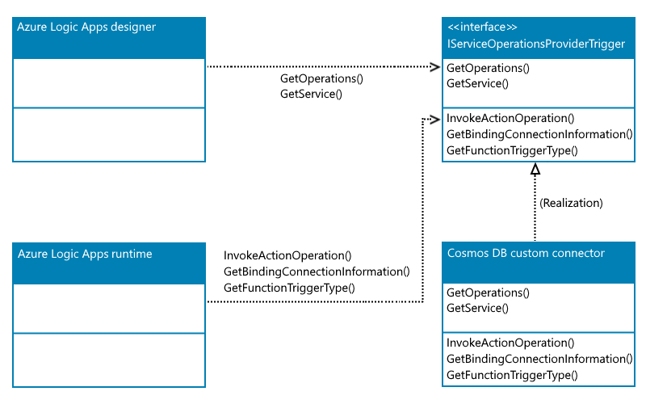
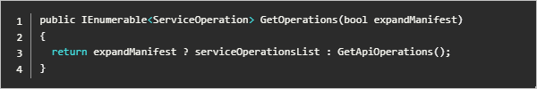
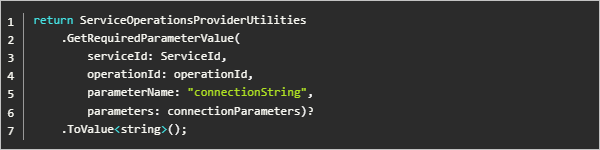
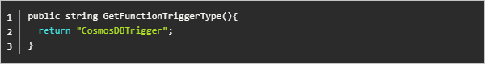

# Create built-in connectors for Standard logic app workflows in single-tenant Azure Logic Apps

In Azure Logic Apps, connectors provide triggers and actions, which are operations that you use in logic app workflows to quickly access data, events, and actions across other apps, services, systems, protocols, and platforms. These operations expand the capabilities in your cloud apps and on-premises apps to work with new and existing data. Connectors are powered by the connector infrastructure that runs in Azure.

Connectors are either built-in or managed. Built-in connectors run natively on the Azure Logic Apps runtime, which means they're hosted in the same process as the runtime and provide higher throughput, low latency, and local connectivity. Managed connectors are deployed, hosted, and managed by Microsoft. When you use a connector operation for the first time in a workflow, some connectors don't require that you create a connection first, but many other connectors require this step. The connection is actually a separate Azure resource that provides access to the target app, service, system, protocol, or platform.

In single-tenant Azure Logic Apps, Standard logic app workflows are powered by a redesigned runtime. This runtime uses the [Azure Functions extensibility model](../azure-functions/functions-bindings-register.md) and provides a key capability for you to create and use your own built-in connectors. With a Standard logic app, a connection definition file contains the required configuration information for the connections created by these built-in connectors. When single-tenant Azure Logic Apps officially released, new built-in connectors included Azure Blob Storage, Azure Event Hubs, Azure Service Bus, and SQL Server, and this list continues to grow. However, if you need connectors that aren't available, you can create your own built-in connectors with the same Azure Functions extensibility framework used by the included built-in connectors.

This article shows how you can use the Azure Functions extensibility framework to create an example built-in connector for Azure Cosmos DB. Generally, you can add any Azure Functions trigger or action to your own built-in connector. Currently, trigger capabilities are limited to only [Azure Functions specific triggers](../azure-functions/functions-bindings-example.md).

For more information about connectors, review the following documentation:

* [About connectors in Azure Logic Apps](../connectors/apis-list.md)

## Prerequisites

* [Visual Studio]

* [NuGet package for Microsoft.Azure.Workflows.WebJobs.Extension](https://www.nuget.org/packages/Microsoft.Azure.Workflows.WebJobs.Extension/).

  The example in this article creates a .NET Core 3.1 class library project and adds this NuGet package as a NuGet reference to the project. The service provider interface is implemented to provide the operations for the Cosmos DB connector.

<a name="built-in-connector-plugin-model"></a>

## Built-in connector extensibility model

The Azure Logic Apps built-in connector extensibility model uses the Azure Functions extensibility model, which enables the capability to add built-in connector implementations, such as Azure Functions extensions. You can use this capability to create, build, and package your own built-in connectors as Azure Functions extensions that anyone can use.

In this built-in connector extensibility model, you have to implement the following operation parts:

* Operation descriptions

  Operation descriptions are metadata about the operations implemented by your custom built-in connector. The workflow designer primarily uses these descriptions to drive the authoring and monitoring experiences for your connector's operations.

  For example, the designer uses operation descriptions to understand the input parameters required by a specific operation and to facilitate generating the outputs' property tokens, based on the schema for the operation's outputs.

* Operation invocations

  At runtime, the Azure Logic Apps runtime uses these implementations to call the specified operation in the workflow definition.

After you finish your custom built-in connector extension, you also have to register the your custom built-in connector with the [Azure Functions runtime extension](../azure-functions/functions-bindings-register.md). These steps are described later in this article.

<a name="service-provider-interface-implementation"></a>

## Service provider interface implementation

The **Microsoft.Azure.Workflows.WebJobs.Extension** NuGet package that you add to your class library project provides the *service provider interface* that's named **IServiceOperationsTriggerProvider**, which your custom built-in connector has to implement. As part of the operation descriptions, this **IServiceOperationsTriggerProvider** interface provides the following methods that your custom built-in connector has to implement:

* **GetOperations()**
* **GetService()**

The workflow designer uses these methods to describe the triggers and actions that the custom built-in connector provides and shows on the designer surface. The **GetService()** method also specifies the connection's input parameters that are required by the designer.

For any action operations, your custom built-in connector has to implement the method that's named **InvokeActionOperation()**, which is invoked during action execution. If you want to use the Azure Functions binding that's used for the managed Azure connector triggers, you have to provide the connection information and trigger bindings as required by Azure Functions. Your custom built-in connector has to implement the following methods for the Azure Functions binding:

* **GetBindingConnectionInformation()**: If you want to use the Azure Functions trigger type, this method provides the required connection parameters information to the Azure Functions trigger binding.

* **GetTriggerType()**: If you want to use an Azure Functions built-in trigger as a custom built-in connector trigger, this method returns the string that's the same as the **type** parameter in the Azure Functions trigger binding.

The following diagram shows the method implementation that's required by the Azure Logic Apps designer and runtime:



The following table has more information about the methods that require implementation:

| Operation method | Method details | Example |
|------------------|----------------|---------|
| **GetOperations()** | The Azure Logic Apps designer requires this method, which provides a high-level description for your service, including the service descriptions, brand color, icon URL, connection parameters, capabilities, and so on. |  |
| **GetService()** | The Azure Logic Apps designer requires this method, which gets the list of operations that are implemented by your service. This operations list is based on Swagger schema. |  |
| **InvokeOperation()** | This method is invoked for each action operation that executes during runtime. You can use any client, such as FTPClient, HTTPClient, and so on, as required by your custom built-in connector actions. If you're only implementing the trigger as in this example, you don't have to implement this method. |  |
| **GetBindingConnectionInformation()** | If you want to use the Azure Functions trigger type, this method provides the required connection parameters information to the Azure Functions trigger binding. |  |
| **GetFunctionTriggerType()** | If you want to use an Azure Functions built-in trigger as a custom built-in connector trigger, you have to return the string that's the same as the **type** parameter in the Azure Functions trigger binding, for example, `"type": "cosmosDBTrigger"`. |  |
||||

<a name="example-custom-built-in-connector"></a>

## Example custom built-in connector

This example creates a sample custom built-in Cosmos DB connector that has only one trigger and no actions. The trigger fires when a new document is added to the lease collection or container in Cosmos DB and then runs a workflow that uses the input payload as the Cosmos document.

| Operation | Operation details | Description |
|-----------|-------------------|-------------|
| Trigger | Receive document | This trigger operation runs when an insert or update operation happens in the specified Cosmos DB database and collection. |
| Action | None | This connector doesn't define any action operations. |
||||

The sample connector uses the functionality from the [Azure Functions capability for the Cosmos DB trigger](../azure-functions/functions-bindings-cosmosdb-v2-trigger.md), based on the Azure Functions trigger binding.

For the complete sample, review [Logic App built-in custom connector](https://github.com/praveensri/LogicAppCustomConnector).

<a name="register-connector"></a>

## Register your connector as an Azure Functions extension

To load your built-in connector extension during the Azure Functions runtime start process, you need to add the Azure Functions extension registration as a startup job and register the service provider as part of the service provider list. Based on the type of data that your built-in trigger needs as inputs, optionally add the converter. This example converts the **Document** data type for Cosmos DB Documents to a **JObject** array.

The following sections show how to register your custom built-in connector as an Azure Functions extension.

### 1. Create the startup job

1. Create a startup class by using the assembly attribute **[assembly:WebJobsStartup]**.

1. Implement the **IWebJobsStartup** interface.

1. In the **Configure()** method, register the extension and inject the service provider. For example, the following code snippet shows the startup class implementation for the sample custom built-in Cosmos DB connector:

   ```csharp
   using Microsoft.Azure.WebJobs;
   using Microsoft.Azure.WebJobs.Hosting;
   using Microsoft.Extensions.DependencyInjection.Extensions;

   [assembly: Microsoft.Azure.WebJobs.Hosting.WebJobsStartup(typeof(ServiceProviders.CosmosDb.Extensions.CosmosDbTriggerStartup))]

   namespace ServiceProviders.CosmosDb.Extensions
   {
       public class CosmosDbServiceProviderStartup : IWebJobsStartup 
       {
           public void Configure(IWebJobsBuilder builder)
           {
               // Register the extension.
               builder.AddExtension<CosmosDbServiceProvider>)();

               // Use dependency injection (DI) for the trigger service operation provider.
               builder.Services.TryAddSingleton<CosmosDbTriggerServiceOperationProvider>();
           }
       }
   }
   ```

   For more information, review [Register services - Use dependency injection in .NET Azure Functions](../azure-functions/functions-dotnet-dependency-injection.md#register-services).

### 2. Register the service provider

Now, register the service provider implementation as an Azure Functions extension. This example uses the built-in [Azure Cosmos DB trigger for Azure Functions](../azure-functions/functions-bindings-cosmosdb-v2-trigger.md?tabs=in-process%2Cfunctionsv2&pivots=programming-language-csharp) as a new trigger and registers the new Cosmos DB service provider for an existing list of service providers, which is already part of the Azure Logic Apps extension.

```csharp
using Microsoft.Azure.Documents;
using Microsoft.Azure.WebJobs.Description;
using Microsoft.Azure.WebJobs.Host.Config;
using Microsoft.Azure.Workflows.ServiceProviders.Abstractions;
using Microsoft.WindowsAzure.ResourceStack.Common.Extensions;
using Microsoft.WindowsAzure.ResourceStack.Common.Json;
using Microsoft.WindowsAzure.ResourceStack.Common.Storage.Cosmos;
using Newtonsoft.Json.Linq;
using System;
using System.Collections.Generic;

namespace ServiceProviders.CosmosDb.Extensions
{
   [Extension("CosmosDbServiceProvider", configurationSection: "CosmosDbServiceProvider")]
   public class CosmosDbServiceProvider : IExtensionConfigProvider
   {
      public CosmosDbServiceProvider(ServiceOperationsProvider serviceOperationsProvider, CosmosDbTriggerServiceOperationProvider operationsProvider)
      {
         serviceOperationsProvider.RegisterService(ServiceName, ServiceId, operationsProvider);
      }
      public void Initialize(ExtensionConfigContext context)
      {
         // Converts the Cosmos Document list to a JObject array.
         context.AddConverter<IReadOnlyList<Document>, JObject[]>(ConvertDocumentToJObject);
      }
      public static JObject[] ConvertDocumentToJObject(IReadOnlyList<Document> data)
      {
         List<JObject> jobjects = new List<JObject>();
         foreach(var doc in data)
         {
            jobjects.Add((JObject)doc.ToJToken());
         }
         return jobjects.ToArray();
      }
   }
}
```

### 3. Add the converter

Add Converter: Logic app has implemented the generic way to handle any function built-in trigger using the JObject array, we may need (optional) to add a converter to convert the read only list of Azure Cosmos DB document into JObject array. Once the converter is ready as shown in above example, we need to register the converter as part of ExtensionConfigContext.

```csharp
// Converts the Cosmos Document list to a JObject array.
context.AddConverter<IReadOnlyList<Document>, JObject[]>(ConvertDocumentToJObject);
```

### Code map diagram for implemented classes

When you're done, review the following code map diagram that shows the implementation for all the classes in **Microsoft.Azure.Workflows.ServiceProvider.Extensions.CosmosDB**:

* **CosmosDbServiceProviderStartup**
* **CosmosDbServiceProvider**
* **CosmosDbServiceOperationProvider**


## Test your custom built-in connector

