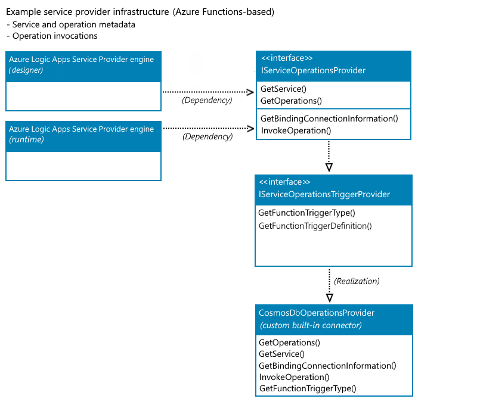
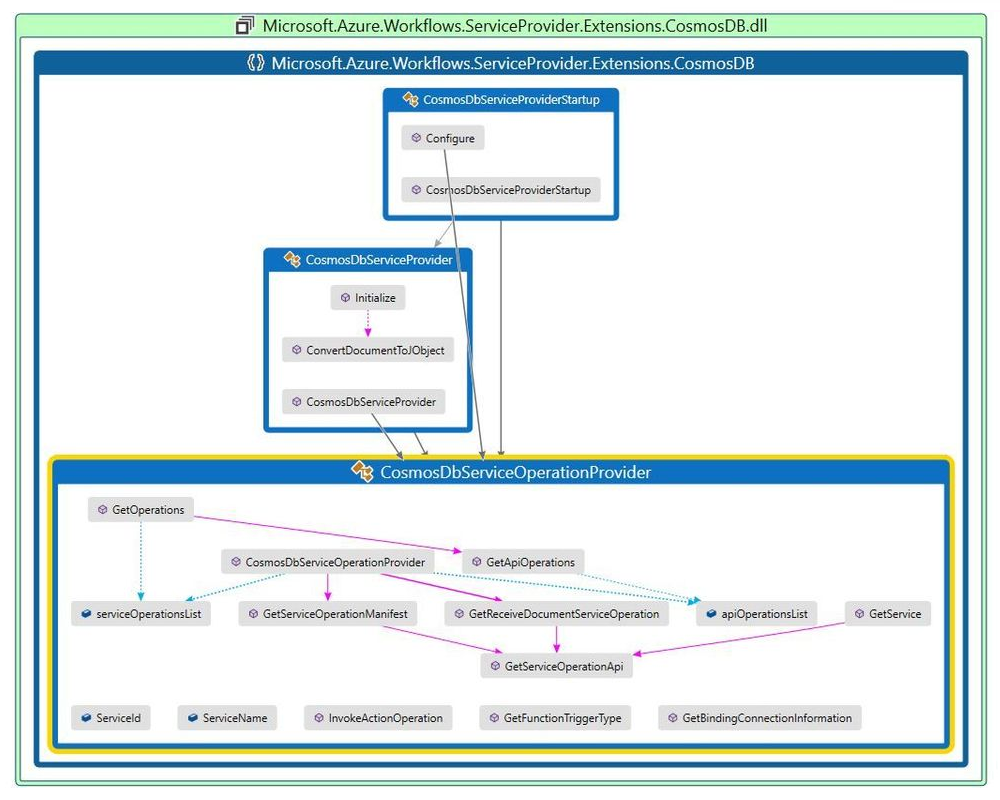
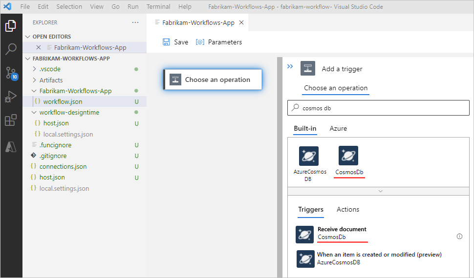
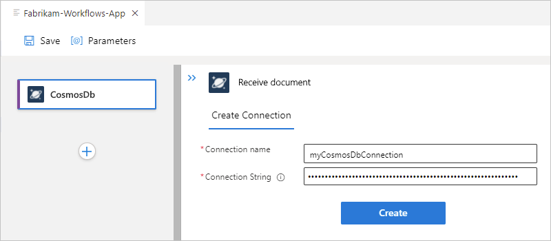
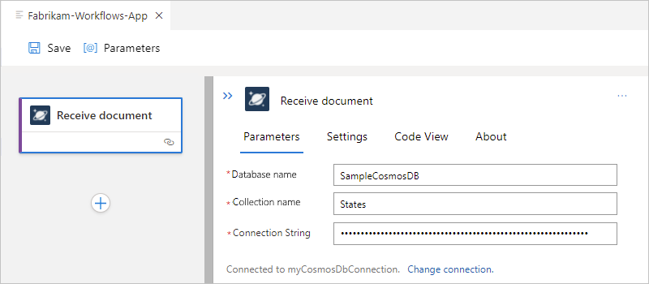
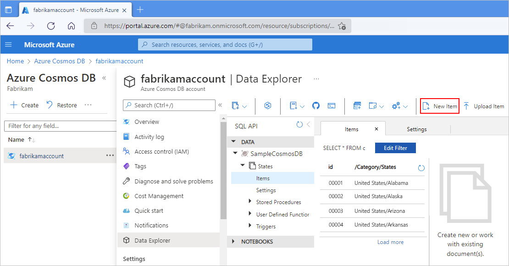

# Create custom built-in connectors for Standard logic apps in single-tenant Azure Logic Apps

[!INCLUDE [logic-apps-sku-standard](../../includes/logic-apps-sku-standard.md)]

If you need connectors that aren't available in Standard logic app workflows, you can create your own built-in connectors using the same extensibility model that's used by the [*service provider-based built-in connectors*](custom-connector-overview.md#service-provider-interface-implementation) available for Standard workflows in single-tenant Azure Logic Apps. This extensibility model is based on the [Azure Functions extensibility model](../azure-functions/functions-bindings-register.md).

This article shows how to create an example custom built-in Azure Cosmos DB connector, which has a single Azure Functions-based trigger and no actions. The trigger fires when a new document is added to the lease collection or container in Azure Cosmos DB and then runs a workflow that uses the input payload as the Azure Cosmos DB document.

| Operation | Operation details | Description |
|-----------|-------------------|-------------|
| Trigger | When a document is received | This trigger operation runs when an insert operation happens in the specified Azure Cosmos DB database and collection. |
| Action | None | This connector doesn't define any action operations. |
||||

This sample connector uses the same functionality as the [Azure Cosmos DB trigger for Azure Functions](../azure-functions/functions-bindings-cosmosdb-v2-trigger.md), which is based on [Azure Functions triggers and bindings](../azure-functions/functions-triggers-bindings.md). For the complete sample, review [Sample custom built-in Azure Cosmos DB connector - Azure Logic Apps Connector Extensions](https://github.com/Azure/logicapps-connector-extensions/tree/CosmosDB/src/CosmosDB).

For more information, review the following documentation:

* [Custom connectors for Standard logic apps](custom-connector-overview.md#custom-connector-standard)
* [Service provider-based built-in connectors](custom-connector-overview.md#service-provider-interface-implementation)
* [Single-tenant Azure Logic Apps](single-tenant-overview-compare.md)

## Prerequisites

* An Azure account and subscription. If you don't have a subscription, [sign up for a free Azure account](https://azure.microsoft.com/free/?WT.mc_id=A261C142F).

* Basic knowledge about single-tenant Azure Logic Apps, Standard logic app workflows, connectors, and how to use Visual Studio Code for creating single tenant-based workflows. For more information, review the following documentation:

  * [Single-tenant versus multi-tenant and integration service environment for Azure Logic Apps](single-tenant-overview-compare.md)

  * [Create an integration workflow with single-tenant Azure Logic Apps (Standard) - Azure portal](create-single-tenant-workflows-azure-portal.md)

* [Visual Studio Code with the Azure Logic Apps (Standard) extension and other prerequisites installed](create-single-tenant-workflows-azure-portal.md#prerequisites). Your installation should already include the [NuGet package for Microsoft.Azure.Workflows.WebJobs.Extension](https://www.nuget.org/packages/Microsoft.Azure.Workflows.WebJobs.Extension/).

  > [!NOTE]
  >
  > This authoring capability is currently available only in Visual Studio Code.

* An Azure Cosmos DB account, database, and container or collection. For more information, review [Quickstart: Create an Azure Cosmos DB account, database, container and items from the Azure portal](../cosmos-db/sql/create-cosmosdb-resources-portal.md).

## High-level steps

The following outline describes the high-level steps to build the example connector:

1. Create a class library project.

1. In your project, add the **Microsoft.Azure.Workflows.WebJobs.Extension** NuGet package as a NuGet reference.

1. Provide the operations for your built-in connector by using the NuGet package to implement the methods for the interfaces named [**IServiceOperationsProvider**](custom-connector-overview.md#iserviceoperationsprovider) and [**IServiceOperationsTriggerProvider**](custom-connector-overview.md#iserviceoperationstriggerprovider).

1. Register your custom built-in connector with the Azure Functions runtime extension.

1. Install the connector for use.

## Create your class library project

1. In Visual Studio Code, create a .NET Core 3.1 class library project.

1. In your project, add the NuGet package named **Microsoft.Azure.Workflows.WebJobs.Extension** as a NuGet reference.

## Implement the service provider interface

To provide the operations for the sample built-in connector, in the **Microsoft.Azure.Workflows.WebJobs.Extension** NuGet package, implement the methods for the following interfaces. The following diagram shows the interfaces with the method implementations that the Azure Logic Apps designer and runtime expect for a custom built-in connector that has an Azure Functions-based trigger:



### IServiceOperationsProvider

This interface includes the following methods that provide the operation manifest and performs your service provider's specific tasks or actual business logic in your custom built-in connector. For more information, review [IServiceOperationsProvider](custom-connector-overview.md#iserviceoperationsprovider).

* [**GetService()**](#getservice)

  The designer in Azure Logic Apps requires the [**GetService()**](#getservice) method to retrieve the high-level metadata for your custom service, including the service description, connection input parameters required on the designer, capabilities, brand color, icon URL, and so on.

* [**GetOperations()**](#getoperations)

  The designer in Azure Logic Apps requires the [**GetOperations()**](#getoperations) method to retrieve the operations implemented by your custom service. The operations list is based on Swagger schema. The designer also uses the operation metadata to understand the input parameters for specific operations and generate the outputs as property tokens, based on the schema of the output for an operation.

* [**GetBindingConnectionInformation()**](#getbindingconnectioninformation)

  If your trigger is an Azure Functions-based trigger type, the runtime in Azure Logic Apps requires the [**GetBindingConnectionInformation()**](#getbindingconnectioninformation) method to provide the required connection parameters information to the Azure Functions trigger binding.

* [**InvokeOperation()**](#invokeoperation)

  If your connector has actions, the runtime in Azure Logic Apps requires the [**InvokeOperation()**](#invokeoperation) method to call each action in your connector that runs during workflow execution. If your connector doesn't have actions, you don't have to implement the **InvokeOperation()** method.

  In this example, the Azure Cosmos DB custom built-in connector doesn't have actions. However, the method is included in this example for completeness.

For more information about these methods and their implementation, review these methods later in this article.

### IServiceOperationsTriggerProvider

You can add or expose an [Azure Functions trigger or action](../azure-functions/functions-bindings-example.md) as a service provider trigger in your custom built-in connector. To use the Azure Functions-based trigger type and the same Azure Functions binding as the Azure managed connector trigger, implement the following methods to provide the connection information and trigger bindings as required by Azure Functions. For more information, review [IServiceOperationsTriggerProvider](custom-connector-overview.md#iserviceoperationstriggerprovider).

* The [**GetFunctionTriggerType()**](#getfunctiontriggertype) method is required to return the string that's the same as the **type** parameter in the Azure Functions trigger binding.

* The [**GetFunctionTriggerDefinition()**](#getfunctiontriggerdefinition) has a default implementation, so you don't need to explicitly implement this method. However, if you want to update the trigger's default behavior, such as provide extra parameters that the designer doesn't expose, you can implement this method and override the default behavior.

### Methods to implement

The following sections describe the methods that the example connector implements. For the complete sample, review [Sample CosmosDbServiceOperationProvider.cs](https://github.com/Azure/logicapps-connector-extensions/blob/CosmosDB/src/CosmosDB/Providers/CosmosDbServiceOperationProvider.cs).

#### GetService()

The designer requires the following method to get the high-level description for your service:

```csharp
public ServiceOperationApi GetService()
{
   return this.CosmosDBApis.ServiceOperationServiceApi();
}
```

#### GetOperations()

The designer requires the following method to get the operations implemented by your service. This operations list is based on Swagger schema.

```csharp
public IEnumerable<ServiceOperation> GetOperations(bool expandManifest)
{
   return expandManifest ? serviceOperationsList : GetApiOperations();
}
```

#### GetBindingConnectionInformation()

To use the Azure Functions-based trigger type, the following method provides the required connection parameters information to the Azure Functions trigger binding.

```csharp
public string GetBindingConnectionInformation(string operationId, InsensitiveDictionary<JToken> connectionParameters)
{
   return ServiceOperationsProviderUtilities
      .GetRequiredParameterValue(
         serviceId: ServiceId,
         operationId: operationID,
         parameterName: "connectionString",
         parameters: connectionParameters)?
      .ToValue<string>();
}
```

#### InvokeOperation()

The example Azure Cosmos DB custom built-in connector doesn't have actions, but the following method is included for completeness:

```csharp
public Task<ServiceOperationResponse> InvokeOperation(string operationId, InsensitiveDictionary<JToken> connectionParameters, ServiceOperationRequest serviceOperationRequest)
{
   throw new NotImplementedException();
}
```

#### GetFunctionTriggerType()

To use an Azure Functions-based trigger as a trigger in your connector, you have to return the string that's the same as the **type** parameter in the Azure Functions trigger binding.

The following example returns the string for the out-of-the-box built-in Azure Cosmos DB trigger, `"type": "cosmosDBTrigger"`:

```csharp
public string GetFunctionTriggerType()
{
   return "CosmosDBTrigger";
}
```

#### GetFunctionTriggerDefinition()

This method has a default implementation, so you don't need to explicitly implement this method. However, if you want to update the trigger's default behavior, such as provide extra parameters that the designer doesn't expose, you can implement this method and override the default behavior.

<a name="register-connector"></a>

## Register your connector

To load your custom built-in connector extension during the Azure Functions runtime start process, you have to add the Azure Functions extension registration as a startup job and register your connector as a service provider in service provider list. Based on the type of data that your built-in trigger needs as inputs, optionally add the converter. This example converts the **Document** data type for Azure Cosmos DB documents to a **JObject** array.

The following sections show how to register your custom built-in connector as an Azure Functions extension.

### Create the startup job

1. Create a startup class using the assembly attribute named **[assembly:WebJobsStartup]**.

1. Implement the **IWebJobsStartup** interface. In the **Configure()** method, register the extension and inject the service provider.

   For example, the following code snippet shows the startup class implementation for the sample custom built-in Azure Cosmos DB connector:

   ```csharp
   using Microsoft.Azure.WebJobs;
   using Microsoft.Azure.WebJobs.Hosting;
   using Microsoft.Extensions.DependencyInjection.Extensions;

   [assembly: Microsoft.Azure.WebJobs.Hosting.WebJobsStartup(typeof(ServiceProviders.CosmosDb.Extensions.CosmosDbTriggerStartup))]

   namespace ServiceProviders.CosmosDb.Extensions
   {
      public class CosmosDbServiceProviderStartup : IWebJobsStartup
      {
         // Initialize the workflow service.
         public void Configure(IWebJobsBuilder builder)
         {
               // Register the extension.
               builder.AddExtension<CosmosDbServiceProvider>)();

               // Use dependency injection (DI) for the trigger service operation provider.
               builder.Services.TryAddSingleton<CosmosDbTriggerServiceOperationsProvider>();
         }
      }
   }
   ```

   For more information, review [Register services - Use dependency injection in .NET Azure Functions](../azure-functions/functions-dotnet-dependency-injection.md#register-services).

### Register the service provider

Now, register the service provider implementation as an Azure Functions extension with the Azure Logic Apps engine. This example uses the built-in [Azure Cosmos DB trigger for Azure Functions](../azure-functions/functions-bindings-cosmosdb-v2-trigger.md?tabs=in-process%2Cfunctionsv2&pivots=programming-language-csharp) as a new trigger. This example also registers the new Azure Cosmos DB service provider for an existing list of service providers, which is already part of the Azure Logic Apps extension. For more information, review [Register Azure Functions binding extensions](../azure-functions/functions-bindings-register.md).

```csharp
using Microsoft.Azure.Documents;
using Microsoft.Azure.WebJobs.Description;
using Microsoft.Azure.WebJobs.Host.Config;
using Microsoft.Azure.Workflows.ServiceProviders.Abstractions;
using Microsoft.WindowsAzure.ResourceStack.Common.Extensions;
using Microsoft.WindowsAzure.ResourceStack.Common.Json;
using Microsoft.WindowsAzure.ResourceStack.Common.Storage.Cosmos;
using Newtonsoft.Json.Linq;
using System;
using System.Collections.Generic;

namespace ServiceProviders.CosmosDb.Extensions
{
   [Extension("CosmosDbServiceProvider", configurationSection: "CosmosDbServiceProvider")]
   public class CosmosDbServiceProvider : IExtensionConfigProvider
   {
      // Initialize a new instance for the CosmosDbServiceProvider class.
      public CosmosDbServiceProvider(ServiceOperationsProvider serviceOperationsProvider, CosmosDbTriggerServiceOperationsProvider operationsProvider)
      {
         serviceOperationsProvider.RegisterService(serviceName: CosmosDBServiceOperationsProvider.ServiceName, serviceOperationsProviderId: CosmosDBServiceOperationsProvider.ServiceId, serviceOperationsProviderInstance: operationsProvider);
      }

      // Convert the Azure Cosmos DB Document array to a generic JObject array.
      public static JObject[] ConvertDocumentToJObject(IReadOnlyList<Document> data)
      {
         List<JObject> jobjects = new List<JObject>();

         foreach(var doc in data)
         {
            jobjects.Add((JObject)doc.ToJToken());
         }

         return jobjects.ToArray();
      }

      // In the Initialize method, you can add any custom implementation.
      public void Initialize(ExtensionConfigContext context)
      {
         // Convert the Azure Cosmos DB Document list to a JObject array.
         context.AddConverter<IReadOnlyList<Document>, JObject[]>(ConvertDocumentToJObject);
      }
   }
}
```

### Add a converter

Azure Logic Apps has a generic way to handle any Azure Functions built-in trigger by using the **JObject** array. However, if you want to convert the read-only list of Azure Cosmos DB documents into a **JObject** array, you can add a converter. When the converter is ready, register the converter as part of **ExtensionConfigContext** as shown earlier in this example:

```csharp
// Convert the Azure Cosmos DB  document list to a JObject array.
context.AddConverter<IReadOnlyList<Document>, JObject[]>(ConvertDocumentToJObject);
```

### Class library diagram for implemented classes

When you're done, review the following class diagram that shows the implementation for all the classes in the **Microsoft.Azure.Workflows.ServiceProvider.Extensions.CosmosDB.dll** extension bundle:

* **CosmosDbServiceOperationsProvider**
* **CosmosDbServiceProvider**
* **CosmosDbServiceProviderStartup**



## Install your connector

To add the NuGet reference from the previous section, in the extension bundle named **Microsoft.Azure.Workflows.ServiceProvider.Extensions.CosmosDB.dll**, update the **extensions.json** file. For more information, go to the **Azure/logicapps-connector-extensions** repo, and review the PowerShell script named [**add-extension.ps1**](https://github.com/Azure/logicapps-connector-extensions/blob/main/src/Common/tools/add-extension.ps1).

1. Update the extension bundle to include the custom built-in connector.

1. In Visual Studio Code, which should have the **Azure Logic Apps (Standard) for Visual Studio Code** extension installed, create a logic app project, and install the extension package using the following PowerShell command:

   **PowerShell**

   ```powershell
   dotnet add package "Microsoft.Azure.Workflows.ServiceProvider.Extensions.CosmosDB" --version 1.0.0  --source $extensionPath
   ```

   Alternatively, from your logic app project's directory using a PowerShell prompt, run the PowerShell script named [**add-extension.ps1**](https://github.com/Azure/logicapps-connector-extensions/blob/main/src/Common/tools/add-extension.ps1):

   ```powershell
   .\add-extension.ps1 {Cosmos-DB-output-bin-NuGet-folder-path} CosmosDB
   ```

   **Bash**

   To use Bash instead, from your logic app project's directory, run the PowerShell script with the following command:

   ```bash
   powershell -file add-extension.ps1 {Cosmos-DB-output-bin-NuGet-folder-path} CosmosDB
   ```

   If the extension for your custom built-in connector was successfully installed, you get output that looks similar to the following example:

   ```output
   C:\Users\{your-user-name}\Desktop\demoproj\cdbproj>powershell - file C:\myrepo\github\logicapps-connector-extensions\src\Common\tools\add-extension.ps1 C:\myrepo\github\logicapps-connector-extensions\src\CosmosDB\bin\Debug\CosmosDB

   Nuget extension path is C:\myrepo\github\logicapps-connector-extensions\src\CosmosDB\bin\Debug\
   Extension dll path is C:\myrepo\github\logicapps-connector-extensions\src\CosmosDB\bin\Debug\netcoreapp3.1\Microsoft.Azure.Workflows.ServiceProvider.Extensions.CosmosDB.dll
   Extension bundle module path is C:\Users\{your-user-name}\.azure-functions-core-tools\Functions\ExtensionBundles\Microsoft.Azure.Functions.ExtensionBundle.Workflows1.1.9
   EXTENSION PATH is C:\Users\{your-user-name}\.azure-functions-core-tools\Functions\ExtensionBundles\Microsoft.Azure.Functions.ExtensionBundle.Workflows\1.1.9\bin\extensions.json and dll Path is C:\myrepo\github\logicapps-connector-extensions\src\CosmosDB\bin\Debug\netcoreapp3.1\Microsoft.Azure.Workflows.ServiceProvider.Extensions.CosmosDB.dll
   SUCCESS: The process "func.exe" with PID 26692 has been terminated.
      Determining projects to restore...
      Writing C:\Users\{your-user-name}\AppData\Local\Temp\tmpD343.tmp`<br>
   info : Adding PackageReference for package 'Microsoft.Azure.Workflows.ServiceProvider.Extensions.CosmosDB' into project 'C:\Users\{your-user-name}\Desktop\demoproj\cdbproj.csproj'.
   info : Restoring packages for C:\Users\{your-user-name}\Desktop\demoproj\cdbproj.csproj...
   info : Package 'Microsoft.Azure.Workflows.ServiceProvider.Extensions.CosmosDB' is compatible with all the specified frameworks in project 'C:\Users\{your-user-name}\Desktop\demoproj\cdbproj.csproj'.
   info : PackageReference for package 'Microsoft.Azure.Workflows.ServiceProvider.Extensions.CosmosDB' version '1.0.0' updated in file 'C:\Users\{your-user-name}\Desktop\demoproj\cdbproj.csproj'.
   info : Committing restore...
   info : Generating MSBuild file C:\Users\{your-user-name}\Desktop\demoproj\cdbproj\obj\cdbproj.csproj.nuget.g.props.
   info : Generating MSBuild file C:\Users\{your-user-name}\Desktop\demoproj\cdbproj\obj\cdbproj.csproj.nuget.g.targets.
   info : Writing assets file to disk. Path: C:\Users\{your-user-name}\Desktop\demoproj\cdbproj\obj\project.assets.json.
   log : Restored C:\Users\{your-user-name}\Desktop\demoproj\cdbproj\cdbproj.csproj (in 1.5 sec).
   Extension CosmosDB is successfully added.

   C:\Users\{your-user-name}\Desktop\demoproj\cdbproj\>
   ```

1. If any **func.exe** process is running, make sure to close or exit that process before you continue to the next step.

## Test your connector

1. In Visual Studio Code, open your Standard logic app and blank workflow in the designer.

1. On the designer surface, select **Choose an operation** to open the connector operations picker.

1. Under the operations search box, select **Built-in**. In the search box, enter **cosmos db**.

   The operations picker shows your custom built-in connector and trigger, for example:

   

1. From the **Triggers** list, select your custom built-in trigger to start your workflow.

1. On the connection pane, provide the following property values to create a connection, for example:

   | Property | Required | Value | Description |
   |----------|----------|-------|-------------|
   | **Connection name** | Yes | <*Azure-Cosmos-DB-connection-name*> | The name for the Azure Cosmos DB connection to create |
   | **Connection String** | Yes | <*Azure Cosmos DB-DB-connection-string*> | The connection string for the Azure Cosmos DB database collection or lease collection where you want to add each new received document. |
   |||||

   

1. When you're done, select **Create**.

1. On the trigger properties pane, provide the following property values for your trigger, for example:

   | Property | Required | Value | Description |
   |----------|----------|-------|-------------|
   | **Database name** | Yes | <*Azure-Cosmos-DB-database-name*> | The name for the Azure Cosmos DB database to use |
   | **Collection name** | Yes | <*Azure-Cosmos-DB-collection-name*> | The name for the Azure Cosmos DB collection where you want to add each new received document. |
   |||||

   

   For this example, in code view, the workflow definition, which is in the **workflow.json** file, has a `triggers` JSON object that appears similar to the following sample:

   ```json
   {
      "definition": {
         "$schema": "https://schema.management.azure.com/providers/Microsoft.Logic/schemas/2016-06-01/workflowdefinition.json#",
         "actions": {},
         "contentVersion": "1.0.0.0",
         "outputs": {},
         "triggers": {
            "When_a_document_is_received": {
               "inputs":{
                  "parameters": {
                     "collectionName": "States",
                     "databaseName": "SampleCosmosDB"
                  },
                  "serviceProviderConfiguration": {
                     "connectionName": "cosmosDb",
                     "operationId": "whenADocumentIsReceived",
                     "serviceProviderId": "/serviceProviders/CosmosDb"
                  },
                  "splitOn": "@triggerOutputs()?['body']",
                  "type": "ServiceProvider"
               }
            }
         }
      },
      "kind": "Stateful"
   }
   ```

   The connection definition, which is in the **connections.json** file, has a `serviceProviderConnections` JSON object that appears similar to the following sample:

   ```json
   {
      "serviceProviderConnections": {
         "cosmosDb": {
            "parameterValues": {
               "connectionString": "@appsetting('cosmosDb_connectionString')"
            },
            "serviceProvider": {
               "id": "/serviceProviders/CosmosDb"
            },
            "displayName": "myCosmosDbConnection"
         }
      },
      "managedApiConnections": {}
   }
   ```

1. In Visual Studio Code, on the **Run** menu, select **Start Debugging**. (Press F5)

1. To trigger your workflow, in the Azure portal, open your Azure Cosmos DB account. On the account menu, select **Data Explorer**. Browse to the database and collection that you specified in the trigger. Add an item to the collection.

   

## Next steps

* [Source for sample custom built-in Azure Cosmos DB connector - Azure Logic Apps Connector Extensions](https://github.com/Azure/logicapps-connector-extensions/tree/CosmosDB/src/CosmosDB)

* [Built-in Service Bus trigger: batching and session handling](https://techcommunity.microsoft.com/t5/integrations-on-azure-blog/azure-logic-apps-running-anywhere-built-in-service-bus-trigger/ba-p/2079995)
