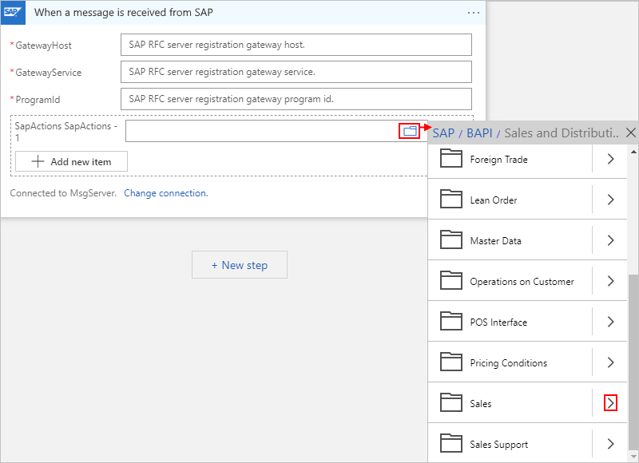
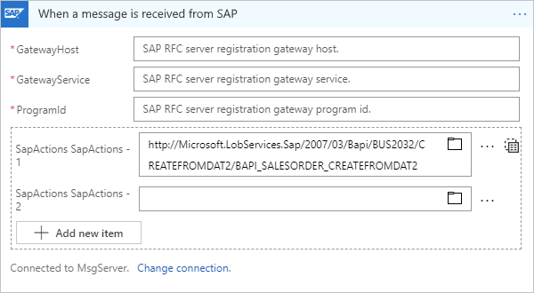
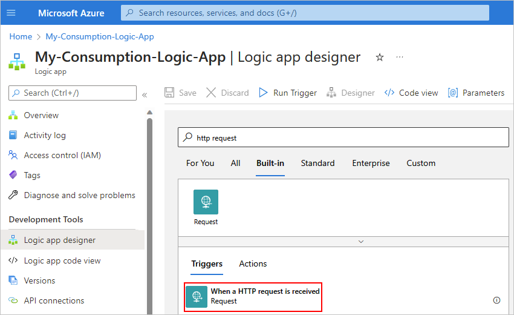
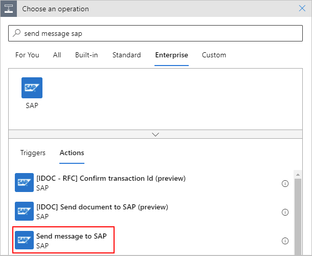
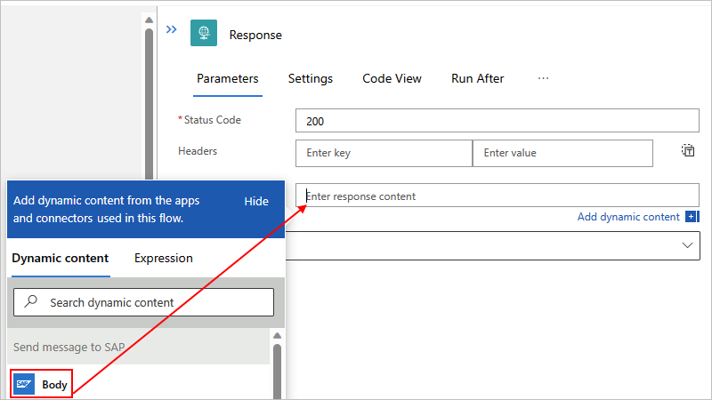
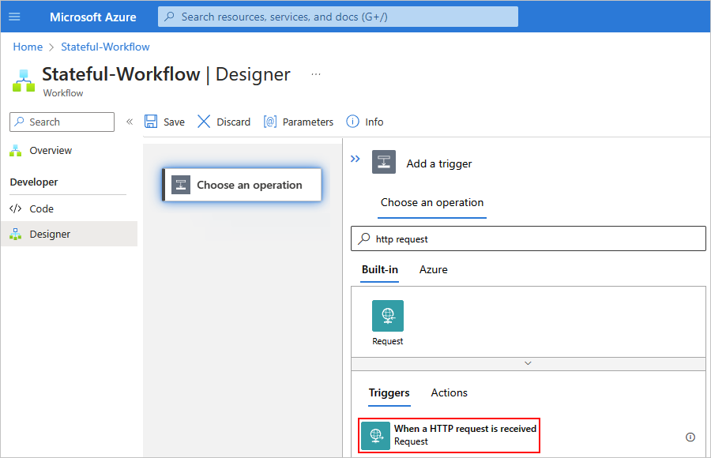

# Create example workflows for common SAP integration scenarios in Azure Logic Apps

[!INCLUDE [logic-apps-sku-consumption-standard](../../includes/logic-apps-sku-consumption-standard.md)]

This guide shows how to create example logic app workflows that demonstrate some common SAP integration scenarios using Azure Logic Apps and the SAP connector.

> [!IMPORTANT]
> For Standard logic app workflows, the SAP *built-in* connector is in preview and is subject to the 
> [Supplemental Terms of Use for Microsoft Azure Previews](https://azure.microsoft.com/support/legal/preview-supplemental-terms/).

<a name="receive-message-sap"></a>

## Receive message from SAP

The following example logic app workflow triggers when the workflow's SAP trigger receives a message from an SAP server.

<a name="add-sap-trigger"></a>

### Add an SAP trigger

### [Multi-tenant](#tab/multi-tenant)

1. In the [Azure portal](https://portal.azure.com), create a Consumption logic app and blank workflow, which opens in the designer.

1. In the designer, under the search box, select **Enterprise**. In the search box, enter **when message received sap**. From the triggers list, select the SAP trigger named **When a message is received from SAP**.

   

1. If you don't have an existing connection, provide the following connection information for your on-premises SAP server. Otherwise, continue with the next step to set up your SAP trigger.

   | Parameter | Description |
   |-----------|-------------|
   | **Connection name** | Enter a name for the connection. |
   | **Data Gateway** | 1. For **Subscription**, select the Azure subscription for the data gateway resource that you created in the Azure portal for your data gateway installation. <br><br>2. For **Connection Gateway**, select your data gateway resource in Azure. |
   | **Client** | The SAP client ID to use for connecting to your SAP server |
   | **Authentication Type** | The authentication type to use for your connection |
   | **Logon Type** | Select either **Application Server** or **Group**, and then configure the corresponding required parameters, even though they appear optional: <br><br>- **Application Server**: **AS Host**, **AS Service**, and **AS System Number** <br><br>- **Group**: **MS Server Host**, **MS Service Name or Port Number**, **MS System ID**, and **MS Logon Group** |
   | **Safe Typing** | This option available for backward compatibility and only checks the string length. By default, strong typing is used to check for invalid values by performing XML validation against the schema. This behavior can help you detect issues earlier. Learn more about the [Safe Typing option](logic-apps-using-sap-connector.md#safe-typing). |

1. When you're done, select **Create**.

   Azure Logic Apps sets up and tests your connection.

1. After the SAP trigger information box appears, provide the required values, based on your SAP server configuration, and add any other available parameters for this trigger, for example:

   * The **When a message is received from SAP** trigger supports SAP plain XML format. To receive IDocs as plain XML, in the trigger, open the **Add new parameter** list, select the **IDOC Format** parameter, and then set the parameter to **SapPlainXml**.

   * The **When a message is received from SAP** trigger supports flat files. To receive IDocs as a flat file, in the trigger, open the **Add new parameter** list, select the **IDOC Format** parameter, and then set the parameter to **FlatFile**.

     If you also use the [Flat File Decode action](logic-apps-enterprise-integration-flatfile.md) in your workflow, in your flat file schema, you have to use the **early_terminate_optional_fields** property and set the value to **true**. This requirement is necessary because the flat file IDoc data record that's sent by SAP on the tRFC call named `IDOC_INBOUND_ASYNCHRONOUS` isn't padded to the full SDATA field length. Azure Logic Apps provides the flat file IDoc original data without padding as received from SAP. Also, when you combine this SAP trigger with the Flat File Decode action, the schema that's provided to the action must match.

   * To filter the messages that you receive from your SAP server, open the trigger's **Add new parameter** list, select **SapActions**, and then [specify a list of SAP actions](#filter-with-sap-actions).

     For example, in the **SapActions** section, for the **SapActions - 1** parameter, you can use the file picker to select an SAP action:

     

     Or, you can manually specify an action:

     

     Here's an example that shows how the action appears when you set up the trigger to receive more than one message.

     

     For more information about the SAP action, review [Message schemas for IDoc operations](/biztalk/adapters-and-accelerators/adapter-sap/message-schemas-for-idoc-operations)

1. Now save your logic app workflow so you can start receiving messages from your SAP server. On the designer toolbar, select **Save**.

   Your logic app workflow is now ready to receive messages from your SAP server.

   > [!NOTE]
   > The SAP trigger in these steps is a webhook-based trigger, not a polling trigger. If you're using the data gateway, 
   > the trigger is called from the data gateway only when a message exists, so no polling is necessary.

1. In your logic app workflow's trigger history, check that the trigger registration succeeds.

If you receive a **500 Bad Gateway** or **400 Bad Request** error with a message similar to **service 'sapgw00' unknown**, the network service name resolution to port number is failing, for example:

```json
{
   "body": {
      "error": {
         "code": 500,
         "source": "EXAMPLE-FLOW-NAME.eastus.environments.microsoftazurelogicapps.net",
         "clientRequestId": "00000000-0000-0000-0000-000000000000",
         "message": "BadGateway",
         "innerError": {
            "error": {
               "code": "UnhandledException",
               "message": "\nERROR service 'sapgw00' unknown\nTIME Wed Nov 11 19:37:50 2020\nRELEASE 721\nCOMPONENT NI (network interface)\nVERSION 40\nRC -3\nMODULE ninti.c\nLINE 933\nDETAIL NiPGetServByName: 'sapgw00' not found\nSYSTEM CALL getaddrinfo\nCOUNTER 1\n\nRETURN CODE: 20"
            }
         }
      }
   }
}
```

* **Option 1:** In your API connection and trigger configuration, replace your gateway service name with its port number. In the example error, `sapgw00` needs to be replaced with a real port number, for example, `3300`. This is the only available option for ISE.

* **Option 2:** If you're using the on-premises data gateway, you can add the gateway service name to the port mapping in `%windir%\System32\drivers\etc\services` and then restart the on-premises data gateway service, for example:

  ```text
  sapgw00  3300/tcp
  ```

You might get a similar error when SAP Application server or Message server name resolves to the IP address. For ISE, you must specify the IP address for your SAP Application server or Message server. For the on-premises data gateway, you can instead add the name to the IP address mapping in `%windir%\System32\drivers\etc\hosts`, for example:

```text
10.0.1.9 SAPDBSERVER01 # SAP System Server VPN IP by computer name
10.0.1.9 SAPDBSERVER01.someguid.xx.xxxxxxx.cloudapp.net # SAP System Server VPN IP by fully qualified computer name
```

---

## Receive IDoc packets from SAP

You can set up SAP to [send IDocs in packets](https://help.sap.com/viewer/8f3819b0c24149b5959ab31070b64058/7.4.16/4ab38886549a6d8ce10000000a42189c.html), which are batches or groups of IDocs. To receive IDoc packets, the SAP connector, and specifically the trigger, doesn't need extra configuration. However, to process each item in an IDoc packet after the trigger receives the packet, some additional steps are required to split the packet into individual IDocs.

Here's an example that shows how to extract individual IDocs from a packet by using the [`xpath()` function](./workflow-definition-language-functions-reference.md#xpath):

1. Before you start, you need a logic app workflow with an SAP trigger. If you don't already have this trigger in your logic app workflow, follow the previous steps in this topic to [set up a logic app workflow with an SAP trigger](#receive-message-sap).

   > [!IMPORTANT]
   > The SAP **Program ID** is case-sensitive. Make sure you consistently use the same case format for your **Program ID** 
   > when you configure your logic app workflow and SAP server. Otherwise, you might receive the following errors in the 
   > tRFC Monitor (T-Code SM58) when you attempt to send an IDoc to SAP:
   >
   > * **Function IDOC_INBOUND_ASYNCHRONOUS not found**
   > * **Non-ABAP RFC client (partner type) not supported**
   >
   > For more information from SAP, review the following notes (login required) 
   > [https://launchpad.support.sap.com/#/notes/2399329](https://launchpad.support.sap.com/#/notes/2399329) 
   > and [https://launchpad.support.sap.com/#/notes/353597](https://launchpad.support.sap.com/#/notes/353597).

   For example:

   

1. To immediately reply with the status of your SAP request, [add a Response action to your logic app workflow](../connectors/connectors-native-reqres.md#add-a-response-action).

   As a best practice, add this action immediately after your trigger to free up the communication channel with your SAP server. In Response action, use one of the following status codes (`statusCode`):

   | Status code | Description |
   |-------------|-------------|
   | **200 OK** | This status code always contains a payload, even if the server generates a payload body of zero length. |
   | **202 Accepted** | The request was accepted for processing, but processing isn't complete yet. |
   | **204 No Content** | The server successfully fulfilled the request, and there's no additional content to send in the response payload body. |

1. Get the root namespace from the XML IDoc that your logic app workflow receives from SAP. To extract this namespace from the XML document, add a step that creates a local string variable and stores that namespace by using an `xpath()` expression:

   `xpath(xml(triggerBody()?['Content']), 'namespace-uri(/*)')`

   

1. To extract an individual IDoc, add a step that creates an array variable and stores the IDoc collection by using another `xpath()` expression:

   `xpath(xml(triggerBody()?['Content']), '/*[local-name()="Receive"]/*[local-name()="idocData"]')`

   

   The array variable makes each IDoc available for your logic app workflow to process individually by enumerating over the collection. In this example, the logic app workflow transfers each IDoc to an SFTP server by using a loop:

   

   Each IDoc must include the root namespace, which is the reason why the file content is wrapped inside a `<Receive></Receive>` element along with the root namespace before sending the IDoc to the downstream app, or SFTP server in this case.

You can use the quickstart template for this pattern by selecting this template in the workflow designer when you create a new logic app workflow.


---

## Send IDoc messages to SAP server

To create a logic app workflow that sends an IDoc message to an SAP server and returns a response, follow these examples:

1. [Create a logic app workflow that's triggered by an HTTP request.](#add-request-trigger)
1. [Add an SAP action to your workflow that sends a message to SAP.](#add-sap-action-send-message)
1. [Add a Response action to your workflow.](#add-response-action)
1. [Create a remote function call (RFC) request-response pattern, if you're using an RFC to receive replies from SAP ABAP.](#create-rfc-request-response)
1. [Test your workflow.](#test-your-workflow)

<a name="add-request-trigger"></a>

### Add the Request trigger

To have your workflow receive IDocs from SAP over XML HTTP, you can use the [Request trigger](../connectors/connectors-native-reqres.md). To receive IDocs over Common Programming Interface Communication (CPIC) as plain XML or as a flat file, review the section, [Receive message from SAP](#receive-message-sap).

This section continues with the Request trigger, so first, create a workflow with an endpoint where your SAP server can send HTTP *POST* requests to your workflow. When your workflow receives these requests, the trigger fires and runs the next step in your workflow.

1. In the [Azure portal](https://portal.azure.com), create a logic app resource and a blank workflow, which opens the designer.

1. On the designer, under the search box, select **Built-in**. In the search box, enter **http request**. 

1. From the triggers list, select the Request trigger named **When a HTTP request is received**.

   

1. Save your workflow. On the designer toolbar, select **Save**.

   This step generates an endpoint URL, which hat can receive requests that now appears in your trigger.

   

<a name="add-sap-action-send-message"></a>

### Add an SAP action to send message

Next, create an action to send your IDoc message to SAP when your Request trigger fires. By default, strong typing is used to check for invalid values by performing XML validation against the schema. This behavior can help you detect issues earlier. The **Safe Typing** option is available for backward compatibility and only checks the string length. Learn more about the [Safe Typing option](logic-apps-using-sap-connector.md#safe-typing).

Based on your logic app type, follow the corresponding steps:

#### [Multi-tenant](#tab/multi-tenant)

1. In the workflow designer, under the trigger, select **New step**.

1. Under the **Choose an operation** search box, select **Enterprise**. In the search box, enter **send message sap**. From the actions list, select the SAP action named **Send message to SAP**.

   

1. If your connection already exists, continue to the next step. Otherwise, provide the following connection information for your on-premises SAP server:

   1. Provide a name for the connection.

   1. If you're using the data gateway, follow these steps:

      1. In the **Data Gateway** section, under **Subscription**, first select the Azure subscription for the data gateway resource that you created in the Azure portal for your data gateway installation.

      1. Under **Connection Gateway**, select your data gateway resource in Azure.

   1. For the **Logon Type** property, follow the step based on whether the property is set to **Application Server** or **Group**.

      * For **Application Server**, these properties, which usually appear optional, are required:

        

      * For **Group**, these properties, which usually appear optional, are required:

        

        In the SAP server, the Logon Group is maintained by opening the **CCMS: Maintain Logon Groups** (T-Code SMLG) dialog box. For more information, review [SAP Note 26317 - Set up for LOGON group for automatic load balancing](https://service.sap.com/sap/support/notes/26317).

      By default, strong typing is used to check for invalid values by performing XML validation against the schema. This behavior can help you detect issues earlier. The **Safe Typing** option is available for backward compatibility and only checks the string length. Learn more about the [Safe Typing option](logic-apps-using-sap-connector.md#safe-typing).

   1. When you're finished, select **Create**.

      Azure Logic Apps sets up and tests your connection to make sure that the connection works properly.

      > [!NOTE]
      > If you receive the following error, there is a problem with your installation of the SAP NCo client library: 
      >
      > **Test connection failed. Error 'Failed to process request. Error details: 'could not load file or assembly 'sapnco, Version=3.0.0.42, Culture=neutral, PublicKeyToken 50436dca5c7f7d23' or one of its dependencies. The system cannot find the file specified.'.'**
      >
      > Make sure to [install the required version of the SAP NCo client library and meet all other prerequisites](logic-apps-using-sap-connector.md#sap-client-library-prerequisites).

1. Now find and select an action from your SAP server.

   1. In the **SAP Action** box, select the folder icon. From the file list, find and select the SAP Message you want to use. To navigate the list, use the arrows.

      This example selects an IDoc with the **Orders** type.

      

      If you can't find the action you want, you can manually enter a path, for example:

      

      > [!TIP]
      > Provide the value for **SAP Action** through the expression editor. 
      > That way, you can use the same action for different message types.

      For more information about IDoc operations, review [Message schemas for IDoc operations](/biztalk/adapters-and-accelerators/adapter-sap/message-schemas-for-idoc-operations).

   1. Click inside the **Input Message** box so that the dynamic content list appears. From that list, under **When a HTTP request is received**, select the **Body** field.

      This step includes the body content from your Request trigger and sends that output to your SAP server.

      

      When you're finished, your SAP action looks like this example:

      

1. Save your logic app workflow. On the designer toolbar, select **Save**.

### Send flat file IDocs

You can use IDocs with a flat file schema if you wrap them in an XML envelope. To send a flat file IDoc, use the generic instructions to [add an SAP action to send your IDoc message](#add-an-sap-action-to-send-message), but with the following changes:

1. In the **Send message to SAP** action, use the following URI:

   **`http://Microsoft.LobServices.Sap/2007/03/Idoc/SendIdoc`**

1. Format your input message with an XML envelope.

For example, review the following example XML payload:

```xml
<SendIdoc xmlns="http://Microsoft.LobServices.Sap/2007/03/Idoc/">
  <idocData>EDI_DC 3000000001017945375750 30INVOIC011BTSVLINV30KUABCABCFPPC LDCA X004010810 4 SAPMSX LSEDI ABCABCFPPC 000d3ae4-723e-1edb-9ca4-cc017365c9fd 20210217054521INVOICINVOIC01ZINVOIC2RE 20210217054520
E2EDK010013000000001017945375000001E2EDK01001000000010 ABCABC1.00000 0060 INVO9988298128 298.000 298.000 LB Z4LR EN 0005065828 L
E2EDKA1 3000000001017945375000002E2EDKA1 000000020 RS ABCABCFPPC 0005065828 ABCABCABC ABCABC Inc. Limited Risk Distributor ABCABC 1950 ABCABCABCA Blvd ABCABAABCAB L5N8L9 CA ABCABC E ON V-ABCABC LDCA
E2EDKA1 3000000001017945375000003E2EDKA1 000000020 AG 0005065828 ABCABCFPPC ABCABC ABCABC ABCABC - FPP ONLY 88 ABCABC Crescent ABCABAABCAB L5R 4A2 CA ABCABC 111 111 1111 E ON ABCABCFPPC EN
E2EDKA1 3000000001017945375000004E2EDKA1 000000020 RE 0005065828 ABCABCFPPC ABCABC ABCABC ABCABC - FPP ONLY 88 ABCABC Crescent ABCABAABCAB L5R 4A2 CA ABCABC 111 111 1111 E ON ABCABCFPPC EN
E2EDKA1 3000000001017945375000005E2EDKA1 000000020 RG 0005065828 ABCABCFPPC ABCABC ABCABC ABCABC - FPP ONLY 88 ABCABC Crescent ABCABAABCAB L5R 4A2 CA ABCABC 111 111 1111 E ON ABCABCFPPC EN
E2EDKA1 3000000001017945375000006E2EDKA1 000000020 WE 0005001847 41 ABCABC ABCABC INC (ABCABC) DC A. ABCABCAB 88 ABCABC CRESCENT ABCABAABCAB L5R 4A2 CA ABCABC 111-111-1111 E ON ABCABCFPPC EN
E2EDKA1 3000000001017945375000007E2EDKA1 000000020 Z3 0005533050 ABCABCABC ABCABC Inc. ABCA Bank Swift Code -ABCABCABCAB Sort Code - 1950 ABCABCABCA Blvd. Acc No -1111111111 ABCABAABCAB L5N8L9 CA ABCABC E ON ABCABCFPPC EN
E2EDKA1 3000000001017945375000008E2EDKA1 000000020 BK 1075 ABCABCABC ABCABC Inc 1950 ABCABCABCA Blvd ABCABAABCAB ON L5N 8L9 CA ABCABC (111) 111-1111 (111) 111-1111 ON
E2EDKA1 3000000001017945375000009E2EDKA1 000000020 CR 1075 CONTACT ABCABCABC 1950 ABCABCABCA Blvd ABCABAABCAB ON L5N 8L9 CA ABCABC (111) 111-1111 (111) 111-1111 ON
E2EDK02 3000000001017945375000010E2EDK02 000000020 0099988298128 20210217
E2EDK02 3000000001017945375000011E2EDK02 000000020 00140-N6260-S 20210205
E2EDK02 3000000001017945375000012E2EDK02 000000020 0026336270425 20210217
E2EDK02 3000000001017945375000013E2EDK02 000000020 0128026580537 20210224
E2EDK02 3000000001017945375000014E2EDK02 000000020 01740-N6260-S
E2EDK02 3000000001017945375000015E2EDK02 000000020 900IAC
E2EDK02 3000000001017945375000016E2EDK02 000000020 901ZSH
E2EDK02 3000000001017945375000017E2EDK02 000000020 9078026580537 20210217
E2EDK03 3000000001017945375000018E2EDK03 000000020 02620210217
E2EDK03 3000000001017945375000019E2EDK03 000000020 00120210224
E2EDK03 3000000001017945375000020E2EDK03 000000020 02220210205
E2EDK03 3000000001017945375000021E2EDK03 000000020 01220210217
E2EDK03 3000000001017945375000022E2EDK03 000000020 01120210217
E2EDK03 3000000001017945375000023E2EDK03 000000020 02420210217
E2EDK03 3000000001017945375000024E2EDK03 000000020 02820210418
E2EDK03 3000000001017945375000025E2EDK03 000000020 04820210217
E2EDK17 3000000001017945375000026E2EDK17 000000020 001DDPDelivered Duty Paid
E2EDK17 3000000001017945375000027E2EDK17 000000020 002DDPdestination
E2EDK18 3000000001017945375000028E2EDK18 000000020 00160 0 Up to 04/18/2021 without deduction
E2EDK28 3000000001017945375000029E2EDK28 000000020 CA BOFACATT Bank of ABCABAB ABCABC ABCABAB 50127217 ABCABCABC ABCABC Inc.
E2EDK28 3000000001017945375000030E2EDK28 000000020 CA 026000082 ABCAbank ABCABC ABCABAB 201456700OLD ABCABCABC ABCABC Inc.
E2EDK28 3000000001017945375000031E2EDK28 000000020 GB ABCAGB2L ABCAbank N.A ABCABA E14, 5LB GB63ABCA18500803115593 ABCABCABC ABCABC Inc. GB63ABCA18500803115593
E2EDK28 3000000001017945375000032E2EDK28 000000020 CA 020012328 ABCABANK ABCABC ABCABAB ON M5J 2M3 2014567007 ABCABCABC ABCABC Inc.
E2EDK28 3000000001017945375000033E2EDK28 000000020 CA 03722010 ABCABABC ABCABABC Bank of Commerce ABCABAABCAB 64-04812 ABCABCABC ABCABC Inc.
E2EDK28 3000000001017945375000034E2EDK28 000000020 IE IHCC In-House Cash Center IHCC1075 ABCABCABC ABCABC Inc.
E2EDK28 3000000001017945375000035E2EDK28 000000020 CA 000300002 ABCAB Bank of ABCABC ABCABAB 0021520584OLD ABCABCABC ABCABC Inc.
E2EDK28 3000000001017945375000036E2EDK28 000000020 US USCC US Cash Center (IHC) city USCC1075 ABCABCABC ABCABC Inc.
E2EDK29 3000000001017945375000037E2EDK29 000000020 0064848944US A CAD CA ABCABC CA United States US CA A Air Air
E2EDKT1 3000000001017945375000038E2EDKT1 000000020 ZJ32E EN
E2EDKT2 3000000001017945375000039E2EDKT2 000038030 GST/HST877845941RT0001 *
E2EDKT2 3000000001017945375000040E2EDKT2 000038030 QST1021036966TQ0001 *
E2EDKT1 3000000001017945375000041E2EDKT1 000000020 Z4VL
E2EDKT2 3000000001017945375000042E2EDKT2 000041030 0.000 *
E2EDKT1 3000000001017945375000043E2EDKT1 000000020 Z4VH
E2EDKT2 3000000001017945375000044E2EDKT2 000043030 *
E2EDK14 3000000001017945375000045E2EDK14 000000020 008LDCA
E2EDK14 3000000001017945375000046E2EDK14 000000020 00710
E2EDK14 3000000001017945375000047E2EDK14 000000020 00610
E2EDK14 3000000001017945375000048E2EDK14 000000020 015Z4F2
E2EDK14 3000000001017945375000049E2EDK14 000000020 0031075
E2EDK14 3000000001017945375000050E2EDK14 000000020 021M
E2EDK14 3000000001017945375000051E2EDK14 000000020 0161075
E2EDK14 3000000001017945375000052E2EDK14 000000020 962M
E2EDP010013000000001017945375000053E2EDP01001000000020 000011 2980.000 EA 298.000 LB MOUSE 298.000 Z4TN 4260
E2EDP02 3000000001017945375000054E2EDP02 000053030 00140-N6260-S 00000120210205 DFUE
E2EDP02 3000000001017945375000055E2EDP02 000053030 0026336270425 00001120210217
E2EDP02 3000000001017945375000056E2EDP02 000053030 0168026580537 00001020210224
E2EDP02 3000000001017945375000057E2EDP02 000053030 9100000 00000120210205 DFUE
E2EDP02 3000000001017945375000058E2EDP02 000053030 911A 00000120210205 DFUE
E2EDP02 3000000001017945375000059E2EDP02 000053030 912PP 00000120210205 DFUE
E2EDP02 3000000001017945375000060E2EDP02 000053030 91300 00000120210205 DFUE
E2EDP02 3000000001017945375000061E2EDP02 000053030 914CONTACT ABCABCABC 00000120210205 DFUE
E2EDP02 3000000001017945375000062E2EDP02 000053030 963 00000120210205 DFUE
E2EDP02 3000000001017945375000063E2EDP02 000053030 965 00000120210205 DFUE
E2EDP02 3000000001017945375000064E2EDP02 000053030 9666336270425 00000120210205 DFUE
E2EDP02 3000000001017945375000065E2EDP02 000053030 9078026580537 00001020210205 DFUE
E2EDP03 3000000001017945375000066E2EDP03 000053030 02920210217
E2EDP03 3000000001017945375000067E2EDP03 000053030 00120210224
E2EDP03 3000000001017945375000068E2EDP03 000053030 01120210217
E2EDP03 3000000001017945375000069E2EDP03 000053030 02520210217
E2EDP03 3000000001017945375000070E2EDP03 000053030 02720210217
E2EDP03 3000000001017945375000071E2EDP03 000053030 02320210217
E2EDP03 3000000001017945375000072E2EDP03 000053030 02220210205
E2EDP19 3000000001017945375000073E2EDP19 000053030 001418VVZ
E2EDP19 3000000001017945375000074E2EDP19 000053030 002RJR-00001 AB ABCABCABC Mouse FORBUS BLUETOOTH
E2EDP19 3000000001017945375000075E2EDP19 000053030 0078471609000
E2EDP19 3000000001017945375000076E2EDP19 000053030 003889842532685
E2EDP19 3000000001017945375000077E2EDP19 000053030 011CN
E2EDP26 3000000001017945375000078E2EDP26 000053030 00459064.20
E2EDP26 3000000001017945375000079E2EDP26 000053030 00352269.20
E2EDP26 3000000001017945375000080E2EDP26 000053030 01052269.20
E2EDP26 3000000001017945375000081E2EDP26 000053030 01152269.20
E2EDP26 3000000001017945375000082E2EDP26 000053030 0126795.00
E2EDP26 3000000001017945375000083E2EDP26 000053030 01552269.20
E2EDP26 3000000001017945375000084E2EDP26 000053030 00117.54
E2EDP26 3000000001017945375000085E2EDP26 000053030 00252269.20
E2EDP26 3000000001017945375000086E2EDP26 000053030 940 2980.000
E2EDP26 3000000001017945375000087E2EDP26 000053030 939 2980.000
E2EDP05 3000000001017945375000088E2EDP05 000053030 + Z400MS List Price 52269.20 17.54 1 EA CAD 2980
E2EDP05 3000000001017945375000089E2EDP05 000053030 + XR1 Tax Jur Code Level 6795.00 13.000 52269.20
E2EDP05 3000000001017945375000090E2EDP05 000053030 + Tax Subtotal1 6795.00 2.28 1 EA CAD 2980
E2EDP05 3000000001017945375000091E2EDP05 000053030 + Taxable Amount + TaxSubtotal1 59064.20 19.82 1 EA CAD 2980
E2EDP04 3000000001017945375000092E2EDP04 000053030 CX 13.000 6795.00 7000000000
E2EDP04 3000000001017945375000093E2EDP04 000053030 CX 0 0 7001500000
E2EDP04 3000000001017945375000094E2EDP04 000053030 CX 0 0 7001505690
E2EDP28 3000000001017945375000095E2EDP28 000053030 00648489440000108471609000 CN CN ABCAB ZZ 298.000 298.000 LB US 400 United Stat KY
E2EDPT1 3000000001017945375000096E2EDPT1 000053030 0001E EN
E2EDPT2 3000000001017945375000097E2EDPT2 000096040 AB ABCABCABC Mouse forBus Bluetooth EN/XC/XD/XX Hdwr Black For Bsnss *
E2EDS01 3000000001017945375000098E2EDS01 000000020 0011
E2EDS01 3000000001017945375000099E2EDS01 000000020 01259064.20 CAD
E2EDS01 3000000001017945375000100E2EDS01 000000020 0056795.00 CAD
E2EDS01 3000000001017945375000101E2EDS01 000000020 01159064.20 CAD
E2EDS01 3000000001017945375000102E2EDS01 000000020 01052269.20 CAD
E2EDS01 3000000001017945375000103E2EDS01 000000020 94200000 CAD
E2EDS01 3000000001017945375000104E2EDS01 000000020 9440.00 CAD
E2EDS01 3000000001017945375000105E2EDS01 000000020 9450.00 CAD
E2EDS01 3000000001017945375000106E2EDS01 000000020 94659064.20 CAD
E2EDS01 3000000001017945375000107E2EDS01 000000020 94752269.20 CAD
E2EDS01 3000000001017945375000108E2EDS01 000000020 EXT
Z2XSK010003000000001017945375000109Z2XSK01000000108030 Z400 52269.20
Z2XSK010003000000001017945375000110Z2XSK01000000108030 XR1 13.000 6795.00 CX
</idocData>
</SendIdoc>
```

<a name="add-response-action"></a>

### Add a Response action

Now, add the Response action to your workflow and include the output from the SAP action. That way, your workflow returns the results from your SAP server to the original requestor.

**Consumption** and **ISE**

1. In the workflow designer, under the SAP action, select **New step**.

1. Under the **Choose an operation** search box, select **Built-in**. In the search box, enter **response**.

1. From the actions list, select the action named **Response**.

1. In the **Response** action, select inside the **Body** box so that the dynamic content list appears. From that list, under **Send message to SAP**, select the **Body** field.

   

1. Save your workflow.

**Standard**

1. In the workflow designer, under the SAP action, select the plus sign (**+**) > **Add an action**.

1. Under the **Choose an operation** search box, select **Built-in**. In the search box, enter **response**.

1. In the **Add an action** pane, from the actions list, select the action named **Response**.

1. In the **Response** action pane, select inside the **Body** box so that the dynamic content list appears. From that list, under **Send message to SAP**, select the **Body** field.

   

1. Save your workflow.

#### Create RFC request-response

You must create a request and response pattern if you need to receive replies by using a remote function call (RFC) to Azure Logic Apps from SAP ABAP. To receive IDocs in your logic app workflow, you should make the workflow's first action a [Response action](../connectors/connectors-native-reqres.md#add-a-response-action) with a status code of `200 OK` and no content. This recommended step completes the SAP Logical Unit of Work (LUW) asynchronous transfer over tRFC immediately, which leaves the SAP CPIC conversation available again. You can then add further actions in your logic app workflow to process the received IDoc without blocking further transfers.

> [!NOTE]
> The SAP trigger receives IDocs over tRFC, which doesn't have a response parameter by design.

To implement a request and response pattern, you must first discover the RFC schema using the [`generate schema` command](#generate-schemas-for-artifacts-in-sap). The generated schema has two possible root nodes: 

* The request node, which is the call that you receive from SAP.
* The response node, which is your reply back to SAP.

In the following example, a request and response pattern is generated from the `STFC_CONNECTION` RFC module. The request XML is parsed to extract a node value in which SAP requests `<ECHOTEXT>`. The response inserts the current timestamp as a dynamic value. You receive a similar response when you send a `STFC_CONNECTION` RFC from a logic app workflow to SAP.

```xml
<STFC_CONNECTIONResponse xmlns="http://Microsoft.LobServices.Sap/2007/03/Rfc/">
  <ECHOTEXT>@{first(xpath(xml(triggerBody()?['Content']), '/*[local-name()="STFC_CONNECTION"]/*[local-name()="REQUTEXT"]/text()'))}</ECHOTEXT>
  <RESPTEXT>Azure Logic Apps @{utcNow()}</RESPTEXT>
</STFC_CONNECTIONResponse>
```

### Test your workflow

1. If your logic app resource isn't already enabled, on your logic app menu, select **Overview**. On the toolbar, select **Enable**.

1. On the designer toolbar, select **Run Trigger** > **Run**. This step manually starts your workflow.

1. Trigger your workflow by sending an HTTP POST request to the URL in your Request trigger. Include your message content with your request. To the send the request, you can use a tool such as [Postman](https://www.getpostman.com/apps).

   For this article, the request sends an IDoc file, which must be in XML format and include the namespace for the SAP action you're using, for example:

   ```xml
   <?xml version="1.0" encoding="UTF-8" ?>
   <Send xmlns="http://Microsoft.LobServices.Sap/2007/03/Idoc/2/ORDERS05//720/Send">
     <idocData>
       <...>
     </idocData>
   </Send>
   ```

1. After you send your HTTP request, wait for the response from your workflow.

   > [!NOTE]
   >
   > Your workflow might time out if all the steps required for the response don't finish within the [request timeout limit](logic-apps-limits-and-config.md). 
   > If this condition happens, requests might get blocked. To help you diagnose problems, learn how you can [check and monitor your logic apps](monitor-logic-apps.md).

You've now created a workflow that can communicate with your SAP server. Now that you've set up an SAP connection for your workflow, you can explore other available SAP actions, such as BAPI and RFC.

### [Standard](#tab/standard)

On the designer, make sure that **Choose an operation** is selected. Under the search box, select **Built-in**. In the search box, enter **http request**. From the triggers list, select the Request trigger named **When a HTTP request is received**.



---

<a name="filter-with-sap-actions"></a>

## Filter messages with SAP actions

You can optionally filter the messages that your logic app workflow receives from your SAP server by providing a list, or array, with a single or multiple SAP actions. By default, this array is empty, which means that your logic app receives all the messages from your SAP server without filtering.

When you set up the array filter, the trigger only receives messages from the specified SAP action types and rejects all other messages from your SAP server. However, this filter doesn't affect whether the typing of the received payload is weak or strong.

Any SAP action filtering happens at the level of the SAP Adapter for your on-premises data gateway. For more information, review [how to send test IDocs to Azure Logic Apps from SAP](#test-sending-idocs-from-sap).

If you can't send IDoc packets from SAP to your logic app workflow's trigger, review the Transactional RFC (tRFC) call rejection message in the SAP tRFC (T-Code SM58) dialog box. In the SAP interface, you might get the following error messages, which are clipped due to the substring limits on the **Status Text** field.