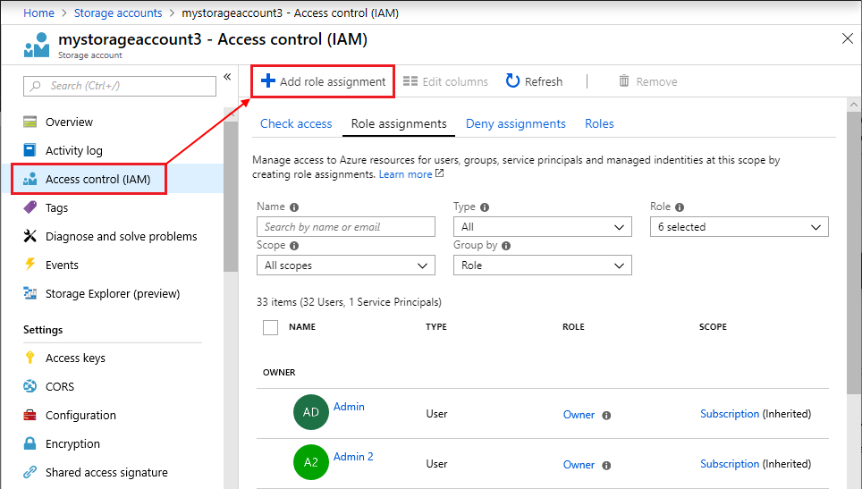
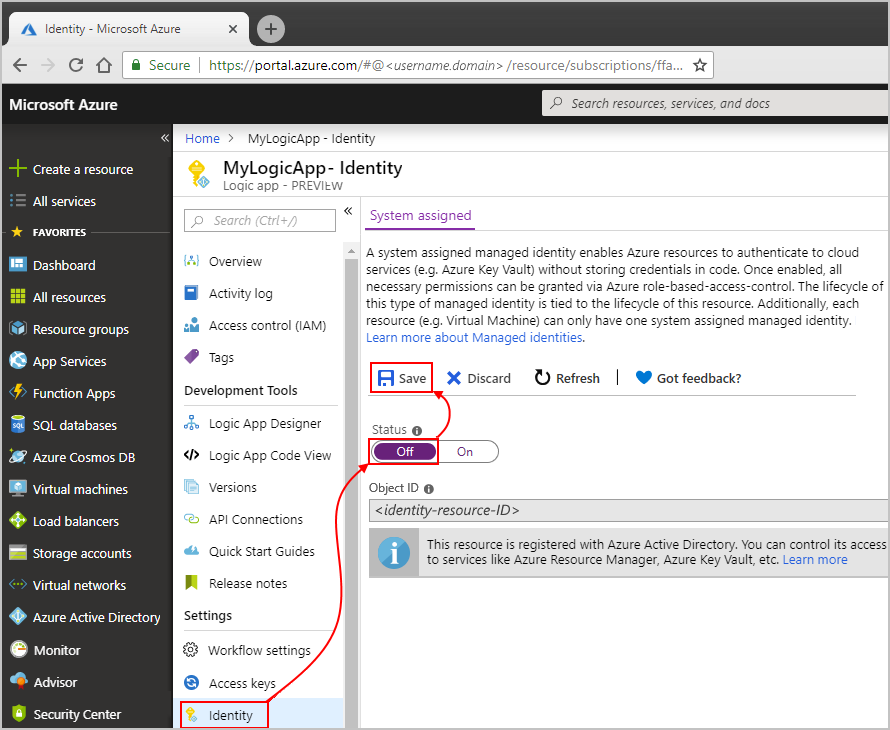

# Authenticate and access resources with managed identities in Azure Logic Apps

To access resources in other Azure Active Directory (Azure AD) tenants and 
authenticate your identity without signing in, your logic app can use a 
[managed identity](../active-directory/managed-identities-azure-resources/overview.md) 
(formerly known as Managed Service Identity or MSI), rather than credentials or secrets. 
Azure manages this identity for you and helps secure your credentials because you don't 
have to provide or rotate secrets. This article shows how you can set up and use a 
system-assigned managed identity for your logic app. For more information about managed identities, 
see [What is managed identities for Azure resources?](../active-directory/managed-identities-azure-resources/overview.md)

> [!NOTE]
> Your logic app can use managed identities only with 
> connectors that support managed identities. Currently, 
> only the HTTP connector supports managed identities.
>
> You can currently have up to 10 logic app workflows with 
> system-assigned managed identities in each Azure subscription.

## Prerequisites

* An Azure subscription, or if you don't have a subscription, 
<a href="https://azure.microsoft.com/free/" target="_blank">sign up for a free Azure account</a>.

* The logic app where you want to use the system-assigned 
managed identity. If you don't have a logic app, see 
[Create your first logic app workflow](../logic-apps/quickstart-create-first-logic-app-workflow.md).

<a name="enable-identity"></a>

## Enable managed identity

For system-assigned managed identities, you don't have to manually create that identity. 
To set up a system-assigned managed identity for your logic app, 
you can use these ways: 

* [Azure portal](#azure-portal) 
* [Azure Resource Manager templates](#template) 
* [Azure PowerShell](../active-directory/managed-identities-azure-resources/howto-assign-access-powershell.md) 

<a name="azure-portal"></a>

### Azure portal

To enable a system-assigned managed identity for your logic app through 
the Azure portal, turn on the **System assigned** setting in your logic 
app's identity settings.

1. In the [Azure portal](https://portal.azure.com), 
open your logic app in Logic App Designer.

1. On the logic app menu, under **Settings**, select **Identity**. 

1. Under **System assigned** > **Status**, choose **On**. 
Then, choose **Save** > **Yes**.

   

   Your logic app now has a system-assigned managed identity registered 
   in Azure Active Directory:

   

   | Property | Value | Description | 
   |----------|-------|-------------| 
   | **Object ID** | <*identity-resource-ID*> | A Globally Unique Identifier (GUID) that represents the system-assigned managed identity for your logic app in an Azure AD tenant | 
   ||| 

<a name="template"></a>

### Azure Resource Manager template

When you want to automate creating and deploying 
Azure resources such as logic apps, you can use 
[Azure Resource Manager templates](../logic-apps/logic-apps-create-deploy-azure-resource-manager-templates.md). 
To create a system-assigned managed identity for 
your logic app through a template, add the `"identity"` 
element and `"type"` property to your logic app workflow 
definition in your deployment template: 

```json
"identity": {
   "type": "SystemAssigned"
}
```

For example:

```json
{
   "apiVersion": "2016-06-01", 
   "type": "Microsoft.logic/workflows", 
   "name": "[variables('logicappName')]", 
   "location": "[resourceGroup().location]", 
   "identity": { 
      "type": "SystemAssigned" 
   }, 
   "properties": { 
      "definition": { 
         "$schema": "https://schema.management.azure.com/providers/Microsoft.Logic/schemas/2016-06-01/workflowdefinition.json#", 
         "actions": {}, 
         "parameters": {}, 
         "triggers": {}, 
         "contentVersion": "1.0.0.0", 
         "outputs": {} 
   }, 
   "parameters": {}, 
   "dependsOn": [] 
}
```

When Azure creates your logic app, that logic app's 
workflow definition includes these additional properties:

```json
"identity": {
   "type": "SystemAssigned",
   "principalId": "<principal-ID>",
   "tenantId": "<Azure-AD-tenant-ID>"
}
```

| Property | Value | Description | 
|----------|-------|-------------|
| **principalId** | <*principal-ID*> | A Globally Unique Identifier (GUID) that represents the logic app in the Azure AD tenant and sometimes appears as an "object ID" or `objectID` | 
| **tenantId** | <*Azure-AD-tenant-ID*> | A Globally Unique Identifier (GUID) that represents the Azure AD tenant where the logic app is now a member. Inside the Azure AD tenant, the service principal has the same name as the logic app instance. | 
||| 

<a name="access-other-resources"></a>

## Access resources with managed identity

After you create a system-assigned managed identity for your logic app, 
you can [give that identity access to other Azure resources](../active-directory/managed-identities-azure-resources/howto-assign-access-portal.md). 
You can then use that identity for authentication, just like any other 
[service principal](../active-directory/develop/app-objects-and-service-principals.md). 

> [!NOTE]
> Both the system-assigned managed identity and the resource where 
> you want to assign access must have the same Azure subscription.

### Assign access to managed identity

To give access to another Azure resource for your logic 
app's system-assigned managed identity, follow these steps:

1. In the Azure portal, go to the Azure resource where 
you want to assign access for your managed identity. 

1. From the resource's menu, select **Access control (IAM)**. 
On the toolbar, choose **Add** > **Add role assignment**.

   

1. Under **Add role assignment**, select the **Role** you want for the identity. 

1. In the **Assign access to** property, 
select **Azure AD user, group, or service principal**, 
if not already selected.

1. In the **Select** box, starting with the first character 
in your logic app's name, enter your logic app's name. 
When your logic app appears, select the logic app.

   

1. When you're done, choose **Save**.

### Authenticate with managed identity in logic app

After you set up your logic app with a system-assigned managed identity 
and assigned access to the resource you want for that identity, 
you can now use that identity for authentication. For example, 
you can use an HTTP action so your logic app can send an HTTP 
request or call to that resource. 

1. In your logic app, add the **HTTP** action.

1. Provide the necessary details for that action, 
such as the request **Method** and **URI** location 
for the resource you want to call.

   For example, suppose you're using Azure Active 
   Directory (Azure AD) authentication with 
   [one of these Azure services that support Azure AD](../active-directory/managed-identities-azure-resources/services-support-managed-identities.md#azure-services-that-support-azure-ad-authentication). 
   In the **URI** box, enter the endpoint URL for that Azure service. 
   So, if you're using Azure Resource Manager, enter this value in the **URI** property:

   `https://management.azure.com/subscriptions/<Azure-subscription-ID>?api-version=2016-06-01`

1. In the HTTP action, choose **Show advanced options**.

1. From the **Authentication** list, select **Managed Identity**. 
After you select this authentication, the **Audience** property 
appears with the default resource ID value:

   

   > [!IMPORTANT]
   > 
   > In the **Audience** property, the resource ID value must exactly match 
   > what Azure AD expects, including any required trailing slashes. 
   > You can find these resource ID values in this 
   > [table describing Azure services that support Azure AD](../active-directory/managed-identities-azure-resources/services-support-managed-identities.md#azure-services-that-support-azure-ad-authentication). 
   > For example, if you're using the Azure Resoruce Manager resource ID, 
   > make sure the URI has a trailing slash.

1. Continue building the logic app the way you want.

<a name="remove-identity"></a>

## Remove managed identity

To disable a system-assigned managed identity on your logic app, 
you can follow the steps similar to how you set up the identity 
through the Azure portal, Azure Resource Manager deployment templates, 
or Azure PowerShell.

When you delete your logic app, 
Azure automatically removes your logic app's 
system-assigned identity from Azure AD.

### Azure portal

To remove a system-assigned managed identity for your logic app 
through the Azure portal, turn off the **System assigned** setting 
in your logic app's identity settings.

1. In the [Azure portal](https://portal.azure.com), 
open your logic app in Logic App Designer.

1. On the logic app menu, under **Settings**, select **Identity**. 

1. Under **System assigned** > **Status**, choose **Off**. 
Then, choose **Save** > **Yes**.

   

### Deployment template

If you created the logic app's system-assigned managed identity 
with an Azure Resource Manager deployment template, set the 
`"identity"` element's `"type"` property to `"None"`. 
This action also deletes the principal ID from Azure AD.

```json
"identity": {
   "type": "None"
}
```

## Get support

* For questions, visit the [Azure Logic Apps forum](https://social.msdn.microsoft.com/Forums/en-US/home?forum=azurelogicapps).
* To submit or vote on feature ideas, visit the 
[Logic Apps user feedback site](https://aka.ms/logicapps-wish).
