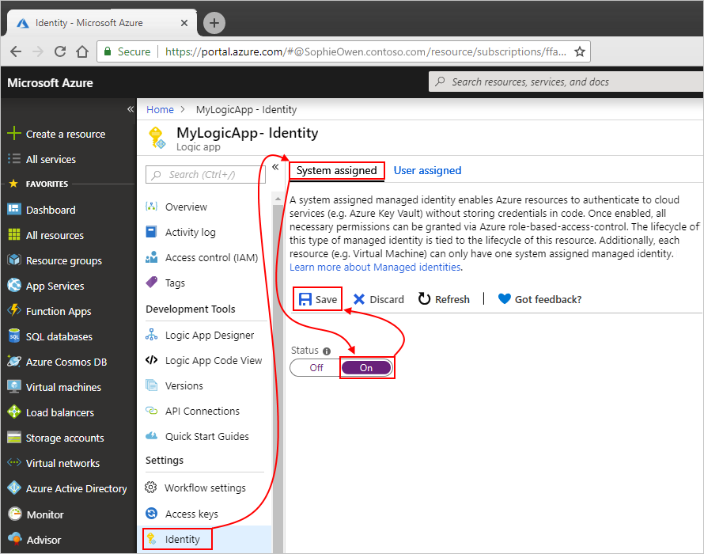
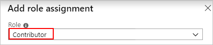
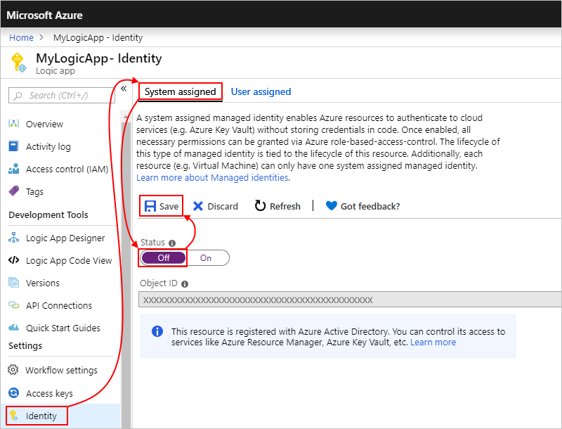

# Authenticate access to Azure resources by using managed identities in Azure Logic Apps

To access the resources in other Azure Active Directory (Azure AD) tenants and authenticate your identity without signing in, your logic app can use the system-assigned [managed identity](../active-directory/managed-identities-azure-resources/overview.md) (formerly known as Managed Service Identity or MSI), rather than credentials or secrets. Azure manages this identity for you and helps secure your credentials because you don't have to provide or rotate secrets. This article shows how to set up and use the system-assigned managed identity in your logic app. Currently, managed identities work only with [specific built-in triggers and actions](../logic-apps/logic-apps-securing-a-logic-app.md#add-authentication-to-outbound-calls), not managed connectors or connections.

For more information, see these topics:

* [Triggers and actions that support managed identities](../logic-apps/logic-apps-securing-a-logic-app.md#add-authentication-outbound)
* [Azure services that support Azure AD authentication with managed identities](../active-directory/managed-identities-azure-resources/services-support-managed-identities.md#azure-services-that-support-azure-ad-authentication)
* [Supported authentication types on outbound calls](../logic-apps/logic-apps-securing-a-logic-app.md#add-authentication-outbound)
* [Managed identity limits for logic apps](../logic-apps/logic-apps-limits-and-config.md#managed-identity)

## Prerequisites

* An Azure subscription, or if you don't have a subscription, [sign up for a free Azure account](https://azure.microsoft.com/free/). Both the managed identity and the target Azure resource where you want access need to use the same Azure subscription.

* [Azure AD administrator permissions](../active-directory/users-groups-roles/directory-assign-admin-roles.md) that can assign roles to managed identities in the same Azure AD tenant as the target resource. To give a managed identity access to an Azure resource, you need to add a role for that identity on the target resource.

* The target Azure resource that you want to access

* A logic app that uses [triggers and actions that support managed identities](../logic-apps/logic-apps-securing-a-logic-app.md#add-authentication-outbound)

<a name="system-assigned"></a>

## Enable system-assigned identity

Unlike user-assigned identities, you don't have to manually create the system-assigned identity. To set up your logic app's system-assigned identity, here are the options that you can use:

* [Azure portal](#azure-portal-system-logic-app)
* [Azure Resource Manager templates](#template-system-logic-app)
* [Azure PowerShell](../active-directory/managed-identities-azure-resources/howto-assign-access-powershell.md)
* [Azure CLI](../active-directory/managed-identities-azure-resources/howto-assign-access-cli.md)

<a name="azure-portal-system-logic-app"></a>

### Enable system-assigned identity in Azure portal

1. In the [Azure portal](https://portal.azure.com), open your logic app in Logic App Designer.

1. On the logic app menu, under **Settings**, select **Identity** > **System assigned**. Under **Status**, select **On** > **Save** > **Yes**.

   

   Your logic app can now use the system-assigned identity, which is registered with Azure Active Directory and is represented by an object ID.

   

   | Property | Value | Description |
   |----------|-------|-------------|
   | **Object ID** | <*identity-resource-ID*> | A Globally Unique Identifier (GUID) that represents the system-assigned identity for your logic app in your Azure AD tenant |
   ||||

1. Now follow the [steps that give the identity access to the resource](#access-other-resources).

<a name="template-system-logic-app"></a>

### Enable system-assigned identity in Azure Resource Manager template

To automate creating and deploying Azure resources such as logic apps, you can use [Azure Resource Manager templates](../logic-apps/logic-apps-azure-resource-manager-templates-overview.md). To enable the system-assigned managed identity for your logic app in the template, add the `identity` object and the `type` child property to the logic app's resource definition in the template, for example:

```json
{
   "apiVersion": "2016-06-01",
   "type": "Microsoft.logic/workflows",
   "name": "[variables('logicappName')]",
   "location": "[resourceGroup().location]",
   "identity": {
      "type": "SystemAssigned"
   },
   "properties": {
      "definition": {
         "$schema": "https://schema.management.azure.com/providers/Microsoft.Logic/schemas/2016-06-01/workflowdefinition.json#",
         "actions": {},
         "parameters": {},
         "triggers": {},
         "contentVersion": "1.0.0.0",
         "outputs": {}
   },
   "parameters": {},
   "dependsOn": []
}
```

When Azure creates your logic app resource definition, the `identity` object gets these additional properties:

```json
"identity": {
   "type": "SystemAssigned",
   "principalId": "<principal-ID>",
   "tenantId": "<Azure-AD-tenant-ID>"
}
```

| Property (JSON) | Value | Description |
|-----------------|-------|-------------|
| `principalId` | <*principal-ID*> | The Globally Unique Identifier (GUID) of the service principal object for the managed identity that represents your logic app in the Azure AD tenant. This GUID sometimes appears as an "object ID" or `objectID`. |
| `tenantId` | <*Azure-AD-tenant-ID*> | The Globally Unique Identifier (GUID) that represents the Azure AD tenant where the logic app is now a member. Inside the Azure AD tenant, the service principal has the same name as the logic app instance. |
||||

<a name="access-other-resources"></a>

## Give identity access to resources

After you set up a managed identity for your logic app, you can [give that identity access to other Azure resources](../active-directory/managed-identities-azure-resources/howto-assign-access-portal.md). You can then use that identity for authentication.

1. In the [Azure portal](https://portal.azure.com), go to the Azure resource where you want your managed identity to have access.

1. From the resource's menu, select **Access control (IAM)** > **Role assignments** where you can review the current role assignments for that resource. On the toolbar, select **Add** > **Add role assignment**.

   

   > [!TIP]
   > If the **Add role assignment** option is disabled, you most likely don't have permissions. 
   > For more information about the permissions that let you manage roles for resources, see 
   > [Administrator role permissions in Azure Active Directory](../active-directory/users-groups-roles/directory-assign-admin-roles.md).

1. Under **Add role assignment**, select a **Role** that gives your identity the necessary access to the target resource.

   For this topic's example, your identity needs a [role that can access the blob in an Azure Storage container](../storage/common/storage-auth-aad.md#assign-rbac-roles-for-access-rights):

   

1. In the **Assign access to** box, select **Azure AD user, group, or service principal**.

   

1. In the **Select** box, find and select your logic app.

   

1. When you're done, select **Save**.

   The target resource's role assignments list now shows the selected managed identity and role.

   

1. Now follow the [steps to authenticate access with the identity](#authenticate-access-with-identity) in a trigger or action that supports managed identities.

<a name="authenticate-access-with-identity"></a>

## Authenticate access with managed identity

After you [enable the managed identity for your logic app](#azure-portal-system-logic-app) and [give that identity access to the target resource or entity](#access-other-resources), you can use that identity in [triggers and actions that support managed identities](logic-apps-securing-a-logic-app.md#managed-identity-authentication).

> [!IMPORTANT]
> If you have an Azure function where you want to use the system-assigned identity, 
> first [enable authentication for Azure functions](../logic-apps/logic-apps-azure-functions.md#enable-authentication-for-azure-functions).

These steps show how to use the managed identity with a trigger or action through the Azure portal. To specify the managed identity in a trigger or action's underlying JSON definition, see [Managed identity authentication](../logic-apps/logic-apps-securing-a-logic-app.md#managed-identity-authentication).

1. In the [Azure portal](https://portal.azure.com), open your logic app in the Logic App Designer.

1. If you haven't done so yet, add the [trigger or action that supports managed identities](logic-apps-securing-a-logic-app.md#managed-identity-authentication).

   For example, the HTTP trigger or action can use the system-assigned identity that you enabled for your logic app. In general, the HTTP trigger or action uses these properties to specify the resource or entity that you want to access:

   | Property | Required | Description |
   |----------|----------|-------------|
   | **Method** | Yes | The HTTP method that's used by the operation that you want to run |
   | **URI** | Yes | The endpoint URL for accessing the target Azure resource or entity. The URI syntax usually includes the [resource ID](../active-directory/managed-identities-azure-resources/services-support-managed-identities.md#azure-services-that-support-azure-ad-authentication) for the Azure resource or service. |
   | **Headers** | No | Any header values that you need or want to include in the outgoing request, such as the content type |
   | **Queries** | No | Any query parameters that you need or want to include in the request, such as the parameter for a specific operation or the API version for the operation that you want to run |
   | **Authentication** | Yes | The authentication type to use for authenticating access to the target resource or entity |
   ||||

   As a specific example, suppose that you want to run the [Snapshot Blob operation](https://docs.microsoft.com/rest/api/storageservices/snapshot-blob) on a blob in the Azure Storage account where you previously set up access for your identity. However, the [Azure Blob Storage connector](https://docs.microsoft.com/connectors/azureblob/) doesn't currently offer this operation. Instead, you can run this operation by using the [HTTP action](../logic-apps/logic-apps-workflow-actions-triggers.md#http-action) or another [Blob Service REST API operation](https://docs.microsoft.com/rest/api/storageservices/operations-on-blobs).

   > [!IMPORTANT]
   > To access Azure storage accounts behind firewalls by using HTTP requests and managed identities, 
   > make sure that you also set up your storage account with the [exception that allows access by trusted Microsoft services](../connectors/connectors-create-api-azureblobstorage.md#access-trusted-service).

   To run the [Snapshot Blob operation](https://docs.microsoft.com/rest/api/storageservices/snapshot-blob), the HTTP action specifies these properties:

   | Property | Required | Example value | Description |
   |----------|----------|---------------|-------------|
   | **Method** | Yes | `PUT`| The HTTP method that the Snapshot Blob operation uses |
   | **URI** | Yes | `https://{storage-account-name}.blob.core.windows.net/{blob-container-name}/{folder-name-if-any}/{blob-file-name-with-extension}` | The resource ID for an Azure Blob Storage file in the Azure Global (public) environment, which uses this syntax |
   | **Headers** | Yes, for Azure Storage | `x-ms-blob-type` = `BlockBlob` <p>`x-ms-version` = `2019-02-02` | The `x-ms-blob-type` and `x-ms-version` header values that are required for Azure Storage operations. <p><p>**Important**: In outgoing HTTP trigger and action requests for Azure Storage, the header requires the `x-ms-version` property and the API version for the operation that you want to run. <p>For more information, see these topics: <p><p>- [Request headers - Snapshot Blob](https://docs.microsoft.com/rest/api/storageservices/snapshot-blob#request) <br>- [Versioning for Azure Storage services](https://docs.microsoft.com/rest/api/storageservices/versioning-for-the-azure-storage-services#specifying-service-versions-in-requests) |
   | **Queries** | Yes, for this operation | `comp` = `snapshot` | The query parameter name and value for the Snapshot Blob operation. |
   | **Authentication** | Yes | `Managed Identity` | The authentication type to use for authenticating access to the Azure blob |
   |||||

   Here is the example HTTP action that shows all these property values:

   

   For more information about all the available Azure REST API operations, see the [Azure REST API Reference](https://docs.microsoft.com/rest/api/azure/).

1. From the **Authentication** list, select **Managed Identity**. If the [**Authentication** property is supported](logic-apps-securing-a-logic-app.md#add-authentication-outbound) but hidden, open the **Add new parameter** list, and select **Authentication**.

   > [!NOTE]
   > Not all triggers and actions let you select an authentication type. For more information, see [Add authentication to outbound calls](logic-apps-securing-a-logic-app.md#add-authentication-outbound).

   

1. After you select **Managed Identity**, the **Audience** property appears for some triggers and actions. If the **Audience** property is supported but hidden, open the **Add new parameter** list, and select **Audience**.

1. Make sure that you set the **Audience** value to the resource ID for the target resource or service. Otherwise, by default, the **Audience** property uses the `https://management.azure.com/` resource ID, which is the resource ID for Azure Resource Manager.

   > [!IMPORTANT]
   > Make sure that the target resource ID *exactly matches* the value that Azure Active Directory (AD) expects, 
   > including any required trailing slashes. For example, the resource ID for all Azure Blob Storage accounts requires 
   > a trailing slash. However, the resource ID for a specific storage account doesn't require a trailing slash. Check the [resource IDs for the Azure services that support Azure AD](../active-directory/managed-identities-azure-resources/services-support-managed-identities.md#azure-services-that-support-azure-ad-authentication).

   This example sets the **Audience** property to `https://storage.azure.com/` so that the access tokens used for authentication are valid for all storage accounts. However, you can also specify the root service URL, `https://fabrikamstorageaccount.blob.core.windows.net`, for a specific storage account.

   

   For more information about authorizing access with Azure AD for Azure Storage, see these topics:

   * [Authorize access to Azure blobs and queues by using Azure Active Directory](../storage/common/storage-auth-aad.md)
   * [Authorize access to Azure Storage with Azure Active Directory](https://docs.microsoft.com/rest/api/storageservices/authorize-with-azure-active-directory#use-oauth-access-tokens-for-authentication)

<a name="remove-identity"></a>

## Remove system-assigned identity

To stop using the system-assigned identity for your logic app, you have these options:

* [Azure portal](#azure-portal-disable)
* [Azure Resource Manager templates](#template-disable)
* [Azure PowerShell](https://docs.microsoft.com/powershell/module/az.resources/remove-azroleassignment)
* [Azure CLI](https://docs.microsoft.com/cli/azure/role/assignment?view=azure-cli-latest#az-role-assignment-delete)

If you delete your logic app, Azure automatically removes the managed identity from Azure AD.

<a name="azure-portal-disable"></a>

### Remove system-assigned identity in the Azure portal

In the Azure portal, remove the system-assigned identity [from your logic app](#disable-identity-logic-app) and that identity's access [from your target resource](#disable-identity-target-resource).

<a name="disable-identity-logic-app"></a>

#### Remove system-assigned identity from logic app

1. In the [Azure portal](https://portal.azure.com), open your logic app in Logic App Designer.

1. On the logic app menu, under **Settings**, select **Identity** > **System assigned**. Under **Status**, select **Off** > **Save** > **Yes**.

   

<a name="disable-identity-target-resource"></a>

#### Remove identity access from resources

1. In the [Azure portal](https://portal.azure.com), go to the target Azure resource where you want to remove access for a managed identity.

1. From the target resource's menu, select **Access control (IAM)**. Under the toolbar, select **Role assignments**.

1. In the roles list, select the managed identities that you want to remove. On the toolbar, select **Remove**.

   > [!TIP]
   > If the **Remove** option is disabled, you most likely don't have permissions. 
   > For more information about the permissions that let you manage roles for resources, see [Administrator role permissions in Azure Active Directory](../active-directory/users-groups-roles/directory-assign-admin-roles.md).

The managed identity is now removed and no longer has access to the target resource.

<a name="template-disable"></a>

### Disable managed identity in Azure Resource Manager template

If you enabled the logic app's system-managed identity by using an Azure Resource Manager template, set the `identity` object's `type` child property to `None`. This action also deletes the principal ID for the system-managed identity from Azure AD.

```json
"identity": {
   "type": "None"
}
```

## Next steps

* [Secure access and data in Azure Logic Apps](../logic-apps/logic-apps-securing-a-logic-app.md)
