# Authenticate access to Azure resources with managed identities in Azure Logic Apps

Some triggers and actions in logic app workflows support using a [managed identity](../active-directory/managed-identities-azure-resources/overview.md), previously known as a *Managed Service Identity (MSI)*, to authenticate connections to resources protected by Azure Active Directory (Azure AD). When your logic app resource has a managed identity enabled, you don't have to provide credentials, secrets, or Azure AD tokens. Azure manages this identity and helps keep authentication information secure because you don't have to manage this sensitive information.

Azure Logic Apps supports the [*system-assigned* managed identity](../active-directory/managed-identities-azure-resources/overview.md), which you can use with only one logic app resource, and the [*user-assigned* managed identity](../active-directory/managed-identities-azure-resources/overview.md), which you can share across a group of logic app resources, based on where your logic app workflows run.

| Logic app resource type | Environment | Description |
|-------------------------|-------------|-------------|
| Consumption | - Multi-tenant Azure Logic Apps <p><p>- Integration service environment (ISE) | You can enable and use *either* the system-assigned identity or a *single* user-assigned identity at the logic app resource level and connection level. |
| Standard | - Single-tenant Azure Logic Apps <p><p>- App Service Environment v3 (ASEv3) <p><p>- Azure Arc enabled Logic Apps | Currently, you can use *only* the system-assigned identity, which is automatically enabled. The user-assigned identity is currently unavailable. |
|||

To learn about managed identity limits in Azure Logic Apps, review [Limits on managed identities for logic apps](logic-apps-limits-and-config.md#managed-identity). For more information about the Consumption and Standard logic app resource types and environments, review the following documentation:

* [What is Azure Logic Apps?](logic-apps-overview.md#resource-environment-differences)
* [Single-tenant versus multi-tenant and integration service environment](single-tenant-overview-compare.md)
* [Azure Arc enabled Logic Apps](azure-arc-enabled-logic-apps-overview.md)

<a name="triggers-actions-managed-identity"></a>
<a name="managed-connectors-managed-identity"></a>

## Where you can use a managed identity

Only specific built-in and managed connector operations that support Azure AD Open Authentication (Azure AD OAuth) can use a managed identity for authentication. The following table provides only a *sample selection*. For a more complete list, review [Authentication types for triggers and actions that support authentication](logic-apps-securing-a-logic-app.md#authentication-types-supported-triggers-actions) and [Azure services that support Azure AD authentication with managed identities](../active-directory/managed-identities-azure-resources/services-support-managed-identities.md#azure-services-that-support-azure-ad-authentication).

### [Consumption](#tab/consumption)

The following table lists the operations where you can use either the system-assigned managed identity or user-assigned managed identity in the **Logic App (Consumption)** resource type:

| Operation type | Supported operations |
|----------------|----------------------|
| Built-in | - Azure API Management <br>- Azure App Services <br>- Azure Functions <br>- HTTP <br>- HTTP + Webhook <p>**Note**: HTTP operations can authenticate connections to Azure Storage accounts behind Azure firewalls with the system-assigned identity. However, they don't support the user-assigned managed identity for authenticating the same connections. |
| Managed connector (**Preview**) | Single-authentication: <p>- Azure Automation <br>- Azure Event Grid <br>- Azure Key Vault <br>- Azure Resource Manager <br>- HTTP with Azure AD <p>Multi-authentication: <p>- Azure Blob Storage <br>- SQL Server |
|||

### [Standard](#tab/standard)

The following table lists the operations where you can use the system-assigned managed identity in the **Logic App (Standard)** resource type:

| Operation type | Supported operations |
|----------------|----------------------|
| Built-in | - HTTP <br>- HTTP + Webhook <p>**Note**: HTTP operations can authenticate connections to Azure Storage accounts behind Azure firewalls with the system-assigned identity. |
| Managed connector (**Preview**) | Single-authentication: <p>- Azure Automation <br>- Azure Event Grid <br>- Azure Key Vault <br>- Azure Resource Manager <br>- HTTP with Azure AD <p>Multi-authentication: <p>- Azure Blob Storage <br>- SQL Server |
|||

---

This article shows how to enable and set up the system-assigned identity or user-assigned identity, based on whether you're using the **Logic App (Consumption)** or **Logic App (Standard)** resource type. Unlike the system-assigned identity, which you don't have to manually create, you *do* have to manually create the user-assigned identity for the **Logic App (Consumption)** resource type. This article includes the steps to create the user-assigned identity using the Azure portal and Azure Resource Manager template (ARM template). For Azure PowerShell, Azure CLI, and Azure REST API, review the following documentation:

| Tool | Documentation |
|------|---------------|
| Azure PowerShell | [Create user-assigned identity](../active-directory/managed-identities-azure-resources/how-to-manage-ua-identity-powershell.md) |
| Azure CLI | [Create user-assigned identity](../active-directory/managed-identities-azure-resources/how-to-manage-ua-identity-cli.md) |
| Azure REST API | [Create user-assigned identity](../active-directory/managed-identities-azure-resources/how-to-manage-ua-identity-rest.md) |
|||

## Prerequisites

* An Azure account and subscription. If you don't have a subscription, [sign up for a free Azure account](https://azure.microsoft.com/free/). Both the managed identity and the target Azure resource where you need access must use the same Azure subscription.

* To give a managed identity access to an Azure resource, you need to add a role to the target resource for that identity. To add roles, you need [Azure AD administrator permissions](../active-directory/roles/permissions-reference.md) that can assign roles to identities in the corresponding Azure AD tenant.

* The target Azure resource that you want to access. On this resource, you'll add a role for the managed identity, which helps the logic app resource or connection authenticate access to the target resource.

* The logic app resource where you want to use the [trigger or actions that support managed identities](logic-apps-securing-a-logic-app.md#authentication-types-supported-triggers-actions).

  | Logic app resource type | Managed identity support |
  |-------------------------|--------------------------|
  | Consumption | System-assigned or user-assigned identity |
  | Standard | System-assigned identity (automatically enabled) |
  |||

<a name="system-assigned-azure-portal"></a>
<a name="azure-portal-system-logic-app"></a>

## Enable system-assigned identity in Azure portal

### [Consumption](#tab/consumption)

1. In the [Azure portal](https://portal.azure.com), open your logic app resource.

1. On the logic app menu, under **Settings**, select **Identity**.

1. On the **Identity** pane, under **System assigned**, select **On** > **Save**. When Azure prompts you to confirm, select **Yes**.

   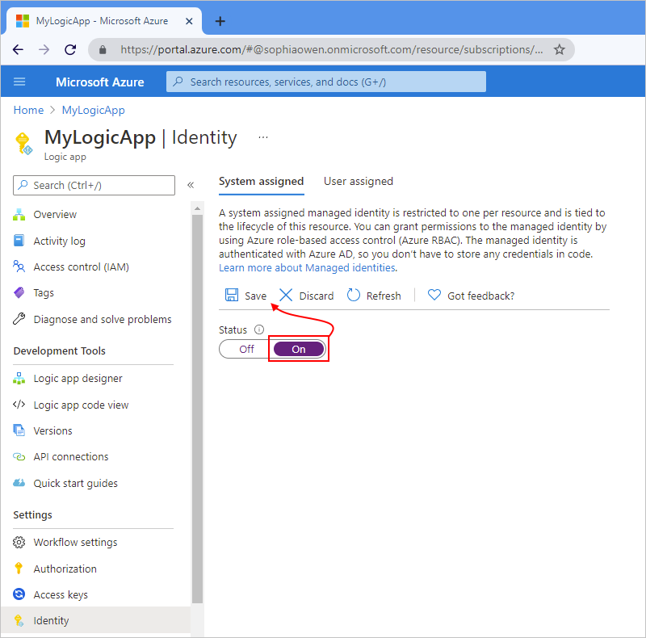

   > [!NOTE]
   > If you get an error that you can have only a single managed identity, your logic app resource is already associated with the 
   > user-assigned identity. Before you can add the system-assigned identity, you have to first *remove* the user-assigned identity 
   > from your logic app resource.

   Your logic app resource can now use the system-assigned identity, which is registered with Azure AD and is represented by an object ID.

   

   | Property | Value | Description |
   |----------|-------|-------------|
   | **Object (principal) ID** | <*identity-resource-ID*> | A Globally Unique Identifier (GUID) that represents the system-assigned identity for your logic app in an Azure AD tenant. |
   ||||

1. Now follow the [steps that give that identity access to the resource](#access-other-resources) later in this topic.

### [Standard](#tab/standard)

On a **Logic App (Standard)** resource, the system-assigned identity is automatically enabled.

1. In the [Azure portal](https://portal.azure.com), open your logic app workflow in the designer.

1. On the logic app menu, under **Settings**, select **Identity**.

1. On the **Identity** pane, under **System assigned**, select **On** > **Save**. When Azure prompts you to confirm, select **Yes**.

   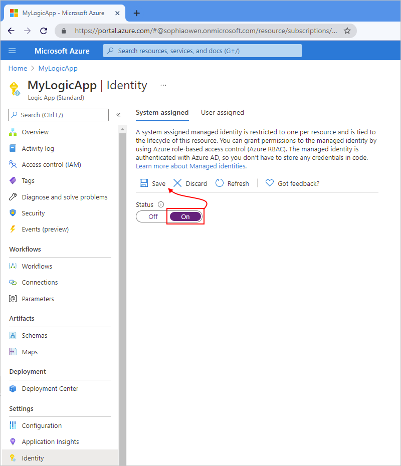

   Your logic app resource can now use the system-assigned identity, which is registered with Azure AD and is represented by an object ID.

   

   | Property | Value | Description |
   |----------|-------|-------------|
   | **Object (principal) ID** | <*identity-resource-ID*> | A Globally Unique Identifier (GUID) that represents the system-assigned identity for your logic app in an Azure AD tenant. |
   ||||

1. Now follow the [steps that give that identity access to the resource](#access-other-resources) later in this topic.

---

<a name="system-assigned-template"></a>
<a name="template-system-logic-app"></a>

## Enable system-assigned identity in an ARM template

To automate creating and deploying Azure resources such as logic apps, you can use an [ARM template](logic-apps-azure-resource-manager-templates-overview.md). To enable the system-assigned managed identity for your logic app resource in the template, add the `identity` object and the `type` child property to the logic app's resource definition in the template, for example:

### [Consumption](#tab/consumption)

```json
{
   "apiVersion": "2016-06-01",
   "type": "Microsoft.logic/workflows",
   "name": "[variables('logicappName')]",
   "location": "[resourceGroup().location]",
   "identity": {
      "type": "SystemAssigned"
   },
   "properties": {},
   <...>
}
```

### [Standard](#tab/standard)

```json
{
   "apiVersion": "2021-01-15",
   "type": "Microsoft.Web/sites",
   "name": "[variables('sites_<logic-app-resource-name>_name')]",
   "location": "[resourceGroup().location]",
   "kind": "functionapp,workflowapp",
   "identity": {
      "type": "SystemAssigned"
   },
   "properties": {},
   <...>
}
```

---

When Azure creates your logic app resource definition, the `identity` object gets these other properties:

```json
"identity": {
   "type": "SystemAssigned",
   "principalId": "<principal-ID>",
   "tenantId": "<Azure-AD-tenant-ID>"
}
```

| Property (JSON) | Value | Description |
|-----------------|-------|-------------|
| `principalId` | <*principal-ID*> | The Globally Unique Identifier (GUID) of the service principal object for the managed identity that represents your logic app in the Azure AD tenant. This GUID sometimes appears as an "object ID" or `objectID`. |
| `tenantId` | <*Azure-AD-tenant-ID*> | The Globally Unique Identifier (GUID) that represents the Azure AD tenant where the logic app is now a member. Inside the Azure AD tenant, the service principal has the same name as the logic app instance. |
||||

<a name="azure-portal-user-identity"></a>
<a name="user-assigned-azure-portal"></a>

## Create user-assigned identity in the Azure portal (Consumption only)

Before you can enable the user-assigned identity on your **Logic App (Consumption)** resource, you have to first create that identity as a separate Azure resource.

1. In the [Azure portal](https://portal.azure.com) search box, enter `managed identities`. Select **Managed Identities**.

   

1. On the **Managed Identities** pane, select **Create**.

   

1. Provide information about your managed identity, and then select **Review + Create**, for example:

   

   | Property | Required | Value | Description |
   |----------|----------|-------|-------------|
   | **Subscription** | Yes | <*Azure-subscription-name*> | The name for the Azure subscription to use |
   | **Resource group** | Yes | <*Azure-resource-group-name*> | The name for the Azure resource group to use. Create a new group, or select an existing group. This example creates a new group named `fabrikam-managed-identities-RG`. |
   | **Region** | Yes | <*Azure-region*> | The Azure region where to store information about your resource. This example uses **West US**. |
   | **Name** | Yes | <*user-assigned-identity-name*> | The name to give your user-assigned identity. This example uses `Fabrikam-user-assigned-identity`. |
   |||||

   After validating the information, Azure creates your managed identity. Now you can add the user-assigned identity to your logic app resource, which can have only one user-assigned identity.

1. In the Azure portal, open your logic app resource.

1. On the logic app menu, under **Settings**, select **Identity**.

1. On the **Identity** pane, select **User assigned** > **Add**.

   

1. On the **Add user assigned managed identity** pane, follow these steps:

   1. From the **Subscription** list, select your Azure subscription, if not already selected.

   1. From the list with *all* the managed identities in that subscription, select the user-assigned identity that you want. To filter the list, in the **User assigned managed identities** search box, enter the name for the identity or resource group.

      

   1. When you're done, select **Add**.

      > [!NOTE]
      > If you get an error that you can have only a single managed identity, your logic app is already associated with the system-assigned 
      > identity. Before you can add the user-assigned identity, you have to first disable the system-assigned identity.

   Your logic app is now associated with the user-assigned managed identity.

   

1. Now follow the [steps that give that identity access to the resource](#access-other-resources) later in this topic.

<a name="template-user-identity"></a>

## Create user-assigned identity in an ARM template (Consumption only)

To automate creating and deploying Azure resources such as logic apps, you can use an [ARM template](logic-apps-azure-resource-manager-templates-overview.md), which support [user-assigned identities for authentication](../active-directory/managed-identities-azure-resources/how-to-manage-ua-identity-arm.md). In your template's `resources` section, your logic app's resource definition requires these items:

* An `identity` object with the `type` property set to `UserAssigned`

* A child `userAssignedIdentities` object that specifies the user-assigned resource and name

This example shows a logic app resource definition for an HTTP PUT request and includes a non-parameterized `identity` object. The response to the PUT request and subsequent GET operation also have this `identity` object:

```json
{
   "$schema": "https://schema.management.azure.com/schemas/2015-01-01/deploymentTemplate.json#",
   "contentVersion": "1.0.0.0",
   "parameters": {<template-parameters>},
   "resources": [
      {
         "apiVersion": "2016-06-01",
         "type": "Microsoft.logic/workflows",
         "name": "[variables('logicappName')]",
         "location": "[resourceGroup().location]",
         "identity": {
            "type": "UserAssigned",
            "userAssignedIdentities": {
               "/subscriptions/<Azure-subscription-ID>/resourceGroups/<Azure-resource-group-name>/providers/Microsoft.ManagedIdentity/userAssignedIdentities/<user-assigned-identity-name>": {}
            }
         },
         "properties": {
            "definition": {<logic-app-workflow-definition>}
         },
         "parameters": {},
         "dependsOn": []
      },
   ],
   "outputs": {}
}
```

If your template also includes the managed identity's resource definition, you can parameterize the `identity` object. This example shows how the child `userAssignedIdentities` object references a `userAssignedIdentity` variable that you define in your template's `variables` section. This variable references the resource ID for your user-assigned identity.

```json
{
   "$schema": "https://schema.management.azure.com/schemas/2015-01-01/deploymentTemplate.json#",
   "contentVersion": "1.0.0.0",
   "parameters": {
      "Template_LogicAppName": {
         "type": "string"
      },
      "Template_UserAssignedIdentityName": {
         "type": "securestring"
      }
   },
   "variables": {
      "logicAppName": "[parameters(`Template_LogicAppName')]",
      "userAssignedIdentityName": "[parameters('Template_UserAssignedIdentityName')]"
   },
   "resources": [
      {
         "apiVersion": "2016-06-01",
         "type": "Microsoft.logic/workflows",
         "name": "[variables('logicAppName')]",
         "location": "[resourceGroup().location]",
         "identity": {
            "type": "UserAssigned",
            "userAssignedIdentities": {
               "[resourceId('Microsoft.ManagedIdentity/userAssignedIdentities/', variables('userAssignedIdentityName'))]": {}
            }
         },
         "properties": {
            "definition": {<logic-app-workflow-definition>}
         },
         "parameters": {},
         "dependsOn": [
            "[resourceId('Microsoft.ManagedIdentity/userAssignedIdentities/', variables('userAssignedIdentityName'))]"
         ]
      },
      {
         "apiVersion": "2018-11-30",
         "type": "Microsoft.ManagedIdentity/userAssignedIdentities",
         "name": "[parameters('Template_UserAssignedIdentityName')]",
         "location": "[resourceGroup().location]",
         "properties": {}
      }
  ]
}
```

<a name="access-other-resources"></a>

## Give identity access to resources

Before you can use your logic app's managed identity for authentication, on the Azure resource where you want to use the identity, you have to set up access for your identity by using Azure role-based access control (Azure RBAC). The steps in this section cover how to assign the appropriate role to that identity on the Azure resource using the [Azure portal](#azure-portal-assign-access) and [Azure Resource Manager template (ARM template)](../role-based-access-control/role-assignments-template.md). For Azure PowerShell, Azure CLI, and Azure REST API, review the following documentation:

| Tool | Documentation |
|------|---------------|
| Azure PowerShell | [Add role assignment](../active-directory/managed-identities-azure-resources/howto-assign-access-powershell.md) |
| Azure CLI | [Add role assignment](../active-directory/managed-identities-azure-resources/howto-assign-access-cli.md) |
| Azure REST API | [Add role assignment](../role-based-access-control/role-assignments-rest.md) |
|||

<a name="azure-portal-assign-access"></a>

### Assign managed identity role-based access in the Azure portal

On the Azure resource where you want to use the managed identity for authentication, you have to assign that identity to a role that can access that target resource. For more general information about this task, review [Assign a managed identity access to another resource using Azure RBAC](../active-directory/managed-identities-azure-resources/howto-assign-access-portal.md).

> [!NOTE]
> When a managed identity has access to an Azure resource in the same subscription, the identity can 
> access only that resource. However, in some triggers and actions that support managed identities, 
> you have to first select the Azure resource group that contains the target resource. If the identity 
> doesn't have access at the resource group level, no resources in that group are listed, despite having 
> access to the target resource.
>
> To handle this behavior, you must also give the identity access to the resource group, not just 
> the resource. Likewise, if you have to select your subscription before you can select the 
> target resource, you must give the identity access to the subscription.

1. In the [Azure portal](https://portal.azure.com), open the resource where you want to use the identity.

1. On the resource's menu, select **Access control (IAM)** > **Add** > **Add role assignment**.

   > [!NOTE]
   > If the **Add role assignment** option is disabled, you don't have permissions to assign roles. 
   > For more information, review [Azure AD built-in roles](../active-directory/roles/permissions-reference.md).

1. Now, assign the necessary role to your managed identity. On the **Role** tab, assign a role that gives your identity the required access to the current resource.

   For this example, assign the role that's named **Storage Blob Data Contributor**, which includes write access for blobs in an Azure Storage container. For more information about specific storage container roles, review [Roles that can access blobs in an Azure Storage container](../storage/blobs/authorize-access-azure-active-directory.md#assign-azure-roles-for-access-rights).

1. Next, choose the managed identity where you want to assign the role. Under **Assign access to**, select **Managed identity** > **Add members**.

1. Based on your managed identity's type, select or provide the following values:

   | Type | Azure service instance | Subscription | Member |
   |------|------------------------|--------------|--------|
   | **System-assigned** | **Logic App** | <*Azure-subscription-name*> | <*your-logic-app-name*> |
   | **User-assigned** (Consumption only) | Not applicable | <*Azure-subscription-name*> | <*your-user-assigned-identity-name*> |
   |||||

   For more information about assigning roles, review the documentation, [Assign roles using the Azure portal](../role-based-access-control/role-assignments-portal.md).

1. After you finish setting up access for the identity, you can then use the identity to [authenticate access for triggers and actions that support managed identities](#authenticate-access-with-identity).

<a name="authenticate-access-with-identity"></a>

## Authenticate access with managed identity

After you [enable the managed identity for your logic app resource](#azure-portal-system-logic-app) and [give that identity access to the target resource or entity](#access-other-resources), you can use that identity in [triggers and actions that support managed identities](logic-apps-securing-a-logic-app.md#authentication-types-supported-triggers-actions).

> [!IMPORTANT]
> If you have an Azure function where you want to use the system-assigned identity, 
> first [enable authentication for Azure Functions](logic-apps-azure-functions.md#enable-authentication-for-functions).

These steps show how to use the managed identity with a trigger or action through the Azure portal. To specify the managed identity in a trigger or action's underlying JSON definition, review [Managed identity authentication](logic-apps-securing-a-logic-app.md#managed-identity-authentication).

### [Consumption](#tab/consumption)

1. In the [Azure portal](https://portal.azure.com), open your logic app resource.

1. If you haven't done so yet, add the [trigger or action that supports managed identities](logic-apps-securing-a-logic-app.md#authentication-types-supported-triggers-actions).

   > [!NOTE]
   > Not all triggers and actions support letting you add an authentication type. For more information, review 
   > [Authentication types for triggers and actions that support authentication](logic-apps-securing-a-logic-app.md#authentication-types-supported-triggers-actions).

1. On the trigger or action that you added, follow these steps:

   * **Built-in operations that support managed identity authentication**

     1. From the **Add new parameter** list, add the **Authentication** property if the property doesn't already appear.

        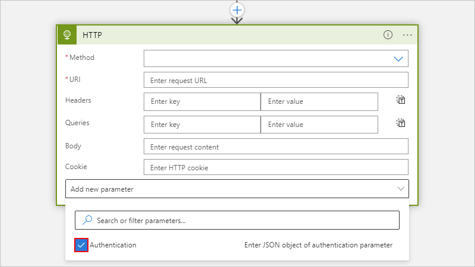

     1. From the **Authentication type** list, select **Managed identity**.

        

     For more information, review [Example: Authenticate built-in trigger or action with a managed identity](#authenticate-built-in-managed-identity).

   * **Managed connector operations that support managed identity authentication** (preview)

     1. On the tenant selection page, select **Connect with managed identity (preview)**, for example:

        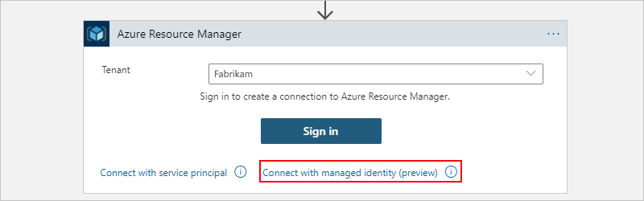

     1. On the next page, for **Connection name**, provide a name to use for the connection.

     1. For the authentication type, choose one of the following options based on your managed connector:

        * **Single-authentication**: These connectors support only one authentication type. From the **Managed identity** list, select the currently enabled managed identity, if not already selected, and then select **Create**, for example:

          

        * **Multi-authentication**: These connectors support more than one authentication type. From the **Authentication type** list, select **Logic Apps Managed Identity** > **Create**, for example:

          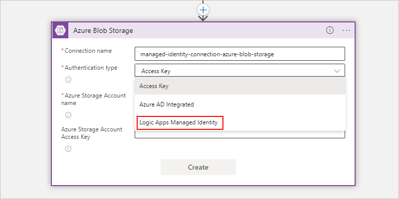

        For more information, review [Example: Authenticate managed connector trigger or action with a managed identity](#authenticate-managed-connector-managed-identity).

### [Standard](#tab/standard)

1. In the [Azure portal](https://portal.azure.com), open your logic app resource.

1. If you haven't done so yet, add the [trigger or action that supports managed identities](logic-apps-securing-a-logic-app.md#authentication-types-supported-triggers-actions).

   > [!NOTE]
   > Not all triggers and actions support letting you add an authentication type. For more information, review 
   > [Authentication types for triggers and actions that support authentication](logic-apps-securing-a-logic-app.md#authentication-types-supported-triggers-actions).

1. On the trigger or action that you added, follow these steps:

   * **Built-in operations that support managed identity authentication**

     1. From the **Add new parameter** list, add the **Authentication** property if the property doesn't already appear.

        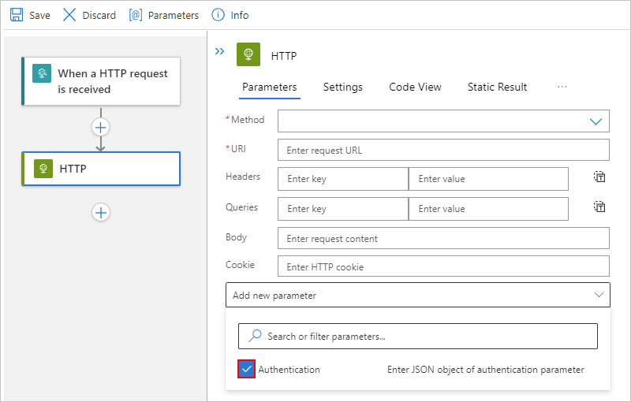

     1. From the **Authentication type** list, select **Managed identity**.

        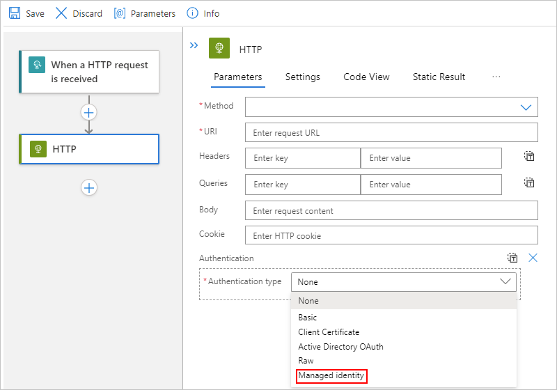

     For more information, review [Example: Authenticate built-in trigger or action with a managed identity](#authenticate-built-in-managed-identity).

   * **Managed connector operations that support managed identity authentication** (preview)

     1. On the tenant selection page, select **Connect with managed identity (preview)**, for example:

        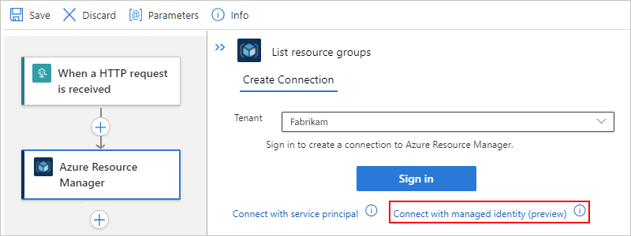

     1. On the next page, for **Connection name**, provide a name to use for the connection.

     1. For the authentication type, choose one of the following options based on your managed connector:

        * **Single-authentication**: These connectors support only one authentication type. From the **Managed identity** list, select the currently enabled managed identity, if not already selected, and then select **Create**, for example:

          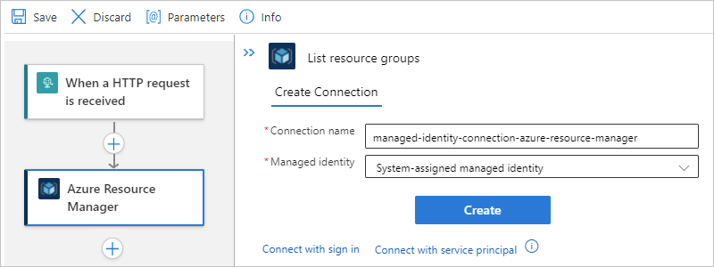

        * **Multi-authentication**: These connectors support more than one authentication type. From the **Authentication type** list, select **Logic Apps Managed Identity** > **Create**, for example:

          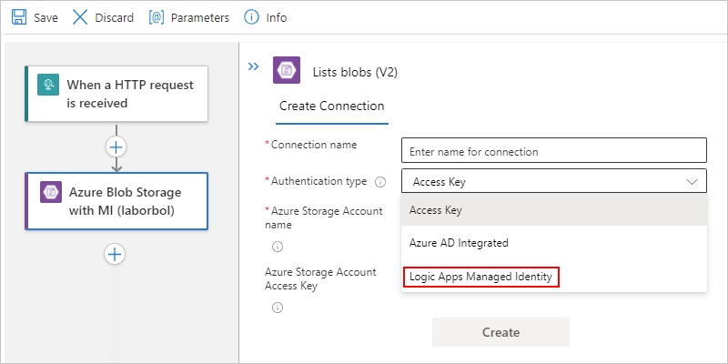

        For more information, review [Example: Authenticate managed connector trigger or action with a managed identity](#authenticate-managed-connector-managed-identity).

---

<a name="authenticate-built-in-managed-identity"></a>

## Example: Authenticate built-in trigger or action with a managed identity

The built-in HTTP trigger or action can use the system-assigned identity that you enable on your logic app resource. In general, the HTTP trigger or action uses the following properties to specify the resource or entity that you want to access:

| Property | Required | Description |
|----------|----------|-------------|
| **Method** | Yes | The HTTP method that's used by the operation that you want to run |
| **URI** | Yes | The endpoint URL for accessing the target Azure resource or entity. The URI syntax usually includes the [resource ID](../active-directory/managed-identities-azure-resources/services-support-managed-identities.md#azure-services-that-support-azure-ad-authentication) for the Azure resource or service. |
| **Headers** | No | Any header values that you need or want to include in the outgoing request, such as the content type |
| **Queries** | No | Any query parameters that you need or want to include in the request, such as the parameter for a specific operation or the API version for the operation that you want to run |
| **Authentication** | Yes | The authentication type to use for authenticating access to the target resource or entity |
||||

As a specific example, suppose that you want to run the [Snapshot Blob operation](/rest/api/storageservices/snapshot-blob) on a blob in the Azure Storage account where you previously set up access for your identity. However, the [Azure Blob Storage connector](/connectors/azureblob/) doesn't currently offer this operation. Instead, you can run this operation by using the [HTTP action](logic-apps-workflow-actions-triggers.md#http-action) or another [Blob Service REST API operation](/rest/api/storageservices/operations-on-blobs).

> [!IMPORTANT]
> To access Azure storage accounts behind firewalls by using HTTP requests and managed identities, 
> make sure that you also set up your storage account with the [exception that allows access by trusted Microsoft services](../connectors/connectors-create-api-azureblobstorage.md#access-blob-storage-with-managed-identities).

To run the [Snapshot Blob operation](/rest/api/storageservices/snapshot-blob), the HTTP action specifies these properties:

| Property | Required | Example value | Description |
|----------|----------|---------------|-------------|
| **Method** | Yes | `PUT`| The HTTP method that the Snapshot Blob operation uses |
| **URI** | Yes | `https://<storage-account-name>/<folder-name>/{name}` | The resource ID for an Azure Blob Storage file in the Azure Global (public) environment, which uses this syntax |
| **Headers** | For Azure Storage | `x-ms-blob-type` = `BlockBlob` <p>`x-ms-version` = `2019-02-02` <p>`x-ms-date` = `@{formatDateTime(utcNow(),'r')}` | The `x-ms-blob-type`, `x-ms-version`, and `x-ms-date` header values are required for Azure Storage operations. <p><p>**Important**: In outgoing HTTP trigger and action requests for Azure Storage, the header requires the `x-ms-version` property and the API version for the operation that you want to run. The `x-ms-date` must be the current date. Otherwise, your workflow fails with a `403 FORBIDDEN` error. To get the current date in the required format, you can use the expression in the example value. <p>For more information, review these topics: <p><p>- [Request headers - Snapshot Blob](/rest/api/storageservices/snapshot-blob#request) <br>- [Versioning for Azure Storage services](/rest/api/storageservices/versioning-for-the-azure-storage-services#specifying-service-versions-in-requests) |
| **Queries** | Only for the Snapshot Blob operation | `comp` = `snapshot` | The query parameter name and value for the operation. |
|||||

### [Consumption](#tab/consumption)

The following example shows a sample HTTP action with all the previously described property values to use for the Snapshot Blob operation:


1. After you add the HTTP action, add the **Authentication** property to the HTTP action. From the **Add new parameter** list, select **Authentication**.

   

   > [!NOTE]
   > Not all triggers and actions support letting you add an authentication type. For more information, review 
   > [Authentication types for triggers and actions that support authentication](logic-apps-securing-a-logic-app.md#authentication-types-supported-triggers-actions).

1. From the **Authentication type** list, select **Managed identity**.

   

1. From the managed identity list, select from the available options based on your scenario.

   * If you set up the system-assigned identity, select **System-assigned managed identity** if not already selected.

     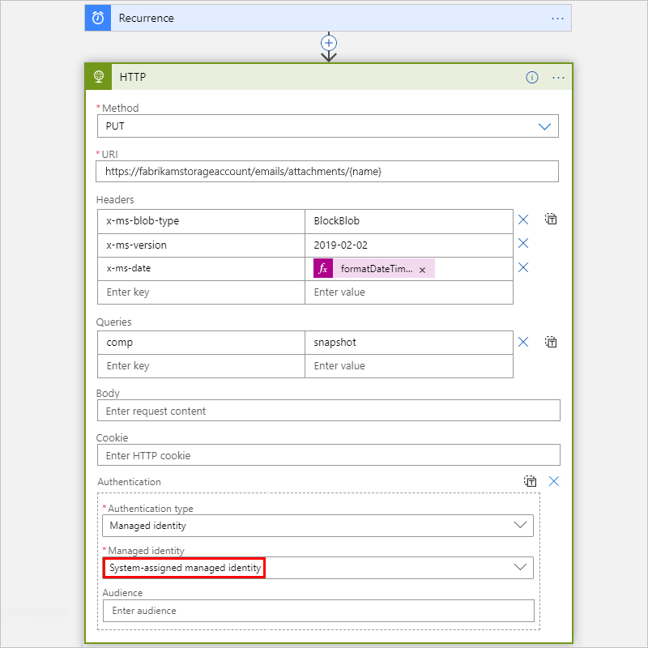

   * If you set up a user-assigned identity, select that identity if not already selected.

     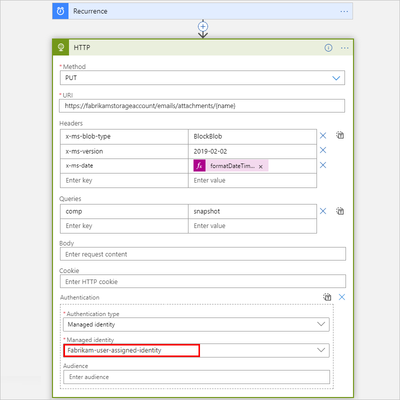

   This example continues with the **System-assigned managed identity**.

1. On some triggers and actions, the **Audience** property also appears for you to set the target resource ID. Set the **Audience** property to the [resource ID for the target resource or service](../active-directory/managed-identities-azure-resources/services-support-managed-identities.md#azure-services-that-support-azure-ad-authentication). Otherwise, by default, the **Audience** property uses the `https://management.azure.com/` resource ID, which is the resource ID for Azure Resource Manager.
  
    For example, if you want to authenticate access to a [Key Vault resource in the global Azure cloud](../active-directory/managed-identities-azure-resources/services-support-managed-identities.md#azure-key-vault), you must set the **Audience** property to *exactly* the following resource ID: `https://vault.azure.net`. Note that this specific resource ID *doesn't* have any trailing slashes. In fact, including a trailing slash might produce either a `400 Bad Request` error or a `401 Unauthorized` error.

   > [!IMPORTANT]
   > Make sure that the target resource ID *exactly matches* the value that Azure Active Directory (AD) expects, 
   > including any required trailing slashes. For example, the resource ID for all Azure Blob Storage accounts requires 
   > a trailing slash. However, the resource ID for a specific storage account doesn't require a trailing slash. Check the 
   > [resource IDs for the Azure services that support Azure AD](../active-directory/managed-identities-azure-resources/services-support-managed-identities.md#azure-services-that-support-azure-ad-authentication).

   This example sets the **Audience** property to `https://storage.azure.com/` so that the access tokens used for authentication are valid for all storage accounts. However, you can also specify the root service URL, `https://<your-storage-account>.blob.core.windows.net`, for a specific storage account.

   

   For more information about authorizing access with Azure AD for Azure Storage, review the following documentation:

   * [Authorize access to Azure blobs and queues by using Azure Active Directory](../storage/blobs/authorize-access-azure-active-directory.md)

   * [Authorize access to Azure Storage with Azure Active Directory](/rest/api/storageservices/authorize-with-azure-active-directory#use-oauth-access-tokens-for-authentication)

1. Continue building the workflow the way that you want.

### [Standard](#tab/standard)

The following example shows a sample HTTP action with all the previously described property values to use for the Snapshot Blob operation:

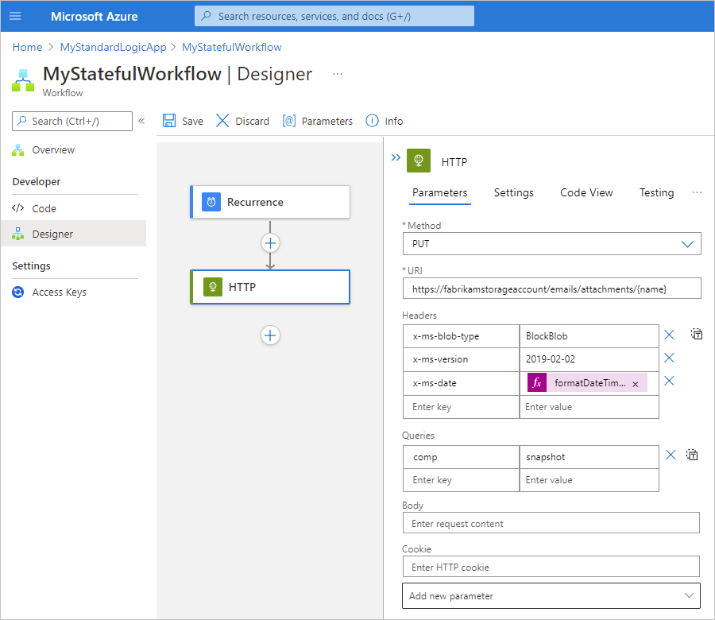

1. After you add the HTTP action, add the **Authentication** property to the HTTP action. From the **Add new parameter** list, select **Authentication**.

   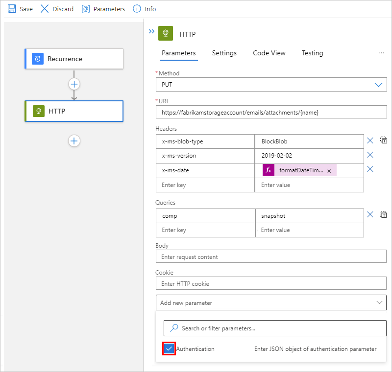

   > [!NOTE]
   > Not all triggers and actions support letting you add an authentication type. For more information, review 
   > [Authentication types for triggers and actions that support authentication](logic-apps-securing-a-logic-app.md#authentication-types-supported-triggers-actions).

1. From the **Authentication type** list, select **Managed identity**.

   

1. From the managed identity list, select **System-assigned managed identity** if not already selected.

     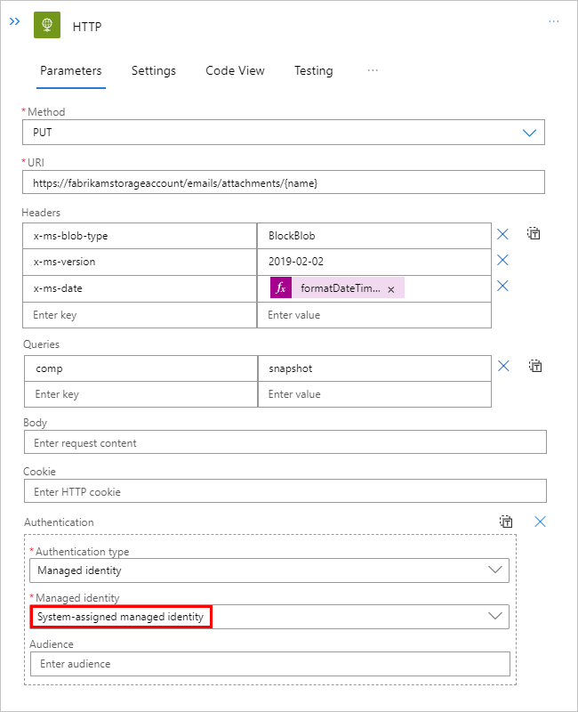

1. On some triggers and actions, the **Audience** property also appears for you to set the target resource ID. Set the **Audience** property to the [resource ID for the target resource or service](../active-directory/managed-identities-azure-resources/services-support-managed-identities.md#azure-services-that-support-azure-ad-authentication). Otherwise, by default, the **Audience** property uses the `https://management.azure.com/` resource ID, which is the resource ID for Azure Resource Manager.
  
    For example, if you want to authenticate access to a [Key Vault resource in the global Azure cloud](../active-directory/managed-identities-azure-resources/services-support-managed-identities.md#azure-key-vault), you must set the **Audience** property to *exactly* the following resource ID: `https://vault.azure.net`. Note that this specific resource ID *doesn't* have any trailing slashes. In fact, including a trailing slash might produce either a `400 Bad Request` error or a `401 Unauthorized` error.

   > [!IMPORTANT]
   > Make sure that the target resource ID *exactly matches* the value that Azure Active Directory (AD) expects, 
   > including any required trailing slashes. For example, the resource ID for all Azure Blob Storage accounts requires 
   > a trailing slash. However, the resource ID for a specific storage account doesn't require a trailing slash. Check the 
   > [resource IDs for the Azure services that support Azure AD](../active-directory/managed-identities-azure-resources/services-support-managed-identities.md#azure-services-that-support-azure-ad-authentication).

   This example sets the **Audience** property to `https://storage.azure.com/` so that the access tokens used for authentication are valid for all storage accounts. However, you can also specify the root service URL, `https://<your-storage-account>.blob.core.windows.net`, for a specific storage account.

   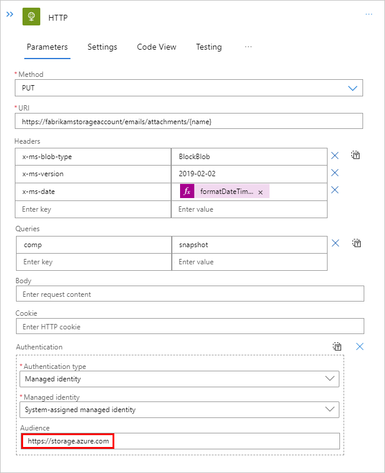

   For more information about authorizing access with Azure AD for Azure Storage, review the following documentation:

   * [Authorize access to Azure blobs and queues by using Azure Active Directory](../storage/blobs/authorize-access-azure-active-directory.md)
   * [Authorize access to Azure Storage with Azure Active Directory](/rest/api/storageservices/authorize-with-azure-active-directory#use-oauth-access-tokens-for-authentication)

1. Continue building the workflow the way that you want.

---

<a name="authenticate-managed-connector-managed-identity"></a>

## Example: Authenticate managed connector trigger or action with a managed identity

The Azure Resource Manager managed connector has an action, **Read a resource**, that can use the managed identity that you enable on your logic app resource. This example shows how to use the system-assigned managed identity.

### [Consumption](#tab/consumption)

1. After you add the action to your workflow and select your Azure AD tenant, select **Connect with managed identity (preview)**.

   

1. On the connection name page, provide a name for the connection, and select the managed identity that you want to use.

   The Azure Resource Manager action is a single-authentication action, so the connection information pane shows a **Managed identity** list that automatically selects the managed identity that's currently enabled on the logic app resource. If you enabled a system-assigned managed identity, the **Managed identity** list selects **System-assigned managed identity**. If you had enabled a user-assigned managed identity instead, the list selects that identity instead.

   If you're using a multiple-authentication trigger or action, such as Azure Blob Storage, the connection information pane shows an **Authentication type** list that includes the **Managed identity** option among other authentication types.

   In this example, **System-assigned managed identity** is the only selection available.

   

   > [!NOTE]
   > If the managed identity isn't enabled when you try to create the connection, change the connection, 
   > or was removed while a managed identity-enabled connection still exists, you get an error appears 
   > that you must enable the identity and grant access to the target resource.

1. When you're ready, select **Create**.

1. After successfully creating the connection, the designer can fetch any dynamic values, content, or schema by using managed identity authentication.

1. Continue building the workflow the way that you want.

### [Standard](#tab/standard)

1. After you add the action to your workflow, on the action's **Create Connection** pane, select your Azure AD tenant, and then select **Connect with managed identity (preview)**.

   

1. On the connection name page, provide a name for the connection.

   The Azure Resource Manager action is a single-authentication action, so the connection information pane shows a **Managed identity** list that automatically selects the managed identity that's currently enabled on the logic app resource. If you enabled a system-assigned managed identity, the **Managed identity** list selects **System-assigned managed identity**. If you had enabled a user-assigned managed identity instead, the list selects that identity instead.

   In this example, **System-assigned managed identity** is the only selection available.

   

   If you're using a multiple-authentication trigger or action, such as Azure Blob Storage, the connection information pane shows an **Authentication type** list that includes the **Managed identity** option among other authentication types.

   > [!NOTE]
   > If the managed identity isn't enabled when you try to create the connection, change the connection, 
   > or was removed while a managed identity-enabled connection still exists, you get an error appears 
   > that you must enable the identity and grant access to the target resource.

1. When you're ready, select **Create**.

1. After successfully creating the connection, the designer can fetch any dynamic values, content, or schema by using managed identity authentication.

1. Continue building the workflow the way that you want.

---

<a name="logic-app-resource-definition-connection-managed-identity"></a>

## Logic app resource definition and connections that use a managed identity (Consumption)

A connection that enables and uses a managed identity are a special connection type that works only with a managed identity. At runtime, the connection uses the managed identity that's enabled on the logic app resource. This configuration is saved in the logic app resource definition's `parameters` object, which contains the `$connections` object that includes pointers to the connection's resource ID along with the identity's resource ID, if the user-assigned identity is enabled.

This example shows what the configuration looks like when the logic app enables the system-assigned managed identity:

```json
"parameters": {
   "$connections": {
      "value": {
         "<action-name>": {
            "connectionId": "/subscriptions/{Azure-subscription-ID}/resourceGroups/{resourceGroupName}/providers/Microsoft.Web/connections/{connection-name}",
            "connectionName": "{connection-name}",
            "connectionProperties": {
               "authentication": {
                  "type": "ManagedServiceIdentity"
               }
            },
            "id": "/subscriptions/{Azure-subscription-ID}/providers/Microsoft.Web/locations/{Azure-region}/managedApis/{managed-connector-type}"
         }
      }
   }
}
```

This example shows what the configuration looks like when the logic app enables a user-assigned managed identity:

```json
"parameters": {
   "$connections": {
      "value": {
         "<action-name>": {
            "connectionId": "/subscriptions/{Azure-subscription-ID}/resourceGroups/{resourceGroupName}/providers/Microsoft.Web/connections/{connection-name}",
            "connectionName": "{connection-name}",
            "connectionProperties": {
               "authentication": {
                  "identity": "/subscriptions/{Azure-subscription-ID}/resourceGroups/{resourceGroupName}/providers/microsoft.managedidentity/userassignedidentities/{managed-identity-name}",
                  "type": "ManagedServiceIdentity"
               }
            },
            "id": "/subscriptions/{Azure-subscription-ID}/providers/Microsoft.Web/locations/{Azure-region}/managedApis/{managed-connector-type}"
         }
      }
   }
}
```

During runtime, the Azure Logic Apps service checks whether any managed connector trigger and actions in the logic app workflow are set up to use the managed identity and that all the required permissions are set up to use the managed identity for accessing the target resources that are specified by the trigger and actions. If successful, Azure Logic Apps retrieves the Azure AD token that's associated with the managed identity and uses that identity to authenticate access to the target resource and perform the configured operation in trigger and actions.

<a name="arm-templates-connection-resource-managed-identity"></a>

## ARM template for managed connections and managed identities (Consumption)

If you automate deployment with an ARM template, and your logic app workflow includes a managed connector trigger or action that uses a managed identity, confirm that the underlying connection resource definition includes the `parameterValueType` property with `Alternative` as the property value. Otherwise, your ARM deployment won't set up the connection to use the managed identity for authentication, and the connection won't work in your logic app's workflow. This requirement applies only to [specific managed connector triggers and actions](#triggers-actions-managed-identity) where you selected the [**Connect with managed identity** option](#authenticate-managed-connector-managed-identity).

For example, here's the underlying connection resource definition for an Azure Automation action that uses a managed identity where the definition includes the `parameterValueType` property, which is set to `Alternative` as the property value:

```json
{
    "type": "Microsoft.Web/connections",
    "name": "[variables('automationAccountApiConnectionName')]",
    "apiVersion": "2016-06-01",
    "location": "[parameters('location')]",
    "kind": "V1",
    "properties": {
        "api": {
            "id": "[subscriptionResourceId('Microsoft.Web/locations/managedApis', parameters('location'), 'azureautomation')]"
        },
        "customParameterValues": {},
        "displayName": "[variables('automationAccountApiConnectionName')]",
        "parameterValueType": "Alternative"
    }
},
```

<a name="remove-identity"></a>

## Disable managed identity

To stop using the managed identity for authentication, first [remove the identity's access to the target resource](#disable-identity-target-resource). Next, on your logic app resource, [turn off the system-assigned identity or remove the user-assigned identity](#disable-identity-logic-app).

When you disable the managed identity on your logic app resource, you remove the capability for that identity to request access for Azure resources where the identity had access.

> [!NOTE]
> If you disable the system-assigned identity, any and all connections used by workflows in that 
> logic app's workflow won't work at runtime, even if you immediately enable the identity again. 
> This behavior happens because disabling the identity deletes the object ID. Each time that you 
> enable the identity, Azure generates the identity with a different and unique object ID. To resolve 
> this problem, you have to recreate the connections so that they use the current object ID for the 
> current system-assigned identity.
>
> Try to avoid disabling the system-assigned identity as much as possible. If you want to remove 
> the identity's access to Azure resources, remove the identity's role assignment from the target 
> resource.If you delete your logic app resource, Azure automatically removes the managed identity 
> from Azure AD.

The steps in this section cover using the [Azure portal](#azure-portal-disable) and [Azure Resource Manager template (ARM template)](#template-disable). For Azure PowerShell, Azure CLI, and Azure REST API, review the following documentation:

| Tool | Documentation |
|------|---------------|
| Azure PowerShell | 1. [Remove role assignment](../role-based-access-control/role-assignments-powershell.md). <br>2. [Delete user-assigned identity](../active-directory/managed-identities-azure-resources/how-to-manage-ua-identity-powershell.md). |
| Azure CLI | 1. [Remove role assignment](../role-based-access-control/role-assignments-cli.md). <br>2. [Delete user-assigned identity](../active-directory/managed-identities-azure-resources/how-to-manage-ua-identity-cli.md). |
| Azure REST API | 1. [Remove role assignment](../role-based-access-control/role-assignments-rest.md). <br>2. [Delete user-assigned identity](../active-directory/managed-identities-azure-resources/how-to-manage-ua-identity-rest.md). |
|||

<a name="azure-portal-disable"></a>

### Disable managed identity in the Azure portal

To remove access for the managed identity, remove the identity's role assignment from the target resource, and then disable the managed identity.

<a name="disable-identity-target-resource"></a>

#### Remove role assignment

The following steps remove access to the target resource from the managed identity:

1. In the [Azure portal](https://portal.azure.com), go to the target Azure resource where you want to remove access for the managed identity.

1. From the target resource's menu, select **Access control (IAM)**. Under the toolbar, select **Role assignments**.

1. In the roles list, select the managed identities that you want to remove. On the toolbar, select **Remove**.

   > [!TIP]
   > If the **Remove** option is disabled, you most likely don't have permissions. 
   > For more information about the permissions that let you manage roles for resources, review 
   > [Administrator role permissions in Azure Active Directory](../active-directory/roles/permissions-reference.md).

<a name="disable-identity-logic-app"></a>

#### Disable managed identity on logic app resource

1. In the [Azure portal](https://portal.azure.com), open your logic app resource.

1. On the logic app menu, under **Settings**, select **Identity**, and then follow the steps for your identity:

   * Select **System assigned** > **On** > **Save**. When Azure prompts you to confirm, select **Yes**.

   * Select **User assigned** and the managed identity, and then select **Remove**. When Azure prompts you to confirm, select **Yes**.

<a name="template-disable"></a>

### Disable managed identity in an ARM template

If you created the logic app's managed identity by using an ARM template, set the `identity` object's `type` child property to `None`.

```json
"identity": {
   "type": "None"
}
```

## Next steps

* [Secure access and data in Azure Logic Apps](logic-apps-securing-a-logic-app.md)