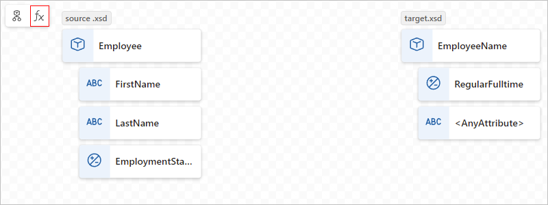

# Create maps to transform data in Azure Logic Apps with Visual Studio Code (preview)

> [!IMPORTANT]
> This capability is in preview and is subject to the 
> [Supplemental Terms of Use for Microsoft Azure Previews](https://azure.microsoft.com/support/legal/preview-supplemental-terms/).

[!INCLUDE [logic-apps-sku-standard](../../includes/logic-apps-sku-standard.md)]

To exchange messages that have different XML or JSON formats in an Azure Logic Apps workflow, you have to transform the data from one format to another, especially if you have gaps between the source and target schema structures. Data transformation helps you bridge those gaps. For this task, you need to create a map that defines the transformation between data elements in the source and target schemas.

To visually create and edit a map, you can use Visual Studio Code with the Data Mapper extension within the context of a Standard logic app project. The Data Mapper tool provides a unified experience for XSLT mapping and transformation using drag and drop gestures, a prebuilt functions library for creating expressions, and a way to manually test the maps that you create and use in your workflows.

After you create your map, you can directly call that map from a workflow in your logic app project or from a workflow in the Azure portal. For this task, add the **Data Mapper Operations** action named **Transform using Data Mapper XSLT** to your workflow. However, to use this action in the Azure portal, you have to add the map to either of the following resources:

- An integration account for a Consumption or Standard logic app resource
- The Standard logic app resource itself

This how-to guide shows how to complete the following tasks:

- Create a new data map.
- Specify the source and target schemas to use for the map.
- Navigate the map.
- Add schema elements to the map.
- Create a direct mapping between elements.
- Create a complex mapping between elements.
- Create a loop between arrays.
- Crete an if condition between elements.
- Save the map.
- Test the map.
- Call the map from a workflow in your logic app project.

## Limitations

- The Data Mapper extension currently works only in Visual Studio Code running on Windows operating systems.

- The Data Mapper tool is currently available only in Visual Studio Code, not the Azure portal, and only from within Standard logic app projects, not Consumption logic app projects.

- Unless your map transforms XML to XML, you can use maps created in Data Mapper only with the **Data Mapper Operations** action named **Transform using Data Mapper XSLT**, not the **XML Operations** action named **Transform XML**. Specifically, this limitation applies to maps that transform XML to JSON, JSON to XML, or JSON to JSON. For maps that transform XML to XML, you can use the **Transform XML** action.

- The Data Mapper tool's **Code view** pane is currently read only.

## Known issues

The Data Mapper extension currently works only with schemas in flat folder-structured projects.

## Prerequisites

- [Same prerequisites for using Visual Studio Code and the Azure Logic Apps (Standard) extension](create-single-tenant-workflows-visual-studio-code.md#prerequisites) to create Standard logic app workflows.

- The latest **Azure Logic Apps - Data Mapper** extension. You can download and install this extension from inside Visual Studio Code through the Marketplace, or you can find this extension externally on the [Marketplace website](https://marketplace.visualstudio.com/vscode).

- The source and target schema files that describe the data types to transform. These files can have either the following formats:

  - An XML schema definition file with the .xsd file extension
  - A JavaScript Object Notation file with the .json file extension

- A Standard logic app project that includes a stateful workflow with at least a trigger. If you don't have a project, follow these steps in Visual Studio Code:

  1. [Connect to your Azure account](create-single-tenant-workflows-visual-studio-code.md#connect-azure-account), if you haven't already.

  1. [Create a local folder, a local Standard logic app project, and a stateful workflow](create-single-tenant-workflows-visual-studio-code.md#create-project). During workflow creation, select **Open in current window**.

- Sample input data if you want to test the map and check that the transformation works as you expect.

## Create a data map

1. On the Visual Studio Code left menu, select the **Azure** icon.

1. In the **Azure** pane, under the **Data Mapper** section, select **Create new data map**.

   

1. Provide a name for your data map.

1. Specify your source and target schemas by following these steps:

   1. On the map surface, select **Add a source schema**.

      

   1. On the **Configure** pane that opens, select **Add new** > **Browse**.

   1. Find and select your source schema file, and then select **Add**.

      If your source schema doesn't appear in the **Open** window, from the file type list, change **XSD File (\*.xsd)** to **All Files (\*.\*)**.

      The map surface now shows the data types from the source schema. For the examples in this guide, 

   1. On the map surface, select **Add a target schema**.

   1. On the **Configure** pane that opens, select **Add new** > **Browse**.

   1. Find and select your target schema file, and then select **Add**.

      If your target schema doesn't appear in the **Open** window, from the file type list, change **XSD File (\*.xsd)** to **All Files (\*.\*)**.

      The map surface now shows data types from the target schema.

   Alternatively, you can also add your source and target schema files locally to your logic app project in the **Artifacts** **Schemas** folder, so that they appear in Visual Studio Code. In this case, you can specify your source and target schema in the Data Mapper tool on the **Configure** pane by selecting **Select existing**, rather than **Add new**.

The following table describes the possible data types that might appear in a schema:

| Symbol | Type | Notes |
|--------|------|-------|
|  | Array | Contains items or repeating item nodes |
|  | Binary | |
|  | Bool | True or false only |
|  | Complex | An XML object with children properties, similar to the Object JSON type |
|  | DateTime | |
|  | Decimal | |
|  | Integer | Whole numbers only |
|  | Null | Not a data type, but appears when an error or an invalid type exists |
|  | Number | A JSON integer or decimal |
|  | Object | A JSON object with children properties, similar to the Complex XML type |
|  | String | |

## Navigate the map 

To move around the map, you have the following options:

- To pan around, drag your pointer around the map surface. Or, press and hold the mouse wheel, while you move the mouse or trackball.

- In the lower left map corner, on the navigation bar, select the option you want:

  | Option | Alternative gesture |
  |--------|---------------------|
  | **Zoom in** | On the map surface, double select.  -or-  Scroll up with the mouse wheel. |
  | **Zoom out** | On the map surface, press SHIFT + double select.  -or-  Scroll down with the mouse wheel. |
  | **Zoom to fit** | None |
  | **Show (Hide) mini-map** | None |

- To move up one level on the map, on the breadcrumb path at the top of the map, select a previous level.

## Add elements to the map

1. On the map surface, from the target schema's data element list, select the target element that you want to map. If that element is a child of a parent element, find and expand the parent first.

1. In the source schema area, select **Select element**.

1. From the **Source schema** window that appears, select one or more source elements to show on the map.

   - To include the parent and direct children, open the parent's shortcut menu, and select **Add children**.

   - To include a parent and all the children of a parent, including any subsequent parents, open the top-level parent's shortcut menu, and select **Add children (recursive)**.

1. When you're done, close the source schema window. You can always add more source elements later. On the map, in the upper left corner, select **Show source schema** (node tree).

## Create a direct mapping between source and target elements

For a straightforward transformation between elements with the same type in the source and targe schemas, follow these steps:

1. To review what happens in code while you create the mapping, in the map's upper right corner, select **Show code**.

1. Move your pointer over the source element so that both a circle and a plus sign (**+**) appear.

   

1. Drag a line to the target element so that the line connects to the circle that appears.

   

   You've now created a direct mapping between both elements.

   

   The code view window reflects the direct mapping that you created:

   

## Create a complex mapping between elements

For a more complex transformation between elements in the source and target schemas, such as elements that you want to combine or that have different data types, you can use one or more functions to perform tasks for that transformation. The following table lists the available function groups and example functions that you can use:

| Group | Example functions |
|-------|-----------|
| Collection | Average, Count, Direct Access, Index, Join, Maximum, Minimum, Sum |
| Conversion | To date, To integer, To number, To string |
| Date and time | Add days |
| Logical comparison | Equal, Exists, Greater, Greater or equal, If, If else, Is nil, Is null, Is number, Is string, Less, Less or equal, Logical AND, Logical NOT, Logical OR, Not equal |
| Math | Absolute, Add, Arctangent, Ceiling, Cosine, Divide, Exponential, Exponential (base 10), Floor, Integer divide, Log, Log (base 10), Module, Multiply, Power, Round, Sine, Square root, Subtract, Tangent |
| String | Code points to string, Concat, Contains, Ends with, Length, Lowercase, Name, Regular expression matches, Regular expression replace, Replace, Starts with, String to code-points, Substring, Substring after, Substring before, Trim, Trim left, Trim right, Uppercase |
| Utility | Copy, Error, Format date-time, Format number |

### Add a function without an existing mapping

1. Connect the function to the source and target elements.

   1. Drag and draw a line between the source elements and the function's left edge. You can start either from the source elements or from the function.

   1. Drag and draw a line between the function's right edge and the target element. You can start either from the target element or from the function.

1. On the function's **Properties** tab, confirm or edit the input to use.

   For some data types, such as arrays, the scope for the transformation might also appear available. This scope is usually the immediate element, such as an array, but in some scenarios, the scope might exist beyond the immediate element.

### Add a function to an existing mapping

1. [Create a direct mapping between the source and target elements](#create-direct-mapping).

   The created mapping might show an error because the source and target data types don't match. This example transforms the source element value to a DateTime value

   The function now appears connected to the selected mapping relationship.

   > [!NOTE]
   >
   > If no mapping line is selected when you select a function, the function appears on the map, 
   > but disconnected from any elements or other functions. To connect the function, you can drag 
   > and draw connections between the unmapped function and other items.

1. After the function appears on the map, select the function so that the information window appears. 

1. Select the line for the mapping that you created.

1. Move your pointer over the selected connection, and select **Insert function** when the plus sign (**+**) appears.

For example, to iterate through array items, see [Create a loop between arrays](#loop-through-array). To perform a task when an element's value meets a condition, see [Create an if condition between items](#create-if-condition).

### Add a function with multiple inputs

The example in this section concatenates two source elements so that you can map the results to the target element.

1. Make sure that map shows the source and target elements that you want.

1. In the map's upper left corner, select **Show functions**.

   

1. From the functions list that opens, find and select the function that you want to use, which adds the function to the map. If the function doesn't appear visible on the map, try zooming out on the map surface.

   

   > [!NOTE]
   >
   > If no mapping line exists or is selected when you add a function to the map, the function 
   > appears on the map, but disconnected from any elements or other functions. A red dot appears 
   > in the function's upper right corner to show that the function isn't correctly configured, for example:
   >
   > 

1. Expand the function shape to display the function's details and connection points. To expand the function shape, select inside the shape.

1. In the function information pane, on the **Properties** tab, under **Inputs**, select the source data elements to use as the inputs.

   This example selects the **FirstName** and **LastName** source elements as the function inputs, which automatically adds the connections on the map.

   

1. To complete the mapping drag and draw a line between the function's right edge and the target element. You can start either from the target element or from the function.

   

## Create a loop between arrays

If your source and target schemas include arrays, you can create a loop mapping that iterates through the items in those arrays.

1. On the map, in the target schema area, expand the array and array items.

1. In the source schema area, add the array and items to the map.

1. [Create a direct mapping between the source and target elements](#create-direct-mapping).

   

   When you first create a mapping relationship between a matching pair of array items, a mapping relationship is automatically created at the parent array level.

   

   The code view window reflects the looping relationship that you created:

   

## Create an if condition between items

## Save your map

On the map toolbar, select **Save**.

Visual Studio Code saves your map as the following artifacts:

- A **<*your-map-name*>.yml** file in the **Artifacts** > **MapDefinitions** project folder
- An **<*your-map-name*>.xslt** file in the **Artifacts** > **Maps** project folder

## Test your map

To confirm that the transformation works as you expect, you'll need sample input data.

1. On your map toolbar, select **Test**.

1. On the **Test map** pane, in the **Input** window, paste your sample input data, and then select **Test**.

   The test pane switches to the **Output** tab and shows the test's status code and response body.

## Call your map from a workflow in your project

1. On the Visual Studio Code left menu, select **Explorer** (files icon) to view your logic app project structure.

1. Expand the folder that has your workflow name. From the **workflow.json** file's shortcut menu, select **Open Designer**.

1. On the workflow designer, either after the step or between the steps where you want to perform the transformation, select the plus sign (**+**) > **Add an action**.

1. On the **Add an action** pane, in the search box, enter **data mapper**. Select the **Data Mapper Operations** action named **Transform using Data Mapper XSLT**.

1. In the action information box, specify the **Content** value, and leave **Map Source** set to **Logic App**. From the **Map Name** list, select the map file (.xslt) that you want to use.

To use the same **Transform using Data Mapper XSLT** action in the Azure portal, add the map to either of the following resources:

- An integration account for a Consumption or Standard logic app resource
- The Standard logic app resource itself

## Next steps

- For maps that transform XML to XML, see [Transform XML in workflows with Azure Logic Apps](logic-apps-enterprise-integration-transform.md)
- For data transformations using B2B operations in Azure Logic Apps, see [Add maps for transformations in workflows with Azure Logic Apps](logic-apps-enterprise-integration-maps.md)