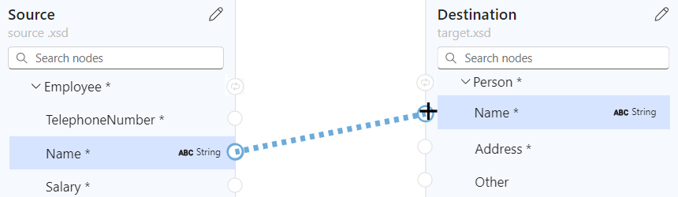
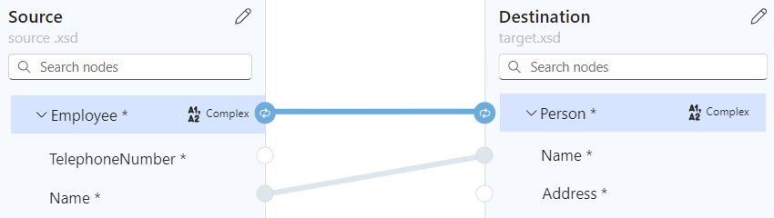
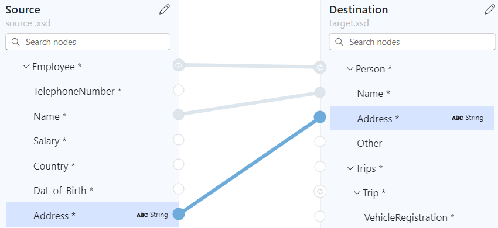

# Create maps to transform data in Azure Logic Apps with Visual Studio Code

[!INCLUDE [logic-apps-sku-standard](../../includes/logic-apps-sku-standard.md)]

To exchange messages that have different XML or JSON formats in an Azure Logic Apps workflow, you have to transform the data from one format to another, especially if you have gaps between the source and target schema structures. Data transformation helps you bridge those gaps. For this task, you need to create a map that defines the transformation between data elements in the source and target schemas.

To visually create and edit a map, you can use Visual Studio Code with the Azure Logic Apps (Standard) extension within the context of a Standard logic app project. The Data Mapper tool provides a unified experience for XSLT mapping and transformation using drag and drop gestures, a prebuilt functions library for creating expressions, and a way to manually test the maps that you create and use in your workflows.

After you create your map, you can directly call that map from a workflow in your logic app project or from a workflow in the Azure portal. For this task, you can use the **Data Mapper Operations** action named **Transform using Data Mapper XSLT** in your workflow.

This how-to guide shows how to create an empty data map, choose your source and target schemas, select schema elements to start mapping, create various mappings, save and test your map, and then call the map from a workflow in your logic app project.

## Limitations and known issues

- Data Mapper currently works only in Visual Studio Code running on Windows operating systems.

- Data Mapper is currently available only in Visual Studio Code, not the Azure portal, and only from within Standard logic app projects, not Consumption logic app projects.

- Data Mapper currently doesn't support comma-separated values (.csv) files.

- The **Code** pane in Data Mapper is currently read only.

- The layout and item positions in Data Mapper are currently automatic and read only.

- If you create a mapping between parent elements, which have **Complex** type, in the source and target schemas, the mapper creates a loop that iterates through the child elements. However, you must still explicitly create mappings between the child elements. 

- To call maps created with Data Mapper, you can only use the **Data Mapper Operations** action named **Transform using Data Mapper XSLT**. [For maps created by any other tool, use the **XML Operations** action named **Transform XML**](logic-apps-enterprise-integration-transform.md).

- To use the maps that you create with Data Mapper with workflows in the Azure portal, you must [add them directly to your Standard logic app resource](logic-apps-enterprise-integration-maps.md?tabs=standard#add-map-to-standard-logic-app-resource).

## Prerequisites

- [Visual Studio Code and the Azure Logic Apps (Standard) extension](create-single-tenant-workflows-visual-studio-code.md#prerequisites) to create Standard logic app workflows.

  > [!NOTE]
  >
  > The formerly separate Data Mapper extension is now merged with the Azure Logic Apps (Standard) extension. 
  > To avoid conflicts, any existing version of the Data Mapper extension is removed when you install or update 
  > the Azure Logic Apps (Standard) extension. After extension install or update, please restart Visual Studio Code.

- The source and target schema files that describe the data types to transform. These files can have either the following formats:

  - An XML schema definition file with the .xsd file extension
  - A JavaScript Object Notation file with the .json file extension

- A Standard logic app project that includes a stateful or stateless workflow with a trigger at minimum. If you don't have a project, follow these steps in Visual Studio Code:

  1. [Connect to your Azure account](create-single-tenant-workflows-visual-studio-code.md#connect-azure-account), if you haven't already.

  1. [Create a local folder, a local Standard logic app project, and a stateful or stateless workflow](create-single-tenant-workflows-visual-studio-code.md#create-project). During workflow creation, select **Open in current window**.

- Sample input data if you want to test the map and check that the transformation works as you expect.

- To use the **Run XSLT** function, your XSLT snippets must exist in files that use either the **.xml** or **.xslt** file name extension. You must put your XSLT snippets in the **InlineXslt** folder in your local project folder structure: **Artifacts** > **DataMapper** > **Extensions** > **InlineXslt**. If this folder structure doesn't exist, create the missing folders.

## Create a data map

1. In Visual Studio Code, open the folder for your Standard logic app project.

1. On the Visual Studio Code left menu, select the **Azure** icon.

1. In the **Azure** window, under **Data Mapper**, select **Create data map**.

   

   On the Visual Studio Code title bar, a prompt box opens so you can provide a name for your map.

1. In the prompt box, enter a data map name.

   For this guide, these steps use the name **Example-data-map**.

   :::image type="content" source="media/create-maps-data-transformation-visual-studio-code/data-map-name.png" alt-text="Screenshot shows prompt box and example data map name.":::

   The Data Mapper creates and opens a blank data map.

1. Choose your source and target schemas by following these steps:

   1. In the **Source** pane, select **Add new** > **Browse** to find and upload your source schema.

      :::image type="content" source="media/create-maps-data-transformation-visual-studio-code/add-source-schema.png" alt-text="Screenshot shows Data Mapper and Source pane with selected options for Add new and Browse.":::

      After you add your source schema, the **Source** pane populates with the XML element "nodes" for the data types in the source schema, for example:

      :::image type="content" source="media/create-maps-data-transformation-visual-studio-code/added-source-schema.png" alt-text="Screenshot shows Source pane populated with source schema XML element nodes.":::

   1. In the **Destination** pane, select **Add new** > **Browse** to find and upload your target schema.

      :::image type="content" source="media/create-maps-data-transformation-visual-studio-code/add-target-schema.png" alt-text="Screenshot shows Data Mapper and Destination pane with selected options for Add new and Browse.":::

      After you add your target schema, the **Destination** pane populates with the XML element "nodes" for the data types in the target schema, for example:

      :::image type="content" source="media/create-maps-data-transformation-visual-studio-code/added-target-schema.png" alt-text="Screenshot shows Destination pane populated with source schema XML element nodes.":::

> [!TIP]
>
> If you experience problems loading your schemas, you can locally add your source and target 
> schema files to your logic app project's **Artifacts**\/**Schemas** folder. In this scenario, 
> to specify your source and target schema in Data Mapper, on the **Source** and **Destination** 
> panes, open the **Select existing** list, rather than use **Add new**, and select your schema.

## Schema data types

The following table describes the possible data types that might appear in a schema:

| Symbol | Type | More info |
|--------|------|-----------|
|  | Complex (Array) | Contains items or repeating item nodes |
|  | Boolean | True or false only |
|  | Complex | An XML object with children properties, similar to the Object JSON type |
|  | DateTime | |
|  | Decimal | |
|  | Integer | Whole numbers only |
|  | String | |

<a name="create-direct-mapping"></a>

## Create a direct mapping between elements

For a straightforward transformation between elements with the same type in the source and target schemas, follow these steps:

1. To view what happens in code while you create the mapping, in the mapper's upper right corner, select **View code**.

1. On the mapper surface, in the **Source** pane, find the source element that you want to map.

   - By default, parent elements are automatically expanded to show their children. You can't collapse parent elements.

   - This example starts mapping from the source element, but you can choose to start mapping from the target element.

1. Move your mouse pointer over the circle next to the source element name until the pointer changes to a plus sign (**+**).

   This example creates a mapping starting from the **Employee ID** source element.

   :::image type="content" source="media/create-maps-data-transformation-visual-studio-code/direct-mapping-start-source-element.png" alt-text="Screenshot shows Data Mapper with pointer over the source element.":::

1. Drag and draw a line so that the source element connects to the circle for the target element in the **Destination** pane.

   This example completes the mapping with the **ID** target element, which has the same data type as the source element.

   :::image type="content" source="media/create-maps-data-transformation-visual-studio-code/direct-mapping-target-element.png" alt-text="Screenshot shows Data Mapper, a pointer over the target element, and a line between the source and target elements.":::

   You've now created a direct mapping between both elements that have the same data types.

   :::image type="content" source="media/create-maps-data-transformation-visual-studio-code/direct-mapping-complete.png" alt-text="Screenshot shows a complete mapping between the EmployeeID and ID in the source and target schemas, respectively.":::

   The **Code** pane shows the mapping relationship that you created:

   :::image type="content" source="media/create-maps-data-transformation-visual-studio-code/direct-mapping-example-code-view.png" alt-text="Screenshot shows Code pane  with direct mapping between EmployeeID and ID in the source and target schemas, respectively.":::

   > [!TIP]
   > 
   > To check whether your mappings have any problems, select **View issues**. For example, 
   > a warning appears in the **Issues** list on the **Warnings** tab if you create a mapping 
   > between elements that have mismatched data types:
   >
   > :::image type="content" source="media/create-maps-data-transformation-visual-studio-code/data-type-mismatch.png" alt-text="Screenshot shows mapping between mismatched data types.":::

<a name="create-complex-mapping"></a>

## Create a complex mapping between elements

For a more complex transformation between elements in the source and target schemas, such as elements that you want to combine or that have different data types, you can use one or more functions to perform tasks for that transformation.

On the mapper surface, a function's label is color-coded based on the function group. Next to the function name, the function's symbol appears, for example:

:::image type="content" source="media/create-maps-data-transformation-visual-studio-code/example-function.png" alt-text="Screenshot shows example function label." border="false":::

The following table lists the available function groups and some example functions that you can use. For the complete list, see the **Functions** list in the Data Mapper tool.

| Group | Example functions |
|-------|-------------------|
| Collection | Average, Count, Direct Access, Distinct values, Filter, Index, Join, Maximum, Minimum, Reverse, Sort, Subsequence, Sum |
| Conversion | To Date, To Integer, To Number, To String |
| Date and time | Add Days, Current Date, Current Time, Equals Date |
| Logical comparison | Equal, Exists, Greater, Greater or equal, If, If Else, Is Nil, Is Null, Is Number, Is String, Less, Less or Equal, Logical AND, Logical NOT, Logical OR, Not Equal |
| Math | Absolute, Add, Arctangent, Ceiling, Cosine, Divide, Exponential, Exponential (base 10), Floor, Integer Divide, Log, Log (base 10), Module, Multiply, Power, Round, Sine, Square Root, Subtract, Tangent |
| String | Codepoints to String, Concat, Contains, Ends with, Length, Lowercase, Name, Regular Expression Matches, Regular Expression Replace, Replace, Starts with, String to Codepoints, Substring, Substring after, Substring before, Trim, Trim Left, Trim Right, Uppercase |
| Utility | Copy, Error, Execute XPath, Format DateTime, Format Number, Run XSLT |

### Add a function without a mapping relationship

The example in this section transforms the source element from String type to DateTime type, which is the target element type. The example starts without creating a mapping and uses the **To Date** function, which accepts a single input.

1. To view what happens in code while you create the mapping, in the mapper's upper right corner, select **View code**.

1. In the **Functions** list, find and select the function that you want to use, which adds the function to the mapper surface. If the **Functions** list is collapsed, in the mapper's upper left corner, select the function icon ().

   This example selects the **To Date** function, which is in the **Conversion** function group.

   :::image type="content" source="media/create-maps-data-transformation-visual-studio-code/no-mapping-select-function.png" alt-text="Screenshot shows selected function named To Date.":::

   You can also find and select any custom functions in the same way. For more information, see [Create a custom function](#create-custom-function).

   > [!NOTE]
   >
   > If no mapping exists on the map or if a mapping is selected when you add a function to the 
   > map, the function appears but isn't connected to any elements or other functions, for example:
   >
   > :::image type="content" source="media/create-maps-data-transformation-visual-studio-code/disconnected-function-to-date.png" alt-text="Screenshot shows disconnected function named To Date." border="false":::

1. Connect the function to the source and target elements.

   1. Drag and draw a line between the source element and the circle on the function's left edge. You can start from either the source element or the function.

      :::image type="content" source="media/create-maps-data-transformation-visual-studio-code/connect-function-to-date-start.png" alt-text="Screenshot shows mapping between a source element and a function.":::

   1. Drag and draw a line between the function's right edge and the target element. You can start from either from the target element or the function.

      :::image type="content" source="media/create-maps-data-transformation-visual-studio-code/connect-function-to-date-end.png" alt-text="Screenshot shows mapping between function and target element.":::

   The **Code** pane shows the mapping relationship that you created:

   :::image type="content" source="media/create-maps-data-transformation-visual-studio-code/to-date-example-code-view.png" alt-text="Screenshot shows Code pane with direct mapping relationship between source and target elements.":::

1. On the mapper surface, select the function shape to view the function details.

1. On the **Input** tab, confirm or edit the input to use.

   :::image type="content" source="media/create-maps-data-transformation-visual-studio-code/function-to-date-confirm-inputs.png" alt-text="Screenshot shows Input tab for the function named To Date.":::

   For some data types, such as arrays, the scope for the transformation might also appear available. This scope is usually the immediate element, such as the array, but in some scenarios, the scope might exist beyond the immediate element.

   For example, to iterate through array items, see [Create a loop between arrays](#loop-through-array). To perform a task when an element's value meets a condition, see [Add a condition between elements](#add-condition).

### Add a function with multiple inputs

The example in this section concatenates multiple source element types so that you can map the results to the target element type. The example uses the **Concat** function, which accepts multiple inputs.

1. To view what happens in code while you create the mapping, in the mapper's upper right corner, select **View code**.

1. In the **Functions** list, find and select the function that you want to use, which adds the function to the mapper surface. If the **Functions** list is collapsed, in the mapper's upper left corner, select the function icon ().

   This example selects the **Concat** function, which is in the **String** function group.

   :::image type="content" source="media/create-maps-data-transformation-visual-studio-code/select-function-concat.png" alt-text="Screenshot shows the selected function named Concat.":::

   > [!NOTE]
   >
   > If no mapping exists on the map or if a mapping is selected when you add a function to the 
   > map, the function appears but isn't connected to any elements or other functions, for example:
   >
   > :::image type="content" source="media/create-maps-data-transformation-visual-studio-code/disconnected-function-concat.png" alt-text="Screenshot shows disconnected function named Concat." border="false":::

1. On the mapper surface, select the function shape to view the function details.

1. On the **Input** tab, select the source data elements to use as the inputs.

   This example selects the **FirstName** and **LastName** elements in the source schema as the function inputs, which automatically adds the respective mappings to the mapper surface.

   :::image type="content" source="media/create-maps-data-transformation-visual-studio-code/function-multiple-inputs.png" alt-text="Screenshot shows multiple source elements as function inputs.":::

1. To complete the mapping, drag and draw a line between the function's right edge and the target element. You can start from either the target element or the function.

   :::image type="content" source="media/create-maps-data-transformation-visual-studio-code/function-multiple-inputs-single-output.png" alt-text="Screenshot shows finished mappings between multiple inputs, Concat function, and target element.":::

   The **Code** pane shows the mapping relationships that you created:

   

<a name="loop-through-array"></a>

## Create a loop between arrays

If your source and target schemas include arrays, you can create a loop mapping relationship that iterates through the items in those arrays. The example in this section loops through an Employee source array and a Person target array.

1. To review what happens in code while you create the mapping, in the map's upper right corner, select **Show code**.

1. On the map, in the target schema area, [select the target array element and target array item elements that you want to map](#create-direct-mapping).

1. On the map, in the target schema area, expand the target array element and array items.

1. In the source schema area, add the source array element and array item elements to the map.

1. [Create a direct mapping between the source and target elements](#create-direct-mapping).

   

   When you first create a mapping relationship between a matching pair of array items, a mapping relationship is automatically created at the parent array level.

   

   The **Code** pane shows the mapping relationship that you created:

   

1. Continue mapping the other array elements.

   

<a name="add-condition"></a>

## Set up a condition and task to perform between elements

To add a mapping relationship that evaluates a condition and performs a task when the condition is met, you can use multiple functions, such as the **If** function, a comparison function such as **Greater**, and the task to perform such as **Multiply**.

The example in this section calculates a discount to apply when the purchase quantity exceeds 20 items by using the following functions:

- **Greater**: Check whether item quantity is greater than 20.
- **If**: Check whether the **Greater** function returns true.
- **Multiply**: Calculate the discount by multiplying the item price by 10% and the item quantity.

1. To review what happens in code while you create the mapping, in the map's upper right corner, select **Show code**.

1. If you haven't already, on the map, [select the target elements and then the source elements that you want to map](#create-direct-mapping).

   This example selects the following elements:

   

1. In the map's upper left corner, select **Show functions** ().

1. Add the following functions to the map: **Greater**, **If**, and **Multiply**

1. Expand all the function shapes to show the function details and connection points.

1. Connect the source elements, functions, and target elements as follows:

   * The source schema's **ItemPrice** element to the target schema's **ItemPrice** element
   * The source schema's **ItemQuantity** element to the **Greater** function's **Value** field
   * The **Greater** function's output to the **If** function's **Condition** field
   * The source schema's **ItemPrice** element to the **Multiply** function's **Multiplicand 0*** field
   * The **Multiply** function's output to the **If** function's **Value** field
   * The **If** function's output to the target schema's **ItemDiscount** element

   > [!NOTE]
   >
   > In the **If** function, the word **ANY** appears to the right of the function name, 
   > indicating that you can assign the output value to anything. 

1. In the following functions, on the **Properties** tab, specify the following values:

   | Function | Input parameter and value |
   |----------|---------------------------|
   | **Greater** | - **Value** #1: The source element named **ItemQuantity** <br>- **Value** #2: **20** |
   | **Multiply** | - **Multiplicand** #1: The source element named **ItemPrice** <br>- **Multiplicand** #2: **.10** |
   | **If** | - **Condition**: **is-greater-than(ItemQuantity,20)** <br>- **Value**: **multiply(ItemPrice, .10)** |

   The following map shows the finished example:

   

   The **Code** pane shows the mapping relationship that you created:

   

## Save your map

When you're done, on the map toolbar, select **Save**.

Visual Studio Code saves your map as the following artifacts:

- A **<*your-map-name*>.yml** file in the **Artifacts** > **MapDefinitions** project folder
- An **<*your-map-name*>.xslt** file in the **Artifacts** > **Maps** project folder

<a name="generate-xslt"></a>

## Generate XSLT file at any time

To generate the **<*your-map-name*>.xslt** file at any time, on the map toolbar, select **Generate XSLT**.

## Test your map

To confirm that the transformation works as you expect, you'll need sample input data.

1. Before you test your map, make sure to [generate the latest **<*your-map-name*>.xslt** file](#generate-xslt).

1. On your map toolbar, select **Test**.

1. On the **Test map** pane, in the **Input** window, paste your sample input data, and then select **Test**.

   The test pane switches to the **Output** tab and shows the test's status code and response body.

## Call your map from a workflow in your project

1. On the Visual Studio Code left menu, select **Explorer** (files icon) to view your logic app project structure.

1. Expand the folder that has your workflow name. From the **workflow.json** file's shortcut menu, select **Open Designer**.

1. On the workflow designer, follow these [general steps to add the **Data Mapper Operations** built-in action named **Transform using Data Mapper XSLT**](create-workflow-with-trigger-or-action.md?tabs=standard#add-action).

1. On the designer, select the **Transform using Data Mapper XSLT** action.

1. On the action information pane that appears, specify the **Content** value, and leave **Map Source** set to **Logic App**. From the **Map Name** list, select the map file (.xslt) that you want to use.

   :::image type="content" source="media/create-maps-data-transformation-visual-studio-code/transform-data-mapper-xslt-action.png" alt-text="Screenshot shows Visual Studio Code, Standard workflow designer, with selected action named Transform using Data Mapper XSLT and action properties.":::

   To use the same **Transform using Data Mapper XSLT** action in the Azure portal, you must [add the map to the Standard logic app resource](logic-apps-enterprise-integration-maps.md?tabs=standard#add-map-to-standard-logic-app-resource).

<a name="create-custom-function"></a>

## Create a custom function

To create your own function that you can use with the Data Mapper tool, follow these steps:

1. Create an XML (.xml) file that has a meaningful name that describes your function's purpose.

   If you have multiple related functions, you can use a single file for these functions. Although you can use any file name, a meaningful file name or category makes your functions easier to identify, find, and discover.

1. In your XML file, you must use the following schema for the function definition:

   ```xml
   <?xml version="1.0" encoding="utf-8"?>
   <xs:schema attributeFormDefault="unqualified" elementFormDefault="qualified" xmlns:xs="http://www.w3.org/2001/XMLSchema">
      <xs:element name="customfunctions">
         <xs:complexType>
            <xs:sequence>
               <xs:element maxOccurs="unbounded" name="function">
                  <xs:complexType>
                     <xs:sequence>
                        <xs:element maxOccurs="unbounded" name="param">
                           <xs:complexType>
                               <xs:attribute name="name" type="xs:string" use="required" />
                               <xs:attribute name="as" type="xs:string" use="required" />
                           </xs:complexType>
                        </xs:element>
                        <xs:any minOccurs="0" />
                     </xs:sequence>
                     <xs:attribute name="name" type="xs:string" use="required" />
                     <xs:attribute name="as" type="xs:string" use="required" />
                     <xs:attribute name="description" type="xs:string" use="required" />
                  </xs:complexType>
               </xs:element>
            </xs:sequence>
         </xs:complexType>
      </xs:element>
   </xs:schema>
   ```

   Each XML element named **"function"** implements an XSLT3.0 style function with a few more attributes. The Data Mapper functions list includes the function name, description, parameter names, and parameter types.

   The following example shows the implementation for a **SampleFunctions.xml** file:

   ```xml
   <?xml version="1.0" encoding="utf-8" ?>
   <xs:schema attributeFormDefault="unqualified" elementFormDefault="qualified" xmlns:xs="http://www.w3.org/2001/XMLSchema">
   <customfunctions>
      <function name="age" as="xs:float" description="Returns the current age.">
         <param name="inputDate" as="xs:date"/> 
         <value-of select="round(days-from-duration(current-date() - xs:date($inputDate)) div 365.25, 1)"/>
      </function> 
      <function name="custom-if-then-else" as="xs:string" description="Evaluates the condition and returns corresponding value.">
         <param name="condition" as="xs:boolean"/>
         <param name="thenResult" as="xs:anyAtomicType"/>
         <param name="elseResult" as="xs:anyAtomicType"/>
         <choose>
            <when test="$condition">
               <value-of select="$thenResult"></value-of>
            </when>
            <otherwise>
               <value-of select="$elseResult"></value-of>
            </otherwise>
         </choose>
      </function>
   </customfunctions>
   ```

1. On your local computer, open the folder for your Standard logic app project.

1. Open the **Artifacts** folder, and create the following folder structure, if none exists: **DataMapper** > **Extensions** > **Functions**.

1. In the **Functions** folder, save your function's XML file.

1. To find your custom function in the Data Mapper tool's functions list, search for the function, or expand the **Custom functions** collection.

## Next steps

- For data transformations using B2B operations in Azure Logic Apps, see [Add maps for transformations in workflows with Azure Logic Apps](logic-apps-enterprise-integration-maps.md)
