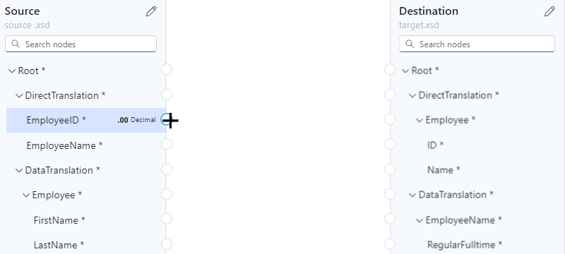
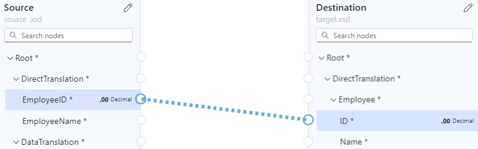
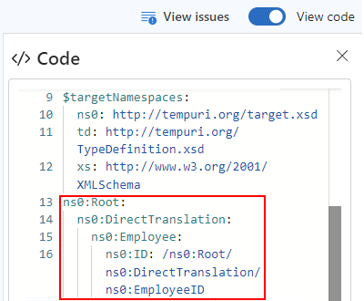
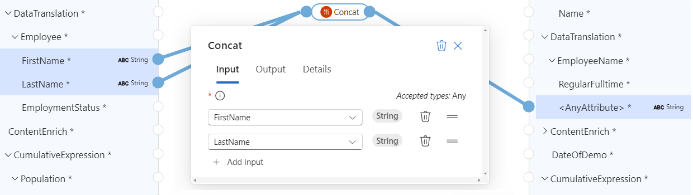
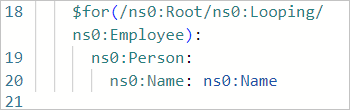

# Create maps to transform data in Azure Logic Apps with Visual Studio Code (preview)

> [!IMPORTANT]
> This capability is in preview and is subject to the 
> [Supplemental Terms of Use for Microsoft Azure Previews](https://azure.microsoft.com/support/legal/preview-supplemental-terms/).

[!INCLUDE [logic-apps-sku-standard](../../includes/logic-apps-sku-standard.md)]

To exchange messages that have different XML or JSON formats in an Azure Logic Apps workflow, you have to transform the data from one format to another, especially if you have gaps between the source and target schema structures. Data transformation helps you bridge those gaps. For this task, you need to create a map that defines the transformation between data elements in the source and target schemas.

To visually create and edit a map, you can use Visual Studio Code with the Data Mapper extension within the context of a Standard logic app project. The Data Mapper tool provides a unified experience for XSLT mapping and transformation using drag and drop gestures, a prebuilt functions library for creating expressions, and a way to manually test the maps that you create and use in your workflows.

After you create your map, you can directly call that map from a workflow in your logic app project or from a workflow in the Azure portal. For this task, you can use the **Data Mapper Operations** action named **Transform using Data Mapper XSLT** in your workflow.

This how-to guide shows how to create a blank data map, choose your source and target schemas, select schema elements to start mapping, create various mappings, save and test your map, and then call the map from a workflow in your logic app project.

## Limitations and known issues

- The Data Mapper extension currently works only in Visual Studio Code running on Windows operating systems.

- The Data Mapper tool is currently available only in Visual Studio Code, not the Azure portal, and only from within Standard logic app projects, not Consumption logic app projects.

- To call maps created with the Data Mapper tool, you can only use the **Data Mapper Operations** action named **Transform using Data Mapper XSLT**. [For maps created by any other tool, use the **XML Operations** action named **Transform XML**](logic-apps-enterprise-integration-transform.md).

- The Data Mapper tool's **Code view** pane is currently read only.

- The map layout and item position are currently automatic and read only.

- The Data Mapper extension currently works only with schemas in flat folder-structured projects.

## Prerequisites

- [Same prerequisites for using Visual Studio Code and the Azure Logic Apps (Standard) extension](create-single-tenant-workflows-visual-studio-code.md#prerequisites) to create Standard logic app workflows.

- The latest **Azure Logic Apps - Data Mapper** extension. You can download and install this extension from inside Visual Studio Code through the Marketplace, or you can find this extension externally on the [Marketplace website](https://marketplace.visualstudio.com/vscode).

- The source and target schema files that describe the data types to transform. These files can have either the following formats:

  - An XML schema definition file with the .xsd file extension
  - A JavaScript Object Notation file with the .json file extension

- A Standard logic app project that includes a stateful or stateless workflow with at least a trigger. If you don't have a project, follow these steps in Visual Studio Code:

  1. [Connect to your Azure account](create-single-tenant-workflows-visual-studio-code.md#connect-azure-account), if you haven't already.

  1. [Create a local folder, a local Standard logic app project, and a stateful or stateless workflow](create-single-tenant-workflows-visual-studio-code.md#create-project). During workflow creation, select **Open in current window**.

- Sample input data if you want to test the map and check that the transformation works as you expect.

## Create a data map

1. On the Visual Studio Code left menu, select the **Azure** icon.

1. In the **Azure** pane, under the **Data Mapper** section, select **Create new data map**.

   

1. Provide a name for your data map.

1. Specify your source and target schemas by following these steps:

   1. On the map surface, select **Add a source schema**.

      

   1. On the **Configure** pane that opens, select **Add new** > **Browse**.

   1. Find and select your source schema file, and then select **Add**.

      If your source schema doesn't appear in the **Open** window, from the file type list, change **XSD File (\*.xsd)** to **All Files (\*.\*)**.

      The map surface now shows the data types from the source schema. For the examples in this guide, 

   1. On the map surface, select **Add a target schema**.

   1. On the **Configure** pane that opens, select **Add new** > **Browse**.

   1. Find and select your target schema file, and then select **Add**.

      If your target schema doesn't appear in the **Open** window, from the file type list, change **XSD File (\*.xsd)** to **All Files (\*.\*)**.

      The map surface now shows data types from the target schema.

   Alternatively, you can also add your source and target schema files locally to your logic app project in the **Artifacts** **Schemas** folder, so that they appear in Visual Studio Code. In this case, you can specify your source and target schema in the Data Mapper tool on the **Configure** pane by selecting **Select existing**, rather than **Add new**.

   When you're done, your map looks similar to the following example:

   

The following table describes the possible data types that might appear in a schema:

| Symbol | Type | More info |
|--------|------|-----------|
|  | Array | Contains items or repeating item nodes |
|  | Binary | |
|  | Bool | True or false only |
|  | Complex | An XML object with children properties, similar to the Object JSON type |
|  | DateTime | |
|  | Decimal | |
|  | Integer | Whole numbers only |
|  | Null | Not a data type, but appears when an error or an invalid type exists |
|  | Number | A JSON integer or decimal |
|  | Object | A JSON object with children properties, similar to the Complex XML type |
|  | String | |

## Navigate the map

To move around the map, you have the following options:

- To pan around, drag your pointer around the map surface. Or, press and hold the mouse wheel, while you move the mouse or trackball.

- After you move one level down into the map, in the map's lower left corner, a navigation bar appears where you can select from the following options:

  

  | Option | Alternative gesture |
  |--------|---------------------|
  | **Zoom out** | On the map surface, press SHIFT + double select.  -or-  Scroll down with the mouse wheel. |
  | **Zoom in** | On the map surface, double select.  -or-  Scroll up with the mouse wheel. |
  | **Zoom to fit** | None |
  | **Show (Hide) mini-map** | None |

- To move up one level on the map, on the breadcrumb path at the top of the map, select a previous level.

## Select target and source elements to map

1. On the map surface, starting from the right side, in the target schema area, select the target element that you want to map. If the element you want is a child of a parent element, find and expand the parent first.

1. Now, on the left side, from the source schema area, select **Select element**.

1. In the **Source schema** window that appears, select one or more source elements to show on the map.

   - To include a parent and direct children, open the parent's shortcut menu, and select **Add children**.

   - To include a parent and all the children for that parent, including any sub-parents, open the top-level parent's shortcut menu, and select **Add children (recursive)**.

1. When you're done, you can close the source schema window. You can always add more source elements later. On the map, in the upper left corner, select **Show source schema** ().

## Create a direct mapping between elements

For a straightforward transformation between elements with the same type in the source and target schemas, follow these steps:

1. To review what happens in code while you create the mapping, in the map's upper right corner, select **Show code**.

1. If you haven't already, on the map, [select the target elements and then the source elements that you want to map](#select-elements).

1. Move your pointer over the source element so that both a circle and a plus sign (**+**) appear.

   

1. Drag a line to the target element so that the line connects to the circle that appears.

   

   You've now created a direct mapping between both elements.

   

   The code view window reflects the mapping relationship that you created:

   

> [!NOTE]
> 
> If you create a mapping between elements where their data types don't match, a warning appears on the target element, for example:
>
> 

## Create a complex mapping between elements

For a more complex transformation between elements in the source and target schemas, such as elements that you want to combine or that have different data types, you can use one or more functions to perform tasks for that transformation.

The following table lists the available function groups and *example* functions that you can use:

| Group | Example functions |
|-------|-------------------|
| Collection | Average, Count, Direct Access, Index, Join, Maximum, Minimum, Sum |
| Conversion | To date, To integer, To number, To string |
| Date and time | Add days |
| Logical comparison | Equal, Exists, Greater, Greater or equal, If, If else, Is nil, Is null, Is number, Is string, Less, Less or equal, Logical AND, Logical NOT, Logical OR, Not equal |
| Math | Absolute, Add, Arctangent, Ceiling, Cosine, Divide, Exponential, Exponential (base 10), Floor, Integer divide, Log, Log (base 10), Module, Multiply, Power, Round, Sine, Square root, Subtract, Tangent |
| String | Code points to string, Concat, Contains, Ends with, Length, Lowercase, Name, Regular expression matches, Regular expression replace, Replace, Starts with, String to code-points, Substring, Substring after, Substring before, Trim, Trim left, Trim right, Uppercase |
| Utility | Copy, Error, Format date-time, Format number |

On the map, the function's label looks like the following example and is color-coded based on the function group. To the function name's left side, a symbol for the function appears. To the function name's right side, a symbol for the function output's data type appears.

### Add a function without a mapping relationship

The example in this section transforms the source element type from String type to DateTime type, which matches the target element type. The example uses the **To date** function, which takes a single input.

1. To review what happens in code while you create the mapping, in the map's upper right corner, select **Show code**.

1. If you haven't already, on the map, [select the target elements and then the source elements that you want to map](#select-elements).

1. In the map's upper left corner, select **Show functions** ().

   

1. From the functions list that opens, find and select the function that you want to use, which adds the function to the map. If the function doesn't appear visible on the map, try zooming out on the map surface.

   This example selects the **To date** function.

   

   > [!NOTE]
   >
   > If no mapping line exists or is selected when you add a function to the map, the function 
   > appears on the map, but disconnected from any elements or other functions, for example:
   >
   > 
   >

1. Expand the function shape to display the function's details and connection points. To expand the function shape, select inside the shape.

1. Connect the function to the source and target elements.

   1. Drag and draw a line between the source elements and the function's left edge. You can start either from the source elements or from the function.

      

   1. Drag and draw a line between the function's right edge and the target element. You can start either from the target element or from the function.

      

1. On the function's **Properties** tab, confirm or edit the input to use.

   

   For some data types, such as arrays, the scope for the transformation might also appear available. This scope is usually the immediate element, such as an array, but in some scenarios, the scope might exist beyond the immediate element.

   The code view window reflects the mapping relationship that you created:

   

For example, to iterate through array items, see [Create a loop between arrays](#loop-through-array). To perform a task when an element's value meets a condition, see [Add a condition between elements](#add-condition).

### Add a function to an existing mapping relationship

When a mapping relationship already exists between source and target elements, you can add the function by following these steps:

1. On the map, select the line for the mapping that you created.

1. Move your pointer over the selected line, and select the plus sign (**+**) that appears.

1. From the functions list that opens, find and select the function that you want to use. 

   The function appears on the map and is automatically connected between the source and target elements.

### Add a function with multiple inputs

The example in this section concatenates multiple source element types so that you can map the results to the target element type. The example uses the **Concat** function, which takes multiple inputs.

1. To review what happens in code while you create the mapping, in the map's upper right corner, select **Show code**.

1. If you haven't already, on the map, [select the target elements and then the source elements that you want to map](#select-elements).

1. In the map's upper left corner, select **Show functions** ().

   

1. From the functions list that opens, find and select the function that you want to use, which adds the function to the map. If the function doesn't appear visible on the map, try zooming out on the map surface.

   This example selects the **Concat** function:

   

   > [!NOTE]
   >
   > If no mapping line exists or is selected when you add a function to the map, the function 
   > appears on the map, but disconnected from any elements or other functions. If the function 
   > requires configuration, a red dot appears in the function's upper right corner, for example:
   >
   > 

1. Expand the function shape to display the function's details and connection points. To expand the function shape, select inside the shape.

1. In the function information pane, on the **Properties** tab, under **Inputs**, select the source data elements to use as the inputs.

   This example selects the **FirstName** and **LastName** source elements as the function inputs, which automatically add the respective connections on the map.

   

1. To complete the mapping drag and draw a line between the function's right edge and the target element. You can start either from the target element or from the function.

   

   The code view window reflects the mapping relationship that you created:

   

## Create a loop between arrays

If your source and target schemas include arrays, you can create a loop mapping relationship that iterates through the items in those arrays. The example in this section loops through an Employee source array and a Person target array.

1. To review what happens in code while you create the mapping, in the map's upper right corner, select **Show code**.

1. On the map, in the target schema area, [select the target array element and target array item elements that you want to map](#select-elements).

1. On the map, in the target schema area, expand the target array element and array items.

1. In the source schema area, add the source array element and array item elements to the map.

1. [Create a direct mapping between the source and target elements](#create-direct-mapping).

   

   When you first create a mapping relationship between a matching pair of array items, a mapping relationship is automatically created at the parent array level.

   

   The code view window reflects the mapping relationship that you created:

   

1. Continue mapping the other array elements.

   

## Set up a condition and task to perform between elements

To add a mapping relationship that evaluates a condition and performs a task when the condition is met, you can use multiple functions, such as the **If** function, a comparison function such as **Greater**, and the task to perform such as **Multiply**.

The example in this section calculates a discount to apply when the purchase quantity exceeds 20 items by using the following functions:

- **Greater**: Check whether item quantity is greater than 20.
- **If**: Check whether the **Greater** function returns true.
- **Multiply**: Calculate the discount by multiplying the item price by 10% and the item quantity.

1. To review what happens in code while you create the mapping, in the map's upper right corner, select **Show code**.

1. If you haven't already, on the map, [select the target elements and then the source elements that you want to map](#select-elements).

   This example selects the following elements:

   

1. In the map's upper left corner, select **Show functions** ().

1. Add the following functions to the map: **Greater**, **If**, and **Multiply**

1. Expand all the function shapes to show the function details and connection points.

1. Connect the source elements, functions, and target elements as follows:

   * The source schema's **ItemPrice** element to the target schema's **ItemPrice** element
   * The source schema's **ItemQuantity** element to the **Greater** function's **Value** field
   * The **Greater** function's output to the **If** function's **Condition** field
   * The source schema's **ItemPrice** element to the **Multiply** function's **Multiplicand 0*** field
   * The **Multiply** function's output to the **If** function's **Value** field
   * The **If** function's output to the target schema's **ItemDiscount** element

   > [!NOTE]
   >
   > In the **If** function, the word **ANY** appears to the right of the function name, 
   > indicating that you can assign the output value to anything. 

1. In the following functions, on the **Properties** tab, specify the following values:

   | Function | Input parameter and value |
   |----------|---------------------------|
   | **Greater** | - **Value** #1: The source element named **ItemQuantity**  - **Value** #2: **20** |
   | **Multiply** | - **Multiplicand** #1: The source element named **ItemPrice**  - **Multiplicand** #2: **.10** |
   | **If** | - **Condition**: **is-greater-than(ItemQuantity,20)**  - **Value**: **multiply(ItemPrice, .10)** |

   The following map shows the finished example:

   

   The code view window reflects the mapping relationship that you created:

   

## Save your map

When you're done, on the map toolbar, select **Save**.

Visual Studio Code saves your map as the following artifacts:

- A **<*your-map-name*>.yml** file in the **Artifacts** > **MapDefinitions** project folder
- An **<*your-map-name*>.xslt** file in the **Artifacts** > **Maps** project folder

## Test your map

To confirm that the transformation works as you expect, you'll need sample input data.

1. On your map toolbar, select **Test**.

1. On the **Test map** pane, in the **Input** window, paste your sample input data, and then select **Test**.

   The test pane switches to the **Output** tab and shows the test's status code and response body.

## Call your map from a workflow in your project

1. On the Visual Studio Code left menu, select **Explorer** (files icon) to view your logic app project structure.

1. Expand the folder that has your workflow name. From the **workflow.json** file's shortcut menu, select **Open Designer**.

1. On the workflow designer, either after the step or between the steps where you want to perform the transformation, select the plus sign (**+**) > **Add an action**.

1. On the **Add an action** pane, in the search box, enter **data mapper**. Select the **Data Mapper Operations** action named **Transform using Data Mapper XSLT**.

1. In the action information box, specify the **Content** value, and leave **Map Source** set to **Logic App**. From the **Map Name** list, select the map file (.xslt) that you want to use.

To use the same **Transform using Data Mapper XSLT** action in the Azure portal, add the map to either of the following resources:

- An integration account for a Consumption or Standard logic app resource
- The Standard logic app resource itself

## Next steps

- For data transformations using B2B operations in Azure Logic Apps, see [Add maps for transformations in workflows with Azure Logic Apps](logic-apps-enterprise-integration-maps.md)
