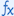

# Create maps to transform data in logic app workflows with Visual Studio Code

[!INCLUDE [logic-apps-sku-standard](../../includes/logic-apps-sku-standard.md)]

When you exchange messages that use different XML or JSON formats in a logic app workflow, you have to specify how to *transform* or convert the data from the source format to the target format, for example, between XML documents or between JSON documents. This task is important especially when you have gaps between the data structures in the source and target schemas. A *schema* describes the data elements, attributes, and data types in an XML or JSON document.

To define transformations between data structures and bridge any gaps, you can create a map (.xslt file) that specifies the relationships between the data elements in the source and target schemas. You can visually create or edit a map by using Visual Studio Code with the Azure Logic Apps (Standard) extension within the context of a Standard logic app project. The Data Mapper tool provides a unified experience for mapping and transformation using drag and drop gestures, prebuilt functions for building expressions, and a way to manually test maps before you use them in your workflows.

After you create your map, you can directly call that map from a workflow in your logic app project or from a Standard logic app workflow in the Azure portal. For this task, you can use the **Data Mapper Operations** action named **Transform using Data Mapper XSLT** in your workflow.

This how-to guide shows how to create an empty data map, choose your source and target schemas, create various kinds of mappings between schema elements, save and test your map, and then call the map from a workflow in your logic app project.

## Limitations and known issues

- Data Mapper currently works only in Visual Studio Code running on Windows operating systems.

- Data Mapper is currently available only in Visual Studio Code, not the Azure portal, and only from within Standard logic app projects, not Consumption logic app projects.

- Data Mapper currently doesn't support schemas that use the comma-separated values (.csv) file format.

- The **Code** pane in Data Mapper is currently read only.

- The layout and item positions in Data Mapper are currently automatic and read only.

- The **Filter** function correctly processes numeric conditions that are enclosed by double quotation marks, for example, **">=10"**. However, this function currently doesn't consistently behave for string comparisons such as a check on whether an item name is **"= 'Pen'"**.

- When you create a mapping between the parent array elements in the source and target schemas, the mapper automatically adds a loop to iterate through the array item elements. However, you must still explicitly create mappings between the source and target array item elements.

- To call maps created with Data Mapper, you can only use the **Data Mapper Operations** action named **Transform using Data Mapper XSLT**. [For maps created by any other tool, use the **XML Operations** action named **Transform XML**](logic-apps-enterprise-integration-transform.md).

- To use the maps that you create with Data Mapper with workflows in the Azure portal, you must [add them directly to your Standard logic app resource](logic-apps-enterprise-integration-maps.md?tabs=standard#add-map-to-standard-logic-app-resource).

## Prerequisites

- [Visual Studio Code and the Azure Logic Apps (Standard) extension](create-single-tenant-workflows-visual-studio-code.md#prerequisites) to create Standard logic app workflows.

  > [!NOTE]
  >
  > The formerly separate Data Mapper extension is now merged with the Azure Logic Apps (Standard) extension. 
  > To avoid conflicts, any existing version of the Data Mapper extension is removed when you install or update 
  > the Azure Logic Apps (Standard) extension. After extension install or update, please restart Visual Studio Code.

- The source and target schema files that describe the data types to transform. These files can have either the following formats:

  - An XML schema definition file with the .xsd file extension

  - A JavaScript Object Notation file with the .json file extension

- A Standard logic app project that includes a stateful or stateless workflow with a trigger at minimum. If you don't have a project, follow these steps in Visual Studio Code:

  1. [Connect to your Azure account](create-single-tenant-workflows-visual-studio-code.md#connect-azure-account), if you haven't already.

  1. [Create a local folder, a Standard logic app workspace and project, and a stateful or stateless workflow](create-single-tenant-workflows-visual-studio-code.md#create-project). During workflow creation, select **Open in current window**.

- Sample input data if you want to test the map and check that the transformation works as you expect.

## Create a data map

1. In Visual Studio Code, open the folder for your Standard logic app project.

1. On the Visual Studio Code left menu, select the **Azure** icon.

1. In the **Azure** window, under **Data Mapper**, select **Create data map**.

   

   On the Visual Studio Code title bar, a prompt box opens so you can provide a name for your map.

1. In the prompt box, enter a name for the map.

   For this guide, these steps use the name **Example-data-map**.

   :::image type="content" source="media/create-maps-data-transformation-visual-studio-code/data-map-name.png" alt-text="Screenshot shows prompt box and example data map name.":::

   The Data Mapper creates and opens a blank data map.

1. Choose your source and target schemas by following these steps:

   1. In the **Source** pane, select **Add new** > **Browse** to find and upload your source schema.

      :::image type="content" source="media/create-maps-data-transformation-visual-studio-code/add-source-schema.png" alt-text="Screenshot shows Data Mapper and Source pane with selected options for Add new and Browse.":::

      After you add your source schema, the **Source** pane populates with the XML element "nodes" for the data types in the source schema, for example:

      :::image type="content" source="media/create-maps-data-transformation-visual-studio-code/added-source-schema.png" alt-text="Screenshot shows Source pane populated with source schema XML element nodes.":::

   1. In the **Destination** pane, select **Add new** > **Browse** to find and upload your target schema.

      :::image type="content" source="media/create-maps-data-transformation-visual-studio-code/add-target-schema.png" alt-text="Screenshot shows Data Mapper and Destination pane with selected options for Add new and Browse.":::

      After you add your target schema, the **Destination** pane populates with the XML element "nodes" for the data types in the target schema, for example:

      :::image type="content" source="media/create-maps-data-transformation-visual-studio-code/added-target-schema.png" alt-text="Screenshot shows Destination pane populated with source schema XML element nodes.":::

> [!TIP]
>
> If you experience problems loading your schemas, you can add your source and target 
> schema files to your logic app project's local **Artifacts**\/**Schemas** folder. In this scenario, 
> to specify your source and target schema in Data Mapper, on the **Source** and **Destination** 
> panes, open the **Select existing** list, rather than use **Add new**, and select your schema.

## Schema data types

The following table describes the possible data types that might appear in a schema:

| Symbol | Type | More info |
|--------|------|-----------|
|  | Complex (Array) | Contains items or repeating item nodes. <br><br>An array element also displays the following connection point: <br><br>  |
|  | Bool | True or false only |
|  | Complex | An XML object with children properties, similar to the Object JSON type |
|  | DateTime | |
|  | Decimal | |
|  | Integer | Whole numbers only |
|  | String | |

<a name="create-direct-mapping"></a>

## Create a direct mapping between elements

To specify a straightforward transformation between elements that have the same type in the source and target schemas, follow these steps:

1. To view what happens in code while you create the mapping, in the mapper's upper right corner, select **View code**.

1. On the mapper surface, in the **Source** pane, find the source element that you want to map.

   - By default, parent elements are automatically expanded to show their children.

   - This example starts mapping from the source element, but you can choose to start mapping from the target element.

1. Move your mouse pointer over the circle next to the source element name until the pointer changes to a plus sign (**+**).

   This example creates a mapping starting from the **Employee ID** source element.

   :::image type="content" source="media/create-maps-data-transformation-visual-studio-code/direct-mapping-start-source-element.png" alt-text="Screenshot shows Data Mapper with pointer over the source element.":::

1. Drag and draw a line so that the source element connects to the circle for the target element in the **Destination** pane.

   This example completes the mapping with the **ID** target element, which has the same data type as the source element.

   :::image type="content" source="media/create-maps-data-transformation-visual-studio-code/direct-mapping-target-element.png" alt-text="Screenshot shows Data Mapper, a pointer over the target element, and a line between the source and target elements.":::

   You've now created a direct mapping between both elements that have the same data types.

   :::image type="content" source="media/create-maps-data-transformation-visual-studio-code/direct-mapping-complete.png" alt-text="Screenshot shows a complete mapping between the EmployeeID and ID in the source and target schemas, respectively.":::

   The **Code** pane shows the mapping relationship that you created:

   :::image type="content" source="media/create-maps-data-transformation-visual-studio-code/direct-mapping-example-code-view.png" alt-text="Screenshot shows Code pane  with direct mapping between EmployeeID and ID in the source and target schemas, respectively.":::

   > [!TIP]
   > 
   > To check whether your mappings have any problems, select **View issues**. For example, 
   > a warning appears in the **Issues** list on the **Warnings** tab if you create a mapping 
   > between elements that have mismatched data types:
   >
   > :::image type="content" source="media/create-maps-data-transformation-visual-studio-code/data-type-mismatch.png" alt-text="Screenshot shows mapping between mismatched data types.":::

<a name="create-complex-mapping"></a>

## Create a complex mapping between elements

To specify a more complicated transformation between elements in the source and target schemas, for example, elements that you want to combine or have different data types, you can use one or more *functions* that perform the transformation that you want in your mapping.

On the mapper surface, the function label is color-coded based on the function group. Next to the function name, the function's symbol appears, for example:

:::image type="content" source="media/create-maps-data-transformation-visual-studio-code/example-function.png" alt-text="Screenshot shows example function label." border="false":::

The following table lists the function groups and some example functions that you can use. For the complete list, see the **Functions** list in Data Mapper.

| Group | Example functions |
|-------|-------------------|
| **Collection** | Average, Count, Direct Access, Distinct values, Filter, Index, Join, Maximum, Minimum, Reverse, Sort, Subsequence, Sum |
| **Conversion** | To Date, To Integer, To Number, To String |
| **Date and time** | Add Days, Current Date, Current Time, Equals Date |
| **Logical comparison** | Equal, Exists, Greater, Greater or equal, If, If Else, Is Nil, Is Null, Is Number, Is String, Less, Less or Equal, Logical AND, Logical NOT, Logical OR, Not Equal |
| **Math** | Absolute, Add, Arctangent, Ceiling, Cosine, Divide, Exponential, Exponential (base 10), Floor, Integer Divide, Log, Log (base 10), Module, Multiply, Power, Round, Sine, Square Root, Subtract, Tangent |
| **String** | Codepoints to String, Concat, Contains, Ends with, Length, Lowercase, Name, Regular Expression Matches, Regular Expression Replace, Replace, Starts with, String to Codepoints, Substring, Substring after, Substring before, Trim, Trim Left, Trim Right, Uppercase |
| **Utility** | Copy, Error, Execute XPath, Format DateTime, Format Number, Run XSLT |

### Add a function without a mapping

The example in this section transforms data in the source element from **String** to **DateTime**, which is the target element type. The example starts without first creating a mapping and uses the **To Date** function, which accepts a single input.

1. To view what happens in code while you create the mapping, in the mapper's upper right corner, select **View code**.

1. In the **Functions** list, find and select the function that you want to use, which adds the function to the mapper surface. If the **Functions** list is collapsed, in the mapper's upper left corner, select the function icon ().

   This example selects the **To Date** function, which is in the **Conversion** function group.

   :::image type="content" source="media/create-maps-data-transformation-visual-studio-code/no-mapping-select-function.png" alt-text="Screenshot shows selected function named To Date.":::

   <!---   You can also find and select any custom functions in the same way. For more information, see [Create a custom function](#create-custom-function).--->

   > [!NOTE]
   >
   > If no mapping exists on the map or if a mapping is selected when you add a function to the 
   > map, the function appears but isn't connected to any elements or other functions, for example:
   >
   > :::image type="content" source="media/create-maps-data-transformation-visual-studio-code/disconnected-function-to-date.png" alt-text="Screenshot shows disconnected function named To Date." border="false":::

1. Connect the function to the source and target elements.

   1. Drag and draw a line between the source element and the circle on the function's left edge. You can start from either the source element or the function.

      :::image type="content" source="media/create-maps-data-transformation-visual-studio-code/connect-function-to-date-start.png" alt-text="Screenshot shows mapping between a source element and a function.":::

   1. Drag and draw a line between the function's right edge and the target element. You can start from either from the target element or the function.

      :::image type="content" source="media/create-maps-data-transformation-visual-studio-code/connect-function-to-date-end.png" alt-text="Screenshot shows mapping between function and target element.":::

   The **Code** pane shows the mapping relationship that you created:

   :::image type="content" source="media/create-maps-data-transformation-visual-studio-code/to-date-example-code-view.png" alt-text="Screenshot shows Code pane with direct mapping relationship between source and target elements.":::

1. On the mapper surface, select the function shape to view the function details.

1. On the **Input** tab, confirm or edit the input to use.

   :::image type="content" source="media/create-maps-data-transformation-visual-studio-code/function-to-date-confirm-inputs.png" alt-text="Screenshot shows Input tab for the function named To Date.":::

   Some scenarios require defining a transformation beyond the immediate pair of source and target elements. For example, to define a transformation between a pair of arrays and their items, you need to [create a loop between the arrays](#loop-through-array). Or, to perform a task when an element's value meets a condition, you need to [add a condition between elements](#add-condition).

### Add a function that uses multiple inputs

The example in this section concatenates multiple source elements as inputs and maps a single output to the target element. The example uses the **Concat** function, which accepts multiple inputs.

1. To view what happens in code while you create the mapping, in the mapper's upper right corner, select **View code**.

1. In the **Functions** list, find and select the function that you want to use, which adds the function to the mapper surface.

   If the **Functions** list is collapsed, in the mapper's upper left corner, select the function icon ().

   This example selects the **Concat** function, which is in the **String** function group.

   :::image type="content" source="media/create-maps-data-transformation-visual-studio-code/select-function-concat.png" alt-text="Screenshot shows the selected function named Concat.":::

   > [!NOTE]
   >
   > If no mapping exists on the map or if a mapping is selected when you add a function to the 
   > map, the function appears but isn't connected to any elements or other functions, for example:
   >
   > :::image type="content" source="media/create-maps-data-transformation-visual-studio-code/disconnected-function-concat.png" alt-text="Screenshot shows disconnected function named Concat." border="false":::

1. On the mapper surface, select the function shape to view the function details.

1. On the **Input** tab, select the source schema elements to use as the inputs.

   This example selects the **FirstName** and **LastName** source schema elements as the function inputs. The mapper automatically adds the respective mappings between the source elements and the function.

   :::image type="content" source="media/create-maps-data-transformation-visual-studio-code/function-multiple-inputs.png" alt-text="Screenshot shows multiple source elements as function inputs.":::

1. To complete the mapping, drag and draw a line between the function's right edge and the target element. You can start from either the target element or the function.

   :::image type="content" source="media/create-maps-data-transformation-visual-studio-code/function-multiple-inputs-single-output.png" alt-text="Screenshot shows finished mappings between multiple inputs, Concat function, and target element.":::

   The **Code** pane shows the mapping relationships that you created:

   :::image type="content" source="media/create-maps-data-transformation-visual-studio-code/concat-example-code-view.png" alt-text="Screenshot shows Code pane with Concat function, which has multiple inputs and a single output.":::

<a name="loop-through-array"></a>

## Iterate through arrays

If your source and target schemas contain arrays, you can create a loop to iterate through the arrays' items. The example in this section creates a loop through an **Employee** source array and a **Person** target array along with mappings between the arrays' items.

1. To view what happens in code while you create the mapping, in the mapper's upper right corner, select **View code**.

1. On the mapper surface, in the **Source** and **Destination** panes, find the arrays that you want to map.

1. Drag and draw a line between the pair of array items. You can start from either the **Source** pane or the **Destination** pane.

   The following example starts from the **Source** pane and maps the **Name** items in the **Employee** source array and the **Person** target array:

   :::image type="content" source="media/create-maps-data-transformation-visual-studio-code/loop-example-map-array-items.png" alt-text="Screenshot shows mapper surface and drawing a mapping between the Name items in the source Employee and target Person arrays.":::

   After you finish mapping the first pair of array items, the mapper automatically adds a loop between the source and target array parent elements, which have the following connection point type: 

   The following example highlights the automatically added loop between the source **Employee** and target **Person** parent arrays:

   :::image type="content" source="media/create-maps-data-transformation-visual-studio-code/loop-example-automap-arrays.png" alt-text="Screenshot shows loop mapping between source Employee and target Person parent arrays.":::

   The **Code** pane shows the mapping and loop that you created:

   :::image type="content" source="media/create-maps-data-transformation-visual-studio-code/loop-example-code-view.png" alt-text="Screenshot shows Code pane  with loop mapping between source and target parent arrays plus array items.":::

1. Continue mapping the other array elements, for example:

   :::image type="content" source="media/create-maps-data-transformation-visual-studio-code/loop-example-continue-mapping.png" alt-text="Screenshot shows more mappings between other array items in source and target arrays.":::

<a name="add-condition"></a>

## Evaluate a condition to perform a task

Suppose you want to add a mapping that evaluates a condition and performs a task when the condition is met. For this scenario, you can use multiple functions.

In the following example, when the purchase quantity exceeds 20 items, the mapping calculates a discount to apply by using the following functions:

| Function group | Function | Purpose in this example |
|----------------|----------|-------------------------|
| **Comparison** | **Greater** | Check whether purchase quantity is more than 20. |
| **Comparison** | **If** | Check whether the **Greater** function returns true. |
| **Math** | **Multiply** | If condition is true, multiply the item price by 10% to calculate the discount. |

1. In the **Source** and **Destination** panes, find the elements to map in your scenario.

   This example uses the following elements:

   - **Source** pane: **ItemPrice** and **ItemQuantity**
   - **Destination** pane: **ItemPrice**, **ItemQuantity**, and **ItemDiscount**

     :::image type="content" source="media/create-maps-data-transformation-visual-studio-code/condition-example-elements.png" alt-text="Screenshot shows mapper surface and data elements for example condition scenario.":::

1. In the **Functions** list, find and select the functions that you want to use, which adds the functions to the mapper surface.

   - If the **Functions** list is collapsed, in the mapper's upper left corner, select the function icon ().

   - If necessary, move the function shapes on the mapper surface to make them easier to select.

   This example adds the following functions to the mapper surface: **Greater**, **If**, and **Multiply**

   :::image type="content" source="media/create-maps-data-transformation-visual-studio-code/condition-example-functions.png" alt-text="Screenshot shows mapper surface, data elements, and functions for example condition scenario.":::

1. To view what happens in code while you create the mappings, in the mapper's upper right corner, select **View code**.

1. Connect the source elements, functions, and target elements in the specific order as your scenario requires.

   This example connects the following items in the specified order to correctly create the mappings:

   | Start | End |
   |-------|-----|
   | **ItemPrice** source element | **ItemPrice** target element |
   | **ItemQuantity** source element | **Greater** function's input on the shape's left edge. This input provides the data for the **Value 1** field in the function details. |
   | **Greater** function's output on the shape's right edge | **If** function's input on the shape's left edge. This input provides the data for the **Condition** field in the function details. |
   | **ItemPrice** source element | **Multiply** function's input on the shape's left edge. This input provides the data for the **Multiplicand** field in the function details. |
   | **Multiply** function's output on the shape's right edge. | **If** function's input on the shape's left edge. This input provides the data for the **Value** field in the function details. |
   | **If** function's output on the shape's right edge. | **ItemDiscount** target element |

   The following example shows the mappings at this point in time:

   :::image type="content" source="media/create-maps-data-transformation-visual-studio-code/condition-example-mappings.png" alt-text="Screenshot shows mapper surface, data elements, and functions with mappings for example condition scenario.":::

1. In the following function details, on the **Input** tab, confirm or provide the following values:

   | Function | Input field and value |
   |----------|-----------------------|
   | **Greater** | - **Value 1**: **ItemQuantity** source element <br>- **Value 2**: **20** as a custom value |
   | **Multiply** | - **Multiplicand 1**: **ItemPrice** source element <br>- **Multiplicand 2**: **.10** as a custom value |
   | **If** | - **Condition**: **is-greater-than(ItemQuantity, 20)** <br>- **Value**: **multiply(ItemPrice, .10**) |

   The following map shows the finished example:

   :::image type="content" source="media/create-maps-data-transformation-visual-studio-code/condition-example-complete.png" alt-text="Screenshot shows finished condition example.":::

   The **Code** pane shows the mapping that you created:

   :::image type="content" source="media/create-maps-data-transformation-visual-studio-code/condition-example-code-view.png" alt-text="Screenshot shows Code pane  with conditional mapping between source and target elements using the functions, Greater, Multiply, and If.":::

<a name="save-map"></a>

## Save your map

When you're done, on the map toolbar, select **Save**.

Visual Studio Code saves your data map as the following artifacts:

- A Data Mapper (**<*your-map-name*>.lml**) file in the **Artifacts** > **MapDefinitions** project folder
- A data map (**<*your-map-name*>.xslt**) file in the **Artifacts** > **Maps** project folder

## Test your map

To confirm that the transformation works as you expect, you'll need sample input data.

1. Before you test your map, [save the map to generate a current **<*your-map-name*>.xslt** file](#save-map).

1. On your map toolbar, select **Open test panel**.

1. On the **Test map** pane, in the **Sample data** box, paste your sample input, and select **Test**.

   The **Result** box shows the test results.

## Call your map from a workflow in your project

1. On the Visual Studio Code Activity bar, select **Explorer** (files icon) to view your logic app project structure.

1. Expand the folder that has your workflow name. From the **workflow.json** file's shortcut menu, select **Open Designer**.

1. On the workflow designer, [follow these general steps to add the **Data Mapper Operations** built-in action named **Transform using Data Mapper XSLT**](create-workflow-with-trigger-or-action.md?tabs=standard#add-action).

1. On the designer, select the **Transform using Data Mapper XSLT** action.

1. On the action information pane that appears, specify the **Content** value, and leave **Map Source** set to **LogicApp**.

1. Open the **Map Name** list, and select your map (.xslt file).

   :::image type="content" source="media/create-maps-data-transformation-visual-studio-code/transform-data-mapper-xslt-action.png" alt-text="Screenshot shows Visual Studio Code, Standard workflow designer, with selected action named Transform using Data Mapper XSLT and action properties.":::

   To use the same **Transform using Data Mapper XSLT** action in the Azure portal, you must [add the map to the Standard logic app resource](logic-apps-enterprise-integration-maps.md?tabs=standard#add-map-to-standard-logic-app-resource).

<a name="run-xslt"></a>

## Run XSLT from a data map

You can run executable XSLT snippets within a data map (**.xslt**) file by using the **Run XSLT** function. When you use this function, you get a data map file that contains the actual executable XSLT. The Data Mapper (**.lml**) file contains a reference to the executable XSLT (**.xslt**  or **.xml**) file.

To complete this task, follow these steps:

1. Create a new data map (**.xslt** or **.xml**) file that contains the executable XSLT snippet that you want to run.

1. Put or move the XSLT snippet file into the following project folder:

   **Artifacts** > **DataMapper\Extensions** > **InlineXSLT**

   :::image type="content" source="media/create-maps-data-transformation-visual-studio-code/inline-xslt-project-structure.png" alt-text="Screenshot shows Visual Studio Code, Standard logic app project, and InlineXslt project folder with InlineXslt.xsd file." lightbox="media/create-maps-data-transformation-visual-studio-code/inline-xslt-project-structure.png":::

   > [!NOTE]
   >
   > If you create or save this executable XSLT file in Visual Studio Code, the file automatically appears in the 
   > **Artifacts** > **Maps** project folder. Make sure to move XSLT snippet files to the **InlineXslt** folder.

1. Open the data map from where you want to run the XSLT.

1. From the **Functions** pane, under **Utility**, select **Run XSLT** to add the function to the mapper surface.

1. On the mapper surface, select **Run XSLT**.

1. From the **File** dropdown list, select the executable **.xslt** file that you added to the **InlineXSLT** folder, for example:

   :::image type="content" source="media/create-maps-data-transformation-visual-studio-code/run-xslt.png" alt-text="Screenshot shows opened data mapper surface and Run XSLT function with selected InlineXslt.xsd file." lightbox="media/create-maps-data-transformation-visual-studio-code/run-xslt.png":::

1. Connect the **Run XSLT** function to the destination node where you want to apply the XSLT logic, for example:

   :::image type="content" source="media/create-maps-data-transformation-visual-studio-code/run-xslt-destination.png" alt-text="Screenshot shows opened data mapper surface and Run XSLT function connected to destination node." lightbox="media/create-maps-data-transformation-visual-studio-code/run-xslt-destination.png":::

   As the XSLT logic applies only to the destination node, you don't have to connect the **Run XSLT** function to a source node.

1. Test your map to confirm that the expected results appear in the destination schema.

For deployment, you only need the resulting data map with the inline executable XSLT.

<a name="extract-values-from-nested-xml"></a>

## Access nodes in nested XML

Suppose you have a schema that has nested XML nodes, and you wanted to work with these nodes in the following ways:

- Access attributes or nested elements.
- Apply logic based on the structure or content from incoming data.

To complete these tasks, use the **Execute XPath** function:

1. Open the data map that you want to work on.

1. From the **Functions** pane, under **Utility**, select **Execute XPath** to add the function to the mapper surface.

1. On the mapper surface, select **Execute XPath**.

1. In the **XPATH expression** box, enter an expression that performs the work you want.

   For information about expression syntax, see [XPath Syntax](https://www.w3schools.com/xml/xpath_syntax.asp).

   This example uses the **`//Address`** expression along with a test payload:

   :::image type="content" source="media/create-maps-data-transformation-visual-studio-code/execute-xpath.png" alt-text="Screenshot shows opened data mapper surface and Execute XPath function with expression." lightbox="media/create-maps-data-transformation-visual-studio-code/execute-xpath.png":::

   > [!NOTE]
   >
   > Double forward slashes (**`//`**) select nodes from the current 
   > node that match the selection, regardless where the nodes exist.

1. Connect the **Execute XPath** function to the destination node where you want to run the function.

   This example connects the function to the **Address** node in the destination schema:

   :::image type="content" source="media/create-maps-data-transformation-visual-studio-code/execute-xpath-destination.png" alt-text="Screenshot shows opened data mapper surface and Execute XPath function connected to destination node." lightbox="media/create-maps-data-transformation-visual-studio-code/execute-xpath-destination.png":::

   > [!NOTE]
   >
   > Node names are automatically enclosed by double quotation marks (**" "**). 

1. Test your map to confirm that the expected results appear in the destination schema.

   This example uses a test payload and correctly produces results with multiple **Address** nodes because the source **Address** node exists in an **Employee** array, while the destination **Address** node exists in a **Person** array.

   :::image type="content" source="media/create-maps-data-transformation-visual-studio-code/execute-xpath-results.png" alt-text="Screenshot shows opened data mapper surface, Execute XPath function, and test results in destination schema." lightbox="media/create-maps-data-transformation-visual-studio-code/execute-xpath-results.png":::

   > [!NOTE]
   >
   > If you create a mapping between arrays in the source and target schemas, a loop automatically 
   > appears on the mapper surface to iterate through the array elements. However, you still have to 
   > create mappings between the source and target array elements. For information about looping 
   > through arrays, see [Iterate through arrays](#loop-through-array).

## Create custom XML functions

To define reusable logic across your map, you can create custom XML functions, which provide the following benefits:

- Reduce duplication and support schema-specific transformations.
- Wrap complex logic into manageable components.
- Handle schema-specific edge cases.

To create a custom XML function, follow these steps:

1. Create an XML (**.xml**) file with a meaningful name that describes your function's purpose.

   Your XML file must use a [specific schema for function definitions](#review-schema-for-a-function-definition). If you have multiple related functions, you can use a single file for these functions. Although you can use any file name, a meaningful file name or category makes your functions easier to identify, find, and discover.

1. Add this XML file to your logic app project in the following folder:

   **Artifacts** > **DataMapper\Extensions** > **Functions**

1. Open the data map where you want to use your function.

1. From the **Functions** pane, under **Utility**, select your custom function, which now appears on the mapper surface.

1. On the mapper surface, select your function. Provide the input that the function needs to work.

1. Connect the function to the required endpoints.

   The following example shows a custom function named **Age** that returns the age for the provided birthdate. The function connects to the **Dat_of_Birth** source node and the **Other** destination node. To review the definition for this custom function, see [Review the sample function definition](#review-the-sample-function-definitions).

   :::image type="content" source="media/create-maps-data-transformation-visual-studio-code/custom-function-age.png" alt-text="Screenshot shows opened data mapper surface and custom function named Age." lightbox="media/create-maps-data-transformation-visual-studio-code/custom-function-age.png":::

1. Test your map to confirm that the expected results appear in the destination schema, for example:

   :::image type="content" source="media/create-maps-data-transformation-visual-studio-code/custom-function-age-results.png" alt-text="Screenshot shows opened data mapper surface, custom function named Age, and function results." lightbox="media/create-maps-data-transformation-visual-studio-code/custom-function-age-results.png":::

### Review schema for a function definition

Your XML file must use the following schema for a function definition. Each XML element that has the **`"function"`** name implements an XSLT 3.0 style function with a few more attributes. The Data Mapper functions list includes the function name, description, parameter names, and parameter types.

```xml
<?xml version="1.0" encoding="utf-8"?>
<xs:schema attributeFormDefault="unqualified" elementFormDefault="qualified" xmlns:xs="http://www.w3.org/2001/XMLSchema">
   <xs:element name="customfunctions">
      <xs:complexType>
         <xs:sequence>
            <xs:element maxOccurs="unbounded" name="function">
               <xs:complexType>
                  <xs:sequence>
                     <xs:element maxOccurs="unbounded" name="param">
                        <xs:complexType>
                           <xs:attribute name="name" type="xs:string" use="required" />
                           <xs:attribute name="as" type="xs:string" use="required" />
                        </xs:complexType>
                     </xs:element>
                     <xs:any minOccurs="0" />
                  </xs:sequence>
                  <xs:attribute name="name" type="xs:string" use="required" />
                  <xs:attribute name="as" type="xs:string" use="required" />
                  <xs:attribute name="description" type="xs:string" use="required" />
               </xs:complexType>
            </xs:element>
         </xs:sequence>
      </xs:complexType>
   </xs:element>
</xs:schema>
```

### Review the sample function definitions

The following **SampleFunctions.xml** file shows the implementation for the following functions:

- **`"age"`**
- **`"custom-if-then-else"`**

```xml
<?xml version="1.0" encoding="utf-8" ?>
<xs:schema attributeFormDefault="unqualified" elementFormDefault="qualified" xmlns:xs="http://www.w3.org/2001/XMLSchema">
<customfunctions>
   <function name="age" as="xs:float" description="Returns the current age.">
      <param name="inputDate" as="xs:date"/> 
      <value-of select="round(days-from-duration(current-date() - xs:date($inputDate)) div 365.25, 1)"/>
   </function> 
   <function name="custom-if-then-else" as="xs:string" description="Evaluates the condition and returns corresponding value.">
      <param name="condition" as="xs:boolean"/>
      <param name="thenResult" as="xs:anyAtomicType"/>
      <param name="elseResult" as="xs:anyAtomicType"/>
      <choose>
         <when test="$condition">
            <value-of select="$thenResult"></value-of>
         </when>
         <otherwise>
            <value-of select="$elseResult"></value-of>
         </otherwise>
      </choose>
   </function>
</customfunctions>
```

## Related content

- [Add maps for transformations in workflows with Azure Logic Apps](logic-apps-enterprise-integration-maps.md)
