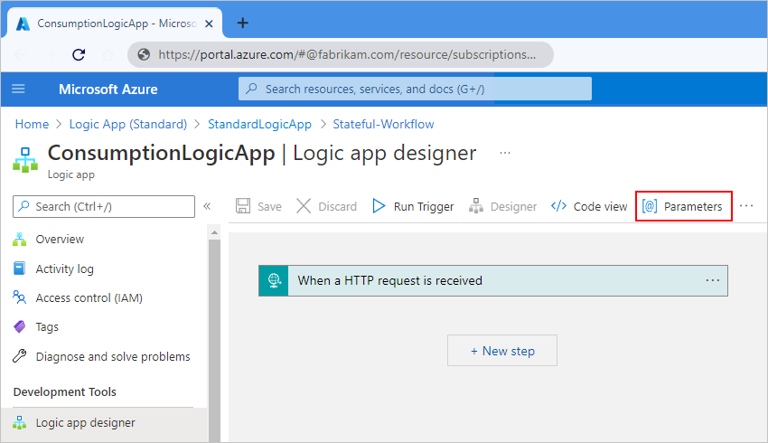
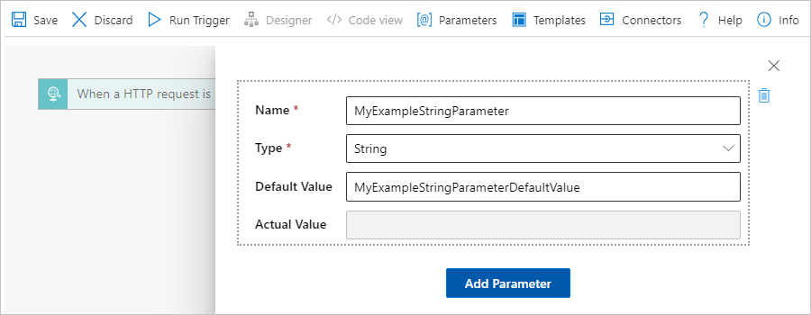
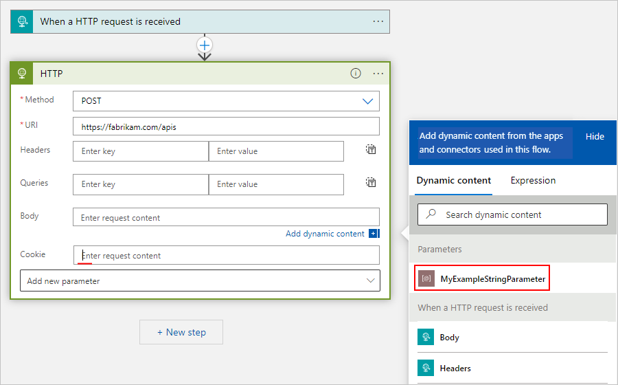
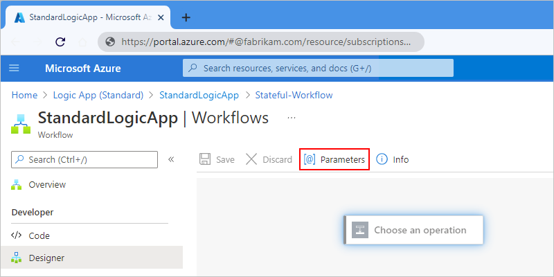
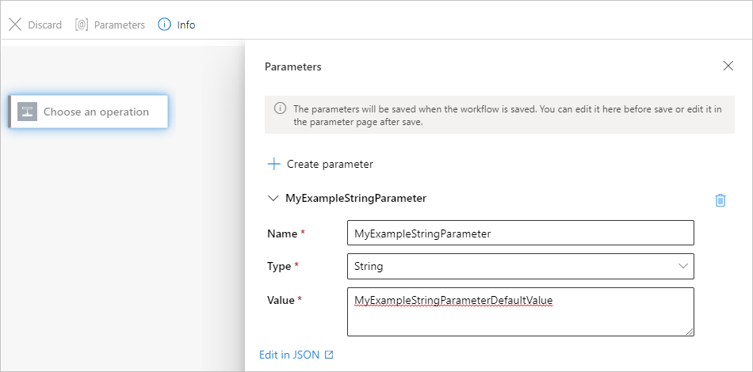
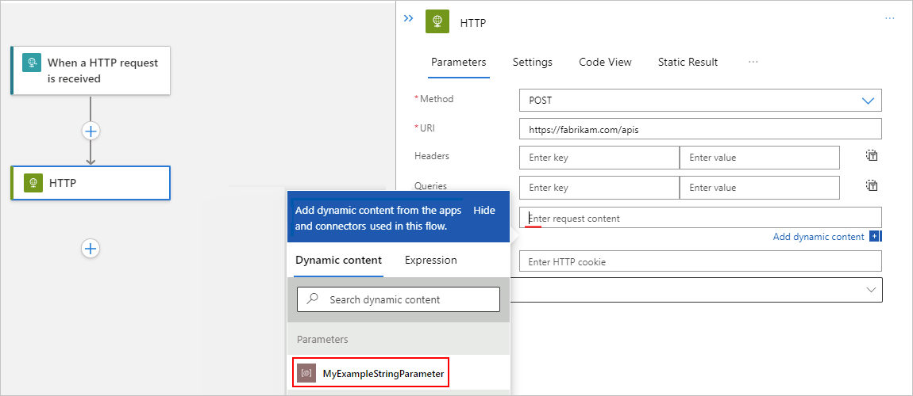

# Create cross-environment parameters for workflow inputs in Azure Logic Apps

[!INCLUDE [logic-apps-sku-consumption-standard](../../includes/logic-apps-sku-consumption-standard.md)]

In Azure Logic Apps, you can abstract values that might change in workflows across development, test, and production environments by defining *parameters*. When you use parameters rather than environment-specific variables, you can initially focus more on designing your workflows, and insert your environment-specific variables later.

This article introduces how to create, use, and edit parameters for multi-tenant Consumption logic app workflows and for single-tenant Standard logic app workflows. You'll also learn how to manage environment variables.

For more information about multi-tenant and single-tenant Azure Logic Apps, review [Single-tenant versus multi-tenant and integration service environment for Azure Logic Apps](single-tenant-overview-compare.md).

## Prerequisites

* An Azure account and subscription. If you don't have a subscription, [sign up for a free Azure account](https://azure.microsoft.com/free/?WT.mc_id=A261C142F).

* A Consumption or Standard logic app workflow

  If you don't have a logic app workflow yet, see [Create an example Consumption logic app workflow using the Azure portal](quickstart-create-example-consumption-workflow.md) or [Create an example Standard logic app workflow using the Azure portal](create-single-tenant-workflows-azure-portal.md).

    > [!NOTE]
    > Currently, you can create parameters for Consumption logic app workflows only by using the Azure portal. 
    > You can create parameters for Standard logic app workflows only by using the Azure portal or Visual Studio Code.

<a name="parameters-introduction"></a>

## Parameters for Consumption versus Standard logic app workflows

For both Consumption and Standard logic app workflows, you can define parameters using the designer. After you define the parameter, you can reference that parameter from any workflow or connection that's in the *same* logic app resource.

In multi-tenant Consumption logic app workflows, after you create and use parameters in the designer, you define and set the environment variables in your Azure Resource Manager template (ARM template) and template parameters files. In this scenario, you have to define and set the parameters *at deployment*, which means that even if you only have to change one variable, you have to redeploy your logic app's ARM template.

In single-tenant Standard logic app workflows, you can work with environment variables both at runtime and deployment by using parameters *and* app settings. App settings contain global configuration options for *all the workflows* in the same logic app resource. For more information, review [Edit host and app settings for single-tenant based logic apps](edit-app-settings-host-settings.md).

> [!NOTE]
> In Standard logic app workflows, secure data types, such as `securestring` and `secureobject`, 
> aren't supported. However, as an alternative option, you can use app settings with Azure Key Vault. 
> You can then [directly reference secure strings](../app-service/app-service-key-vault-references.md), 
> such as connection strings and keys. Similar to ARM templates, where you can define environment 
> variables at deployment time, you can define app settings within your 
> [logic app workflow definition](/azure/templates/microsoft.logic/workflows). You can then capture 
> dynamically generated infrastructure values, such as connection endpoints, storage strings, and more.

However, app settings have size limits and can't be referenced from certain areas in Azure Logic Apps. Parameters offer a wider range of use cases than app settings, such as support for large value sizes and complex objects.

For example, if you use Visual Studio Code as your local development tool to run workflows locally, in your logic app project, you can define parameters using the **parameters.json** file. You can then reference any parameter in this parameters file from any workflow in your project's **workflow.json** file or from any connection object in your project's **connections.json** file. The following list describes a couple common use cases:

* Have a test parameters file that includes all the values that you use during testing. At deployment, you can replace your test parameters file with your production parameters file.

* Parameterize different parts of your **connections.json** file. You can then check your **connections.json** file into source control, and then manage any connections through your **parameters.json** file.

* Parameterize complex objects, such as the `authentication` JSON object. For example, you can replace the `authentication` object value with a string that holds a single parameters expression, such as `@parameters('api-auth')`.

* Review and edit the app settings in your project's **local.settings.json** file. You can then reference these app settings in your parameters.

> [!NOTE]
> As a general recommendation, consider using parameters as the default way to parameterize values, 
> not app settings. That way, when you need to store secure keys or strings, you can follow the 
> recommendation to reference app settings from your parameters. If you want, you can use both 
> options in your solution by using parameters to reference app settings.

## Define, use, and edit parameters

### [Consumption](#tab/consumption)

### Azure portal

1. In the [Azure portal](https://portal.azure.com), open your logic app workflow. Under **Workflows**, select and open your workflow in the designer.

1. From the designer toolbar, select **Parameters**.

   

1. On the **Parameters** pane, select **Add parameter**.

1. Provide the following information about the parameter to create:

   | Property | Required | Description |
   |----------|----------|-------------|
   | **Name** | Yes | The name for the parameter to create. |
   | **Type** | Yes | The data type for the parameter, such as **Array**, **Bool**, **Float**, **Int**, **Object**, **Secure Object**, **Secure String**, and **String**. |
   | **Default Value** | Yes | The default value for the parameter. You have to specify the default parameter value because the workflow logic, connection information, and parameter values don't exist in a single location. The designer must be able to resolve the parameter values before loading. <br><br>**Important**: For the **Secure Object** and **Secure String** data types, avoid setting a default value because the value is stored as plain text.|
   | **Actual Value** | No | The actual value for the parameter. |
   ||||

   The following example shows a definition for a string parameter:

   

1. If you have more parameters to add, select **Add Parameter**. Otherwise, close the parameters pane, but make sure to save your workflow to save your new parameter definition.

1. To reference the parameter from a trigger or action that's in the same workflow, follow these steps:

   1. In the designer, open the workflow that you want, and expand the trigger or action.

   1. In the property where you want to use the parameter, click inside that property's edit box.

   1. From the dynamic content list that opens, under **Parameters**, select your previously created parameter, for example:

      

1. To view or edit the parameters in a logic app workflow, follow these steps:

   1. Open the logic app workflow in the designer. On the designer toolbar, select **Parameters**.

      The **Parameters** pane opens and displays all the parameters that you defined for that workflow.

   1. Make your edits, close the parameters pane, and save your logic app workflow.

### [Standard](#tab/standard)

#### Azure portal

1. In the [Azure portal](https://portal.azure.com), open your logic app resource. Under **Workflows**, open your workflow in the designer.

1. From the designer toolbar, select **Parameters**.

   

1. On the **Parameters** pane, select **Create parameter**.

1. Provide the following information about the parameter to create:

   | Property | Required | Description |
   |----------|----------|-------------|
   | **Name** | Yes | The name for the parameter to create. |
   | **Type** | Yes | The data type for the parameter, such as **Array**, **Bool**, **Float**, **Int**, **Object**, and **String**. <br><br>**Note**: In Standard logic app workflows, secure data types, such as `securestring` and `secureobject`, aren't supported. |
   | **Value** | Yes | The value for the parameter. <br><br>In Standard logic app workflows, you have to specify the parameter value because the workflow logic, connection information, and parameter values don't exist in a single location. The designer must be able to resolve the parameter values before loading. |
   ||||

   The following example shows a definition for a string parameter:

   

1. When you're done, close the **Parameters** pane, but make sure to save your workflow to save your new parameter definition.

1. To reference the parameter from a trigger or action that's in any workflow within the same logic app, follow these steps:

   1. In the designer, open the workflow that you want, and expand the trigger or action.

   1. In the property where you want to use the parameter, click inside that property's edit box.

   1. From the dynamic content list that opens, under **Parameters**, select your previously created parameter, for example:

      

1. To view or edit parameters in the same logic app, follow either step:

   * Open any workflow in that logic app. On the workflow menu, select **Designer**. On the designer toolbar, select **Parameters**.

     The **Parameters** pane opens and displays all the parameters that you defined from workflows in that logic app.

   * To view or edit in bulk JSON, on your logic app's main menu, select **Parameters**.

     The **Parameters** JSON view opens and displays all the parameters that you defined from workflows in that logic app.

#### Visual Studio Code

1. In a project root-level JSON file named **parameters.json**, define *all* the parameters and their values. This file has an object that includes *key-value* pairs. Each *key* is the name for each parameter, while each *value* is the structure for each parameter. Each structure needs to include both a `type` and `value` declaration.

   > [!IMPORTANT]
   > Your **parameters.json** file must define and include all the parameters and their values that you 
   > reference or use elsewhere in your project, for example, in workflow definitions or connections.

   The following example shows a basic parameters file:

   ```json
   {
       "responseString": { 
           "type": "string", 
           "value": "hello" 
       },
       "functionAuth": { 
           "type": "object", 
           "value": { 
               "type": "QueryString", 
               "name": "Code", 
               "value": "@appsetting('<AzureFunctionsOperation-FunctionAppKey>')" 
           }
       }
    }
    ```

    > [!NOTE]
    > In the **parameters.json** file, `@appsetting` is the only valid expression type.

1. To reference parameters in your trigger or action inputs, use the expression `@parameters('<parameter-name>')`.

##### Parameterize connections file

To parameterize your **connections.json** file, replace the values for literals, such as `ConnectionRuntimeUrl`, with a single `parameters()` expression, for example, `@parameters('api-runtimeUrl')`. In the **connections.json** file, the only valid expression types are `@parameters` and `@appsetting`.

> [!IMPORTANT]
>
> If you parameterize the **connections.json** file during development, the designer experience becomes restricted, 
> both locally and in the Azure portal. If you need to use the designer for development, use a non-parameterized 
> **connections.json** file instead. Then, in your deployment pipelines, replace with the parameterized file. 
> The runtime still works with parameterization. Designer improvements are in development.

The following example shows a parameterized **connections.json** file that uses both app settings and parameters. Although you want to use parameters where possible, this scenario is an exception or edge case where you'd use app settings over parameters because app settings are generated during deployment and are easier to dynamically populate in a development pipeline. This sample file uses a parameter for the complex `blob_auth` authentication object and app settings for the other values. In this case, you can use a parameter for the authentication object as you're unlikely to reference the parameter in your workflow:

```json
{
   "serviceProviderConnections": {
      "serviceBus": {
         "parameterValues": {
            "connectionString": "@appsetting('serviceBus_connectionString')"
        },
        "serviceProvider": {
           "id": "/serviceProviders/serviceBus"
        },
        "displayName": "servicebus"
     }
   },
   "managedApiConnections": {
      "azureblob": {
         "api": {
            "id": "/subscriptions/@{appsetting('WORKFLOWS_SUBSCRIPTION_ID')}/providers/Microsoft.Web/locations/@{appsetting('WORKFLOWS_LOCATION_NAME')}/managedApis/azureblob"
         },
         "connection": {
            "id": "/subscriptions/@{appsetting('WORKFLOWS_SUBSCRIPTION_ID')}/resourceGroups/@{appsetting('WORKFLOWS_RESOURCE_GROUP_NAME')}/providers/Microsoft.Web/connections/azureblob"
         },
         "connectionRuntimeUrl": "@appsetting('BLOB_CONNECTION_RUNTIMEURL')",
         "authentication": "@parameters('blob_auth')"
      }
   }
}
```

> [!NOTE]
> When you have an expression that's inline with plain text, make sure to use the interpolated 
> format for that expression by enclosing that expression with curly braces ({}). This format helps 
> avoid parsing problems.
>
> For example, if you have `"<text>/@<function-name>('<parameter-name>')/<text>"`, 
> use the following version instead: `"<text>/@{<function-name>('<parameter-name>')}/<text>"`. 
>
> For more information, review [Considerations for using functions](workflow-definition-language-functions-reference.md#function-considerations).

### Manage parameters files

Typically, you need to manage multiple versions of parameters files. You might have targeted values for different deployment environments, such as development, testing, and production. Managing these parameters files often works like managing ARM template parameters files. When you deploy to a specific environment, you promote the corresponding parameters file, generally through a pipeline for DevOps.

To dynamically replace parameters files using the Azure CLI, run the following command:

```azurecli
az functionapp deploy --resource-group MyResourceGroup --name MyLogicApp --src-path C:\parameters.json --type static --target-path parameters.json
```

If you have a NuGet-based logic app project, you have to update your project file (**&lt;logic-app-name&gt;.csproj**) to include the parameters file in the build output, for example:

```csproj
<ItemGroup>
  <None Update="parameters.json">
    <CopyToOutputDirectory>PreserveNewest</CopyToOutputDirectory>
  </None>
</ItemGroup>
```

> [!NOTE]
> Currently, the capability to dynamically replace parameters files is not yet available in the Azure portal or the workflow designer.

For more information about setting up your logic apps for DevOps deployments, review the following documentation:

* [DevOps deployment overview for single-tenant based logic apps](devops-deployment-single-tenant-azure-logic-apps.md)
* [Set up DevOps deployment for single-tenant based logic apps](set-up-devops-deployment-single-tenant-azure-logic-apps.md)

### Manage app settings

In single-tenant Azure Logic Apps, app settings contain global configuration options for *all the workflows* in the same logic app. When you run workflows locally in Visual Studio Code, you can access these app settings as local environment variables in the **local.settings.json** file. You can then reference these app settings in your parameters.

To add, update, or delete app settings, select and review the following sections for Visual Studio Code, Azure portal, Azure CLI, or ARM (Bicep) template.

#### Azure portal

To review the app settings for your logic app resource in the Azure portal, follow these steps:

1. In the [Azure portal](https://portal.azure.com/), open your logic app resource.

1. On your logic app menu, under **Settings**, select **Configuration**.

1. On the **Configuration** page, on the **Application settings** tab, review the app settings for your logic app.

1. To view all values, select **Show Values**. Or, to view a single value, select that value.

To add a new setting, follow these steps:

1. On the **Application settings** tab, under **Application settings**, select **New application setting**.

1. For **Name**, enter the *key* or name for your new setting.

1. For **Value**, enter the value for your new setting.

1. When you're ready to create your new *key-value* pair, select **OK**.

   

1. When you're done, on the **Configuration** toolbar, select **Save**.

#### Azure CLI

To review your current app settings using the Azure CLI, run the command, `az logicapp config appsettings list`. Make sure that your command includes the `--name -n` and `--resource-group -g` parameters, for example:

```azurecli
az logicapp config appsettings list --name MyLogicApp --resource-group MyResourceGroup
```

To add or update an app setting using the Azure CLI, run the command `az logicapp config appsettings set`. Make sure that your command includes the `--name n` and `--resource-group -g` parameters. For example, the following command creates a setting with a key named `CUSTOM_LOGIC_APP_SETTING` with a value of `12345`:

```azurecli
az logicapp config appsettings set --name MyLogicApp --resource-group MyResourceGroup --settings CUSTOM_LOGIC_APP_SETTING=12345 
```

#### Resource Manager or Bicep template

To review and define your app settings in an ARM template or Bicep template, find your logic app's resource definition, and update the `appSettings` JSON object. For the full resource definition, see the [ARM template reference](/azure/templates/microsoft.web/sites).

This example shows file settings for either ARM templates or Bicep templates:

```json
"appSettings": [
    {
        "name": "string",
        "value": "string"
    },
    {
        "name": "string",
        "value": "string"
    },
    <...>
], 
```

---

## Next steps

* [Single-tenant versus multi-tenant and integration service environment for Azure Logic Apps](single-tenant-overview-compare.md)
