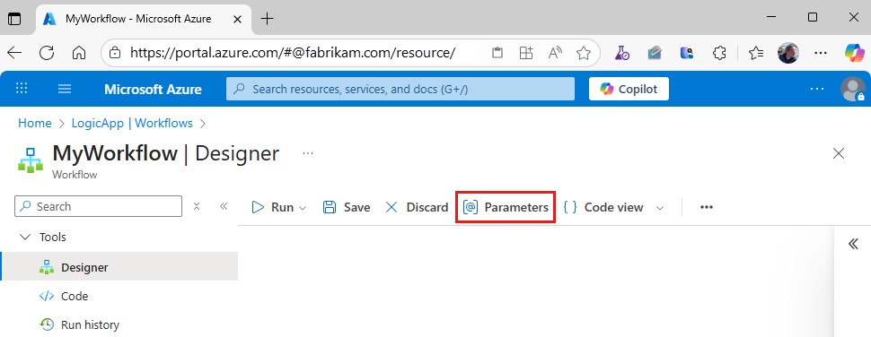
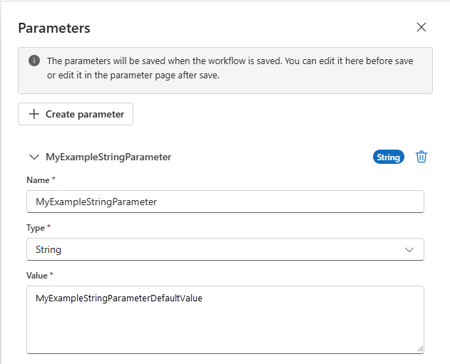
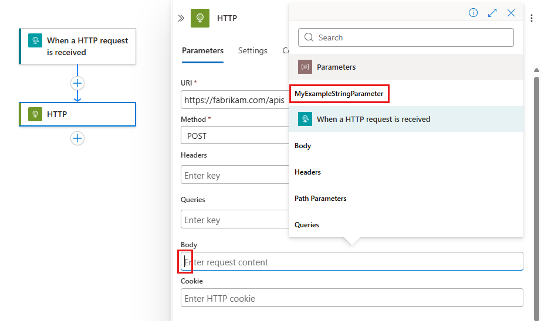

# Create cross-environment parameters for workflow inputs in Azure Logic Apps

[!INCLUDE [logic-apps-sku-consumption-standard](../../includes/logic-apps-sku-consumption-standard.md)]

In Azure Logic Apps, you can abstract values that might change in workflows across development, test, and production environments by defining *parameters*. When you use parameters rather than environment-specific variables, you can focus more on designing your workflows, then insert your environment-specific variables later.

This article describes how to create, use, and edit parameters for multitenant Consumption logic app workflows and for single-tenant Standard logic app workflows. You also learn how to manage environment variables.

For more information about multitenant and single-tenant Azure Logic Apps, see [Single-tenant versus multitenant in Azure Logic Apps](single-tenant-overview-compare.md).

## Prerequisites

- An Azure account and subscription. If you don't have a subscription, [sign up for a free Azure account](https://azure.microsoft.com/free/?WT.mc_id=A261C142F).

- A Consumption or Standard logic app workflow

  If you don't have a logic app workflow yet, see [Create an example Consumption logic app workflow using the Azure portal](quickstart-create-example-consumption-workflow.md) or [Create an example Standard logic app workflow using the Azure portal](create-single-tenant-workflows-azure-portal.md).

    > [!NOTE]
    > Currently, you can create parameters for Consumption logic app workflows only by using the Azure portal. 
    > You can create parameters for Standard logic app workflows by using the Azure portal or Visual Studio Code.

<a name="parameters-introduction"></a>

## Parameters for Consumption versus Standard logic app workflows

For both Consumption and Standard logic app workflows, you can define parameters using the designer. After you define the parameter, you can reference that parameter from any workflow or connection that's in the *same* logic app resource.

In multitenant Consumption logic app workflows you create and use parameters in the designer. Then you define and set the environment variables in your Azure Resource Manager template (ARM template) and template parameters files. In this scenario, you have to define and set the parameters *at deployment*. This requirement means that even if you only have to change one variable, you have to redeploy your logic app's ARM template.

In single-tenant Standard logic app workflows, you can work with environment variables both at runtime and deployment by using parameters *and* app settings. App settings contain global configuration options for *all the workflows* in the same logic app resource. For more information, review [Edit host and app settings for single-tenant based logic apps](edit-app-settings-host-settings.md).

> [!IMPORTANT]
>
> When you have sensitive information, such as connection strings that include usernames and passwords, 
> make sure to use the most secure authentication flow available. For example, in Standard logic app workflows, 
> secure data types, such as `securestring` and `secureobject`, aren't supported. Microsoft recommends that you 
> authenticate access to Azure resources with a [managed identity](/entra/identity/managed-identities-azure-resources/overview) 
> when possible, and assign a role that has the least privilege necessary.
>
> If this capability is unavailable, make sure to secure connection strings through other measures, such as 
> [Azure Key Vault](/azure/key-vault/general/overview), which you can use with [app settings](edit-app-settings-host-settings.md). 
> You can then [directly reference secure strings](../app-service/app-service-key-vault-references.md), such as connection 
> strings and keys. Similar to ARM templates, where you can define environment variables at deployment time, you can define 
> app settings within your [logic app workflow definition](/azure/templates/microsoft.logic/workflows). 
> You can then capture dynamically generated infrastructure values, such as connection endpoints and storage strings. 
> For more information, see [Application types for the Microsoft identity platform](/entra/identity-platform/v2-app-types).

App settings have size limits and can't be referenced from certain areas in Azure Logic Apps. Parameters offer a wider range of use cases than app settings, such as support for large value sizes and complex objects.

For example, if you use Visual Studio Code as your development tool to run workflows locally, you can define parameters using the parameters.json file. You can then reference any parameter in this parameters file from any workflow in your project's workflow.json file or from any connection object in your project's connections.json file. The following list describes a couple common use cases:

- Have a test parameters file that includes all the values that you use during testing. At deployment, you can replace your test parameters file with your production parameters file.
- Parameterize different parts of your connections.json file. You can then check your connections.json file into source control, and then manage any connections through your parameters.json file.
- Parameterize complex objects, such as the `authentication` JSON object. For example, you can replace the `authentication` object value with a string that holds a single parameters expression, such as `@parameters('api-auth')`.
- Review and edit the app settings in your project's local.settings.json file. You can then reference these app settings in your parameters.

> [!NOTE]
> In general, consider using parameters as the default way to parameterize values, not app settings. That way, when you need to store secure keys or strings, you can follow the recommendation to reference app settings from your parameters. You can use both options in your solution by using parameters to reference app settings.

## Define, use, and edit parameters

This procedure describes how to work with parameters for either Consumption or Standard logic app workflows in the Azure portal.

1. In the [Azure portal](https://portal.azure.com), open your logic app resource.

   - For Standard logic apps, on the resource sidebar, under **Workflows**, select **Workflows**.

     On the **Workflows** page, select the blank workflow to open the designer.

   - For Consumption logic apps, on the resource sidebar, under **Development Tools**, select the designer to open the workflow.

1. From the designer toolbar, select **Parameters**.

   

1. On the **Parameters** pane, select **Create parameter**.

1. Provide the following information about the parameter to create:

   | Property | Required | Description |
   |----------|----------|-------------|
   | **Name** | Yes | The name for the parameter to create. |
   | **Type** | Yes | The data type for the parameter, such as **Array**, **Bool**, **Float**, **Int**, **Object**, and **String**. <br><br>**Note**: In Standard logic app workflows, secure data types, such as `securestring` and `secureobject`, aren't supported. |
   | **Value** (Standard) | Yes | The value for the parameter. <br><br>In Standard logic app workflows, specify the parameter value. The workflow logic, connection information, and parameter values don't exist in a single location. The designer must be able to resolve the parameter values before it loads the workflow. |
   | **Default Value** (Consumption) | Yes | The default value for the parameter. You have to specify the default parameter value. The workflow logic, connection information, and parameter values don't exist in a single location. The designer must be able to resolve the parameter values before it loads the workflow. <br><br>**Important**: For the **Secure Object** and **Secure String** data types, avoid setting a default value because the value is stored as plain text. |
   | **Actual Value** (Consumption) | No | The actual value for the parameter. |

   The following example shows a definition for a string parameter:

   

1. When you're done, close the **Parameters** pane. Make sure to save your workflow to save your new parameter definition.

1. To reference the parameter from a trigger or action that's in any workflow in the same logic app, follow these steps:

   1. In the designer, open the workflow that you want, and expand the trigger or action.

   1. In the property where you want to use the parameter, select inside that property's edit box. Select the lightning icon to open the dynamic content list.

   1. From that list, under **Parameters**, select your previously created parameter.

      

1. To view or edit parameters in the same logic app:

   - Open any workflow in that logic app in the workflow designer. On the designer toolbar, select **Parameters**.

     The **Parameters** pane opens and displays all the parameters that you defined from workflows in that logic app.

   - (Standard workflows only) To view or edit in bulk JSON, on the resource sidebar, select **Parameters**.

     The **Parameters** JSON view opens and displays all the parameters that you defined from workflows in that logic app.

## Visual Studio Code

This procedure describes how to work with parameters for Standard logic app workflows using Visual Studio Code.

1. In a project root-level JSON file named parameters.json, define *all* the parameters and their values. This file has an object that includes *key-value* pairs. Each *key* is the name for each parameter. Each *value* is the structure for the parameter. Each structure needs to include both a `type` and `value` declaration.

   > [!IMPORTANT]
   > Your parameters.json file must define and include all the parameters and their values that you 
   > reference or use elsewhere in your project. This requirement includes workflow definitions and connections.

   The following example shows a basic parameters file:

   ```json
   {
       "responseString": { 
           "type": "string", 
           "value": "hello" 
       },
       "functionAuth": { 
           "type": "object", 
           "value": { 
               "type": "QueryString", 
               "name": "Code", 
               "value": "@appsetting('<AzureFunctionsOperation-FunctionAppKey>')" 
           }
       }
    }
    ```

    > [!NOTE]
    > In the parameters.json file, `@appsetting` is the only valid expression type.

1. To reference parameters in your trigger or action inputs, use the expression `@parameters('<parameter-name>')`.

### Parameterize connections file

To parameterize your connections.json file, replace the values for literals, such as `ConnectionRuntimeUrl`, with a single `parameters()` expression, for example, `@parameters('api-runtimeUrl')`. In the connections.json file, the only valid expression types are `@parameters` and `@appsetting`.

> [!IMPORTANT]
>
> If you parameterize the connections.json file during development, the designer experience becomes restricted, 
> both locally and in the Azure portal. If you need to use the designer for development, use a nonparameterized 
> connections.json file instead. Then, in your deployment pipelines, replace with the parameterized file. 
> The runtime still works with parameterization. Designer improvements are in development.

The following example shows a parameterized connections.json file that uses both app settings and parameters. This sample file uses a parameter for the complex `blob_auth` authentication object and app settings for the other values.

You want to use parameters where possible. Because app settings are generated during deployment and are easier to dynamically populate in a development pipeline, you should use app settings over parameters in this scenario. In this case, you can use a parameter for the authentication object because you're unlikely to reference the parameter in your workflow:

```json
{
   "serviceProviderConnections": {
      "serviceBus": {
         "parameterValues": {
            "connectionString": "@appsetting('serviceBus_connectionString')"
        },
        "serviceProvider": {
           "id": "/serviceProviders/serviceBus"
        },
        "displayName": "servicebus"
     }
   },
   "managedApiConnections": {
      "azureblob": {
         "api": {
            "id": "/subscriptions/@{appsetting('WORKFLOWS_SUBSCRIPTION_ID')}/providers/Microsoft.Web/locations/@{appsetting('WORKFLOWS_LOCATION_NAME')}/managedApis/azureblob"
         },
         "connection": {
            "id": "/subscriptions/@{appsetting('WORKFLOWS_SUBSCRIPTION_ID')}/resourceGroups/@{appsetting('WORKFLOWS_RESOURCE_GROUP_NAME')}/providers/Microsoft.Web/connections/azureblob"
         },
         "connectionRuntimeUrl": "@appsetting('BLOB_CONNECTION_RUNTIMEURL')",
         "authentication": "@parameters('blob_auth')"
      }
   }
}
```

> [!NOTE]
> When you have an expression that's inline with plain text, make sure to use the interpolated 
> format for that expression by enclosing that expression with curly braces ({}). This format helps 
> avoid parsing problems.
>
> For example, if you have `"<text>/@<function-name>('<parameter-name>')/<text>"`, 
> use the following version instead: `"<text>/@{<function-name>('<parameter-name>')}/<text>"`. 
>
> For more information, see [Considerations for using functions](workflow-definition-language-functions-reference.md#function-considerations).

### Manage parameters files

Typically, you need to manage multiple versions of parameters files. You might have targeted values for different deployment environments, such as development, testing, and production. Managing these parameters files often works like managing ARM template parameters files. When you deploy to a specific environment, you promote the corresponding parameters file, generally through a pipeline for DevOps.

To dynamically replace parameters files using the Azure CLI, run the following command:

```azurecli
az functionapp deploy --resource-group MyResourceGroup --name MyLogicApp --src-path C:\parameters.json --type static --target-path parameters.json
```

If you have a NuGet-based logic app project, you have to update your project file (**&lt;logic-app-name&gt;.csproj**) to include the parameters file in the build output, for example:

```csproj
<ItemGroup>
  <None Update="parameters.json">
    <CopyToOutputDirectory>PreserveNewest</CopyToOutputDirectory>
  </None>
</ItemGroup>
```

> [!NOTE]
> Currently, the capability to dynamically replace parameters files isn't yet available in the Azure portal or the workflow designer.

For more information about setting up your logic apps for DevOps deployments:

- [DevOps deployment overview for single-tenant based logic apps](devops-deployment-single-tenant-azure-logic-apps.md)
- [Set up DevOps deployment for single-tenant based logic apps](set-up-devops-deployment-single-tenant-azure-logic-apps.md)

### Manage app settings

In Standard single-tenant Azure Logic Apps, app settings contain global configuration options for *all the workflows* in the same logic app. When you run workflows locally in Visual Studio Code, you can access these app settings as local environment variables in the local.settings.json file. You can then reference these app settings in your parameters.

The following sections describe how to add, update, or delete app settings for Visual Studio Code, the Azure portal, Azure CLI, and ARM (Bicep) template.

#### The Azure portal

To review the app settings for your logic app resource in the Azure portal, follow these steps:

1. In the [Azure portal](https://portal.azure.com/), open your logic app resource.

1. On your logic app menu, under **Settings**, select **Environment variables**.

1. On the **Environment variables** page, on the **App settings** tab, review the app settings for your logic app.

1. To view all values, select **Show Values**. Or, to view a single value, select that value.

To add a new setting, follow these steps:

1. Under **Application settings**, select **+ Add**.

1. For **Name**, enter the *key* or name for your new setting.

1. For **Value**, enter the value for your new setting.

1. If necessary, select **Deployment slot setting**. 

1. When you're ready to create your new *key-value* pair, select **Apply**.

#### Azure CLI

To review your current app settings using the Azure CLI, run the command, `az logicapp config appsettings list`. Make sure that your command includes the `--name -n` and `--resource-group -g` parameters, for example:

```azurecli
az logicapp config appsettings list --name MyLogicApp --resource-group MyResourceGroup
```

To add or update an app setting using the Azure CLI, run the command `az logicapp config appsettings set`. Make sure that your command includes the `--name n` and `--resource-group -g` parameters. For example, the following command creates a setting with a key named `CUSTOM_LOGIC_APP_SETTING` with a value of `12345`:

```azurecli
az logicapp config appsettings set --name MyLogicApp --resource-group MyResourceGroup --settings CUSTOM_LOGIC_APP_SETTING=12345 
```

#### Resource Manager or Bicep file

To review and define your app settings in an ARM template or Bicep file, find your logic app's resource definition, and update the `appSettings` JSON object. For the full resource definition, see the [ARM template reference](/azure/templates/microsoft.web/sites).

This example shows file settings for either ARM templates or Bicep files:

```json
"appSettings": [
    {
        "name": "string",
        "value": "string"
    },
    {
        "name": "string",
        "value": "string"
    },
    <...>
], 
```

## Related content

- [Single-tenant versus multitenant in Azure Logic Apps](single-tenant-overview-compare.md)
