# Create replication tasks for Azure resources using Azure Logic Apps (preview)

> [!IMPORTANT]
> This capability is in preview and is subject to the 
> [Supplemental Terms of Use for Microsoft Azure Previews](https://azure.microsoft.com/support/legal/preview-supplemental-terms/).

While maximum availability and reliability are top operational priorities for Azure services, many ways still exist for communication to stop due to networking or name resolution problems, errors, or temporary unresponsiveness. Such conditions aren't "disastrous" such that you'll want to abandon the regional deployment altogether as you might do in disaster recovery situation. However, the business scenario for some apps might become impacted by availability events that last no more than a few minutes or even seconds.

To reduce the effect that unpredictable events can have on your Azure resources in an Azure region, you can replicate the content in these resources to help you maintain business continuity. You can create a [*replication task*](#replication-task) that moves the data, events, or messages from a source in one region to a target in another region. That way, you can have the target readily available if the source goes offline and the target has to take over. Each replication task that you create is powered by a stateless workflow in a **Logic App (Standard)** resource, which is hosted in single-tenant Azure Logic Apps. If you're new to logic apps and workflows, review [What is Azure Logic Apps](logic-apps-overview.md) and [Single-tenant versus multi-tenant and integration service environment for Azure Logic Apps](single-tenant-overview-compare.md).

> [!NOTE]
> Currently, [replication task templates](#replication-task-templates) are available for 
> [Azure Event Hubs](../event-hubs/event-hubs-about.md) and [Azure Service Bus](../service-bus-messaging/service-bus-messaging-overview.md).

This article provides an overview about replication tasks powered by Azure Logic Apps and shows how to create an example replication task for Azure Service Bus queues.

## What is a replication task?

A replication task receives data, events, or messages from a source, moves that content to a target, and then deletes that content from the source. Most replication tasks move the content unchanged. At most, if the source and target protocols differ, these tasks perform mappings between metadata structures. Replication tasks are generally stateless, meaning that they don't share states or other side effects across parallel or sequential executions of a task.

Replication doesn't aim to exactly create exact 1:1 clones of a source to a target. Instead, the replication task focuses on preserving the relative order of events for Event Hubs or messages for Service Bus where required by grouping related events or messages respectively with the same partition key.

- Event Hubs also sequentially [arranges messages with the same partition key in the same partition](../event-hubs/event-hubs-features.md#partitions).

  If the partition count in the source and target Event Hubs entities is identical, all streams in the target map to the same partitions as in the source. However, if the partition count differs, which matters in some of the patterns described in [Event replication tasks patterns](../event-hubs/event-hubs-federation-patterns.md), the mapping differs, but streams are always kept together and in order. The relative order of events belonging to different streams or of independent events without a partition key in a target partition might always differ from the source partition.

  For more information, review [Streams and order preservation](../event-hubs/event-hubs-federation-patterns.md#streams-and-order-preservation).

- For Service Bus, the replication task enables session support for the source entity so that message sequences with the same session ID retrieved from the source are submitted to the target queue or topic as a batch in the original sequence and with the same session ID. For more information, review [Sequences and order preservation](../service-bus-messaging/service-bus-federation-patterns.md#sequences-and-order-preservation).

To learn more about multi-site and multi-region federation for Azure services where you can create replication tasks, review the following documentation:

- [Event Hubs multi-site and multi-region federation](../event-hubs/event-hubs-federation-overview.md)
- [Event replication tasks patterns](../event-hubs/event-hubs-federation-patterns.md)
- [Service Bus message replication and cross-region federation](../service-bus-messaging/service-bus-federation-overview.md)
- [Message replication tasks patterns](../service-bus-messaging/service-bus-federation-patterns.md)

## Service-assigned metadata

For Service Bus, the service-assigned metadata of a message obtained from the source Service Bus queue or topic, the original enqueue time, and sequence number are replaced by new service-assigned values in the target Service Bus queue or topic.

For Event Hubs, the service-assigned metadata of an event obtained from the source Event Hubs instance, the original enqueue time, sequence number, and offset are replaced by new service-assigned values in the target Event Hub instance.

## Replication tasks with Azure Logic Apps versus Azure Functions

## Replication task templates

The following table lists the replication task templates currently available in this preview:

| Resource type | Replication task templates |
|---------------|----------------------------|
| Azure Event Hubs | - **Replicate to Event Hubs instance**: Replicate content between two Event Hubs instances, or event hubs.  - **Replicate from Event Hubs instance to Service Bus queue**  - **Replicate from Event Hubs instance to Service Bus topic** |
| Azure Service Bus | - **Replicate to Service Bus queue**: Replicate content between two Service Bus queues.  - **Replicate from service Bus queue to Event Hub instance**  - **Replicate from Service Bus queue to Service Bus topic**  - **Replicate from Service Bus topic subscription to Service Bus queue**  - **Replicate from Service Bus topic subscription to Event Hubs instance** |
|||

## Replication topology and workflow

To help you visualize how a replication task powered by Azure Logic Apps (Standard) works, the following diagrams show the replication task structure and workflow for Event Hubs instances and for Service Bus queues.

### Replication topology for Event Hubs

The following diagram shows the topology and replication task workflow between Event Hubs instances:

For information about replication and federation in Azure Event Hubs, review the following documentation:

- [Event Hubs multi-site and multi-region federation](../event-hubs/event-hubs-federation-overview.md)
- [Event replication tasks patterns](../event-hubs/event-hubs-federation-patterns.md)

### Replication topology for Service Bus

The following diagram shows the topology and replication task workflow between Service Bus queues:

For information about replication and federation in Azure Service Bus, review the following documentation:

- [Service Bus message replication and cross-region federation](../service-bus-messaging/service-bus-federation-overview.md)
- [Message replication tasks patterns](../service-bus-messaging/service-bus-federation-patterns.md)

## Naming conventions

For example, if you want to create a replication task between Service Bus queues, you can use the following suggested naming convention:

| Source name | Example | Replication app | Example | Target name | Example |
|-------------|---------|-----------------|---------|-------------|---------|
| Namespace: `<name>-sb-<region>` | `fabrikam-sb-weu` | Logic app: `<name-source-region-target-region>` | `fabrikam-rep-weu-wus` | Namespace: `<name>-sb-<region>` | `fabrikam-sb-wus` |
| Queue: `<name>` | `jobs-transfer` | Workflow: `<name>` | `jobs-transfer-workflow` | Queue: `<name>` | `jobs` |
|||||||

## Pricing

Underneath, a replication task is powered by a stateless workflow in a **Logic App (Standard)** resource that's hosted in single-tenant Azure Logic Apps. When you create this replication task, charges start incurring immediately. Usage, billing, and the pricing model follow the [Standard plan](logic-apps-pricing.md) and [Standard plan rates](https://azure.microsoft.com/pricing/details/logic-apps/). Metering and billing are based on the hosting plan and pricing tier that's used for the underlying logic app resource and workflow.

## Prerequisites

- An Azure account and subscription. If you don't have a subscription, [sign up for a free Azure account](https://azure.microsoft.com/free/?WT.mc_id=A261C142F).

- The source and target resources or entities, which should exist in different Azure regions and vary based on the task template that you want to use. The example in this article uses two Service Bus queues, which are located in different namespaces and Azure regions.

## Create a replication task

This example shows how to create a replication task for Service Bus queues.

1. In the [Azure portal](https://portal.azure.com), find the Service Bus namespace that you want to use as the source.

1. On the namespace navigation menu, in the **Automation** section, and select **Tasks (preview)**.

   

1. On the **Tasks** pane, select **Add a task** so that you can select a task template.

   

1. On the **Add a task** pane, under **Select a template**, in the template for the replication task that you want to create, select **Select**. If the next page doesn't appear, select **Next: Authenticate**.

   This example continues by selecting the **Replicate to Service Bus queue** task template, which replicates content between Service Bus queues.

   

1. Under **Authenticate**, in the **Connections** section, select **Create** for every connection that appears in the task so that you can provide authentication credentials for all the connections. The types of connections in each task vary based on the task.

   This example shows the prompt to create the connection to the target Service Bus namespace where the target queue exists. The connection already exists for the source Service Bus namespace.

   

1. Provide the necessary information about the target.

   For this example, provide a display name for the connection, and then select the Service Bus namespace where the target queue exists.

   

   The following example shows the successfully created connection:

   

1. After you finish all the connections, select **Next: Configure**.

1. Under **Configure**, provide a name for the task and any other information required for the task. When you're done, select **Review + create**.

   > [!NOTE]
   > You can't change the task name after creation, so consider a name that still applies if you 
   > [edit the underlying workflow](#edit-task-workflow). Changes that you make to the underlying 
   > workflow apply only to the task that you created, not the task template.
   >
   > For example, if you name your task `fabrikam-rep-weu-wus`, but you later edit the underlying 
   > workflow for a different purpose, you can't change the task name to match.

   

1. On **Review + create** pane, confirm the Azure resources that the replication task requires for operation.

   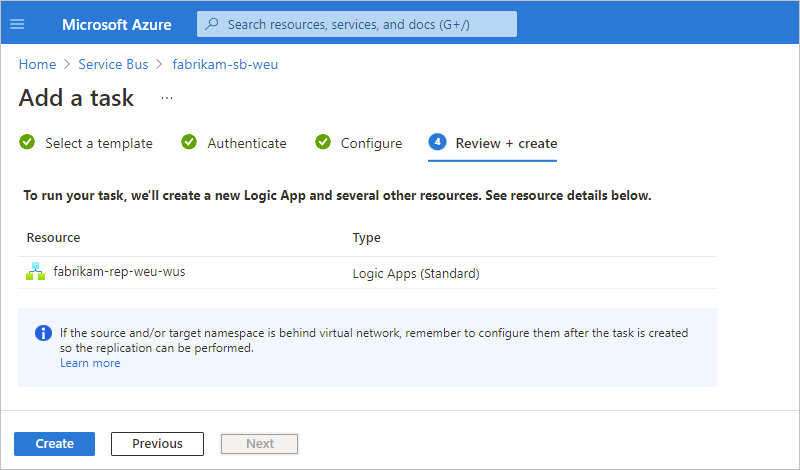

   - If you chose to create a new logic app resource for the replication task, the pane shows the required resources that the replication task will create to operate. Although not listed, these resources include an Azure storage account that contains configuration information for the logic app resource, workflow, and other runtime operations. For example, this storage account contains the position or *offset* in the stream or sequence where the primary or source entity stops reading if the primary's region become unavailable.

   - If you chose to use an existing logic app resource for the replication task, the pane shows the resources that the replication will reuse to operate.

   > [!NOTE]
   > If your source, target, or both are behind a virtual network, you have to set up permissions and access 
   > after you create the task. In this scenario, permissions and access are required so that the logic app 
   > workflow can perform the replication task.

1. When you're ready, select **Create**.

   The task that you created, which is automatically live and running, now appears on the **Tasks** list.

   > [!TIP]
   > If the task doesn't appear immediately, try refreshing the tasks list or wait a little before you refresh. On the toolbar, select **Refresh**.

   

1. If your resources are behind a virtual network, remember to set up permissions for the logic app resource and workflow to access those resources.

## Set up retry policy

To avoid data loss during an availability event on either side of a replication relationship, you need to configure the retry policy for robustness. To configure the retry policy for a replication task, review the [documentation about retry policies in Azure Logic Apps](logic-apps-exception-handling.md#retry-policies) and the steps to [edit the underlying workflow](#edit-task-workflow).

## Review task history

This example shows how to view a task's history of workflow runs along with their statuses, inputs, outputs, and other information and continues using the example for a Service Bus queue replication task.

1. In the [Azure portal](https://portal.azure.com), find the Azure resource or entity that has the task history that you want to review.

   For this example, this resource is a Service Bus namespace.

1. On the resource navigation menu, under **Settings**, in the **Automation** section, select **Tasks (preview)**.

1. On the **Tasks** pane, find the task that you want to review. In that task's **Runs** column, select **View**.

   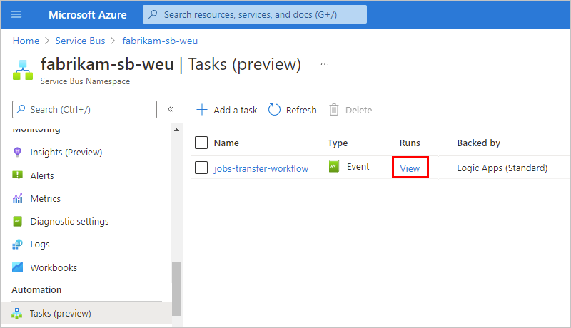

   This step opens the **Overview** pane for the underlying stateless workflow, which is included in a Standard logic app resource.

1. To view run history for a stateless workflow, on the **Overview** pane toolbar, select **Enable debug mode**.

   The **Run History** tab shows any previous, in progress, and waiting runs for the task along with their identifiers, statuses, start times, and run durations.

   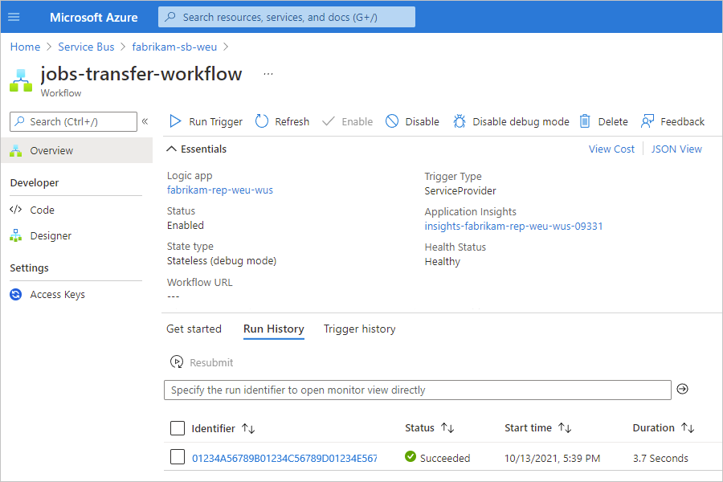

   The following table describes the possible statuses for a run:

   | Status | Description |
   |--------|-------------|
   | **Cancelled** | The task was canceled while running. |
   | **Failed** | The task has at least one failed action, but no subsequent actions existed to handle the failure. |
   | **Running** | The task is currently running. |
   | **Succeeded** | All actions succeeded. A task can still finish successfully if an action failed, but a subsequent action existed to handle the failure. |
   | **Waiting** | The run hasn't started yet and is paused because an earlier instance of the task is still running. |
   |||

1. To view the statuses and other information for each step in a run, select that run.

   The run details pane opens and shows the underlying workflow that ran.

   - A workflow always starts with a [*trigger*](../connectors/apis-list.md#triggers). For this task, the workflow starts with a Service Bus trigger that waits for messages to arrive in the source Service Bus queue.

   - Each step shows its status and run duration. Steps that have 0-second durations took less than 1 second to run.

   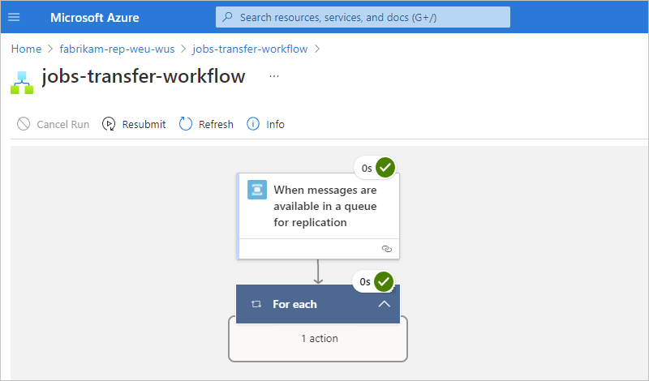

1. To review the inputs and outputs for each step, select the step, which opens a pane that shows the inputs, outputs, and properties details for that step.

   This example shows the inputs for the Service Bus trigger.

   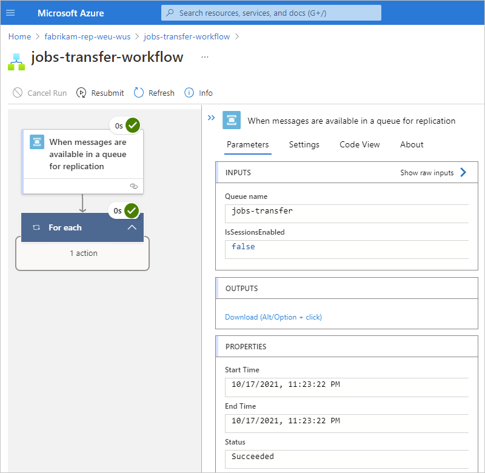

To learn how you can build your own automated workflows so that you can integrate apps, data, services, and systems apart from the context of replication tasks for Azure resources, see [Create an integration workflow with single-tenant Azure Logic Apps (Standard) in the Azure portal](create-single-tenant-workflows-azure-portal.md).

## Edit the task

To change a task, you have these options:

- [Edit the task "inline"](#edit-task-inline) so that you can change the task's properties, such as connection information or configuration information.

- [Edit the task's underlying workflow](#edit-task-workflow) in the designer.

### Edit the task inline

1. In the [Azure portal](https://portal.azure.com), find the resource that has the task that you want to update.

1. On the resource navigation menu, in the **Automation** section, select **Tasks (preview)**.

1. In the tasks list, find the task that you want to update. Open the task's ellipses (**...**) menu, and select **Edit in-line**.

   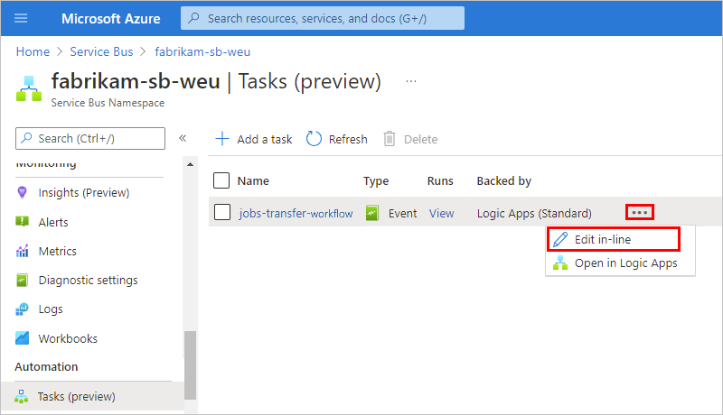

   By default, the **Authenticate** tab appears and shows the existing connections.

1. To add new authentication credentials or select different existing authentication credentials for a connection, open the connection's ellipses (**...**) menu, and select either **Add new connection** or if available, different authentication credentials.

   > [!NOTE]
   > You can edit only the target connection, not the source connection.

   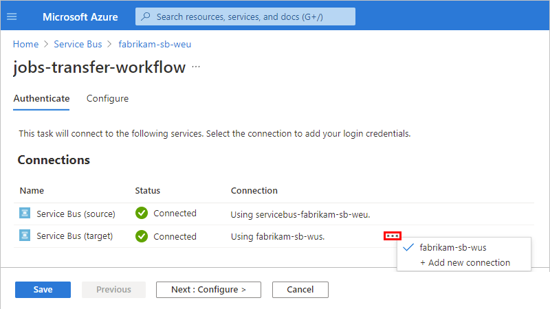

1. To update other task properties, select **Next: Configure**.

   For the task in this example, you can specify different source and target queues. However, the task name and underlying logic app and workflow remain the same.

   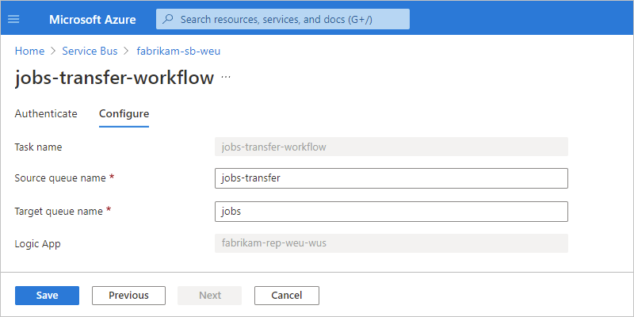

1. When you're done, select **Save**.

### Edit the task's underlying workflow

If you change the underlying workflow for a replication task, your changes affect the original configuration for the task instance that you created, but not the task template. After you make and save your changes, the name that you provided for your original task might not accurately describe the task anymore, so you might have to recreate the task with a different name.

1. In the [Azure portal](https://portal.azure.com), find the resource that has the task that you want to update.

1. On the resource navigation menu, in the **Automation** section, select **Tasks**.

1. In the tasks list, find the task that you want to update. Open the task's ellipses (**...**) menu, and select **Open in Logic Apps**.

   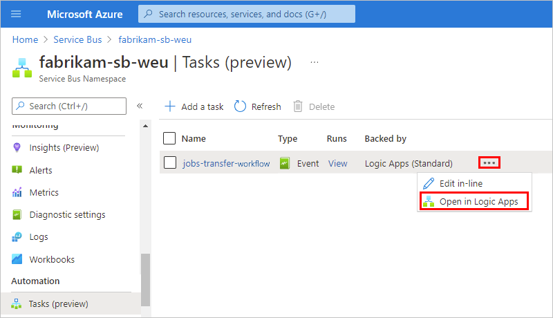

   The Azure portal changes context to designer where you can now edit the workflow.

   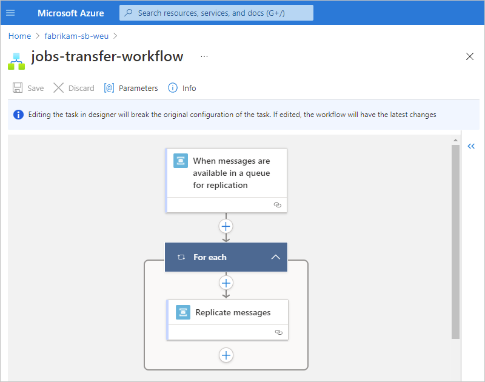

   You can now edit the workflow's trigger and actions as well as the properties for the trigger and actions.

1. To view the properties for the trigger or an action, select that trigger or action.

   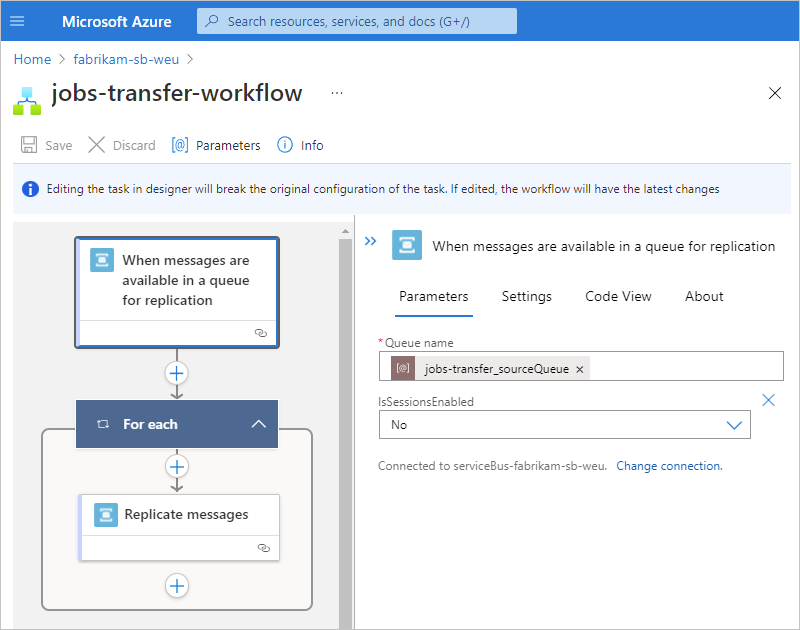

   For this example, the trigger's **IsSessionsEnabled** property is changed to **Yes**.

1. To save your changes, on the designer toolbar, select **Save**.

   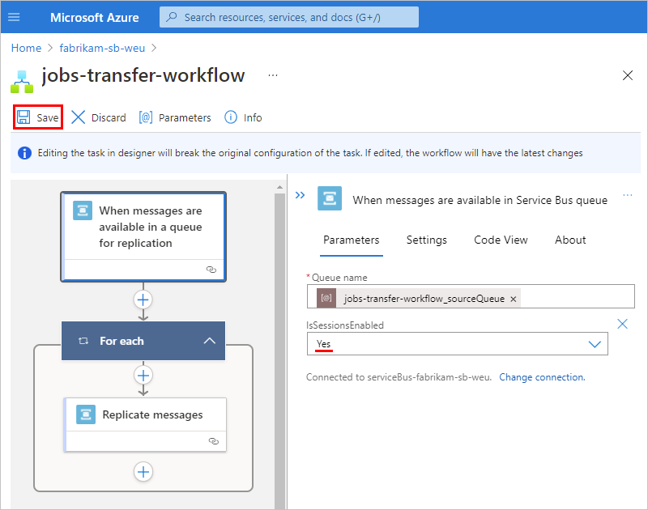

1. To test and run the updated workflow, open the logic app resource that contains the updated workflow. On the workflow navigation menu, select **Overview** > **Run Trigger** > **Run**.

   After the run finishes, the designer shows the workflow's run details. To review the inputs and outputs for each step, select the step, which opens a pane that shows the inputs, outputs, and properties details for that step.

   This example shows the selected Service Bus trigger's inputs, outputs, and properties, along with the updated trigger property value.

   

1. To disable the workflow so that the task doesn't continue running, on the **Overview** toolbar, select **Disable**. For more information, review [Disable or enable single-tenant workflows](create-single-tenant-workflows-azure-portal.md#disable-or-enable-workflows).

## Set up failover for replication tasks

You can use replication tasks for disaster recovery and to protect against regional availability incidents or network disruptions. Any such failure scenario requires performing a failover from the primary or source entity to the secondary or target entity and then telling any affected producers and consumers to use the endpoint for the secondary or target entity.

When the region for the primary or source becomes unavailable, failover to the secondary or target entity isn't automatic or immediate. The position or *offset* in the stream or sequence where the primary or source entity stopped reading is read by the Azure storage account that was created by the replication task.

To enable failover from the primary or source entity and to make sure that the replication task starts reading from the secondary or target entity at the correct position, follow these steps:

1. In the [Azure portal](https://portal.azure.com), open the logic app resource and the underlying workflow behind the replication task.

1. On the workflow's navigation menu, select **Overview**. On the **Overview** toolbar, select **Disable**.

1. Go to the Azure resource group that contains the replication task resources, including the logic app resource and the Azure storage account that contains the position or *offset* in the stream or sequence where the primary or source entity stopped reading when the primary's region became unavailable.

1. Delete the storage account.

1. Return to the workflow behind the replication task and enable the workflow again.

To force producers and consumers to use the secondary endpoint, you need to make information about the entity available to use and look up in a location that's easy to reach and update. If producers or consumers encounter frequent or persistent errors, they should consult that location and adjust their configuration. There are numerous ways to share that configuration, but DNS and file shares are examples.

## Next steps

- [About the workflow designer in single-tenant Azure Logic Apps](designer-overview.md)
- [Edit host and app settings for logic apps in single-tenant Azure Logic Apps](edit-app-settings-host-settings.md)
- [Create parameters to use in workflows across environments in single-tenant Azure Logic Apps](parameterize-workflow-app.md)