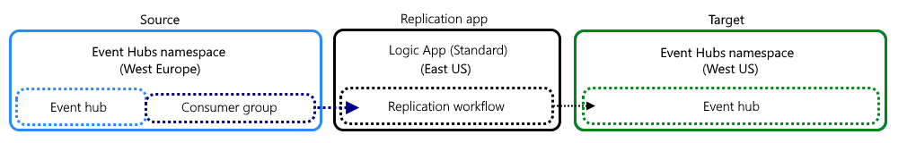
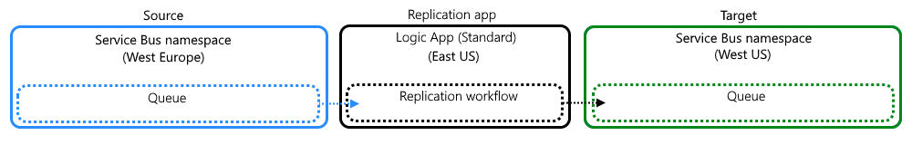
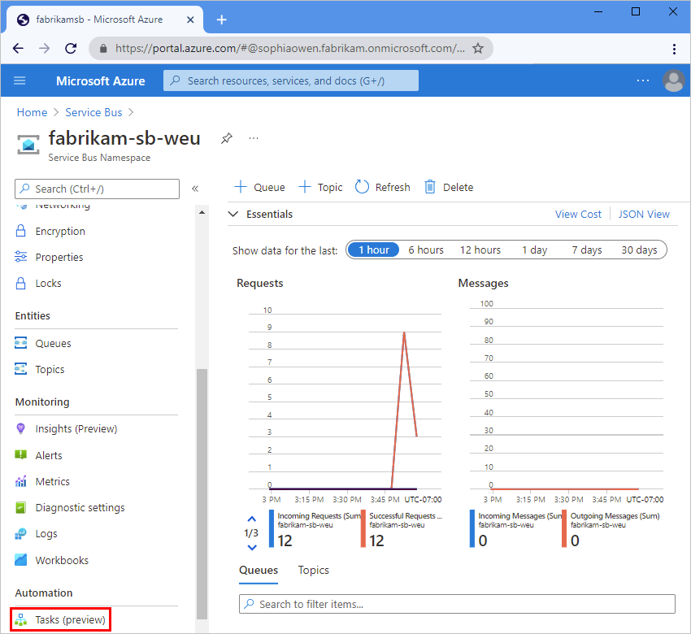
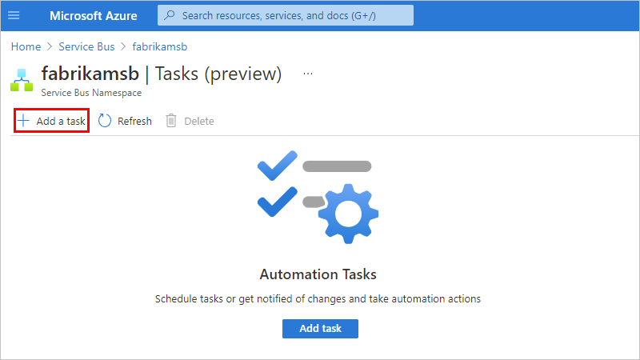
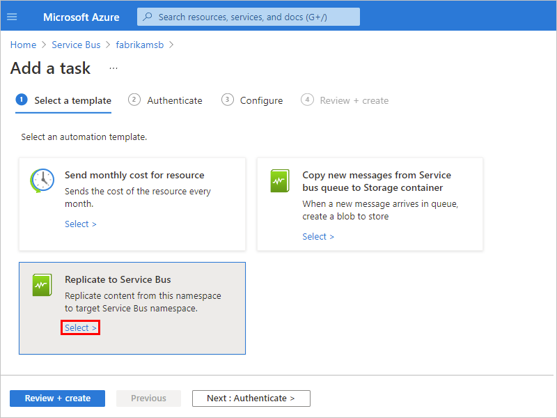
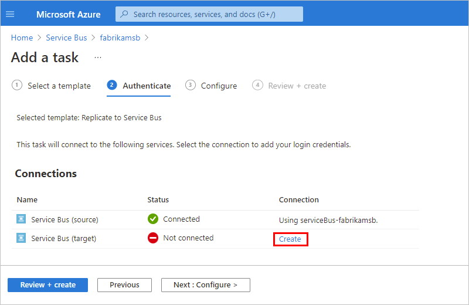
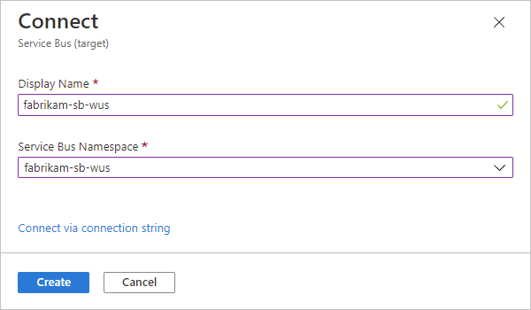
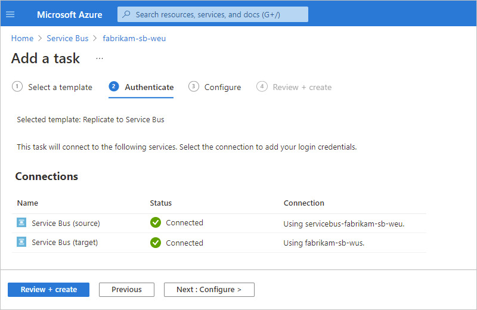
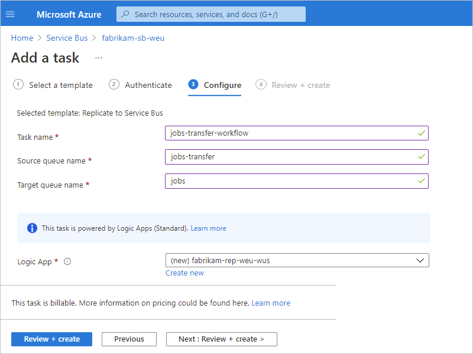

# Create replication tasks for Azure resources using Azure Logic Apps (preview)

> [!IMPORTANT]
> This capability is in preview and is subject to the 
> [Supplemental Terms of Use for Microsoft Azure Previews](https://azure.microsoft.com/support/legal/preview-supplemental-terms/).

To reduce the impact that unpredictable events can have on your Azure resources, you can replicate content in these resources to help you maintain business continuity. You can create a [*replication task*](#replication-task) that moves the data, events, or messages from a source in one region to a target in another region. That way, you can have the target readily available if the source goes offline and the target has to take over. Each replication task that you create is powered by a stateless workflow in a Standard logic app resource, which is hosted in single-tenant Azure Logic Apps. If you're new to logic apps and workflows, review [What is Azure Logic Apps](logic-apps-overview.md) and [Single-tenant versus multi-tenant and integration service environment for Azure Logic Apps](single-tenant-overview-compare.md).

> [!NOTE]
> Currently, [replication task templates](#replication-task-templates) are available for 
> [Azure Event Hubs](../event-hubs/event-hubs-about.md) and [Azure Service Bus](../service-bus-messaging/service-bus-messaging-overview.md).

This article provides an overview about replication tasks powered by Azure Logic Apps and shows how to create an example replication task for Azure Service Bus queues.

## What is a replication task?

A replication task receives data, events, or messages from a source, moves that content to a target, and then deletes that content from the source. Most replication tasks move the content unchanged. At most, if the source and target protocols differ, these tasks perform mappings between metadata structures. Replication tasks are generally stateless, meaning that they don't share states or other side-effects across parallel or sequential executions of a task.

Replication doesn't aim to exactly create exact 1:1 clones of a source to a target. Instead, replication focuses on preserving the relative order of events where required by grouping related events with the same partition key and arranges messages with the same partition key sequentially in the same partition.

## Replication task templates

The following table lists the replication task templates currently available in this preview:

| Resource type | Replication task templates |
|---------------|----------------------------|
| Azure Event Hubs | - **Replicate to Event Hubs instance**: Replicate content between two Event Hubs instances.  - **Replicate from Event Hubs instance to Service Bus queue**  - **Replicate from Event Hubs instance to Service Bus topic** |
| Azure Service Bus | - **Replicate to Service Bus queue**: Replicate content between two Service Bus queues.  - **Replicate from service Bus queue to Event Hub instance**  - **Replicate from Service Bus queue to Service Bus topic**  - **Replicate from Service Bus topic subscription to Service Bus queue**  - **Replicate from Service Bus topic subscription to Event Hubs instance** |
|||

## Replication tasks: Azure Logic Apps versus Azure Functions

### Replication topology for Event Hubs

For more information about replication and federation in Azure Event Hubs with Azure Functions, review the following documentation:

- [Multi-site and multi-region federation for Event Hubs](../event-hubs/event-hubs/event-hubs-federation-overview.md)
- [Event replication tasks and applications with Azure Functions](../event-hubs/event-hubs-federation-replicator-functions.md)
- [Event replication tasks patterns](../event-hubs/event-hubs-federation-patterns.md)

### Replication topology for Service Bus

For more information about replication and federation in Azure Service Bus with Azure Functions, review the following documentation:

- [Message replication and cross-region federation](../service-bus-messaging/service-bus-federation-overview.md)
- [Message replication tasks and applications](../service-bus-messaging/service-bus-federation-replicator-functions.md)
- [Message replication tasks patterns](../service-bus-messaging/service-bus-federation-patterns.md)

## Pricing

Underneath, a replication task is powered by a stateless workflow in a Standard logic app resource that's hosted in single-tenant Azure Logic Apps. When you create this replication task, charges start incurring immediately. Usage, billing, and the pricing model follows the [Standard plan](logic-apps-pricing.md) and [Standard plan rates](https://azure.microsoft.com/pricing/details/logic-apps/). Metering and billing are based on the hosting plan and pricing tier that's used for the underlying logic app resource and workflow.

## Prerequisites

- An Azure account and subscription. If you don't have a subscription, [sign up for a free Azure account](https://azure.microsoft.com/free/?WT.mc_id=A261C142F).

- The source and target resources or entities, which should exist in different Azure regions and vary based on the task template that you want to use. The example in this article uses two Service Bus queues, which are located in different namespaces and Azure regions.

## Create a replication task

This example shows how to create a replication task for Service Bus queues.

1. In the [Azure portal](https://portal.azure.com), find the Service Bus namespace that you want to use as the source.

1. On the namespace navigation menu, in the **Automation** section, and select **Tasks (preview)**.

   

1. On the **Tasks** pane, select **Add a task** so that you can select a task template.

   

1. On the **Add a task** pane, under **Select a template**, in the template for the replication task that you want to create, select **Select**. If the next page doesn't appear, select **Next: Authenticate**.

   This example continues by selecting the **Replicate to Service Bus queue** task template, which replicates content between Service Bus queues.

   

1. Under **Authenticate**, in the **Connections** section, select **Create** for every connection that appears in the task so that you can provide authentication credentials for all the connections. The types of connections in each task vary based on the task.

   This example shows the prompt to create the connection to the target Service Bus namespace where the target queue exists. The connection already exists for the source Service Bus namespace.

   

1. Provide the necessary information about the target.

   For this example, provide a display name for the connection, and then select the Service Bus namespace where the target queue exists.

   

   The following example shows the successfully created connection:

   

1. After you finish all the connections, select **Next: Configure**.

1. Under **Configure**, provide a name for the task and any other information required for the task. When you're done, select **Review + create**.

   > [!NOTE]
   > You can't change the task name after creation, so consider a name that still applies if you 
   > [edit the underlying workflow](#edit-task-workflow). Changes that you make to the underlying 
   > workflow apply only to the task that you created, not the task template.
   >
   > For example, if you name your task `Fabrikam-Service-Bus-Replication-Task`, but you later edit 
   > the underlying workflow to replicate to an Event Hubs namespace, you can't change the task name 
   > to `Fabrikam-Service-Bus-Event-Hubs-Replication-Task`.

   

   The task that you created, which is automatically live and running, now appears on the **Tasks** list.

   > [!TIP]
   > If the task doesn't appear immediately, try refreshing the tasks list or wait a little before you refresh. On the toolbar, select **Refresh**.

## Set up retry policy

To avoid data loss during an availability event on either side of a replication relationship, you need to configure the retry policy for robustness. Refer to the Azure Functions documentation on retries to configure the retry policy.

The policy settings chosen for the example projects in the sample repository configure an exponential backoff strategy with retry intervals from 5 seconds to 15 minutes with infinite retries to avoid data loss.

For Service Bus, review the "using retry support on top of trigger resilience" section to understand the interaction of triggers and the maximum delivery count defined for the queue.
